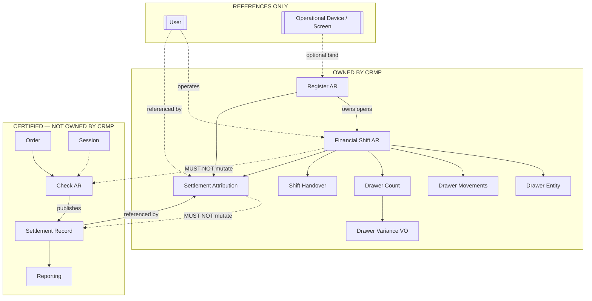

# ADR-ARCH-028: Cash Register Management Platform (CRMP)

> [← ADR-ARCH-020](./ADR-ARCH-020-financial-settlement-platform.md) · [← ADR-ARCH-022](./ADR-ARCH-022-order-settlement-platform.md) · [← ADR-ARCH-026](./ADR-ARCH-026-settlement-record-platform.md) · [← ADR-ARCH-027](./ADR-ARCH-027-operational-document-identity.md) · [Registry](../constitution/ADR-Registry.md)

| Field | Value |
|---|---|
| **Status** | Accepted |
| **Owner** | Architecture Authority |
| **Program** | CASH-REGISTER-MANAGEMENT-ARCHITECTURE-1 |
| **Date** | 2026-07-24 |
| **Revision** | **1.0** |
| **Supersedes** | — |
| **Refines** | [ADR-ARCH-020](./ADR-ARCH-020-financial-settlement-platform.md) · [ADR-ARCH-022](./ADR-ARCH-022-order-settlement-platform.md) · [ADR-ARCH-023](./ADR-ARCH-023-financial-core-capabilities.md) · [ADR-ARCH-026](./ADR-ARCH-026-settlement-record-platform.md) · Operational Screen / Device Management architecture |
| **Does not modify** | ADR-ARCH-020 · 022 · 023 · 026 money / publication ownership (additive platform only) |
| **Implementation status** | **Not implemented** — constitutional decision only; no schema, API, service, or UI authorized by this ADR alone |
| **Related programs** | CASH-REGISTER-MANAGEMENT-ARCHITECTURE-1 · SELF-ORDERING-COUNTER-PICKUP-ARCHITECTURE-1 (consumer) · REPORTING-PAYMENT-METHOD-ANALYTICS-1 (future-readiness note) |

---

## 1. Executive Summary

MineuQR constitutionalizes the **Cash Register Management Platform (CRMP)** as the operational owner of:

- Register lifecycle  
- Financial Shift lifecycle  
- Drawer accountability  
- Shift handover  
- Settlement Attribution  
- Operational financial accountability (expected vs actual drawer, variance)

CRMP **does not** own Settlement, Revenue, payment authorization, or accounting ledgers.

**Check** remains the sole Monetary Aggregate Root (ADR-ARCH-020).  
**Settlement Record** remains the immutable Check-published financial document (ADR-ARCH-026).  
CRMP **attributes** published settlements to Register + Financial Shift + Staff User — it never mutates Settlement money.

This ADR authorizes **architecture publication only**. Runtime work requires successor programs under Architecture Authority sequencing.

---

## 2. Context

### 2.1 Certified financial baseline (must not be violated)

| Concern | Authority | ADR |
|---------|-----------|-----|
| Monetary Aggregate Root / Revenue | **Check** | ADR-ARCH-020 |
| Order Settlement state | Check-owned entity | ADR-ARCH-022 |
| Tender / payment methods | SettlementTransaction under Check | ADR-ARCH-020 / 023 |
| Canonical financial publication | **Settlement Record** | ADR-ARCH-026 |
| Reporting Revenue | Paid Settlement Records / paid Check law | ADR-ARCH-026 + Reporting |
| Operational Screens / Devices | Device Platform + Screen Runtime | Device Management / Screen architecture |
| Staff identity today | Restaurant `User` (+ access) | Access model — **no Cashier domain** |

### 2.2 Gap (evidence)

The restaurant operates multiple stations across staff shifts (e.g. Ahmed 06:00–15:00 → handover → Ammar 15:00–close). Operations must answer:

- Who performed this settlement?  
- Which operational shift owns accountability for it?  
- Which register was used?  
- Which staff member received the money?  
- What was expected vs actual drawer balance?  
- Was there variance?  
- Who handed over / who accepted?

**Phase 1 audit finding:** Register, Financial Shift, Drawer, Handover, and Settlement Attribution are **ABSENT** as domain platforms. Homonyms (“Register Payment”, owner signup, UI drawers, fulfilment stations) must not be reused as till identity.

Settlement Record already exposes optional `createdByActorType` / `createdByActorId` slots; production settle paths often leave them null. That is an **adoption gap**, not a reason to redesign ADR-026.

### 2.3 Explicit non-goals of this ADR

- Implementing schema, APIs, services, projections, or UI  
- Creating a Cashier Aggregate / Cashier domain  
- Creating an Employee Aggregate inside CRMP  
- Moving money, Settlement, or Revenue ownership  
- Redesigning Check, Order, Session, Kitchen, Settlement Record, or Reporting platforms  
- ERP cash posting / general ledger / AR-AP  

---

## 3. Problem Statement

Without CRMP, MineuQR can finalize guest Checks and publish Settlement Records, but cannot constitutionally account for **who held the drawer**, **which register/shift owned operational custody**, or **cash variance** — across Waiter, QR, Self Ordering, Counter Pickup, and future channels.

Filling that gap by extending Check, Session, or Settlement Record into till accounting would violate certified ownership. A **new adjacent platform** is required.

---

## 4. Decision

**MineuQR SHALL introduce the Cash Register Management Platform (CRMP) as the sole constitutional owner of register operations, financial-shift accountability, drawer custody, shift handover, and settlement attribution — without becoming a monetary Aggregate Root and without owning Settlement or Revenue.**

### Constitutional one-liners

1. Check settles money.  
2. Settlement Record publishes financial facts.  
3. CRMP attributes those facts to Register + Financial Shift + Staff User and accounts for drawer custody.  
4. Operational Screens execute permissions; Staff identity remains User-based.  
5. No Cashier domain.

---

## 5. Platform Mission

### CRMP exists to manage

| Mission area | Meaning |
|--------------|---------|
| Register lifecycle | Create / activate / deactivate operational financial stations |
| Financial Shift lifecycle | Open / operate / close / hand over accountability periods |
| Drawer accountability | Opening float, movements, expected cash, counts, variance |
| Shift handover | Transfer of drawer responsibility between operators |
| Settlement Attribution | Correlate Settlement Record → Register + Shift + Staff |
| Operational financial accountability | Shift-level custody reports (not Revenue SSOT) |

### CRMP is NOT

| Forbidden identity | Why |
|--------------------|-----|
| Settlement Platform | Check owns settle (ADR-020) |
| Revenue Platform | Revenue = paid Check / Paid SR law |
| Accounting System / ERP | Explicit restaurant-ops boundary |
| Payment Gateway | External authorization out of scope |
| Cashier Domain | Screens + User permissions only |

---

## 6. Constitutional Principles (mandatory)

| ID | Principle |
|----|-----------|
| **P1** | **Check remains the sole Monetary Aggregate Root.** |
| **P2** | **Settlement remains Check-owned.** CRMP MUST NOT settle, finalize, or recalculate Check money. |
| **P3** | **Settlement Record remains immutable and Check-published.** CRMP MUST NOT rewrite SR money fields. |
| **P4** | **CRMP owns operational financial accountability only.** It never owns money, settlement, revenue, or payment authorization. |
| **P5** | **Financial Shift owns accountability.** Financial Shift never owns financial assets (cash physically exists in the world; Shift records custody facts). |
| **P6** | **Register is an operational financial station.** Register is not Device, not Operational Screen, not Staff User. Relationships to those are **references only**. |
| **P7** | **Settlement Attribution is an association.** It references Settlement Record. It never mutates Settlement. |
| **P8** | **Operational Screens execute permissions.** CRMP never introduces a Cashier domain. Staff identity MUST remain User-based. |
| **P9** | **Channel-agnostic attribution.** Waiter, QR, Self Ordering, Counter Pickup, Drive-Thru, and future channels settle via Check; CRMP attributes at the settle convergence point without channel-owned till logic. |
| **P10** | **Expected drawer cash derives from custody + attributed cash tenders** — never from Order totals or unpaid Checks. |
| **P11** | **Fulfilment Station ≠ Register.** Order fulfilment anchors MUST NOT be treated as cash registers. |
| **P12** | **Dining Session ≠ Financial Shift.** Visit lifecycle MUST NOT be overloaded as till shift. |

---

## 7. Aggregate Contracts (constitutional — no implementation)

### 7.1 Classification table

| Candidate | Kind | Owner | Notes |
|-----------|------|-------|-------|
| **Register** | **Aggregate Root** | CRMP | Long-lived financial station identity |
| **Financial Shift** | **Aggregate Root** | CRMP | Time-bound accountability unit on one Register |
| **Drawer** | **Entity** under Financial Shift | CRMP | Logical cash custody container for the shift |
| **Drawer Movement** | **Entity** under Financial Shift | CRMP | Typed custody posting (float / paid in / paid out / safe drop / …) |
| **Opening Float** | **Value Object** (or typed movement) | CRMP | Declared opening cash |
| **Safe Drop / Paid In / Paid Out** | **Drawer Movement types** | CRMP | Non-settlement custody events |
| **Drawer Count** | **Entity / Value Object** under Financial Shift | CRMP | Declared actual cash at a count moment |
| **Drawer Variance** | **Value Object (derived)** | CRMP | `actual − expected`; never authoritative manual override of money systems |
| **Shift Handover** | **Entity / Domain Event** under Financial Shift | CRMP | Closing operator + accepting operator transfer |
| **Settlement Attribution** | **Association** | CRMP | References Settlement Record + Register + Shift + User |
| **Settlement Record** | Immutable Financial Document | Produced by Check | **Referenced only** |
| **User (Staff)** | Reference | Identity / Access | Operator of Shift; not owned by CRMP |
| **Operational Device / Screen** | Reference (optional bind) | Device / Screen Platform | May bind to Register; never is Register |
| **Check / Order / Session** | External aggregates | Existing platforms | Unchanged ownership |

### 7.2 Register (Aggregate Root)

**Identity:** Restaurant-scoped operational financial station.

**Responsibilities:**

- Exist as the parent station for Financial Shifts  
- Track register operational status (e.g. active / inactive)  
- Optionally reference a bound Operational Device  

**MUST NOT:**

- Own money, Settlements, Orders, Checks, or Users  
- Be conflated with Device, Screen, fulfilment Station, or Staff  

### 7.3 Financial Shift (Aggregate Root)

**Identity:** One accountability period on exactly one Register, operated by a Staff User.

**Responsibilities:**

- Open / close lifecycle  
- Own Drawer entity and movements / counts for the period  
- Own Shift Handover facts  
- Be the accountability owner referenced by Settlement Attribution  

**MUST NOT:**

- Own or mutate Settlement / Settlement Record money  
- Own Revenue  
- Span multiple Registers  
- Remain active concurrently with another Shift on the same Register  

### 7.4 Drawer (Entity)

Logical cash custody for a Financial Shift. Exists only within Shift scope.

### 7.5 Drawer Movement (Entity)

Append-only custody postings within a Shift (opening float, paid in/out, safe drop, adjustments per future policy). Never creates Settlement Transactions.

### 7.6 Drawer Count & Drawer Variance

- **Count** records declared actual cash.  
- **Variance** is **calculated** from expected vs counted; it is not an independent monetary authority and MUST NOT rewrite Settlement values.

### 7.7 Settlement Attribution (Association)

**Fields (conceptual):**

- `settlementRecordId` (reference — required)  
- `registerId`  
- `financialShiftId`  
- `operatorUserId`  
- `attributedAt`  

**Rules:**

- MAY be created only for an existing Settlement Record  
- MUST NOT alter SR snapshots, tenders, or totals  
- MUST be unique per Settlement Record for a given attribution policy generation (no duplicate active attributions)

---

## 8. Ownership Matrix (exactly one owner per concern)

| Concern | Constitutional owner |
|---------|----------------------|
| Order placement / kitchen lifecycle | **Order** |
| Table / waiter visit | **Dining Session** |
| Operational session identity | **Operational Session Platform** |
| Money / tenders / finalize / Revenue authority | **Check** |
| Order Settlement entity | **Check** |
| Settlement Record publication | **Check** (producer) |
| Settlement Record document | **Settlement Record** (immutable publication) |
| Reporting Revenue / paid financial KPIs | **Reporting** ← Paid SR / Check law |
| Register identity & status | **Register (CRMP)** |
| Financial Shift lifecycle & accountability | **Financial Shift (CRMP)** |
| Drawer / movements / counts / variance | **Financial Shift (CRMP)** |
| Shift Handover | **Financial Shift (CRMP)** |
| Settlement Attribution | **CRMP** |
| Staff identity | **User** (Identity / Access) |
| Settlement / register **permission execution** | **Operational Screen capability + Access** |
| Device credential / pairing | **Operational Device Platform** |
| Optional Device↔Register binding | Binding fact owned by **CRMP** or Device catalog policy (reference only); Device remains Device |
| Payment authorization (card/gateway) | **Out of platform** (external) |
| Accounting GL / ERP | **Out of platform** |

---

## 9. Constitutional Invariants

| ID | Invariant |
|----|-----------|
| **CR-INV-01** | Only **one active Financial Shift** per Register at a time. |
| **CR-INV-02** | A **closed Financial Shift is immutable** for custody and attribution membership (corrections via compensating CRMP records / new counts — never silent rewrite of closed shift money facts). |
| **CR-INV-03** | **Settlement Attribution cannot exist** without a real Settlement Record reference. |
| **CR-INV-04** | A Register **MUST NOT** transition to a terminal closed/inactive state that abandons custody while an **active Financial Shift** exists (close/handover Shift first). |
| **CR-INV-05** | **Handover requires** a closing operator and an accepting operator (both User references). |
| **CR-INV-06** | **Drawer Variance is calculated** (`actual − expected`). It MUST NOT be treated as an independently entered monetary authority that overrides Settlement. |
| **CR-INV-07** | **Financial Shift MUST NEVER change Settlement values** (Check totals, ST lines, SR snapshots). |
| **CR-INV-08** | **Register MUST NEVER own money** (no Register balance as Revenue; no Register-held Settlement). |
| **CR-INV-09** | Expected cash MUST NOT be derived from unpaid Orders or open Checks. |
| **CR-INV-10** | Settlement Attribution MUST NOT be channel-specific (no kiosk-only attribution model). |
| **CR-INV-11** | CRMP MUST NOT introduce Cashier Aggregate, Cashier role-as-domain, or Employee Aggregate inside CRMP. |
| **CR-INV-12** | Tenant isolation: Register, Shift, Attribution MUST carry `restaurantId`; cross-tenant references forbidden. |
| **CR-INV-13** | Device / Screen / User / Fulfilment Station references are optional correlations — deleting or rotating a Device MUST NOT delete historical Shift accountability. |
| **CR-INV-14** | At most one active Settlement Attribution per Settlement Record under the active attribution policy (idempotent retries MUST NOT duplicate). |

---

## 10. Relationship Diagrams

### 10.1 Ownership vs reference (canonical)



### 10.2 Accountability chain (business narrative)

```
Register
  └─ Financial Shift
       ├─ Drawer
       │    ├─ Movements (float / in / out / drop)
       │    └─ Counts → Variance
       ├─ Handover
       └─ Settlement Attribution ──references──► Settlement Record ──► Reporting
```

### 10.3 Settle convergence (all channels)

```
Channel place/serve (Order / Session) 
        → Check finalize (Settlement)
        → Settlement Record publish
        → CRMP Settlement Attribution (active Shift on Register + User)
        → Shift custody expected cash updated from attributed cash tenders
```

---

## 11. Lifecycle Definitions (conceptual only)

### 11.1 Register

```
Provisioned → Active ⇄ Inactive
```

- **Active:** may host Financial Shifts  
- **Inactive:** MUST NOT open new Shifts; MUST NOT have an active Shift (CR-INV-04)  
- Historical Shifts remain for audit  

### 11.2 Financial Shift

```
Open → (Operating: movements, attributions, counts) → Closing / Handover → Closed
```

- **Open:** exactly one operator User; Drawer initialized with Opening Float  
- **Operating:** attributions and movements append  
- **Handover:** closing operator + accepting operator; typically closes Shift A and opens Shift B on same Register  
- **Closed:** immutable (CR-INV-02)  

### 11.3 Drawer

```
Exists while Shift open → Accumulates movements → Counted at close/handover → Frozen with Shift
```

### 11.4 Settlement Attribution

```
Settlement Record exists → Attribute to active Shift → Immutable correlation fact
```

- Failure to attribute MUST NOT roll back Check settlement (money already final).  
- Missing attribution is an **operational control gap**, remediated by CRMP correction workflows — never by rewriting SR money.

---

## 12. Architectural Boundaries

### 12.1 CRMP MAY

- Own Register and Financial Shift aggregates  
- Record drawer movements, counts, variance, handover  
- Create Settlement Attribution referencing Settlement Records  
- Expose shift/register operational reports composed from attribution + SR/ST cash tender facts  
- Optionally bind Register to Operational Device  
- Rely on User identity and Screen capabilities for permissioned operations  
- Adopt wiring of existing SR `createdByActor*` slots on staff settle paths (without redesigning SR)  

### 12.2 CRMP MUST

- Preserve P1–P12 and CR-INV-01…14  
- Attribute in a channel-agnostic manner at settle convergence  
- Keep Device, Screen, User, Fulfilment Station as references  
- Treat closed Shifts as immutable custody records  
- Calculate variance; never use variance to mutate Settlement  

### 12.3 CRMP MUST NOT

- Become a Monetary Aggregate Root  
- Settle Checks or publish Settlement Records  
- Calculate or redefine Revenue  
- Authorize card/gateway payments  
- Introduce Cashier / Employee aggregates inside CRMP  
- Duplicate Check, Order, Session, or Settlement Record  
- Use Dining Session or fulfilment Station as Register/Shift  
- Store Settlement money copies as a competing SSOT  
- Require fake Sessions for kiosk/counter accountability  

---

## 13. Compatibility Matrix

| Channel | Business owner | Financial settle | CRMP interaction |
|---------|----------------|------------------|------------------|
| Waiter / Table Service | Dining Session | `session.markPaid` → Check | Attribute under active Shift + staff User |
| QR | Order (+ session as applicable) | Check finalize | Same attribution hook |
| Self Ordering / Kiosk | Order | Staff settle of sessionless Check | Same — no kiosk-owned Register required |
| Counter Pickup | Order | Staff settle | Same |
| Drive-Thru / future | Order (typical) | Check finalize | Same — no channel-specific CRMP fork |

**Proof of compatibility:** All channels already converge on Check finalize + Settlement Record. CRMP attaches **after publication** (or beside staff settle façade) without owning channel place paths.

---

## 14. Integration Contracts (constitutional)

| Integration | Direction | Contract |
|-------------|-----------|----------|
| Check → SR | Existing | Unchanged publish |
| SR → CRMP Attribution | CRMP reads SR id (+ cash tender facts) | Reference only |
| Staff settle façade → CRMP | After successful settle | Create Attribution for active Shift |
| SR actor slots | Settle path → SR | Optional freeze of User actor (adoption; not CRMP money) |
| Device Platform → Register | Optional | Binding reference |
| Screen capability → CRMP ops | Permission gate | e.g. future `register_operations` — not Cashier domain |
| Reporting ← SR | Revenue | Unchanged |
| Reporting ← CRMP | Shift/drawer ops reports | Additive operational reports only |

---

## 15. Risks & Constitutional Corrections

| # | Risk if ignored | Constitutional correction |
|---|-----------------|---------------------------|
| R1 | CRMP becomes second monetary root | P1 / P4 / CR-INV-08 |
| R2 | Settlement moved under Register | P2 / P7 |
| R3 | Cashier domain introduced | P8 / CR-INV-11 |
| R4 | Session overloaded as Shift | P12 |
| R5 | Fulfilment station used as Register | P11 |
| R6 | Expected cash from Orders | P10 / CR-INV-09 |
| R7 | Attribution mutates SR | P3 / P7 / CR-INV-07 |
| R8 | Channel-specific till engines | P9 / CR-INV-10 |
| R9 | Device deletion erases accountability | CR-INV-13 |
| R10 | Multiple active Shifts per Register | CR-INV-01 |

**Architecture Impact STOP:** Any successor program that requires changing ADR-020/022/026 money or publication ownership MUST halt and file an Architecture Impact Report. This ADR does **not** require such modification.

---

## 16. Consequences

### Positive

- Clear custody answers (who / which register / which shift / variance)  
- Preserves certified Settlement & Reporting constitution  
- Channel-agnostic operational control for counter, table, and future modes  
- Aligns with Operational Screens (permissioned User ops) without Cashier domain  

### Trade-offs

- New platform surface area (Register / Shift) to implement in successor programs  
- Attribution can lag settle if not wired carefully (operational gap, not money corruption)  
- Multi-staff Employee roster remains outside CRMP (Identity program if needed)  

### Neutral

- Homonym cleanup in product language (“Register Payment” vs Register Aggregate) remains presentation concern  

---

## 17. Migration Strategy (not authorized by this ADR)

| Stage | Intent |
|-------|--------|
| **M0** | This ADR accepted — no runtime change |
| **M1** | CRMP Domain program — Register + Financial Shift + Drawer movements/handover |
| **M2** | Settlement Attribution + staff settle façade hook + SR actor adoption |
| **M3** | Drawer Count / Variance / Close UX on Operational Screens |
| **M4** | Optional Device binding + `register_operations` capability |
| **M5** | Shift operational reporting (additive; Revenue unchanged) |
| **M6** | Production adoption with Counter Pickup / multi-register restaurants |

Each stage: Audit → Impact → Implement → Certify.  
**No production implementation is authorized under ADR-ARCH-028 alone.**

---

## 18. Future Programs (recommended)

| Program | Purpose |
|---------|---------|
| `CASH-REGISTER-MANAGEMENT-DOMAIN-1` | Aggregate contracts → domain model (still gated) |
| `CASH-REGISTER-SETTLEMENT-ATTRIBUTION-1` | Attribution + SR actor wiring on staff settle |
| `CASH-REGISTER-DRAWER-CLOSE-1` | Count / variance / close / handover UX |
| `CASH-REGISTER-SCREEN-ADOPTION-1` | Operational Screen capability + device bind |
| `CASH-REGISTER-SHIFT-REPORTING-1` | Operational shift reports from attribution + SR |

---

## 19. Glossary

| Term | Meaning |
|------|---------|
| **CRMP** | Cash Register Management Platform |
| **Register** | Operational financial station Aggregate Root (not Device, not fulfilment Station) |
| **Financial Shift** | Accountability period Aggregate Root on one Register |
| **Drawer** | Shift-scoped cash custody entity |
| **Settlement Attribution** | CRMP association from Settlement Record → Register + Shift + User |
| **Operational financial accountability** | Custody / variance / handover — **not** Revenue |
| **Cashier** | Forbidden domain term — use Staff User + Screen permission |

---

## 20. Certification

| Criterion | Status |
|-----------|--------|
| Preserves ADR-020 Check monetary ownership | **Met** |
| Preserves ADR-022 Order Settlement ownership | **Met** |
| Preserves ADR-026 Settlement Record publication model | **Met** |
| No Cashier domain | **Met** |
| Aggregate contracts classified | **Met** |
| Ownership matrix (single owner) | **Met** |
| Invariants CR-INV-01…14 | **Met** |
| Channel compatibility without channel forks | **Met** |
| No certified ADR modification required | **Met** |
| Production implementation authorized | **No** |

### ADR Verdict

**ADR-ARCH-028 ACCEPTED — Cash Register Management Platform constitutionalized.**

Implementation remains unauthorized until Architecture Authority sequences and certifies successor programs.
