> **Navigation:** [Architecture Home](../README.md) · [Constitution](../constitution/Architecture-Constitution-v1.0.md) · [ADR Registry](../constitution/ADR-Registry.md) · [Diagrams](../diagrams/)

# ARCH-1 — Order-Centric Architecture Blueprint

**MineuQR 2.0 · Architecture Blueprint Authority**  
**Program:** ARCH-1 (Design Only)  
**Status:** Ratified (incorporated in Architecture Constitution v1.0)  
**Inputs:** RESET-1 baseline, ARCH-1A foundation, ARCH-1A.1 Order Audit, ADR-ARCH-001 through ADR-ARCH-007  
**Implementation:** Prohibited in this program

---

## Diagram sources

Editable Mermaid sources for this blueprint are maintained in [diagrams/](../diagrams/). Future programs must edit `.mmd` files rather than recreate diagrams elsewhere.

| Blueprint topic | Diagram file |
|---|---|
| Domain landscape (§2) | [domain-landscape.mmd](../diagrams/domain-landscape.mmd) |
| Order aggregate (§3) | [order-aggregate.mmd](../diagrams/order-aggregate.mmd) |
| Lifecycle (§5) | [lifecycle.mmd](../diagrams/lifecycle.mmd) |
| Production path (§13) | [production-path.mmd](../diagrams/production-path.mmd) |
| Event flow (§8, §15) | [event-flow.mmd](../diagrams/event-flow.mmd) |
| Package layout | [package-architecture.mmd](../diagrams/package-architecture.mmd) |

---

## Executive Summary

MineuQR 2.0 adopts **Order as the sole Core Domain**. Every guest action, owner operation, notification, analytics view, and future fulfillment integration ultimately derives authority from the **Order Aggregate** and its lifecycle. Commercial, Restaurant, Identity, and Table contexts **gate or contextualize** orders but do not own order state. Kitchen, Printing, Session settlement, and Analytics are **integration contexts** that consume Order domain events and expose read models—never co-own the aggregate.

This blueprint replaces the current **router-centric, synchronously coupled** production path with a **single authoritative pipeline**: Application Command → Aggregate + Policies → Repository Commit → Domain Events → Subscribers → Read Models → Presentation.

**Printing is retired (RESET-1)** and reappears in this blueprint only as a **future optional integration boundary** for programs such as PRINTING-1—never as a co-owner of Order state.

---

# 1. Architecture Vision

### Architectural goals

1. **Order sovereignty** — All order state mutations flow through the Order Aggregate (ADR-ARCH-001, ADR-ARCH-007).
2. **One truth** — Persisted order data and server read models are the only sources for business metrics and lifecycle (ADR-ARCH-002).
3. **Clear ownership** — Each bounded context owns its data and publishes/consumes contracts; no cross-context inline orchestration in the Order write path (ADR-ARCH-003).
4. **Event-first integration** — Side effects (notifications, session linkage, kitchen, future print) react to domain events, not inline calls from the router (ADR-ARCH-004).
5. **One production path** — No feature-flag split write behavior in certified production (ADR-ARCH-005).
6. **Thin presentation** — UI renders server projections; no KPI or lifecycle authority in the client (ADR-ARCH-006).

### Long-term vision

MineuQR evolves into a **restaurant operating platform** where:

- **Order** is the operational nucleus (create → fulfill → complete/cancel).
- **Surrounding contexts** subscribe to Order truth rather than duplicating it.
- **Read models** power dashboard, workspace, analytics, and guest tracking without recomputation in the browser.
- **Future Session** becomes a first-class settlement context that **references** orders but does not mutate order lifecycle except through defined integration commands/events.

### Design philosophy

- **Domain-first, infrastructure-last** — Policies and invariants live in the domain; tRPC/HTTP/DB are adapters.
- **Explicit over implicit** — Lifecycle transitions, events, and integration contracts are named and versioned.
- **Evolution without redesign** — New fulfillment channels (kitchen display, print connector) attach via events, not aggregate changes.
- **Certification over flexibility** — One certified production path; experimental flags must converge before ORDER-1 completion.

### Architectural principles

| Principle | Statement |
|---|---|
| P1 | Order Aggregate is the only mutation authority for order state |
| P2 | Repositories persist aggregates atomically (order + lines in one transaction) |
| P3 | Domain events are emitted only after successful commit |
| P4 | Integration contexts are event consumers or query clients—never aggregate internals |
| P5 | Read models are derived; they may lag; they never write back to the aggregate |
| P6 | Commercial gates **authorize** commands; they do not **store** order state |
| P7 | Guest public access uses capability tokens (tracking token), not internal IDs |

### Core assumptions

- RESET-1 baseline remains: **no thermal printing runtime** until explicitly reintroduced via PRINTING-1+ under this blueprint.
- TiDB/MySQL remains the system of record for Order persistence in ORDER-1.
- tRPC remains the primary application API surface (adapter), not the domain layer.
- Dining Session dual-write flag (`TABLE_SESSION_DUAL_WRITE`) will be **retired** in favor of event-driven session integration before ORDER-1 certification.
- Order is table-scoped today; hotel/room labeling is a Restaurant presentation concern.

### Why Order is the center

Guest ordering is the **primary revenue and operational trigger** in MineuQR: it creates kitchen work, owner alerts, session totals, analytics facts, and (future) print jobs. Without a sovereign Order domain, these contexts fight over state in routers and UI—exactly the violations identified in ARCH-1A.1. Centering Order provides a stable contract for ORDER-1, ORDER-EVENTS-1, ORDERS-WORKSPACE-1, KITCHEN-DISPLAY-1, and future PRINT-CONNECTOR-1.

---

# 2. Domain Landscape

### Context map (logical)

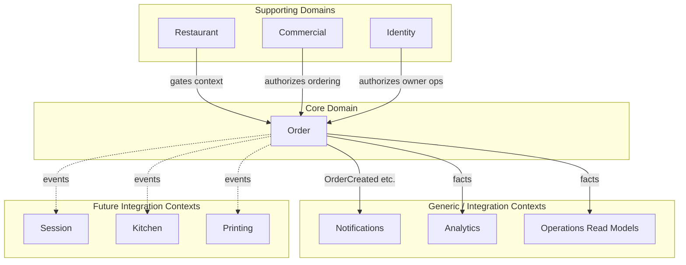

---

### Order (Core Domain)

| Aspect | Specification |
|---|---|
| **Responsibilities** | Order creation, line composition, lifecycle, cancellation, completion, invariants, domain events |
| **Ownership** | `orders`, `order_items` (aggregate persistence); order lifecycle truth |
| **Boundaries** | Does not own restaurant profile, subscription, user identity, notification delivery, print execution, session settlement |
| **Dependencies** | Restaurant (context lookup), Commercial (authorization), Table (seating reference), Menu/Offer (pricing inputs via domain service) |
| **Public contracts** | Commands: `PlaceOrder`, `AdvanceOrderStatus`, `CancelOrder`; Events: see §8; Queries: via read models only for non-aggregate reads |

---

### Commercial (Supporting)

| Aspect | Specification |
|---|---|
| **Responsibilities** | Plan entitlements, feature flags, guest ordering authorization |
| **Ownership** | Subscriptions, entitlements resolution (`@commercial/*`) |
| **Boundaries** | Never stores or mutates orders |
| **Dependencies** | Identity (owner), Restaurant (owner link) |
| **Public contracts** | `CanGuestOrder(restaurantId) → boolean`; used as policy input on `PlaceOrder` |

---

### Restaurant (Supporting)

| Aspect | Specification |
|---|---|
| **Responsibilities** | Venue profile, hours, closure, currency, table label, slug |
| **Ownership** | `restaurants`, `restaurant_tables`, hours JSON |
| **Boundaries** | Does not own order lifecycle |
| **Dependencies** | Identity (owner) |
| **Public contracts** | `GetRestaurantContext(id)`, `IsOpenForOrdering(id, at)` — query services for Order policies |

---

### Kitchen (Future Integration — KITCHEN-DISPLAY-1)

| Aspect | Specification |
|---|---|
| **Responsibilities** | Kitchen display queue, prep routing, station views (future) |
| **Ownership** | Kitchen read models, display state (not order lifecycle) |
| **Boundaries** | **Must not** mutate `orders.status` directly; requests fulfillment acknowledgment via defined commands that delegate to Order |
| **Dependencies** | Order events (`OrderCreated`, `OrderStatusChanged`) |
| **Public contracts** | Inbound: domain events; Outbound: `RequestStatusAdvance` application command (optional future) |

*Current state:* status enum implies kitchen; no KDS domain exists. Blueprint treats Kitchen as **downstream consumer**.

---

### Printing (Future Integration — PRINTING-1 / PRINT-CONNECTOR-1)

| Aspect | Specification |
|---|---|
| **Responsibilities** | Print job creation, device routing, ESC/POS execution (future programs only) |
| **Ownership** | Print jobs, printers, connectors (when reintroduced) |
| **Boundaries** | **Never** co-own order state; **never** inline in Order commit path |
| **Dependencies** | Order events (`OrderCreated`, optionally `OrderReady`) |
| **Public contracts** | Subscribe to events; idempotent print job creation keyed by `orderId` + template |

*Current state:* **Retired (RESET-1)**. Blueprint reserves integration slot only.

---

### Notifications (Generic)

| Aspect | Specification |
|---|---|
| **Responsibilities** | Deliver owner alerts, customer push, in-app notifications |
| **Ownership** | `notifications`, push subscriptions, delivery logs |
| **Boundaries** | Reacts to events; does not decide order state |
| **Dependencies** | Order events, Identity (recipient), Restaurant (owner) |
| **Public contracts** | `OnOrderCreated`, `OnOrderReady` event handlers |

---

### Analytics (Generic)

| Aspect | Specification |
|---|---|
| **Responsibilities** | Aggregated metrics, reports, exports |
| **Ownership** | Analytics read models / materialized facts (future tables or projections) |
| **Boundaries** | Read-only relative to Order aggregate |
| **Dependencies** | Order events or operational read models |
| **Public contracts** | Query APIs: daily/monthly sales, status breakdowns |

---

### Identity (Supporting)

| Aspect | Specification |
|---|---|
| **Responsibilities** | Authentication, authorization, tenant access |
| **Ownership** | Users, sessions (auth), roles |
| **Boundaries** | Does not own business order rules |
| **Dependencies** | None for Order |
| **Public contracts** | `AssertRestaurantAccess(user, restaurantId)` |

---

### Session (Future — settlement context)

| Aspect | Specification |
|---|---|
| **Responsibilities** | Table dining session, settlement (paid/complimentary/closed), session timeline |
| **Ownership** | `dining_sessions`, `table_events`, session aggregates |
| **Boundaries** | Links to orders via `orderId` references; **does not** replace Order lifecycle |
| **Dependencies** | Order events for `ORDER_CREATED`; order read queries for workspace |
| **Public contracts** | Events consumed: `OrderCreated`, `OrderCancelled`; Commands: `LinkOrderToSession` (integration) |

*Migration note:* Replace inline dual-write in `order.create` with post-commit event subscription.

---

# 3. Order Aggregate Blueprint

### Aggregate Root: **Order**

The Order Aggregate is the **sole consistency boundary** for a placed guest order (ADR-ARCH-007).

### Structure

```
Order (Aggregate Root)
├── OrderId (Identity)
├── OrderNumber (Value Object)
├── TrackingToken (Value Object — capability)
├── RestaurantId (Reference)
├── TableId / TableNumber (Value Object / Reference)
├── SessionId? (Optional Reference — assigned via integration)
├── CustomerInfo? (Value Object: name, phone)
├── OrderNotes? (Value Object)
├── OrderStatus (Enum Value Object)
├── Timestamps (Value Object: createdAt, updatedAt, readyAt?)
├── Money (Value Object: totalAmount, currency context from Restaurant)
└── Lines: OrderLine[] (Entities)
    ├── OrderLineId
    ├── MenuItemId | OfferLineId
    ├── Snapshot: nameAr, nameEn, unitPrice
    ├── Quantity
    └── LineNotes?
```

### Entities vs Value Objects

| Concept | Type | Rationale |
|---|---|---|
| Order | Aggregate Root | Controls lifecycle and lines |
| OrderLine | Entity | Identity within aggregate; quantity/notes may differ per line |
| OrderStatus | Value Object | Immutable transition target |
| Money / UnitPrice | Value Object | Financial consistency |
| TrackingToken | Value Object | Opaque guest capability |
| OrderNumber | Value Object | Human-facing identifier, unique per restaurant |

### Business invariants (aggregate-level)

1. **Non-empty lines** — At least one line on creation.
2. **Positive quantity** — Each line quantity ∈ [1, 99].
3. **Non-negative totals** — Total equals sum of line totals (server-computed).
4. **Immutable lines after commit** — No add/remove/reprice after `PlaceOrder` succeeds (modification policy).
5. **Single terminal path** — Terminal states (`served`, `cancelled`) admit no further lifecycle transitions.
6. **Restaurant scope** — All lines belong to the same restaurant as the root.
7. **Tracking token uniqueness** — Globally unique when issued.

### Aggregate state (persisted)

Maps to `orders` + `order_items` tables (current schema aligned; future migration may add `order_events` outbox).

### Aggregate responsibilities

- Accept `PlaceOrder` command (via factory)
- Enforce lifecycle transitions
- Emit domain events on state change
- Reject invalid commands with domain errors

### Explicitly **outside** the aggregate

| Concern | Owner |
|---|---|
| Menu/Offer catalog & live prices | Restaurant/Menu domain service (input to factory) |
| Guest ordering entitlement | Commercial policy |
| Restaurant open hours | Restaurant policy |
| Table existence | Table policy |
| Notification delivery | Notifications context |
| Push subscription enrollment | Customer Push context |
| Session settlement | Session context |
| Print job execution | Printing context (future) |
| Dashboard KPIs | Analytics read models |
| Owner auth | Identity |

---

# 4. Domain Model

### Aggregates

| Aggregate | Purpose |
|---|---|
| **Order** | Core operational unit (only core aggregate in ORDER-1 scope) |

*Session is not part of Order aggregate; it remains a separate aggregate linked by reference.*

### Entities

| Entity | Aggregate | Why |
|---|---|---|
| OrderLine | Order | Independent line identity, notes, quantity |

### Value Objects

| Value Object | Why |
|---|---|
| OrderStatus | Typed lifecycle with transition rules |
| OrderNumber | Format/ uniqueness rules |
| TrackingToken | Guest auth to public read model |
| Money | Decimal precision, currency display context |
| CustomerInfo | Optional PII bundle |
| TableReference | tableId + tableNumber consistency |

### Policies (domain — see §7)

- OrderLifecyclePolicy
- OrderModificationPolicy
- OrderCancellationPolicy
- OrderVisibilityPolicy

### Specifications

| Specification | Purpose |
|---|---|
| `OrderLinesUniqueMenuItemsSpec` | No duplicate menuItemId in cart |
| `OrderWithinRestaurantSpec` | Lines match restaurant |
| `GuestOrderingAllowedSpec` | Commercial + restaurant open + table valid |

### Domain Services

| Service | Why (not in aggregate) |
|---|---|
| **OrderPricingService** | Resolves authoritative prices from Menu/Offer catalogs (cross-aggregate read) |
| **OrderNumberAllocationService** | Generates next order number per restaurant (requires sequence/lock strategy) |
| **TrackingTokenIssuanceService** | Cryptographic/nanoid uniqueness |

### Repositories

| Repository | Responsibility |
|---|---|
| **OrderRepository** | Load/save Order aggregate atomically |
| *(no direct repository for notifications, sessions, etc.)* | Integration via events |

---

# 5. Order Lifecycle Architecture

### States (authoritative)

| State | Meaning |
|---|---|
| `pending` | Order received; awaiting kitchen/owner acknowledgment |
| `preparing` | Order accepted for preparation |
| `ready` | Order ready for pickup/serving |
| `served` | Order fulfilled to guest (**terminal success**) |
| `cancelled` | Order voided (**terminal failure**) |

### State diagram

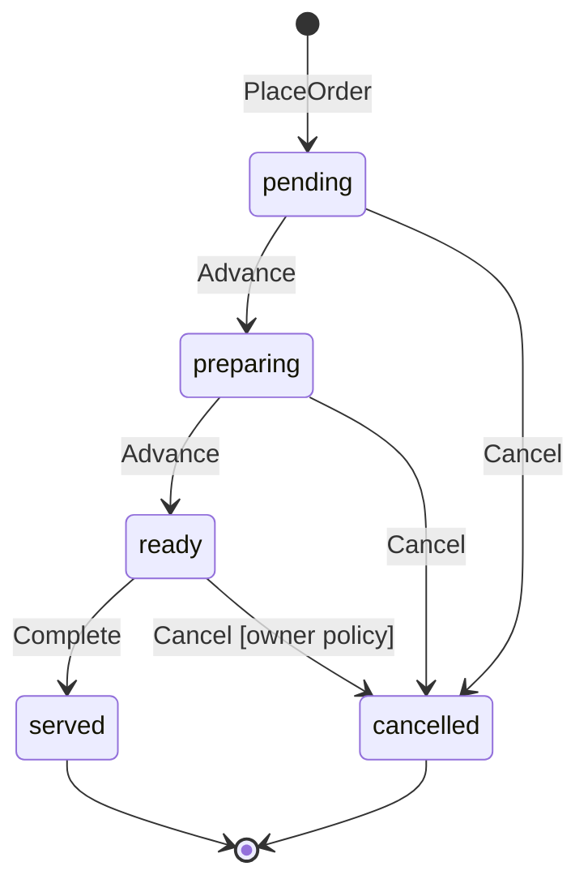

### Valid transitions

| From | To | Actor | Notes |
|---|---|---|---|
| `pending` | `preparing` | Owner/staff | Accept order |
| `pending` | `cancelled` | Owner/staff | Reject/void |
| `preparing` | `ready` | Owner/staff | Mark ready |
| `preparing` | `cancelled` | Owner/staff | Void during prep |
| `ready` | `served` | Owner/staff | Complete service |
| `ready` | `cancelled` | Owner/staff | Rare; policy-gated |

### Invalid transitions (reject at domain)

- Any transition **from** `served` or `cancelled`
- Skip states unless explicitly allowed by future policy (default: **no skipping** — e.g. `pending` → `ready` forbidden)
- Guest-initiated status changes (always forbidden)

### Terminal states

- `served` — success terminal
- `cancelled` — failure terminal

### Transition rules

1. Only **AdvanceOrderStatus** / **CancelOrder** commands mutate status.
2. **readyAt** set on first entry to `ready` (immutable once set).
3. **Cancel from `ready`** requires OrderCancellationPolicy (configurable strictness; default allow owner cancel before `served`).

### State invariants

- `readyAt` non-null iff status ∈ {`ready`, `served`} and was previously ready.
- `totalAmount` immutable post-create.
- Status monotonic along allowed graph except cancel.

---

# 6. Business Invariants

| ID | Invariant | Why | Enforced | ADR |
|---|---|---|---|---|
| INV-01 | Server-authoritative pricing | Prevent tampering | OrderPricingService at PlaceOrder | 002, 007 |
| INV-02 | Client price/name ignored | SSOT for money | Command handler strips client fields | 002 |
| INV-03 | Lines immutable after create | Financial audit trail | OrderModificationPolicy | 007 |
| INV-04 | Valid lifecycle transitions only | Operational integrity | OrderLifecyclePolicy | 001, 007 |
| INV-05 | Terminal states are final | No resurrection | OrderLifecyclePolicy | 007 |
| INV-06 | Guest cannot mutate status | Authority boundary | OrderVisibilityPolicy + auth | 003, 006 |
| INV-07 | Owner ops require restaurant access | Tenant isolation | Identity + application layer | 003 |
| INV-08 | Public read via tracking token + slug | Tenant boundary | OrderVisibilityPolicy | 003 |
| INV-09 | Order belongs to one restaurant | Multi-tenant safety | Aggregate + PlaceOrder | 002 |
| INV-10 | Total = Σ line totals at create | Financial consistency | Aggregate factory | 002, 007 |
| INV-11 | Commercial ordering gate | Plan enforcement | GuestOrderingAllowedSpec | 003 |
| INV-12 | Restaurant must be open (policy) | Business rule | Restaurant open spec | 003 |
| INV-13 | Tracking token unique | Guest capability security | Token issuance service | 002 |
| INV-14 | Order number unique per restaurant | Operations clarity | Allocation service | 002 |
| INV-15 | Cancel decrements session aggregates (integration) | Session consistency | Event subscriber, not inline | 004 |

---

# 7. Policy Architecture

Policies are **pure domain rules** (no I/O). Application services inject policy dependencies via specifications/query ports.

### OrderLifecyclePolicy

- **Responsibility:** `canTransition(from, to, context) → boolean`
- **Inputs:** Current status, target status, actor role, optional flags
- **Interactions:** Called by Order aggregate method before state change

### OrderModificationPolicy

- **Responsibility:** `canModifyLines(order) → false` (ORDER-1: no modifications post-create)
- **Future:** May allow pre-acceptance edits if product requires—default **deny**

### OrderCancellationPolicy

- **Responsibility:** `canCancel(order, actor) → boolean`
- **Rules:** Owner/staff only; allowed from non-terminal states per §5

### OrderVisibilityPolicy

- **Responsibility:** Map aggregate → public DTO; strip internal IDs/PII
- **Rules:** Guest sees only public projection; owner sees full operational view via authenticated read model

### Policy independence

Policies **must not** call repositories, HTTP, or notification services. Application layer loads aggregate, invokes policy, persists, publishes events.

---

# 8. Domain Events Architecture

Events are **past tense**, immutable, emitted **after commit** (ADR-ARCH-004).

### Official Domain Events

| Event | Publisher | Payload (conceptual) | Subscribers |
|---|---|---|---|
| **OrderCreated** | Order | orderId, restaurantId, tableId, orderNumber, trackingToken, totalAmount, lineCount, sessionId?, createdAt | Notifications (owner alert), Session (link/ORDER_CREATED), Analytics, Ops feed, Kitchen (future), Printing (future) |
| **OrderStatusChanged** | Order | orderId, restaurantId, fromStatus, toStatus, changedAt, actorId? | Notifications (ready push trigger), Analytics, Ops feed, Kitchen, Session aggregates (cancel) |
| **OrderReady** | Order | orderId, trackingToken, readyAt | Customer push, Kitchen display (future) |
| **OrderCompleted** | Order | orderId, servedAt | Analytics, Session (future settlement hints) |
| **OrderCancelled** | Order | orderId, cancelledAt, reason? | Session (aggregate decrement), Analytics, Ops feed |

### Ordering guarantees

- Per **orderId**: events total order preserved (single writer).
- Cross-order: no global ordering required.

### Idempotency expectations

| Subscriber | Key |
|---|---|
| Notifications | `orderId` + event type + channel |
| Session link | `orderId` |
| Push on ready | `orderId` + `readyAt` |
| Analytics projection | `eventId` or `(orderId, sequence)` |
| Future print | `orderId` + templateId |

### Failure handling

- **Outbox pattern (recommended):** Events persisted in same transaction as aggregate; relay process delivers to subscribers.
- Subscriber failure: retry with backoff; dead-letter after N attempts; **never** roll back committed order.
- Non-critical subscribers (analytics lag) must not block commit.

### Event transport (architecture-level)

- ORDER-1: in-process dispatcher acceptable if outbox table exists.
- ORDER-EVENTS-1: formalize outbox relay, idempotency store, monitoring.

---

# 9. Service Architecture

### Application Services

| Service | Responsibilities | Prohibited |
|---|---|---|
| **PlaceOrderService** | Orchestrate specs, pricing, factory, repository save, outbox emit | Direct SQL; inline notifications |
| **AdvanceOrderStatusService** | Load aggregate, lifecycle policy, save, emit | Skip policy; UI-driven rules |
| **CancelOrderService** | Cancel path | Delete orders physically (soft via status) |
| **OrderQueryFacade** | Route to read models | Compute KPIs; mutate state |

### Domain Services

| Service | Responsibilities | Prohibited |
|---|---|---|
| **OrderPricingService** | Authoritative line resolution | Persist orders |
| **OrderNumberAllocationService** | Allocate numbers | Generate client-facing tokens for non-order use |

### Infrastructure Services

| Service | Responsibilities | Prohibited |
|---|---|---|
| **OrderRepository (impl)** | Drizzle/DB persistence | Business rules |
| **EventOutbox / Relay** | Durable event delivery | Lifecycle decisions |
| **NotificationAdapter** | Email/push/in-app | Order state mutation |
| **CommercialAuthorizationPort** | Entitlement lookup | Store order fields |

---

# 10. Repository Architecture

### Repository interface (conceptual)

```
OrderRepository
  save(order: Order): Promise<void>
  findById(id: OrderId): Promise<Order | null>
  findByTrackingToken(token, restaurantSlug): Promise<Order | null>  // via read-optimized query acceptable
```

### Persistence responsibilities

- Insert/update `orders` + `order_items` in **one transaction**
- Insert outbox rows in same transaction
- Enforce optimistic concurrency via `updatedAt` or version column (recommended ADR)

### Transaction boundaries

- **One command = one transaction = one aggregate save**
- No cross-aggregate transactions (Session updated via events)

### Concurrency

- **OrderNumberAllocation:** use DB sequence row or `SELECT FOR UPDATE` on restaurant counter—replace `COUNT+1` pattern from audit.
- **Status updates:** optimistic lock on `updatedAt`; reject stale writes.

### Aggregate persistence rules

- Always persist full line set on create; no partial line writes.
- Status updates touch root only (lines unchanged in ORDER-1).
- `readyAt` set by aggregate logic, persisted once.

---

# 11. Read Model Architecture

**Rule (ADR-ARCH-006):** UI must never compute business metrics.

### Operational Read Models

| Model | Consumer | Source | Owner |
|---|---|---|---|
| **OwnerOrderList** | Dashboard Orders tab | Orders + lines projection | Order / Ops |
| **OwnerOrderDetail** | Order detail | Orders + lines | Order |
| **PublicOrderStatus** | Guest tracking page | Sanitized projection + expiry rules | Order |
| **ActiveOrderCount** | Ops overview | Count pending/preparing/ready | Ops |

*Replaces client `buildOrderStatistics` in Dashboard.*

### Dashboard Read Models

| Model | Consumer | Notes |
|---|---|---|
| **TodayOrderSummary** | Home snapshot | status breakdown, pending count |
| **SessionOrderCounts** | Dining workspace | derived from list projection |

### Analytics Read Models

| Model | Consumer | Notes |
|---|---|---|
| **DailySalesFact** | Reports tab | served orders revenue |
| **MonthlyRollup** | Excel export | server-generated |
| **YearlyRollup** | Reports | server-generated |

### Reporting Read Models

| Model | Consumer | Notes |
|---|---|---|
| **Commercial operational reports** | Admin/commercial PDF | Already separate; order facts feed in |

### Update strategy

- **Projections:** updated by domain event handlers (sync or async).
- **Guest polling:** reads `PublicOrderStatus` projection only.

---

# 12. Integration Architecture

### Summary matrix

| Context | Direction | Mechanism | Allowed | Forbidden |
|---|---|---|---|---|
| **Commercial** | Inbound to Order | Spec on PlaceOrder | Gate | Store order data |
| **Restaurant/Table** | Inbound | Specs | Context lookup | Lifecycle ownership |
| **Notifications** | Outbound | OrderCreated, OrderReady events | Deliver alerts | Mutate order |
| **Analytics** | Outbound | Events → facts | Aggregate metrics | Client-side KPI math |
| **Kitchen** | Outbound (future) | OrderCreated/StatusChanged | Display queue | Direct status SQL |
| **Printing** | Outbound (future) | OrderCreated/OrderReady | Print jobs | Inline print in commit |
| **Session** | Outbound + reference | OrderCreated; cancel adjusts via event | Link orderId | Inline aggregate in router |
| **Identity** | Inbound | Auth on owner commands | Access control | — |

### Session (future) — target integration

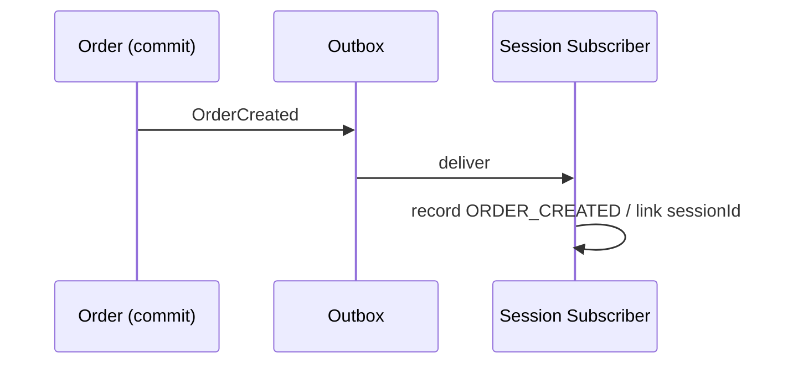

**Forbidden:** `order.create` directly calling `incrementSessionAggregatesForOrder` post-ORDER-1.

### Printing (future)

- **Inbound:** none
- **Outbound:** `OrderCreated` → PrintConnector creates idempotent job
- **Forbidden:** Order aggregate knowing printer IDs, ESC/POS payloads

---

# 13. Production Path (Single Authoritative Flow)

```
Customer / Owner Request
        ↓
Application Layer (Command Handler)
        ↓
Specifications + Policies (domain)
        ↓
Order Aggregate (factory / behavior)
        ↓
OrderRepository.save (transaction)
        ↓
Commit
        ↓
Domain Events → Outbox
        ↓
Event Subscribers (Notifications, Session, Analytics, Ops, future Kitchen/Print)
        ↓
Read Model Projectors (update projections)
        ↓
Presentation (tRPC queries → UI render only)
```

**Not permitted:**

- Router → DB insert → inline notification
- Dashboard → compute revenue from raw list
- Feature-flag bypass of session event path in certified prod
- Alternative create path (e.g. admin “manual order”) without same pipeline—if added later, must use same Application Service

---

# 14. Architectural Constraints Catalogue

### Must

- MUST mutate order state only through Order Application Services.
- MUST enforce lifecycle via OrderLifecyclePolicy.
- MUST compute totals via OrderPricingService at create.
- MUST emit domain events after successful commit.
- MUST serve owner analytics from server read models.
- MUST use tracking token + slug for guest public access.

### Must Not

- MUST NOT accept client-supplied prices or names as authoritative.
- MUST NOT allow UI-only status transition rules without server enforcement.
- MUST NOT invoke notification/session/print services inside aggregate or repository.

### Never

- NEVER store commercial entitlements on order rows.
- NEVER resurrect terminal orders.
- NEVER reintroduce printing inline in Order commit path (RESET-1).
- NEVER compute monthly/yearly sales in client Dashboard code post-ORDER-1.

### Only

- ONLY Order aggregate changes `orders.status` and line snapshots.
- ONLY PlaceOrder creates order lines.
- ONLY one certified production path for create/update.

### Allowed

- ALLOWED: tRPC as application adapter.
- ALLOWED: In-process event dispatch for ORDER-1 if outbox present.
- ALLOWED: Guest public create without auth (with gates).

### Forbidden

- FORBIDDEN: Cross-context DB writes in one router procedure.
- FORBIDDEN: Kitchen/Print domains writing to `orders` table.
- FORBIDDEN: `TABLE_SESSION_DUAL_WRITE` divergent behavior in certified production.

---

# 15. Sequence Diagrams

### Order Creation

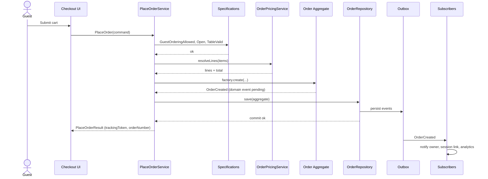

### Order Status Update

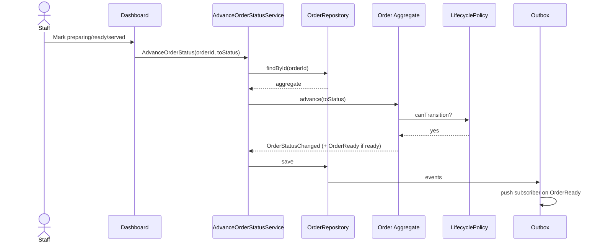

### Order Cancellation

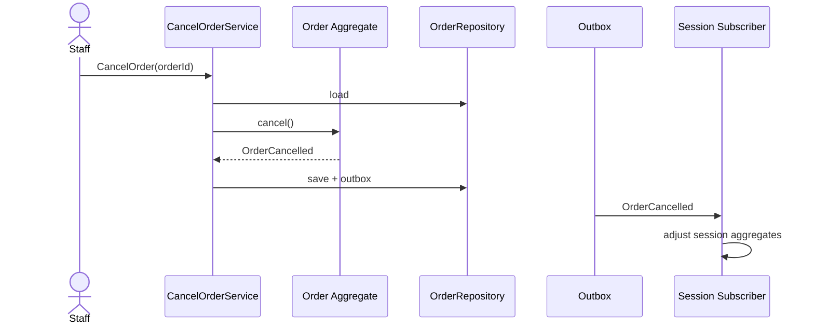

### Order Completion

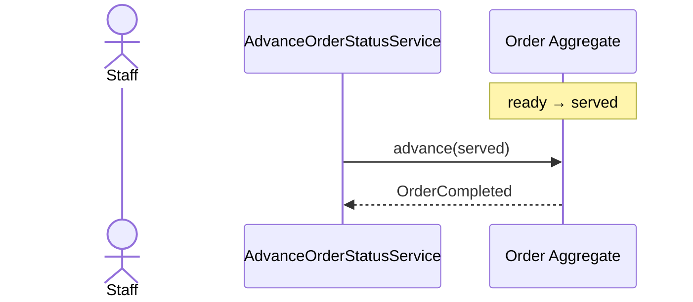

### Event Publication

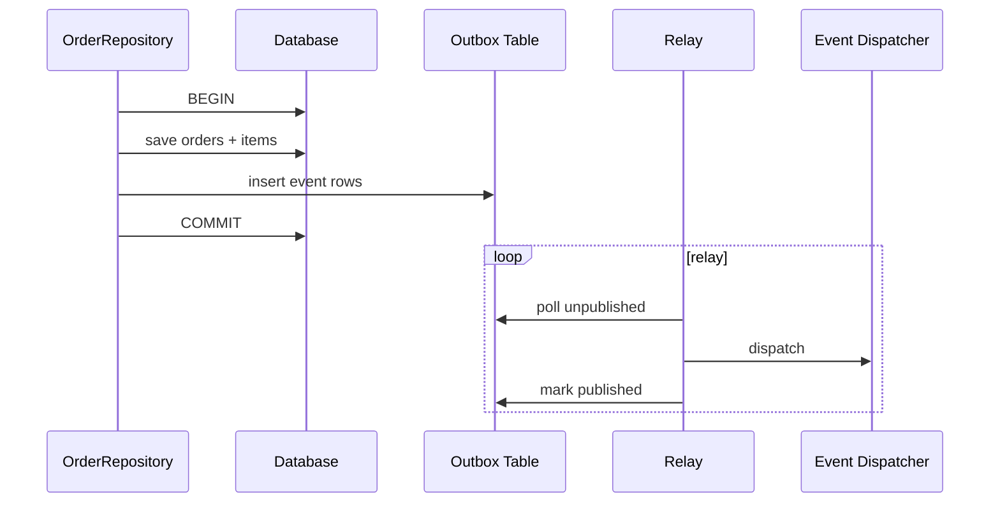

### Read Model Update

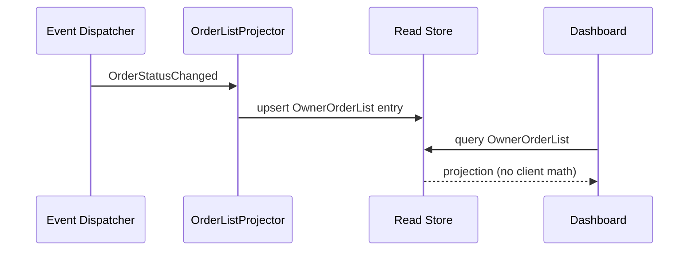

### Notification Flow

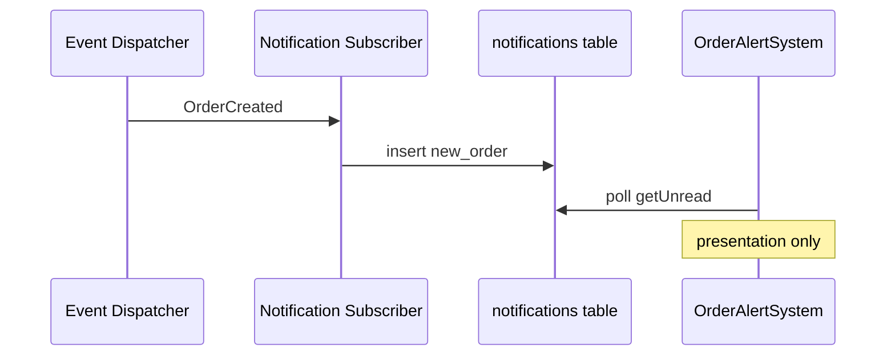

### Printing Trigger (Future)

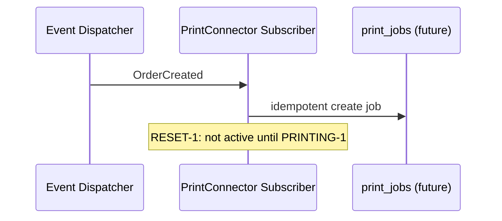

### Kitchen Update (Future)

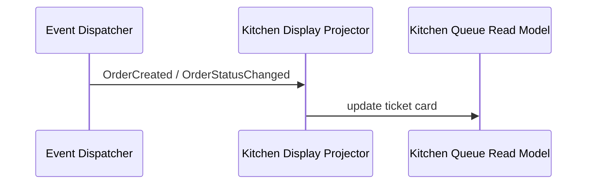

---

# 16. Architectural Risks

| Risk | Type | Mitigation |
|---|---|---|
| Router monolith resists extraction | Coupling | ORDER-1 strangler: move one command at a time behind services |
| Dual-write flag divergence | Current | Mandate convergence before ORDER-1 sign-off |
| Outbox operational complexity | Future | ORDER-EVENTS-1 with monitoring, idempotency store |
| Order number race conditions | Performance | Sequence row per restaurant |
| Event subscriber lag | UX | Read-your-writes: command response includes minimal DTO; projections catch up |
| Scope creep (kitchen/print in ORDER-1) | Evolution | Strict program boundaries per blueprint |
| Session–Order coupling regression | Coupling | Architecture reviews + forbidden dependency lint |
| Client KPI regression | ADR-006 | Delete `buildOrderStatistics`; server queries required for merge |

---

# 17. Architectural Decisions — Ratified ADRs

The following ADRs are **ratified** with Constitution v1.0. See [ADR Registry](../constitution/ADR-Registry.md) and individual documents in [adrs/](../adrs/).

---

### ADR-ARCH-008 — Order Outbox and Event Relay

| Field | Content |
|---|---|
| **Problem** | Inline side effects violate ADR-004; commit/notification ordering is unsafe |
| **Context** | ARCH-1A.1 found sync notification/session calls in router |
| **Decision** | All Order domain events persist to an outbox in the same transaction; relay dispatches asynchronously |
| **Consequences** | + reliability, + testability; − operational component, slight latency for subscribers |
| **Alternatives** | In-process only (rejected: not durable); message broker immediately (deferred: complexity) |

---

### ADR-ARCH-009 — Order Read Models Own Dashboard Analytics

| Field | Content |
|---|---|
| **Problem** | Dashboard computes sales KPIs client-side (ADR-002/006 violation) |
| **Context** | `buildOrderStatistics` in Dashboard.tsx |
| **Decision** | Today/month summaries served exclusively by server read models or query APIs |
| **Consequences** | + SSOT; requires ORDER-1 read model endpoints |
| **Alternatives** | Keep client math with server “verification” (rejected) |

---

### ADR-ARCH-010 — Session Integration via Order Events Only

| Field | Content |
|---|---|
| **Problem** | Session aggregates updated inline on create/cancel |
| **Context** | `TABLE_SESSION_DUAL_WRITE` and aggregate writers in order path |
| **Decision** | Session context subscribes to OrderCreated/OrderCancelled; no session writes in PlaceOrderService |
| **Consequences** | Eventual consistency for session totals; cleaner boundaries |
| **Alternatives** | Shared transaction Order+Session (rejected: wrong aggregate boundary) |

---

### ADR-ARCH-011 — Optimistic Concurrency on Order Root

| Field | Content |
|---|---|
| **Problem** | Concurrent status updates may lost-update |
| **Context** | No version check on update today |
| **Decision** | Order root carries version/`updatedAt` check on save |
| **Consequences** | UI retry on conflict; safer multi-staff operations |
| **Alternatives** | Pessimistic locking (rejected: TiDB row lock cost) |

---

### ADR-ARCH-012 — Printing and Kitchen as Event Consumers (Future)

| Field | Content |
|---|---|
| **Problem** | Need fulfillment channels without polluting core domain |
| **Context** | RESET-1 removed printing; kitchen implied by status only |
| **Decision** | PRINTING-1 and KITCHEN-DISPLAY-1 may only integrate via Order domain events and read models |
| **Consequences** | Clear re-entry path for print; no RESET-1 regression |
| **Alternatives** | Embed print in PlaceOrder (rejected: historical failure mode) |

---

# Program Alignment (Implementation Roadmap Reference)

| Program | Blueprint sections consumed |
|---|---|
| **ORDER-1** | §3–7, §9–10, §13–14 — aggregate, policies, services, repository |
| **ORDER-EVENTS-1** | §8, §15 — outbox, relay, idempotency |
| **ORDERS-WORKSPACE-1** | §11 — owner list/detail projections, session workspace reads |
| **KITCHEN-DISPLAY-1** | §2 Kitchen, §12, §15 — queue read model |
| **PRINT-WORKSPACE-1 / PRINTING-1 / PRINT-CONNECTOR-1** | §2 Printing, §12, §15 — event-triggered jobs |
| **COMMERCIAL** | §2 — gate only; already stabilized (ARCH-1A) |

---

# Final Verdict

| Item | Status |
|---|---|
| **Architecture Blueprint** | Complete — ready for Architecture Authority review |
| **Implementation** | Not authorized in ARCH-1 |
| **Repository changes** | None (design only) |
| **Compliance target** | ADR-ARCH-001 through ADR-ARCH-013 (all ratified) |

This document is the **authoritative Order-Centric Architecture** for MineuQR 2.0. All implementation programs (starting with **ORDER-1**) must trace changes to sections and constraints herein.

---

**Authority:** Ratified as Part I of [Architecture Constitution v1.0](../constitution/Architecture-Constitution-v1.0.md). Next program: **ORDER-1**.

[REDACTED]