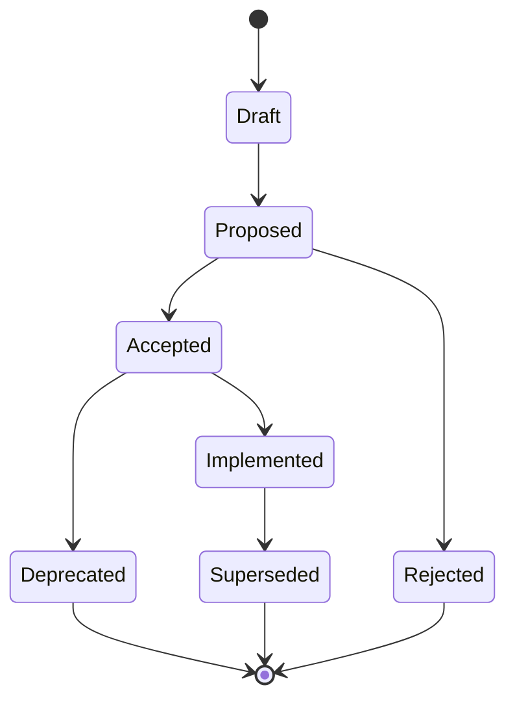

# ADR Lifecycle

> **Constitution §26** · [Governance](../constitution/Governance.md)

# 26. ADR Governance

### ADR lifecycle statuses

| Status | Meaning |
|---|---|
| **Draft** | Author working; not binding |
| **Proposed** | Submitted to Architecture Authority |
| **Accepted** | Binding; implementations must plan compliance |
| **Implemented** | At least one program certified against it |
| **Deprecated** | Still documented; new work must not rely on it |
| **Superseded** | Replaced by named ADR; historical reference only |
| **Rejected** | Recorded decision not to adopt |

### Approval process

1. Author drafts ADR (problem, context, decision, consequences, alternatives).
2. Architecture review (async doc + sync if contested).
3. Architecture Authority votes **Accept** or **Reject**.
4. Accepted ADRs registered in constitutional ADR index.
5. Implementation programs cite ADR IDs in charter.

### Review process

- **Quarterly** ADR hygiene review (deprecated/superseded cleanup).
- **Mandatory** ADR for: new bounded context, breaking event schema, new production path, cross-context write pattern.

### Ownership

| Role | Responsibility |
|---|---|
| Architecture Authority | Accept/reject/supersede |
| Principal Engineer | Draft, maintain index |
| Program Lead | Implementation evidence |
| Engineering | Propose ADRs for local decisions that cross teams |

### Documentation rules

- ADRs live in `docs/architecture/adrs/` (path convention — not created in this program).
- Format: ADR-ARCH-NNN — Title.
- Superseded ADRs must link forward and backward.

### Change management

- **No silent ADRs** — draft in governance before code merges.
- **Emergency ADRs** within 5 business days of exception (§28.4).

---

---

**Template:** [ADR-Template.md](../templates/ADR-Template.md) · **Registry:** [ADR-Registry.md](../constitution/ADR-Registry.md)