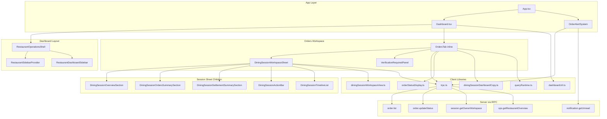
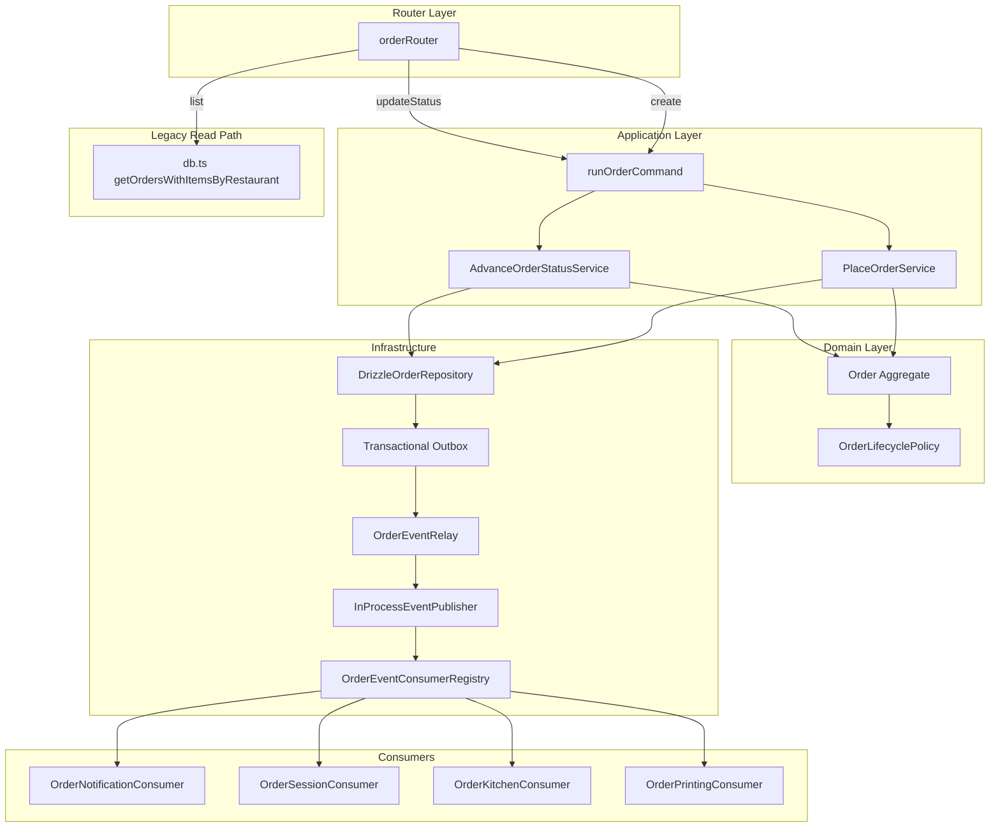

# INV-03 — Component Dependency Graph

**Program:** ORDERS-WORKSPACE-1  
**Type:** Architecture Investigation (read-only)  
**Date:** 2026-06-26

---

## Ownership Map

| Owner Module | Owns | Does Not Own |
|--------------|------|--------------|
| `Dashboard.tsx` | `OrdersTab`, `ReportsTab`, `OperationalSnapshotSection`, all order KPI helpers | Domain lifecycle, event emission |
| `orderStatusDisplay.ts` | Status labels, lifecycle step indices | Status authority |
| `diningSessionWorkspaceView.ts` | Settlement derivation, item counts | Session domain state |
| `sessionWorkspaceOps.ts` | Board row derivations | Ops board server projection |
| `server/order/` | Aggregate, application services, events | UI rendering |
| `server/routers.ts` `orderRouter` | HTTP/tRPC orchestration | Should not own business rules (partial violation on `create`) |

---

## UI Dependency Graph

---

## Server-Side Dependency Graph (Orders mutations)

---

## Coupling Analysis

| Coupling | Severity | Evidence |
|----------|----------|----------|
| `Dashboard.tsx` monolith | **High** | Orders, reports, menu, settings in single 4,400+ line file |
| `OrdersTab` ↔ `DiningSessionWorkspaceSheet` | **Medium** | Session drill-down tightly coupled to order cards |
| Client KPI helpers ↔ `order.list` raw payload | **High** | `buildOrderStatistics` depends on full order list shape |
| Duplicate status labels | **Medium** | `orderStatusDisplay.ts` exists but `OrdersTab` duplicates inline `statusLabels` (lines 3883–3889) |
| `order.list` polled from 6+ components | **Medium** | Independent subscriptions, no shared provider |
| Router `create` ↔ session resolution | **Medium** | `resolveSessionForOrderCreate` in router before application service |
| Read path bypasses domain | **High** | `order.list` → `db.ts` direct, not read model |

---

## Circular Dependencies

| Check | Result | Evidence |
|-------|--------|----------|
| Client import cycles | **None detected** | Standard tree: pages → components → lib → trpc |
| Server order module cycles | **None detected** | Domain does not import infrastructure |
| Router ↔ consumer inline calls | **Resolved** | ORDER-EVENTS-1B removed inline notification/session from router (`order-router-cleanup.test.ts`) |

---

## Shared Dependencies

| Dependency | Consumers |
|------------|-----------|
| `trpc.order.list` | `OrdersTab`, `ReportsTab`, `OperationalSnapshotSection`, `SessionsWorkspacePanel`, `ActiveSessionsTableSection`, `DiningSessionWorkspaceSheet` |
| `buildOrderStatistics` | `OperationalSnapshotSection`, `ReportsTab` |
| `orderStatusDisplay.ts` | Customer pages; **not** owner `OrdersTab` |
| `diningSessionDashboardCopy.ts` | `OrdersTab`, session components |
| `queryRuntime.ts` poll constants | All dashboard order/ops queries |
| `db.ts` read helpers | `order.list`, `order.getById`, consumers (notification reads back) |

---

## Orphan / Dead Code

| Artifact | Status | Evidence |
|----------|--------|----------|
| `DiningSessionOrdersList.tsx` | **Orphan** | No imports in codebase |
| `buildTodayReport()` | **Dead** | Defined `Dashboard.tsx` line 3483, no callers found |
| `order.getById` tRPC | **Unused by client** | Only referenced in server tests |
| `order.activeCount` tRPC | **Unused by client** | Dashboard uses `ops.getRestaurantOverview.pendingOrders` instead |
| `order.trackOrder` | **Deprecated stub** | Always returns `null` |

---

## Dependency Direction Compliance

**Expected:** UI → Application (tRPC) → Domain → Infrastructure

**Actual violations documented in INV-11:**
- UI computes business metrics (`buildOrderStatistics`)
- UI derives settlement state (`deriveSettlementSummary`)
- Read queries skip application layer (`order.list` → `db.ts`)
