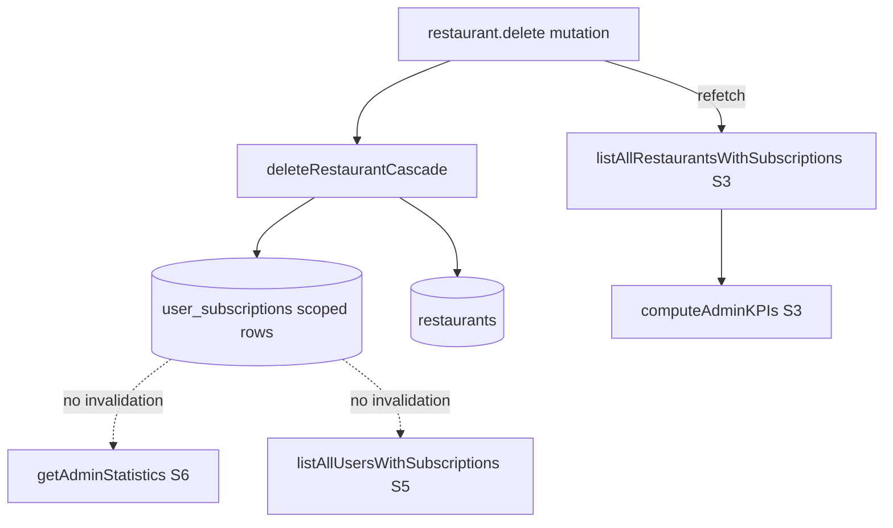

# ADMIN DASHBOARD AUDIT — ADA-1 — Authority Source Mapping

**Program:** Admin Dashboard Audit (ADA)  
**Phase:** ADA-1 — Authority source mapping  
**Date:** 2026-06-08  
**Status:** Complete — read-only documentation  

**Mode:** Mapping only. No code, schema, database, migration, cleanup, or rebuild.

**Upstream:** `ADMIN-DASHBOARD-AUDIT-ADA-0.md` (RED — six authority strategies S1–S6)

---

## 1. Executive Summary

ADA-1 maps **every admin dashboard surface** to its **subscription authority strategy** (S1–S6).

### 1.1 Headline finding

**No admin dashboard screen consumes canonical authority (S1).**

| Strategy | Admin dashboard usage |
|----------|----------------------|
| **S1** Account-only | **0 admin surfaces** (owner-only: `commercial.getEntitlements`) |
| **S2** Scoped-only | Restaurant subscription edit/create checks |
| **S3** Scoped-first | Restaurant list, KPI `activeRestaurants`, plan display on cards |
| **S4** Any-scope canonical | Invoice PDF generation server path; conflicts with user-list S5 |
| **S5** First-row `find` | Users section on `/admin` |
| **S6** Raw aggregation | Statistics page, admin KPI MRR/subscriber counts |

Admin commercial UI is **entirely non-canonical**. Owner diagnostics (`/commercial/diagnostics`) use S1 but are **outside** the admin dashboard program scope.

### 1.2 Conflicting truths (same session, same user)

| Conflict | Screen A | Screen B | Strategies |
|----------|----------|----------|------------|
| User with 3 scoped subs | Users table shows **one** arbitrary sub (S5) | Statistics table shows **three** rows (S6) | S5 vs S6 |
| Multi-venue owner | Users: first sub only | Restaurants: per-venue scoped sub (S3) | S5 vs S3 |
| Invoice generation | `getCanonicalUserSubscription` (S4) | Users list display (S5) | S4 vs S5 |
| KPI active restaurants vs active subscriptions | Venue-level active/trial (S3 client filter) | Row count all subs active\|trial (S6) | S3 vs S6 |

### 1.3 Output classification

## **RED**

Widespread drift — **every** admin commercial surface uses legacy or derived strategies (S2–S6). **Zero** admin screens align with ASN canonical S1.

### 1.4 Success criteria answers

| # | Question | Answer |
|---|----------|--------|
| 1 | Screens using **S1**? | **None** in admin dashboard |
| 2 | Screens using **S2**? | Restaurant subscription create guard; restaurant-scoped mutations |
| 3 | Screens using **S3**? | `/admin` restaurant section, KPI `activeRestaurants` / `expiringSoon` |
| 4 | Screens using **S4**? | `admin.generateInvoicePDF`; `createUserSubscriptionByAdmin` existence check |
| 5 | Screens using **S5**? | `/admin` Users section (`listAllUsersWithSubscriptions`) |
| 6 | Screens using **S6**? | `/statistics`, `/admin` KPI subscriber/MRR fields |
| 7 | MRR source? | `getAdminStatistics` → `computeAdminMrr` on all `status=active` rows (§5) |
| 8 | Conflicting truths? | Users vs Statistics vs Restaurants (§1.2, §6) |
| 9 | Safe areas? | `/users`, `/super-admin` identity tables; platform entity counts (§9) |
| 10 | Rebuild required? | KPI strip, Users commercial columns, Statistics commercial block, Restaurant commercial cards (§8) |

---

## 2. ADA-1.1 — Dashboard Inventory

### 2.1 Route map (actual codebase)

MineuQR does **not** implement separate routes for every item in the ADA brief navigation list. Actual admin surfaces:

| Component | Route | Purpose | Notes |
|-----------|-------|---------|-------|
| **Admin Dashboard Home** | `/admin` | KPI overview, restaurant ops, embedded users + notifications + invoices | Primary admin surface (`AdminManagement.tsx`) |
| **Statistics / Analytics** | `/statistics` | MRR, revenue chart, subscription breakdown, export | Linked from `/admin` header |
| **Users (simple)** | `/users` | Role edit, delete — **no subscription data** | Standalone page |
| **Super Admin** | `/super-admin` | Entity totals + user delete | Legacy/alternate admin UI |
| **Owner Dashboard** | `/dashboard` | Not admin — included for drift boundary | Uses S1 via `useCommercialFeatureVisibility` |
| **Commercial Diagnostics** | `/commercial/diagnostics` | S1 entitlements debug | Not admin; migration verification |

**Not implemented as dedicated admin routes:**

| Brief nav item | Actual location |
|----------------|-----------------|
| Plans | `subscription.listPlans` — catalog picker in dialogs only; **no plan admin CRUD page** |
| Invoices | `admin.generateInvoicePDF` action on user row; `admin.getUserInvoices` **not wired in client** |
| Notifications | Embedded in `/admin` Users section (`sendCustomNotification`, `sendBulkNotification`) |
| Settings | **No admin settings route** found |

### 2.2 Commercial UI inventory

| Component | Parent route | Purpose |
|-----------|--------------|---------|
| **KPI — Active Restaurants** | `/admin` | Venues with subscription `active` or `trial` |
| **KPI — Active Subscriptions** | `/admin` | Count from `getAdminStatistics.activeSubscribers` |
| **KPI — Expiring Soon** | `/admin` | Venue subs ending within 30 days |
| **KPI — Estimated MRR** | `/admin` | `getAdminStatistics.totalRevenue` |
| **KPI — Total Users** | `/admin` | `getExtendedAdminStats.totalUsers` |
| **Restaurant status badge** | `/admin` | Per-venue subscription status |
| **Restaurant plan / billing / price** | `/admin` | Scoped sub + `subscription.listPlans` catalog |
| **Restaurant subscription actions** | `/admin` | Create/edit/delete/cancel scoped sub |
| **User subscription badge** | `/admin` | Status from `listAllUsersWithSubscriptions` |
| **User plan / end date columns** | `/admin` | From S5 picked sub + plan join |
| **User subscription modal** | `/admin` | Create/edit user or scoped sub |
| **Invoice PDF action** | `/admin` | `generateInvoicePDF` per user |
| **Statistics — MRR card** | `/statistics` | Same as admin KPI MRR (S6) |
| **Statistics — subscriber cards** | `/statistics` | Raw status counts (S6) |
| **Statistics — revenue chart** | `/statistics` | `getRevenueByMonth` (S6) |
| **Statistics — plan pie chart** | `/statistics` | `subscriptionsByPlan` (S6) |
| **Statistics — subscription table** | `/statistics` | `getSubscriptionDetails` (S6 + wrong join) |
| **Create restaurant + plan picker** | `/admin` dialog | Optional scoped sub on create |

---

## 3. ADA-1.2 — Resolver Mapping

### 3.1 Server procedures → authority path

| Procedure | Service function | Resolver / selection logic | Strategy |
|-----------|------------------|----------------------------|----------|
| `admin.getStatistics` | `getAdminStatistics()` | `SELECT *` from `user_subscriptions`; MRR = `computeAdminMrr(allSubs)` | **S6** |
| `admin.getRevenueByMonth` | `getRevenueByMonth()` | Filter all subs by `createdAt` month + `status=active` | **S6** |
| `admin.getSubscriptionDetails` | `getSubscriptionDetails()` | Map each sub row; restaurant = first user restaurant | **S6** (+ join defect) |
| `admin.getExtendedStats` | `getExtendedAdminStats()` | Entity `COUNT(*)` — no subscription picker | **N/A** (non-commercial) |
| `admin.listAllRestaurantsWithSubscriptions` | `getAllRestaurantsWithSubscriptions()` | `pickCanonicalSubscription(scoped)` ?? `pickUserLevelSubscription` | **S3** |
| `admin.listAllUsersWithSubscriptions` | `getAllUsersWithSubscriptions()` | `allSubs.find(s => s.userId === u.id)` | **S5** |
| `admin.listAllUsers` | `getAllUsers()` | No subscriptions | **N/A** |
| `admin.createRestaurantSubscription` | `createSubscriptionForRestaurant` | Pre-check `getSubscriptionForRestaurant` | **S2** write |
| `admin.updateRestaurantSubscription` | `updateSubscriptionById` | By `subscriptionId` | **S2** (row-level) |
| `admin.deleteRestaurantSubscription` | `deleteSubscriptionCascade` | By id | **S2** |
| `admin.createUserSubscriptionByAdmin` | `createSubscriptionForRestaurant` | Conflict: `getCanonicalUserSubscription` | **S4** check → **S2** write |
| `admin.updateUserSubscriptionByAdmin` | `updateSubscriptionById` | Target: `resolveSubscriptionForActivation` | **S4** |
| `admin.deleteUserSubscriptionByAdmin` | `deleteSubscriptionCascade` | By user-targeted resolution | **S4** |
| `admin.generateInvoicePDF` | `createInvoice` + PDF | Sub: `getCanonicalUserSubscription(userId)` | **S4** |
| `subscription.listPlans` | `getSubscriptionPlans()` | Catalog reference | **N/A** |
| `restaurant.delete` | `deleteRestaurantCascade` | Deletes scoped subs for venue | **S2** cascade |
| `commercial.getEntitlements` | `getCommercialEntitlements` | `pickUserLevelSubscription` | **S1** (not admin UI) |

### 3.2 Client derivations

| Component | Query/Procedure | Client service | Effective resolver |
|-----------|-----------------|----------------|------------------|
| Admin KPI strip | `getStatistics` + `getExtendedStats` + `listAllRestaurantsWithSubscriptions` | `computeAdminKPIs()` | **S3 + S6** merged |
| Restaurant card subscription | `listAllRestaurantsWithSubscriptions` | Inline `getSubscriptionForRestaurant()` helper | **S3** (server payload) |
| User table subscription | `listAllUsersWithSubscriptions` | Direct field render | **S5** |
| Statistics MRR | `getStatistics` | `stats.totalRevenue` | **S6** |
| Statistics charts | `getRevenueByMonth`, `getStatistics`, `getExtendedStats` | Recharts bind | **S6** / N/A |

---

## 4. ADA-1.3 — Authority Strategy Classification (full resolver register)

| Resolver / function | Strategy | Active in admin? |
|---------------------|----------|------------------|
| `pickUserLevelSubscription` | **S1** | No (owner diagnostics only) |
| `getCommercialEntitlements` | **S1** | No |
| `getSubscriptionForRestaurant` | **S2** | Yes |
| `getAllRestaurantsWithSubscriptions` | **S3** | Yes |
| `resolveOrderingSubscriptionRow` | **S3** | No direct admin UI (limits only) |
| `getCanonicalUserSubscription` | **S4** | Yes (invoice, user sub mutations) |
| `resolveSubscriptionForActivation` | **S4** | Yes (update user sub) |
| `getAllUsersWithSubscriptions` → `find` | **S5** | Yes |
| `getAdminStatistics` | **S6** | Yes |
| `computeAdminMrr` | **S6** | Yes |
| `getRevenueByMonth` | **S6** | Yes |
| `getSubscriptionDetails` | **S6** | Yes |
| `isSubscriptionActive` (fallback) | Legacy any-row | No admin UI (owner trial API) |

---

## 5. ADA-1.4 — Screen Consistency Matrix

| Screen | Subscription source | Plan source | Trial source | Entitlement source | Dominant strategy |
|--------|--------------------|-------------|--------------|-------------------|-------------------|
| **`/admin` — KPI strip** | Mixed: venue subs (S3) + all rows (S6) | `subscription_plans` via MRR calc | `status=trial` in S6 counts | **None** | **S3 + S6** |
| **`/admin` — Restaurants** | `listAllRestaurantsWithSubscriptions` | `listPlans` + sub.planId | Badge from scoped `status` | **None** | **S3** |
| **`/admin` — Users section** | `listAllUsersWithSubscriptions` | Joined `plan` on picked sub | Badge from picked sub | **None** | **S5** |
| **`/admin` — User sub modal** | Mutations (scoped create) | `listPlans` | Form `status` field | **None** | **S2/S4** write |
| **`/admin` — Invoice action** | `generateInvoicePDF` → S4 pick | Plan from picked sub | N/A | **None** | **S4** |
| **`/statistics`** | `getStatistics`, `getSubscriptionDetails` | Plan name in table/chart | `trialSubscribers` count | **None** | **S6** |
| **`/users`** | None | None | None | None | **Safe** (identity only) |
| **`/super-admin`** | None | None | None | None | **Safe** (entity counts) |
| **Owner `/dashboard`** | `commercial.getEntitlements` | Via entitlements resolver | Via entitlements | `resolveCommercialEntitlements` | **S1** (boundary) |

**Conflicting truth detection:** `/admin` Users (S5) vs `/admin` Restaurants (S3) vs `/statistics` (S6) — **confirmed** for multi-subscription owners.

---

## 6. ADA-1.5 — MRR Source Audit

### 6.1 Trace chain

```text
MRR Widget (Admin KPI + Statistics card)
  ↓
trpc.admin.getStatistics
  ↓
getAdminStatistics() — server/db.ts
  ↓
allSubs = SELECT * FROM user_subscriptions
totalRevenue = computeAdminMrr(allSubs, allPlans) — adminKpiCalculations.ts
  ↓
paying = subs.filter(status === "active")   // trials EXCLUDED
sum monthlyEquivalentPlanPrice per row
```

**Revenue-by-month chart** uses a **different** S6 variant:

```text
getRevenueByMonth()
  → same allSubs SELECT
  → filter: status === "active" AND createdAt in calendar month
  → sum plan price per matching row
```

### 6.2 Calculation rules

| Rule | Value |
|------|-------|
| **Included** | `user_subscriptions` where `status = 'active'` |
| **Excluded** | `trial`, `canceled`, `expired` |
| **Billing** | Monthly price; yearly → `priceYearly / 12` |
| **Dedup** | **None** — each scoped row counted separately |
| **Admin role filter** | **None** — admin-held subs included |
| **Strategy** | **S6** raw aggregation |

### 6.3 Why MRR can drift

| Drift cause | Mechanism |
|-------------|-----------|
| **Duplicate scoped rows** | One user with 3 active venue subs → MRR **3×** single-account expectation |
| **KPI `activeSubscriptions` mismatch** | Uses `active OR trial` count; MRR uses **active only** — headline cards disagree |
| **KPI `activeRestaurants`** | Client counts venues with active/trial sub (S3); not equal to subscriber row count (S6) |
| **Restaurant delete** | Removes scoped sub row → MRR drops; account-scoped row (if existed) **unchanged** |
| **Revenue chart vs headline MRR** | Chart buckets by `createdAt` month; headline sums **all** active rows regardless of age |
| **No S1 alignment** | Canonical entitlements ignore scoped rows — MRR may show revenue while owner entitlements show NONE |

---

## 7. ADA-1.6 — Subscription Display Audit

| Component | Resolver | Strategy | Drift risk |
|-----------|----------|----------|------------|
| Restaurant status badge | Embedded `subscription.status` from S3 join | **S3** | P2 — consistent within restaurants panel |
| Restaurant plan name | `plans.find(planId)` + scoped sub | **S3** | P2 |
| Restaurant billing / period end | Scoped sub fields | **S3** | P2 |
| User subscription badge | `u.subscription.status` from S5 | **S5** | **P1** — wrong sub when multiple rows |
| User plan column | `u.plan` from S5 join | **S5** | **P1** |
| User end date | `u.subscription.currentPeriodEnd` | **S5** | **P1** |
| User sub create/edit modal | Reads/writes via admin mutations | **S2/S4** | **P1** — create blocked if S4 finds any row |
| Statistics subscription table | `getSubscriptionDetails` | **S6** | **P1** — wrong `restaurantName` join |
| Statistics status grid | `getAdminStatistics` counts | **S6** | P2 |
| Statistics plan pie | `subscriptionsByPlan` | **S6** | P2 |
| MRR displays (admin + stats) | `computeAdminMrr` | **S6** | **P1** — over-count multi-scoped |
| Invoice PDF button | `getCanonicalUserSubscription` | **S4** | **P1** — may differ from displayed S5 row |
| Trial indicators | `status === 'trial'` on displayed sub | **S3/S5/S6** | **P1** — three different trial counts |
| Restaurant limits | Not shown in admin UI | `resolvePlanLimitsForUser` (S3) | N/A in admin |

---

## 8. ADA-1.7 — Delete Restaurant Dependency Map

### 8.1 Mutation chain

```text
AdminManagement — Delete Restaurant button
  ↓
trpc.restaurant.delete { id }
  ↓
assertRestaurantAccess (auth — not commercial)
  ↓
deleteRestaurantCascade(restaurantId) — cascadeDeletes.ts
  ↓
  order_items → orders → tables → holidays → offers → menu_items → categories
  → invoices (for scoped subs) → renewal_notifications → user_subscriptions (restaurantId match)
  → restaurants
```

**Account-scoped subs (`restaurantId = 0`) survive** restaurant delete.

### 8.2 Client refresh chain

```text
deleteRestaurantMutation.onSuccess
  → refetchRestaurants()  // listAllRestaurantsWithSubscriptions
  → refetchSubs()         // same query alias
```

**Does not refetch:** `getStatistics`, `getExtendedStats`, Users section query.

### 8.3 Dashboard consumers affected

| Consumer | Reacts to delete? | Authority impact |
|----------|-------------------|------------------|
| Restaurant list/cards | **Yes** — immediate refetch | S3 — venue + scoped sub removed |
| KPI `activeRestaurants` | **Yes** — on refetch via `computeAdminKPIs` | S3 count drops |
| KPI `activeSubscriptions` | **No auto-refetch** | S6 stale until manual navigation/refetch |
| KPI `estimatedMrr` | **No auto-refetch** | S6 stale MRR |
| Users section | **No refetch** | S5 may still show user's other subs |
| `/statistics` page | **No** until revisit | S6 counts stale |
| `getCommercialEntitlements` (owner) | **No DB row change** for account sub | S1 unchanged |
| MRR / subscriber charts | Stale until query invalidation | **Drift window** after delete |

### 8.4 Dependency diagram



---

## 9. ADA-1.8 — Drift Hotspot Register

| Priority | Component | Strategy | Risk |
|----------|-----------|----------|------|
| **P1** | `/admin` Users — subscription/plan columns | **S5** | Displays incorrect sub for multi-sub owners |
| **P1** | `/statistics` — subscription details table | **S6** | Wrong restaurant attribution; duplicates |
| **P1** | MRR KPI + Statistics MRR card | **S6** | Over-reports revenue for multi-scoped rows |
| **P1** | `generateInvoicePDF` vs Users display | **S4 vs S5** | Invoice may use different sub than UI |
| **P1** | `createUserSubscriptionByAdmin` conflict check | **S4** | Blocks create when **any** sub exists though UI shows one |
| **P2** | Admin KPI — active restaurants vs active subscriptions | **S3 vs S6** | Inconsistent headline metrics |
| **P2** | Restaurant delete → KPI partial refresh | **S3 vs S6** | MRR/subscriber KPIs stale after delete |
| **P2** | Revenue-by-month chart vs headline MRR | **S6 variants** | Different time filtering logic |
| **P2** | Trial counts across screens | **S3/S5/S6** | Different trial definitions |
| **P3** | `/users` role-only page | **N/A** | No commercial data — safe |
| **P3** | `/super-admin` entity cards | **N/A** | Counts only |
| **P3** | `subscription.listPlans` picker | **Catalog** | Reference data — not authority |

---

## 10. ADA-1.9 — Authority Coverage Matrix

| Area | Canonical (S1) | Derived | Legacy (S2–S6) |
|------|------------------|---------|----------------|
| **Users** | — | — | **S5** (`/admin` users); `/users` safe (no subs) |
| **Restaurants** | — | KPI client filter | **S3** (list + cards + mutations) |
| **Subscriptions** | — | — | **S2/S3/S4/S5/S6** (all admin sub flows) |
| **Metrics** | — | `computeAdminKPIs` | **S6** underlying stats |
| **MRR** | — | Display formatting | **S6** `computeAdminMrr` |
| **Trials** | — | Badge rendering | **S3/S5/S6** status fields (no single trial authority) |
| **Entitlements** | **S1** (owner only) | — | **Not used in admin** |
| **Ordering** | **S1** (guest gate) | — | **Not displayed in admin** |
| **Admin Analytics** | — | Charts | **S6** (`/statistics`) |

---

## 11. Safe vs Rebuild Assessment

### 11.1 Safe areas (no commercial authority drift)

| Surface | Reason |
|---------|--------|
| `/users` | Identity only — `listAllUsers` |
| `/super-admin` user table | Identity only |
| Platform overview cards (restaurants, menu items, categories, offers counts) | `getExtendedAdminStats` — entity totals |
| `subscription.listPlans` | Read-only catalog |
| User role edit / protected user guards | Governance — not subscription authority |

### 11.2 Areas requiring realignment (documentation recommendation — not executed)

| Area | Issue | Target alignment |
|------|-------|------------------|
| Admin KPI commercial strip | S3 + S6 merge | Single strategy or explicit labels |
| Users commercial columns | S5 defect | S1 or deterministic account-scoped pick |
| Statistics commercial section | S6 + wrong joins | Account-level metrics or explicit per-row scoped report |
| Restaurant commercial cards | S3 | Accept as scoped **billing view** if labeled; or align to S1 |
| Invoice workflow | S4 vs S5 | Same picker as displayed subscription |
| Post-delete invalidation | Partial refetch | Invalidate all S6 queries on restaurant delete |

---

## 12. Deliverables Checklist

| # | Deliverable | Section |
|---|-------------|---------|
| 1 | Dashboard Inventory | §2 |
| 2 | Resolver Inventory | §3 |
| 3 | Authority Strategy Map | §4 |
| 4 | Screen Consistency Matrix | §5 |
| 5 | MRR Audit | §6 |
| 6 | Subscription Display Audit | §7 |
| 7 | Delete Restaurant Dependency Graph | §8 |
| 8 | Drift Hotspot Register | §9 |
| 9 | Authority Coverage Matrix | §10 |
| 10 | Executive Summary | §1 |

---

## 13. Related documents

| Document | Relationship |
|----------|--------------|
| `ADMIN-DASHBOARD-AUDIT-ADA-0.md` | Authority discovery predecessor |
| `DATA-INTEGRITY-1-AUDIT.md` Phase E | Launch DB scoped-only data |
| `ASN-5-AUTHORITY-NORMALIZATION-EXECUTION.md` | Canonical S1 definition |

---

*End of ADA-1. Authority source mapping. Read-only. No remediation.*
