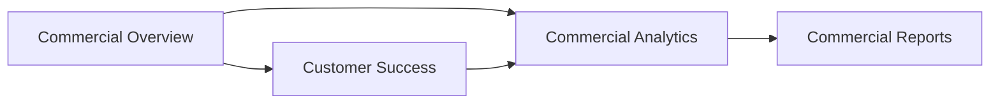

# ADMIN-DASHBOARD-REBUILD-1 — UX Blueprint

**Program:** Admin Dashboard Rebuild  
**Phase:** REBUILD-1 — UX Design Blueprint (read-only)  
**Date:** 2026-06-09  
**Status:** Complete  

**Reference quality bar:** [EXEC-7A Dashboard Rebuild Architecture](./EXEC-7A-DASHBOARD-REBUILD-ARCHITECTURE.md)

---

## 1. Executive Summary

This blueprint defines how the MineuQR Admin Dashboard should **look, feel, and flow** after rebuild. It covers the executive landing experience, commercial command center, operations center, user management, and visual direction — informed by modern SaaS references (Stripe, Vercel, Linear, Supabase, Clerk) while preserving MineuQR brand identity from the Pricing and commercial surfaces.

**Design principle:** Operators are **decision-makers first, mutators second**. The dashboard should answer “what needs attention?” before exposing CRUD controls.

---

## 2. Executive Dashboard Blueprint (Section C)

### 2.1 Current problems (`/admin`)

| Problem | Evidence | Severity |
|---------|----------|----------|
| **Noise** | Welcome copy + KPI strip + 3 shortcut cards + 8-card “all sections” grid + legacy card | High |
| **Card overload** | 16+ navigational cards on home — duplicates sidebar | High |
| **Metric fragmentation** | Same 5 KPIs repeated on `/admin/operations` | Medium |
| **Weak prioritization** | No needs-attention queue on home; alerts live only on `/admin/commercial` | High |
| **Duplicate information** | Commercial status badges decorative on home; no live data behind them | Medium |
| **Placeholder confusion** | Home links to 6 “coming soon” sections with equal visual weight as live areas | High |

### 2.2 Future executive dashboard — layout

Inspired by **Stripe Dashboard home** + **Vercel overview** — dense but prioritized.

```text
┌────────────────────────────────────────────────────────────────┐
│  Good morning, [Admin]                    [Last synced: 2m ago] │
├────────────────────────────────────────────────────────────────┤
│  NEEDS ATTENTION (1–3 items max)                               │
│  ┌──────────────┐ ┌──────────────┐ ┌──────────────┐          │
│  │ 4 expiring   │ │ 2 canceled   │ │ 0 security   │          │
│  │ View →       │ │ View →       │ │ events       │          │
│  └──────────────┘ └──────────────┘ └──────────────┘          │
├────────────────────────────────────────────────────────────────┤
│  TOP KPI LAYER (6 cards, single query: getDashboardSummary)    │
│  MRR │ ARR │ Active Subs │ Commercial Owners │ Restaurants │ Users │
├────────────────────────────────────────────────────────────────┤
│  COMMERCIAL HEALTH          │  GROWTH SIGNALS                 │
│  Mini health bar chart      │  Sparkline: user/restaurant     │
│  Plan distribution chips    │  growth (30d)                   │
├────────────────────────────────────────────────────────────────┤
│  SUBSCRIPTION HEALTH        │  RESTAURANT HEALTH              │
│  Active/Trial/Grace/Expired │  Active venues vs total         │
│  Link → Customer Success    │  Link → Tenants                 │
├────────────────────────────────────────────────────────────────┤
│  QUICK ACTIONS (3 only)                                        │
│  [Tenants]  [Accounts]  [Commercial Overview]                  │
└────────────────────────────────────────────────────────────────┘
```

### 2.3 Layer definitions

| Layer | Data source | Behavior |
|-------|-------------|----------|
| **Top KPI** | `getDashboardSummary` + commercial executive slice | 6 cards max; each links to drill-down |
| **Commercial Health** | `getCommercialOverview.subscriptionHealth` | Snapshot; link to `/admin/commercial` |
| **Growth Signals** | `getCommercialAnalytics.extensions.userGrowth` | Sparkline only — not full charts |
| **Subscription Health** | CRS health distribution | Color via `CommercialStatusBadge` |
| **Restaurant Health** | `activeRestaurants` / `totalRestaurants` | Operational, not subscription |
| **Operational Alerts** | `needsAttention` + future security queue | Max 3 visible; “View all” link |
| **Quick Actions** | Static | Replace 16-card grid |

### 2.4 What to remove from home

- “All sections” nav grid (sidebar owns this).
- Legacy operations card (operations becomes first-class nav).
- Decorative status badges without data binding.
- Duplicate welcome essay — one line subtitle sufficient.

---

## 3. Commercial Command Center (Section E)

### 3.1 Current overlap matrix

| Widget / metric | `/admin/commercial` | `/admin/analytics` |
|-----------------|---------------------|---------------------|
| MRR / ARR | ✅ Executive KPIs | ✅ Subscription KPI row |
| Commercial subscribers | ✅ | ✅ |
| Subscription health distribution | ✅ Panel | ✅ Status grid |
| Plan distribution | ✅ Table | ✅ Pie chart |
| Needs attention | ✅ Panel | ❌ |
| Metadata / authority stamp | ✅ | ❌ |
| Platform KPIs (menu items, categories) | ❌ | ✅ |
| User growth chart | ❌ | ✅ |
| Subscriber detail table | ❌ | ✅ |
| Export buttons | ✅ Header | ✅ Inline |
| Revenue by month | ❌ | Placeholder empty state |

**Operator confusion:** “Should I open Commercial or Analytics for MRR?” — both show it with different framing.

### 3.2 Future commercial workflow



| Page | Question it answers | Primary audience |
|------|---------------------|------------------|
| **Commercial Overview** | What is revenue health **right now**? | Executive / founder |
| **Commercial Analytics** | How did we get here? Who are subscribers? | Ops / finance |
| **Commercial Reports** | What do I export or schedule? | Finance |
| **Customer Success** | Who needs outreach? | Support / success |

### 3.3 Deduplication rules

| Metric | Authoritative surface | Other surfaces |
|--------|----------------------|----------------|
| MRR / ARR | Overview executive KPIs | Analytics: link “View overview” — no duplicate cards |
| Plan distribution | Overview table | Analytics: chart only (no duplicate table) |
| Subscriber list | Analytics table | Overview: count only |
| Needs attention | Overview + Customer Success queue | Home: alert strip summary |
| Exports | Reports page | Overview/Analytics: “Export” links to Reports |

### 3.4 Future page wireframes (text)

**Commercial Overview** — keep current `AdminCommercialPage` structure; remove export from header → move to Reports.

**Commercial Analytics** — `StatisticsPanel` refocused:
- Remove executive KPI row (or collapse to “summary bar”).
- Lead with growth charts + subscriber table.
- Keep platform operational KPIs (menu items, etc.) — unique to analytics.

**Commercial Reports** — new:
- Export history, CSV/Excel, invoice batch, scheduled reports (future).
- Rehome `CommercialExportButtons`.

---

## 4. User Management UX (Section F)

### 4.1 Current workflows

| User type | Classification | Where managed | Actions available |
|-----------|----------------|---------------|-------------------|
| **Commercial owners** | `COMMERCIAL` | `UsersSection` mixed table | Role, classification, subscription CRUD, delete, notify, invoice |
| **Internal staff** | `INTERNAL` | Same table + create dialog | Same (minus subscription if not entitled) |
| **Platform account** | `INTERNAL` + protected | Same table | Role/delete/subscription hidden (1D/1E); still visible in list |
| **Staff categories** | `INTERNAL` | Create dialog only | `support`, `marketing`, etc. — not shown in list |
| **Orphan `/users`** | All | Standalone page | Role, delete only — incomplete |
| **Orphan `/super-admin`** | All | Arabic delete-only | Strict subset |

### 4.2 Required actions (future)

| Action | Commercial | Internal | Platform |
|--------|------------|----------|----------|
| View profile | ✅ | ✅ | ✅ read-only |
| Edit role | ✅ | ✅ | ❌ blocked |
| Edit classification | ✅ | ✅ | ❌ blocked |
| Create subscription | ✅ | ❌ default | ❌ blocked |
| Edit/delete subscription | ✅ | If entitled | ❌ blocked |
| Delete user | ✅ | ✅ | ❌ blocked |
| Send notification | ✅ | ✅ | ✅ |
| Generate invoice PDF | ✅ | If eligible | ❌ document only |
| View restaurants | ✅ | If any | ✅ |
| View commercial slice | ✅ | Read-only | Hidden from commercial population |

### 4.3 Unsafe / legacy actions

| Action | Status | Recommendation |
|--------|--------|----------------|
| Delete platform account | Server blocked (1D) | Remove from all UIs — done |
| Subscription CRUD on platform | Server blocked (1E) | UI hidden — done |
| Role edit via `/users` orphan | Duplicates operations | **Remove route** |
| Delete via `/super-admin` | Duplicates operations | **Remove route** |
| Bulk notify without audience filter | Sends to all users | Add classification filter + confirmation summary |
| Invoice PDF on INTERNAL | Policy question | Disable for non-commercial (see 1E invoice review) |

### 4.4 Missing actions

| Missing | Value |
|---------|-------|
| **Account detail page** | Full `getOwnerOverview` + restaurant list |
| **Classification tab filters** | Default view: Commercial only |
| **Staff category column** | For INTERNAL accounts |
| **Platform account badge** | Visible “Platform” chip when `isProtectedPlatformAccount` |
| **Audit trail link** | Future security center — mutation history |
| **Impersonation** | Not in scope — do not add |

### 4.5 Future user management UX

```text
/admin/accounts
├── Tabs: [Commercial] [Internal] [All]
├── Toolbar: search · classification · role filter
├── Primary CTA: "Add internal user" (INTERNAL tab only)
└── Table columns:
    Name · Email · Role · Classification · Plan · Status · Restaurants · Actions

Row click → /admin/accounts/:id
  ├── Profile header (platform badge if protected)
  ├── Commercial panel (read-only for INTERNAL)
  ├── Restaurants linked
  ├── Safe actions only (context-aware)
  └── Activity / notes (future)
```

---

## 5. Operations Center UX (Section D detail)

### 5.1 Future tab model (interim)

```text
/admin/operations  →  redirect to /admin/tenants (eventually)

/admin/tenants
  - Restaurant directory (card → table at scale)
  - Filters: status, country, search
  - CTA: Add restaurant (wizard)

/admin/accounts
  - See Section 4.5

/admin/communications
  - Bulk notify with audience preview
  - Template messages (future)
  - Send history (future)
```

### 5.2 Restaurant card → tenant row evolution

| Today | Future |
|-------|--------|
| Large cards with inline entitlement box | Compact table rows + detail drawer |
| Edit → navigates to owner `/dashboard` | Edit → `/admin/tenants/:id` admin detail |
| Inherited entitlements paragraph | `CommercialStatusBadge` + plan chip |

---

## 6. Design System Alignment (Section H)

### 6.1 Current admin visual language

**Tokens:** `adminDashStyles.ts`

- Glass cards: `rounded-xl border border-border/50 bg-card/40 backdrop-blur-sm`
- Cinematic shell background + radial glow
- Section titles: `text-lg font-semibold`
- Operational buttons: `h-8 text-xs` with semantic outline colors (`adminActionBtn`)

**Strengths:** Consistent within EXEC-7 shell; dark-mode safe; good mobile dialog scroll.

**Weaknesses:** Low visual hierarchy — cards blend together; badge colors inconsistent across sections; tables feel dense without row breathing room.

### 6.2 Pricing page aesthetic (reference)

**File:** `Pricing.tsx`

- Dark gradient hero: `from-slate-900 via-slate-800 to-slate-900`
- Cyan accent: `text-cyan-300`, `from-cyan-500 to-cyan-400` CTAs
- Bold typographic hierarchy: `text-4xl md:text-5xl font-bold`
- Brand mark with `text-gradient-teal` on “uqr”
- Plan cards: elevated, gradient borders, feature lists

### 6.3 Commercial pages aesthetic (reference)

**Files:** `AdminCommercialPage.tsx`, `commercial/*` components

- Uses `adminDash` tokens — aligned with shell
- `CommercialStatusBadge` — presentation-only, 6 states
- `AdminSection` wrappers — titled groups with descriptions

### 6.4 Recommended visual direction

**Do not** apply full dark-slate pricing background to data-dense admin tables — readability and operator fatigue matter.

**Do** adopt pricing-adjacent elements selectively:

| Element | Admin application |
|---------|-------------------|
| **Teal/cyan accent** | Primary CTAs, active nav, KPI trend positive, links |
| **Gradient brand mark** | Sidebar header only |
| **Elevated hero cards** | Executive home needs-attention + top KPI layer |
| **Bold KPI numerals** | `text-3xl font-bold tracking-tight` on executive metrics |
| **Subtle gradients** | Card borders `border-primary/20` on focus cards only |
| **Reduced badge palette** | Standardize on `CommercialStatusBadge` — remove hardcoded Arabic colors in `getStatusBadge` |

### 6.5 Typography & spacing

| Token | Current | Target |
|-------|---------|--------|
| Page title | `text-2xl sm:text-3xl` | Keep |
| KPI value | `text-2xl font-bold` | `text-3xl font-semibold tabular-nums` |
| Section gap | `space-y-8` | `space-y-10` on executive; `space-y-6` in operations |
| Table row padding | `px-4 py-3` | `py-4` with zebra subtle `bg-muted/20` |
| Max content width | `max-w-7xl` | Keep — matches pricing `max-w-7xl` |

### 6.6 Component priorities for rebuild

1. `AdminStatCard` — elevate visual weight on home.
2. `CommercialStatusBadge` — replace all ad-hoc status badges.
3. `AdminDataTable` — **new** — shared sortable table for tenants/accounts.
4. `AdminDetailHeader` — **new** — profile page top section with platform badge.
5. `AdminAlertStrip` — **new** — needs-attention on home.

---

## 7. Accessibility & i18n

| Issue | Fix in rebuild |
|-------|----------------|
| Mixed hardcoded Arabic in `UsersSection` badges | Full i18n |
| `SuperAdminDashboard` Arabic-only | Remove |
| Icon-only buttons | `AdminIconButton` already has `label` — enforce everywhere |
| RTL breadcrumbs | Already handled — preserve |

---

## 8. Answers to Blueprint Questions

| Question | Answer |
|----------|--------|
| **What should the dashboard become visually?** | A calm, data-forward ops center with pricing-brand teal accents on executive layers; tables remain light/neutral for density. |
| **Executive dashboard?** | Section 2 — alerts-first, 6 KPIs, split health panels, 3 quick actions. |
| **Commercial command center?** | Section 3 — overview → analytics → reports workflow with deduplication rules. |
| **User management?** | Section 4 — segmented accounts with detail pages and platform badge. |
| **Operations center?** | Section 5 — split tenants / accounts / communications. |

---

## 9. Rebuild Acceptance Criteria (UX)

| Criterion | Measurable outcome |
|-----------|-------------------|
| Home loads with ≤ 10 primary visual elements | No 16-card grid |
| Operator reaches restaurant CRUD in ≤ 2 clicks | Tenants in main nav |
| MRR appears once per session path | No dup KPI rows across commercial + analytics |
| Platform account visually distinct | Badge + read-only detail |
| All status labels use one component | Zero hardcoded `getStatusBadge` colors |
| Placeholder nav items visually distinct | Badge or collapsed group |

**Stop boundary:** REBUILD-1 — blueprint only. Implementation begins REBUILD-2+.
