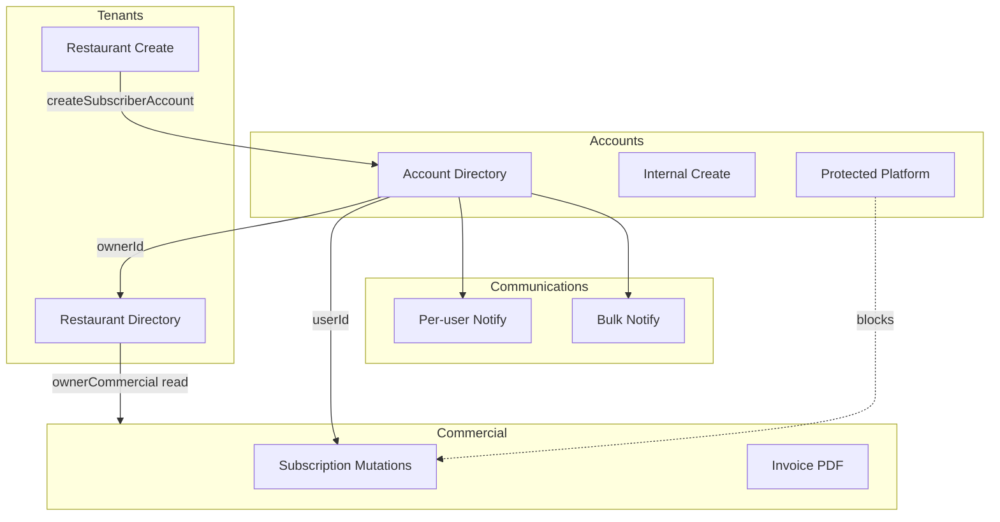

# ADMIN-DASHBOARD-REBUILD-2 — Operations Domain Map

**Program:** Admin Dashboard Rebuild  
**Phase:** REBUILD-2 — Operations Decomposition  
**Date:** 2026-06-09  
**Status:** Complete  

**Source:** `client/src/pages/AdminManagement.tsx` (`/admin/operations`)  
**Prerequisite:** [REBUILD-1 Architecture Audit](./ADMIN-DASHBOARD-REBUILD-1-ARCHITECTURE-AUDIT.md)

---

## 1. Executive Summary

`/admin/operations` is a **~1,650-line monolith** containing four implicit domains today: executive KPIs, tenant (restaurant) management, account management, commercial subscription mutations, and communications. This document maps every section, UI control, query, and mutation to the target domain model.

**Target domains:**

```text
Accounts · Tenants · Commercial · Communications
```

Platform (health/security/launch) and Diagnostics remain outside the operations extraction scope.

---

## 2. Monolith Structure (Current)

```text
AdminManagement.tsx
├── AdminKPISection                    (lines ~1199–1218)
├── Restaurants Section                (lines ~1221–1416)
│   ├── Search + status filter
│   ├── Restaurant card list
│   ├── Edit → owner dashboard
│   ├── Delete restaurant
│   ├── Create restaurant dialog
│   │   └── Optional createSubscriberAccount
│   └── Delete restaurant confirm
└── UsersSection                       (lines 63–966, embedded ~1418–1424)
    ├── Search + classification filter
    ├── Internal user CTA
    ├── Bulk notify CTA
    ├── User table (mobile cards + desktop)
    ├── renderUserActions per row
    ├── Internal user dialog
    ├── Subscription create/edit dialog
    ├── Delete user confirm
    ├── Per-user notify dialog
    ├── Bulk notify dialog
    └── Delete subscription confirm
```

---

## 3. Section → Future Domain Mapping (2A)

### 3.1 Accounts domain

| Current section / control | Component / API | Future domain | Notes |
|---------------------------|-----------------|---------------|-------|
| Users list (all classifications) | `getOwnerOverviewList` | **Accounts** | Primary directory |
| Search by name/email | `UsersSection` toolbar | **Accounts** | |
| Classification filter | `classificationFilter` query param | **Accounts** | Segments commercial/internal/system |
| Role badge + inline role edit | `updateUserRole` | **Accounts** | Protected platform blocked (1D) |
| Classification badge + inline edit | `updateAccountClassification` | **Accounts** | Protected platform blocked (1D) |
| Delete user | `deleteUser` | **Accounts** | Protected platform blocked (1D) |
| Internal user dialog | `createInternalUser` | **Accounts → Internal** | Staff category: marketing, sales, support, operations |
| Platform account row | `isProtectedPlatformAccount` flag | **Accounts → Protected** | INTERNAL + OWNER_OPEN_ID; read-only mutations |
| Commercial user rows | `accountClassification === COMMERCIAL` | **Accounts → Commercial** | Default operator view |
| Marketing staff accounts | `staffCategory === "marketing"` on INTERNAL | **Accounts → Internal** | Sub-segment, not separate classification |
| Restaurant count per user | Joined from `listRestaurants` | **Accounts** (display) | Links to Tenants |
| Self-guard (`u.id !== user?.id`) | `renderUserActions` | **Accounts** | Prevents self-delete/role edit |

### 3.2 Tenants domain

| Current section / control | Component / API | Future domain | Notes |
|---------------------------|-----------------|---------------|-------|
| Restaurants section header | `AdminSection` + `Store` icon | **Tenants** | |
| Restaurant search | `searchQuery` filter | **Tenants** | Name, owner, email, phone |
| Subscription status filter on restaurants | `statusFilter` + `ownerCommercial` | **Tenants** (filter) | Uses owner commercial state — cross-domain read |
| Restaurant card list | `listRestaurants` | **Tenants** | |
| Owner name / email on card | `ownerName`, `ownerEmail` | **Tenants → Ownership** | |
| Inherited entitlements box | `ownerCommercial` display | **Tenants** (read) | Commercial state shown on tenant card |
| Edit restaurant | Navigate `/dashboard?restaurant=id` | **Tenants** | Leaves admin shell — interim |
| Delete restaurant | `restaurant.delete` | **Tenants** | |
| Add restaurant header CTA | `showCreateDialog` | **Tenants** | |
| Create restaurant dialog | `restaurant.create` | **Tenants** | |
| Optional subscriber account in create flow | `createSubscriberAccount` | **Tenants + Accounts** (split) | Provisioning spans both domains |
| Country / currency selection | `countryCurrency.getAll` | **Tenants** | Venue configuration |
| `isActive` on restaurant | Schema field | **Tenants → Tenant State** | Operational active flag |

### 3.3 Commercial domain

| Current section / control | Component / API | Future domain | Notes |
|---------------------------|-----------------|---------------|-------|
| Subscription status column on users | `ownerSubscriptionStatus(u.commercial)` | **Commercial** (read on Accounts) | Display only in directory |
| Plan + end date columns | `ownerPlanLabel`, `currentPeriodEnd` | **Commercial** (read) | |
| Create account subscription | `createUserSubscriptionByAdmin` | **Commercial** | Account-scoped mutation |
| Edit account subscription | `updateUserSubscriptionByAdmin` | **Commercial** | |
| Delete account subscription | `deleteUserSubscriptionByAdmin` | **Commercial** | |
| Subscription dialog form | `SubscriptionAdminFormFields` | **Commercial** | Plan, cycle, status, end date |
| `subscription.listPlans` | Plans query | **Commercial** | |
| Generate invoice PDF | `generateInvoicePDF` | **Commercial → Invoices** | Read/generate; no commercial state mutation |
| Platform subscription actions | Hidden via 1E | **Commercial** | Server + UI blocked |
| Trial status display | `subscriptionStatus === "trial"` | **Commercial** (read) | |
| Billing cycle in sub dialog | `subBillingCycle` | **Commercial** | |
| Restaurant card entitlement badges | `isOwnerEntitled` | **Commercial** (read on Tenants) | |

**Commercial read surfaces outside operations (unchanged in REBUILD-2):**

| Surface | Route | Role |
|---------|-------|------|
| Commercial Overview | `/admin/commercial` | Executive snapshot |
| Commercial Analytics | `/admin/analytics` | Trends + subscriber table |
| Customer Success (future) | `/admin/customer-success` | Expiring/canceled queues |

### 3.4 Communications domain

| Current section / control | Component / API | Future domain | Notes |
|---------------------------|-----------------|---------------|-------|
| Per-user notify button | `sendCustomNotification` | **Communications → Notifications** | |
| Per-user notify dialog | `notifyDialogOpen` | **Communications** | |
| Bulk notify toolbar button | `sendBulkNotification` | **Communications → Announcements** | No audience filter today |
| Bulk notify dialog | `bulkNotifyDialogOpen` | **Communications** | |
| Future email operations | — | **Communications → Campaigns** | Not implemented |

### 3.5 Non-domain / retire from operations

| Current section / control | Future disposition | Rationale |
|---------------------------|-------------------|-----------|
| `AdminKPISection` on operations page | **Retire** from operations → `/admin` only | Duplicate of home KPIs |
| `getDashboardSummary` query on operations | **Retire** with KPI section | Executive domain = Home |
| Header “Add restaurant” duplicate of empty-state CTA | **Merge** in Tenants | Single primary CTA |

---

## 4. Cross-Domain Dependencies



| Dependency | Type | REBUILD-2 handling |
|------------|------|------------------|
| User row shows commercial columns | Read-only cross-domain | Keep in Accounts directory; link to Commercial detail |
| Restaurant card shows owner commercial | Read-only cross-domain | Keep on Tenants; link to Accounts + Commercial |
| Create restaurant + account | Write cross-domain | Split wizard: Tenants step + Accounts provisioning step |
| Invoice PDF on user row | Commercial action from Accounts | Move to account detail Commercial panel |

---

## 5. Classification Matrix

| Account type | Classification | Staff category | Protection | Primary future home |
|--------------|----------------|----------------|------------|---------------------|
| Paying / trial owners | `COMMERCIAL` | — | Standard | Accounts → Commercial tab |
| Internal staff | `INTERNAL` | support, sales, operations, marketing | Standard | Accounts → Internal tab |
| Platform owner | `INTERNAL` | — | `isProtectedPlatformAccount` | Accounts → Protected (read-only) |
| System accounts | `SYSTEM` | — | No admin role (1A) | Accounts → Internal (filtered) |
| Marketing accounts | `INTERNAL` | `marketing` | Standard | Accounts → Internal → Marketing filter |

---

## 6. API Inventory by Domain

### Accounts mutations

```text
admin.updateUserRole
admin.updateAccountClassification
admin.deleteUser
admin.createInternalUser
admin.createSubscriberAccount        ← also Tenants provisioning
admin.listAllUsers                   ← orphan /users only today
admin.getOwnerOverviewList
admin.getOwnerOverview               ← unused in UI; detail page
```

### Tenants mutations

```text
restaurant.create
restaurant.delete
admin.listRestaurants
```

### Commercial mutations (from operations)

```text
admin.createUserSubscriptionByAdmin
admin.updateUserSubscriptionByAdmin
admin.deleteUserSubscriptionByAdmin
admin.generateInvoicePDF
subscription.listPlans
```

### Communications mutations

```text
admin.sendCustomNotification
admin.sendBulkNotification
```

---

## 7. Success Criteria Answers (Domain Map)

| Question | Answer |
|----------|--------|
| **What becomes Accounts?** | User directory, role/classification, delete, internal user create, platform protected row |
| **What becomes Tenants?** | Restaurant directory, CRUD, ownership display, tenant state, create wizard (venue half) |
| **What becomes Commercial?** | Subscription CRUD dialogs, invoice PDF, plan/billing/trial UI (mutations); read columns stay on Accounts/Tenants with links |
| **What becomes Communications?** | Per-user and bulk notifications |
| **What survives from Operations?** | Coordination hub only (optional) — links + provisioning entry points, not domain CRUD |

**Stop boundary:** Domain map complete. Implementation routing in [Route Architecture](./ADMIN-DASHBOARD-REBUILD-2-ROUTE-ARCHITECTURE.md).
