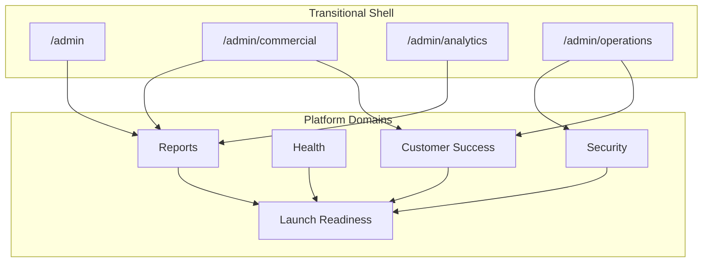

# REBUILD-5AD — Platform Domain Map

**Program:** ADMIN-DASHBOARD-REBUILD-5A  
**Phase:** 5AD — Platform Domain Map  
**Mode:** Audit (authoritative domain structure — inventory only)  
**Date:** 2026-06-07

---

## Approved Platform Domain Structure

```text
MineuQR Admin — Platform Domains (REBUILD-5)

┌─────────────────────────────────────────────────────────────────┐
│  TRANSITIONAL SHELL (retire after domain migration)             │
│  Overview (/admin) · Commercial · Analytics · Operations        │
└─────────────────────────────────────────────────────────────────┘
                              │
        ┌─────────────────────┼─────────────────────┐
        ▼                     ▼                     ▼
   ┌─────────┐         ┌──────────────┐      ┌─────────┐
   │ Security│         │Customer      │      │ Reports │
   │         │         │Success       │      │         │
   └─────────┘         └──────────────┘      └─────────┘
        │                     │                     │
        └──────────┬──────────┴──────────┬──────────┘
                   ▼                     ▼
              ┌─────────┐         ┌──────────────────┐
              │ Health  │         │ Launch Readiness │
              └─────────┘         └──────────────────┘
```

---

## Domain 1 — Security

**Route:** `/admin/security` (placeholder today)  
**Category:** `security`

### Responsibilities

| Area | Owns | Does not own |
|------|------|--------------|
| Admin accounts | Internal user provisioning, staff categories | Customer subscription lifecycle |
| Roles | `updateUserRole`, role badges, self-guard | Commercial plan assignment |
| Permissions | `assertAdminAccess`, admin role gate | Tenant menu permissions |
| Authentication controls | Login policy, session config, rate limits | End-user password reset UX (tenant) |
| Session integrity | `sessionRevocation`, `sessionValidAfter` | Session storage implementation |
| Suspicious activity | `authAudit`, `suspiciousActivity` signals | Commercial fraud detection |
| Access governance | `updateAccountClassification`, protected platform account | Account commercial state |
| Security diagnostics | Future: audit log viewer, access reports | CRS entitlements diagnostics |
| Security audit readiness | Classification audit trail, cascade audit on deletes | Invoice audit trail |

### Current assets migrating in

- `createInternalUser`, `updateUserRole`, `updateAccountClassification`
- `assertAdminAccess`, `authAudit`, `suspiciousActivity`, `accountClassificationAudit`
- Platform account protection (server + AccountsTab UI guards)
- `resetSubscriberPassword` (credential governance)
- `listAllUsers` (retire or expose as security directory)

### Future surface (not built)

- Security event timeline
- Admin access audit viewer
- Role/classification change history
- Suspicious activity dashboard

---

## Domain 2 — Health

**Route:** `/admin/health` (placeholder today)  
**Category:** `health`

### Responsibilities

| Area | Owns | Does not own |
|------|------|--------------|
| Runtime health | Process uptime, deployment status | Subscription health counts |
| Platform health indicators | Aggregate service status | Per-customer health scores |
| Database health | Connection probes, migration status | Data correctness audits |
| Email health | SMTP/Resend connectivity | Notification content |
| Queue readiness | Background job status (future) | Notification delivery to users |
| Monitoring signals | Ops log aggregation (`OPS_EVENT`) | Security threat monitoring |
| Operational diagnostics | CRS/entitlements diagnostics | Commercial KPI reporting |
| Reliability indicators | Error rates, webhook health (future) | Revenue metrics |

### Current assets migrating in

- `CommercialDiagnostics` → relocate from `/commercial/diagnostics`
- `CommercialEntitlementsDiagnostics` component
- `getExtendedStats` (growth/operational series)
- Ops signal infrastructure (`authOpsMetadata`, `opsLog`)
- Email config verification (`email-config.test.ts` patterns)
- `deploymentReadiness` runtime checks (shared feed with Launch Readiness)

### Future surface (not built)

- Health status dashboard
- Email/DB/webhook probe panels
- Incident history

---

## Domain 3 — Customer Success

**Route:** `/admin/customer-success` (placeholder today)  
**Category:** `customer-success`

### Responsibilities

| Area | Owns | Does not own |
|------|------|--------------|
| Accounts | Owner directory, account detail | Role/classification mutations (Security) |
| Tenants | Restaurant directory, venue provisioning | Platform metrics |
| Trial lifecycle | Trial status display, trial creation via subscription | Trial pricing rules (commercial engine) |
| Subscription lifecycle | Create/edit/delete account subscriptions | MRR calculation (Reports) |
| Customer adoption | Active restaurant counts per owner | Platform-wide analytics |
| Customer retention | Expiring/canceled/expired queues | Executive ARR reporting |
| Support operations | Per-user actions, account search | Security audit viewer |
| Communication workflows | Bulk + per-user notifications | Email template management |

### Current assets migrating in

- Operations **AccountsTab** (minus Security mutations → split)
- Operations **TenantsTab**
- Operations **CommunicationsTab**
- `CommercialOverviewNeedsAttention` (from Commercial page)
- `CommercialOverviewSubscriptionHealth` (operational view)
- `getOwnerOverviewList`, `getOwnerOverview`, `getSubscriptionOverview`
- `createSubscriberAccount`, `listRestaurants`
- `sendCustomNotification`, `sendBulkNotification`

### Future surface (not built)

- Customer success home with attention queues
- Owner 360 detail view (`getOwnerOverview`)
- Renewal pipeline workspace
- Support communication hub (absorbs Communications tab)

---

## Domain 4 — Reports

**Route:** `/admin/reports` (placeholder today)  
**Category:** `reports`

### Responsibilities

| Area | Owns | Does not own |
|------|------|--------------|
| Commercial reports | Executive commercial snapshot | Subscription mutations |
| Revenue reporting | MRR, ARR, estimated MRR | Payment collection |
| Growth reporting | User/restaurant growth series | Customer outreach |
| Usage reporting | Platform entity counts (menus, categories, offers) | Tenant editing |
| Export workflows | CSV, XLSX, PDF generation | Notification delivery |
| Analytics summaries | Charts, subscriber tables | Real-time monitoring |
| Executive reporting | Overview KPI strip, metadata panel | Launch checklists |

### Current assets migrating in

- `/admin/commercial` page content (executive + metadata + plan distribution)
- `/admin/analytics` page (`StatisticsPanel`)
- `OverviewKpiSection` (executive home KPIs)
- `CommercialExportButtons` + `downloadReportFile`
- `getDashboardSummary`, `getCommercialOverview`, `getCommercialAnalytics`
- `exportCommercialReport`, `getCommercialExportPackage`
- `generateInvoicePDF`, `getUserInvoices`
- Full reporting stack: `CommercialReportService`, `analyticsProjection`, adapters

### Future surface (not built)

- Unified Reports hub at `/admin/reports`
- Export history / scheduled reports
- Executive PDF dashboard

---

## Domain 5 — Launch Readiness

**Route:** `/admin/launch-readiness` (placeholder today)  
**Category:** `launch-readiness`

### Responsibilities

| Area | Owns | Does not own |
|------|------|--------------|
| Pre-launch readiness | Environment configuration checklist | Runtime monitoring (Health) |
| Production readiness | Deployment guard verification | Live traffic management |
| Compliance readiness | Auth policy certification status | User consent management |
| Commercial readiness | CRS migration completeness, schema version | Commercial KPI values |
| Feature completion tracking | Feature visibility inventory | Feature development |
| Go-live governance | Launch approval workflow (future) | Customer onboarding |
| Launch blockers | Blocker registry with severity | Incident response (Health) |

### Current assets migrating in

- `deploymentReadiness` checks
- `featureVisibility` diagnostics inventory
- Commercial snapshot `schemaVersion` (read from Reports metadata)
- ASN-5A commercial data reality protocol (documentation process)
- Health diagnostics pass/fail as readiness inputs

### Future surface (not built)

- Launch readiness scorecard
- Blocker list with owners
- Go/no-go checklist
- Certification badges (commercial, security, data)

---

## Transitional Domains (decomposition plan)

These live routes are **not** platform domains. They decompose into the five domains above.

| Transitional route | Decomposes into |
|--------------------|-----------------|
| `/admin` (Overview) | Reports (KPIs) + nav hub → retire as domain, keep as entry shell |
| `/admin/commercial` | Reports (executive) + Customer Success (attention queues) |
| `/admin/analytics` | Reports (analytics sub-view) |
| `/admin/operations` | Customer Success (primary) + Security (access mutations) |

---

## Navigation Future State

Current sidebar (10 items) → target sidebar after REBUILD-5:

| Nav item | Domain | Today |
|----------|--------|-------|
| Overview | Transitional shell | LIVE |
| Commercial | → Reports | LIVE (migrate) |
| Analytics | → Reports | LIVE (migrate) |
| Tenants | → Customer Success | LIVE (via operations tab) |
| Customer Success | Customer Success | PLACEHOLDER |
| Health | Health | PLACEHOLDER |
| Security | Security | PLACEHOLDER |
| Reports | Reports | PLACEHOLDER |
| Launch Readiness | Launch Readiness | PLACEHOLDER |
| Operations | → Customer Success | LIVE (decompose) |

**Note:** Navigation changes are out of scope for REBUILD-5A. This map documents target ownership only.

---

## Domain Dependency Graph



---

## REBUILD-5A Deliverables Index

| Doc | Title |
|-----|-------|
| `ADMIN-DASHBOARD-REBUILD-5AA.md` | Platform Asset Inventory |
| `ADMIN-DASHBOARD-REBUILD-5AB.md` | Domain Ownership Matrix |
| `ADMIN-DASHBOARD-REBUILD-5AC.md` | Domain Boundary Report |
| `ADMIN-DASHBOARD-REBUILD-5AD.md` | Platform Domain Map (this document) |

---

## Out of Scope Confirmation

REBUILD-5A performed inventory and ownership mapping only. No code was moved, no routes changed, no Security Center created, no domain dashboards built, no permissions or navigation modified.
