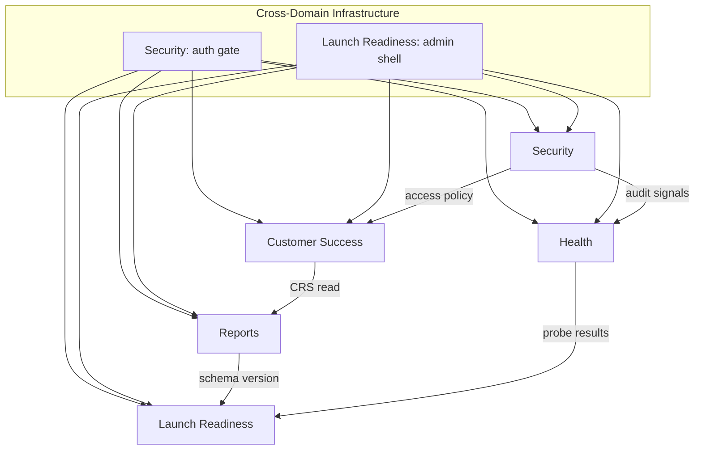

# REBUILD-5BC — Domain Dependency Graph

**Program:** ADMIN-DASHBOARD-REBUILD-5B  
**Phase:** 5BC — Domain Dependency Graph  
**Mode:** Audit + Architecture Mapping

Documents **dependencies** and **shared data sources** between domains. Dependencies do **not** create shared ownership — each data source and API has exactly one owner (5BA).

---

## 1. Domain Dependency Overview



---

## 2. Shared Data Sources (single owner each)

| Data source | Owner | Consumers (read-only) |
|-------------|-------|----------------------|
| `CommercialReadService` (CRS) | **Customer Success** | Reports, Health (diagnostics) |
| `CanonicalMetricsService` | **Reports** | Launch Readiness (readiness score inputs) |
| `CommercialOverviewSnapshot` schema | **Reports** | Launch Readiness (schema version check) |
| `getExtendedAdminStats` / user growth series | **Reports** | — (no cross-consumer today) |
| `platformAccount` / protected user flags | **Security** | Customer Success (display guards), Reports (none) |
| Ops signal log (`OPS_EVENT`) | **Health** | Security (auth signals overlap in log stream) |
| `deploymentReadiness` env checks | **Launch Readiness** | Health (may surface pass/fail as probe) |
| Route registry metadata | **Launch Readiness** | All domains (navigation labels) |

**Rule:** Consumers may **read** upstream data; they do not **own** it.

---

## 3. API Dependency Matrix

Rows = consumer domain. Columns = API owner domain. Cell = APIs consumed.

| Consumer → / Owner ↓ | Customer Success | Reports | Security | Health | Launch Readiness |
|----------------------|------------------|---------|----------|--------|------------------|
| **Customer Success** | — (owns) | reads `getCommercialOverview` snapshot fields for display | calls gated by `assertAdminAccess`; embeds Security mutation UIs | — | uses shell + routes |
| **Reports** | reads CRS via `CommercialReportService` | — (owns) | gated by `assertAdminAccess` | — | reads schema version |
| **Security** | reads `getOwnerOverviewList` for future audit viewer | — | — (owns) | reads auth ops signals | uses shell + routes |
| **Health** | reads CRS for diagnostics | — | — | — (owns) | reports probe status |
| **Launch Readiness** | — | reads schema version + executive snapshot summary | reads deployment guard status | reads health probe results | — (owns) |

---

## 4. UI Dependency Chains

### 4.1 Customer Success → Security (embedded controls)

```text
Customer Success (AccountsTab host)
  └── embeds Security-owned controls:
        ├── Role edit (updateUserRole)
        ├── Classification edit (updateAccountClassification)
        ├── Create internal user (createInternalUser)
        ├── Delete user (deleteUser)
        └── Platform account mutation guards
```

**Dependency type:** UI composition. Security owns controls; CS owns host workspace.

### 4.2 Reports → Customer Success (data)

```text
Reports (CommercialOverviewExecutiveKpis)
  └── reads CRS-backed metrics via getCommercialOverview
        └── CRS owned by Customer Success (CommercialReadService)
```

**Dependency type:** Data read. Reports does not own per-owner commercial state.

### 4.3 Launch Readiness → Health + Reports (certification inputs)

```text
Launch Readiness (readiness scorecard)
  ├── reads Health probe results (email, diagnostics pass/fail)
  ├── reads Reports schema version (CommercialOverviewMetadataPanel field)
  └── reads deploymentReadiness env checks (owned by Launch Readiness)
```

**Dependency type:** Certification inputs. Launch Readiness owns scoring; not the probes.

### 4.4 All domains → Security (gate)

```text
Every admin page/section
  └── useAuthGate + assertAdminAccess
        └── owned by Security
```

**Dependency type:** Infrastructure gate. Non-negotiable cross-cutting dependency.

### 4.5 All domains → Launch Readiness (shell)

```text
Every admin page
  └── AdminOperationsShell + route registry + sidebar
        └── owned by Launch Readiness (until domain-neutral shared layer post-migration)
```

**Dependency type:** Console frame. Domains render inside shell; shell is not domain content.

---

## 5. Transitional Route Dependencies

During migration, transitional routes create temporary cross-dependencies:

| Transitional route | Hosts assets owned by | Dependency |
|--------------------|----------------------|------------|
| `/admin/commercial` | Reports + Customer Success widgets | **Split extraction required** — CS widgets leave first or concurrently |
| `/admin/analytics` | Reports only | Clean single-domain extraction |
| `/admin/operations` | Customer Success + Security controls | **Split extraction required** — Security controls extract to `/admin/security` |
| `/admin` | Launch Readiness + Reports (KPIs) | KPI section extracts to Reports; shell stays Launch Readiness |

---

## 6. Server Module Dependency DAG

```text
                    ┌─────────────────────┐
                    │  assertAdminAccess   │  Security
                    └──────────┬──────────┘
                               │ gates all
         ┌─────────────────────┼─────────────────────┐
         ▼                     ▼                     ▼
┌─────────────────┐  ┌─────────────────┐  ┌─────────────────┐
│CommercialRead   │  │CanonicalMetrics   │  │ accountClass.   │
│Service          │  │Service            │  │ Audit           │
│(Customer Success)│  │(Reports)         │  │(Security)       │
└────────┬────────┘  └────────┬────────┘  └─────────────────┘
         │                    │
         │ CRS slices         │ aggregates
         ▼                    ▼
┌─────────────────┐  ┌─────────────────┐
│ getOwnerOverview│  │ getCommercial   │
│ List (CS)       │  │ Overview (Rep)  │
└─────────────────┘  └────────┬────────┘
                              │
                              ▼
                    ┌─────────────────┐
                    │CommercialReport │
                    │Service (Reports)│
                    └────────┬────────┘
                             │
              ┌──────────────┼──────────────┐
              ▼              ▼              ▼
    getCommercialAnalytics  exportCommercial  analyticsProjection
         (Reports)           (Reports)         (Reports)
```

---

## 7. Circular Dependency Check

| Potential cycle | Exists? | Mitigation |
|-----------------|---------|------------|
| CS → Reports → CS | No | Reports reads CRS; CRS does not read Reports |
| Security → CS → Security | No | CS embeds Security UI; Security does not depend on CS workspace |
| Health → Launch → Health | No | Launch reads Health probes; Health does not read Launch scorecard |
| Reports → Launch → Reports | No | Launch reads schema version; Reports does not read Launch |

**No circular ownership dependencies.** Extraction order can follow DAG.

---

## 8. Dependency Risk Register

| Risk | Domains | Severity | Mitigation on extraction |
|------|---------|----------|--------------------------|
| CRS coupling | CS ↔ Reports | Medium | Freeze CRS contract; Reports reads snapshot API only |
| Embedded Security controls in CS workspace | CS ↔ Security | High | Extract Security controls to `/admin/security`; CS retains deep-link or modal invoke |
| Dual-route export entry | Reports (internal) | Low | Consolidate to `/admin/reports` on extraction |
| Diagnostics outside admin shell | Health | Low | Relocate `/commercial/diagnostics` → `/admin/health` |
| Deprecated API retirement | Launch Readiness | Low | Remove deprecated procedures before domain UI ships |

---

## 9. Consumer-Only Assets (no upstream domain deps)

These domains are extraction-ready with minimal cross-domain coupling:

| Domain | Reason |
|--------|--------|
| **Health** | Self-contained diagnostics; only depends on Security gate + Launch shell |
| **Launch Readiness** | Mostly new UI; reads probe inputs but owns scoring |
| **Security** | Backend complete; UI extraction is additive, not disruptive |

Most coupled extractions: **Customer Success** (hosts Security controls) and **Reports** (shares page with CS widgets on `/admin/commercial`).
