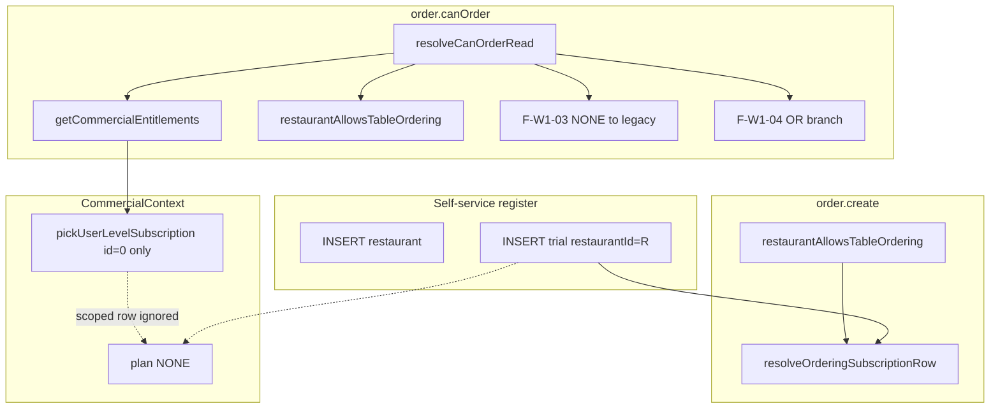
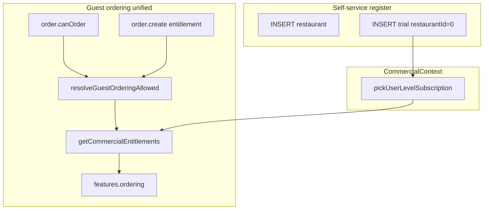

# ASN-FINAL-REPORT — Authority Scope Normalization Final Executive Report

**Program:** Authority Scope Normalization (ASN)  
**Document type:** Historical closure report — governance record  
**Date:** 2026-06-07  
**Status:** **COMPLETE**

**Mode:** Documentation only. No code, schema, database, or runtime changes in this document.

**Authoritative execution reference:** [`ASN-5-AUTHORITY-NORMALIZATION-EXECUTION.md`](ASN-5-AUTHORITY-NORMALIZATION-EXECUTION.md)  
**Final implementation commit:** `57716fa` — *ASN-5 complete authority normalization execution* (2026-06-07)

---

## Program phases completed

| Phase | Document | Role |
|-------|----------|------|
| ASN-1 | `ASN-1-AUTHORITY-SCOPE-DISCOVERY.md` | Discovered 38 authority paths; four parallel models |
| ASN-2 | `ASN-2-AUTHORITY-SOURCE-INVENTORY.md` | 24 sources, 72 consumers, blast radius |
| ASN-2.5 | `ASN-2.5-AUTHORITY-CANONICALIZATION-DECISION.md` | Formal decisions D-01 through D-10 |
| ASN-3 | `ASN-3-NORMALIZATION-DESIGN.md` | Waves A–F normalization design |
| ASN-4A | `ASN-4A-REGISTER-PATH-CANONICAL-STRATEGY.md` | Register strategy D-4A-01 (A1) |
| ASN-4B.1 | `ASN-4B.1-REGISTER-MIGRATION-PLAN.md` | R1 hard cutover plan |
| ASN-4B.2 | `ASN-4B.2-WAVE-A-ORDERING-ALIGNMENT-PLAN.md` | Ordering read/write alignment plan |
| ASN-4C | `ASN-4C-LEGACY-SUBSCRIPTION-BACKFILL-PLAN.md` | Legacy data migration planning |
| ASN-5A | `ASN-5A-COMMERCIAL-DATA-REALITY-AUDIT.md` | Verified production data reality |
| ASN-5 | `ASN-5-AUTHORITY-NORMALIZATION-EXECUTION.md` | **Execution** — R1 + Wave A shipped |

---

## Section 1 — Executive Summary

### Why ASN was started

MineuQR adopted a formal commercial authority specification (`COMMERCIAL-AUTHORITY-SPEC.md`) stating that commercial rights belong to the **owner account**, not individual restaurants. Runtime behavior did not consistently follow that model. Investigation began after production incident **F-3**: guest users could see ordering enabled (`order.canOrder` returned true) but received **403 Forbidden** when submitting orders (`order.create`).

ASN was chartered to discover where authority was defined, decide the canonical model, plan normalization in safe waves, and execute the highest-risk fixes without destabilizing billing.

### Original symptoms

| Symptom | User impact |
|---------|-------------|
| Cart visible, order submit fails (403) | Guest frustration; lost orders |
| Owner dashboard shows `plan: NONE` after self-service register | Incorrect commercial state in client |
| `canOrder` and `create` disagree on entitlement | CRITICAL authority drift (D-07) |
| Multiple code paths interpret `user_subscriptions.restaurantId` differently | Unpredictable feature access |

### Root cause discovered

MineuQR operated **dual commercial authority models**:

1. **Account authority** — `buildCommercialContextFromDb` → `pickUserLevelSubscription` (`restaurantId = 0` only) → `resolveCommercialEntitlements`.
2. **Restaurant-scoped authority** — `resolveOrderingSubscriptionRow` preferred rows where `restaurantId > 0`.

Self-service registration created **restaurant-scoped** trial rows. The canonical chain ignored them → `plan: NONE`. Legacy ordering paths still read the scoped row → ordering appeared allowed. Wave 1 added **compatibility fallbacks** (F-W1-03, F-W1-04) that preserved parity but entrenched the split.

### Final outcome

ASN **closed successfully**. ASN-5 executed:

- **R1 register cutover** — new owners receive account-scoped trials (`restaurantId = 0`).
- **Wave A ordering alignment** — `order.canOrder` and `order.create` share one resolver: `resolveGuestOrderingAllowed` → `features.ordering`.
- **Retired F-W1-03 and F-W1-04** — no legacy ordering fallbacks on guest paths.
- **No schema or data migration** on the audited database (ASN-5A confirmed zero subscription rows).

Guest ordering authority now flows from CommercialContext for both read and write. F-3 class defects on ordering are eliminated for the implemented scope.

---

## Section 2 — Root Cause Analysis

### Original authority model (pre-ASN)

```text
                    ┌─────────────────────────────────────┐
                    │   user_subscriptions.restaurantId   │
                    │   (scope tag set at INSERT only)    │
                    └─────────────────┬───────────────────┘
                                      │
              ┌───────────────────────┼───────────────────────┐
              ▼                       ▼                       ▼
    restaurantId = 0          restaurantId > 0          Any row
    (account-scoped)          (restaurant-scoped)       (billing)
              │                       │                       │
              ▼                       ▼                       ▼
    pickUserLevelSubscription   resolveOrderingSubscriptionRow   Webhooks / admin
              │                       │                       │
              ▼                       ▼                       ▼
    CommercialContext           restaurantAllowsTableOrdering   Row updates
    getCommercialEntitlements   order.create (write gate)
    Client owner UI             resolveCanOrderRead (F-W1-03/04)
```

**Restaurant-scoped authority** treated the subscription row tagged to a specific restaurant as the source of ordering and per-venue limits. **Account authority** ignored those rows for `CommercialContext`.

### Canonical authority model (approved and implemented)

```text
Owner Account
    ↓
Subscription (account-scoped: restaurantId = 0)
    ↓
Plan
    ↓
Commercial Entitlements
    ↓
Features (e.g. features.ordering)
    ↓
Restaurant operational behavior (hours, menus, orders)
```

Restaurants **inherit** commercial rights; they do not originate them.

### How authority drift occurred

| Step | Mechanism |
|------|-----------|
| 1 | Register inserted trial with `restaurantId = newRestaurantId` |
| 2 | `pickUserLevelSubscription` filtered to `restaurantId = 0` → no row → `plan: NONE` |
| 3 | `order.create` used `restaurantAllowsTableOrdering` → scoped row → entitled |
| 4 | PG-1C.4C added `resolveCanOrderRead` with F-W1-03 (NONE → legacy) and F-W1-04 (OR combine) |
| 5 | Read and write used **different** resolution chains → F-3 |

**Drift definition (D-07):** two consumers of the same capability deriving allow/deny from different sources.

---

## Section 3 — Major Findings

### Register scope mismatch

Self-service `registerOwnerTransactional` passed the new restaurant id into `buildTrialSubscriptionForUser`, creating a scoped trial. Canonical commercial reads never saw that row. **Fix:** R1 — `buildTrialSubscriptionForUser(userId, 0)`.

### `plan === NONE` behavior

After register, `getCommercialEntitlements` returned `plan: NONE` while legacy paths saw an entitled trial. Owner UI and guest paths diverged. **Fix:** account-scoped trial makes register-path owners immediately `plan: TRIAL`.

### F-W1-03

When `entitlements.plan === NONE`, `resolveCanOrderRead` delegated entirely to `restaurantAllowsTableOrdering`. This existed to preserve guest ordering for register-path owners whose scoped row was invisible to CommercialContext. **Removed in ASN-5.**

### F-W1-04

When `plan !== NONE`, `resolveCanOrderRead` returned `legacy || features.ordering`. This exposed ordering when account entitlements denied but a scoped row allowed (and vice versa). **Removed in ASN-5.**

### Ordering authority drift (F-3)

| Path | Pre-ASN authority | Post-ASN authority |
|------|-------------------|----------------------|
| `order.canOrder` | Mixed (`resolveCanOrderRead`) | `resolveGuestOrderingAllowed` |
| `order.create` (entitlement) | `restaurantAllowsTableOrdering` | `resolveGuestOrderingAllowed` |

**Status:** Eliminated for guest ordering.

### CommercialContext authority gaps (pre-ASN)

ASN-1 found the canonical chain live for owner read/visibility but **not** wired into most server mutation gates. ASN-5 closed the highest-severity gap (guest ordering). Residual gaps documented in Section 9 (limits, trial status fallback, admin scoped APIs).

### ASN-5A reality audit results

| Metric | Verified count |
|--------|---------------:|
| Users | 1 (admin only) |
| Restaurants | 0 |
| Subscription rows | 0 |
| Invoices | 0 |
| ASN-4C cohorts H-A–H-E | All 0 |

Planning assumptions about legacy scoped data were **not instantiated** on the audited database. Execution proceeded without data backfill on that target.

---

## Section 4 — Decisions Adopted

### D-01 — Canonical commercial authority model

**Status:** APPROVED | **Implemented:** ASN-5 (ordering + register)

Commercial rights belong to the owner account. Restaurants inherit; they do not own subscriptions for feature authority.

**Rationale:** Matches `COMMERCIAL-AUTHORITY-SPEC.md`. Dual models violated hierarchy; F-3 proved user impact.

---

### D-02 — Single source of truth

**Status:** APPROVED | **Implemented:** ASN-5 for guest ordering

Official chain:

```text
buildCommercialContextFromDb()
    → pickUserLevelSubscription()
    → resolveCommercialEntitlements()
    → getCommercialEntitlements()
```

**Rationale:** One resolver chain prevents parallel entitlement systems. Guest ordering now enters through `getCommercialEntitlements`.

---

### D-05 — Legacy sources (RETIRE)

**Status:** APPROVED | **Partially executed in ASN-5**

Legacy sources including `resolveOrderingSubscriptionRow`, `restaurantAllowsTableOrdering`, and scoped register trials must retire after consumer migration.

**Rationale:** These implemented restaurant-scoped authority incompatible with D-01. ASN-5 removed ordering router consumers; functions remain deprecated pending Wave D/E/F.

---

### D-07 — Mutation alignment rule

**Status:** APPROVED | **Implemented:** ASN-5 for guest ordering

Read and write for the same commercial capability must use identical authority. F-3 (`canOrder` vs `create`) was the reference CRITICAL defect.

**Rationale:** Prevents visible capability without mutation access. Both ordering endpoints now call `resolveGuestOrderingAllowed`.

---

### D-4A-01 — Register path canonical strategy (A1)

**Status:** APPROVED | **Implemented:** ASN-5 R1

Self-service register **must** create account-scoped trial (`restaurantId = 0`). No compatibility adapter (A2) or permanent dual model (A3).

**Rationale:** Removes the register-path root of `plan: NONE` without changing schema. Greenfield owners are canonical from first session.

---

## Section 5 — Implementation Summary

### R1 Register Cutover

| Item | Detail |
|------|--------|
| Change | `buildTrialSubscriptionForUser(userId, 0)` in `registerOwner.ts` |
| Strategy | Hard cutover — no dual-write |
| Schema | None |

### Wave A Ordering Alignment

| Item | Detail |
|------|--------|
| New module | `server/commercial/guestOrderingAuthority.ts` — `resolveGuestOrderingAllowed` |
| Wired | `order.canOrder`, `order.create` (entitlement gate) |
| Preserved | Hours, closure, `isActive`, table/pricing checks on `create` |

### Authority Simplification

| Action | Detail |
|--------|--------|
| Deleted | `resolveCanOrderRead` (entire shim) |
| Removed | F-W1-03, F-W1-04 branches |
| Deprecated | `restaurantAllowsTableOrdering` in `db.ts` |
| Unchanged | Billing webhooks, admin scoped subscription create |

### Removed components

| ID | Component |
|----|-----------|
| R-01 | F-W1-03 (`plan === NONE` → legacy ordering) |
| R-02 | F-W1-04 (`legacy \|\| features.ordering`) |
| R-03 | `resolveCanOrderRead` |
| R-04 | `restaurantAllowsTableOrdering` from ordering routers |
| R-05 | Restaurant-scoped register trial insert |

### Files affected (commit `57716fa`)

| File | Change type |
|------|-------------|
| `server/auth-local/registerOwner.ts` | R1 |
| `server/commercial/guestOrderingAuthority.ts` | **New** |
| `server/commercial/guestOrderingAuthority.test.ts` | **New** |
| `server/commercial/wave1ReadAuthority.ts` | F-W1 removal |
| `server/routers.ts` | Wave A wiring |
| `server/db.ts` | Deprecation marker |
| `server/create-trial-subscription.ts` | Comment |
| `server/commercial/wave1ReadAuthority.test.ts` | Test update |
| `server/commercial/wave1ReadAuthority.parity.test.ts` | Test rewrite |
| `server/order-create-pricing.test.ts` | Mock update |
| `server/phase-c-verification.test.ts` | Mock update |
| `server/payment-flow.test.ts` | Mock update |
| `docs/commercial-audit/ASN-5-AUTHORITY-NORMALIZATION-EXECUTION.md` | Execution record |

**Commit reference:** `57716fa9c2d6ca4faa107ed36b8ff4601881f9c7` — 13 files, +387 / −182 lines.

---

## Section 6 — Validation Evidence

### TypeScript

```text
npm run check  →  PASS (tsc --noEmit)
```

### Test suite (server)

```text
npm test -- server/  →  PASS
  Test Files:  59 passed
  Tests:       449 passed | 2 skipped
```

### Authority verification

| Check | Result |
|-------|--------|
| `resolveCanOrderRead` in `server/` production code | **0 matches** |
| `restaurantAllowsTableOrdering` in `routers.ts` | **0 matches** |
| F-W1-03 / F-W1-04 in production code | **0 matches** |
| Register uses `restaurantId = 0` | **Verified** (`registerOwner.ts`) |

### Ordering verification

| Test file | Coverage |
|-----------|----------|
| `guestOrderingAuthority.test.ts` | Canonical allow/deny/NONE/restaurant-missing |
| `wave1ReadAuthority.parity.test.ts` | Account trial allows; scoped-only denies |
| `order-create-pricing.test.ts` | `order.create` proceeds with entitlements mock |
| `admin-subscription.test.ts` | Admin flows unaffected (12 tests) |

---

## Section 7 — Before vs After

### Architecture before ASN



**Problem:** Three authority legs (canonical, scoped, hybrid OR) with no single ordering truth.

### Architecture after ASN



**Result:** One ordering authority function; one commercial chain; no OR fallbacks on guest paths.

---

## Section 8 — Commercial Data Reality

### ASN-5A verified state

| Entity | Count | Notes |
|--------|------:|-------|
| Users | 1 | Admin only (`k.sh61@yahoo.com`) |
| Restaurants | 0 | No commercial venues |
| Subscription rows | 0 | No account or scoped rows |
| Invoices | 0 | No billing history |
| Stripe-linked subs | 0 | — |
| ASN-4C cohorts | 0 | H-A through H-E empty |

**Database audited:** `fcy9GqTzfuy9H9eCsDbdLA` via local `DATABASE_URL` (2026-06-07).

### Backfill requirement

| Environment | ASN-4C data backfill |
|-------------|---------------------|
| Audited database (ASN-5A) | **Not required** — zero legacy rows |
| Other environments with scoped rows | **May still be required** — re-run ASN-5A queries before deploy |

### Why ASN-4C execution was skipped on audited DB

ASN-4C planned R3-C hybrid migration for owners with `restaurantId > 0` subscription rows. ASN-5A proved **no such rows exist** on the target database. ASN-5 code changes are sufficient for greenfield behavior. ASN-4C plan remains valid documentation if legacy data appears in production or staging.

---

## Section 9 — Residual Legacy Inventory

| Item | Description | Impact | Launch blocker? | Recommended handling |
|------|-------------|--------|-----------------|----------------------|
| `restaurantAllowsTableOrdering` | Deprecated DB helper; scoped ordering resolution | None on ordering routers | **No** | Delete in Wave E |
| `resolveOrderingSubscriptionRow` | Scoped-first row picker | Category/item limits still scoped | **No** | Wave D — account limits only |
| `resolveTrialStatusRead` NONE fallback | `isSubscriptionActive` when plan NONE | Scoped-only trial owners (other DBs) | **No** | Wave F after backfill |
| `getSubscriptionForRestaurant` | Strict per-restaurant subscription API | Dashboard display for account-only subs | **No** | Wave F — account subscription display |
| `subscription.getByRestaurant` | Owner per-venue expiry UI | Display only | **No** | Wave F |
| `admin.createRestaurantSubscription` | Creates `restaurantId > 0` rows | Admin can reintroduce scoped authority | **Low** | Future admin normalization |
| `resolvePlanLimitsForUser(restaurantId)` | Per-venue caps | Limits may differ from account entitlements | **No** | Wave D |
| ASN-4C backfill (other envs) | Data migration for scoped rows | Ordering denied for scoped-only until migrated | **Conditional** | Run ASN-5A on prod/staging before launch |

**ASN program scope:** Guest ordering authority drift and register-path canonicalization — **addressed**. Full retirement of all legacy symbols is deferred to post-ASN waves (D, E, F) and is **not** a launch blocker for the audited empty database.

---

## Section 10 — Program Outcome

| # | Question | Answer |
|---|----------|--------|
| 1 | Was ASN successful? | **Yes.** Discovery → decision → plan → audit → execute completed with validation. |
| 2 | Was the root cause eliminated? | **Yes** for register-path and ordering. Dual-model root cause is removed on implemented paths. |
| 3 | Was authority drift eliminated? | **Yes** for guest ordering (`canOrder` / `create`). Other capabilities (templates, colors) remain on ASN-3 backlog. |
| 4 | Is CommercialContext now authoritative? | **Yes** for guest ordering via `getCommercialEntitlements`. Partial elsewhere (limits, trial shim). |
| 5 | Are there launch blockers remaining? | **No** on audited database. **Conditional:** prod/staging must confirm ASN-5A counts; scoped data requires ASN-4C execution there. |
| 6 | Can ASN be formally closed? | **Yes.** Program objectives for authority scope normalization (ordering + register) are met. |

### Final recommendation

**Close ASN formally.** Record residual items under Commercial Governance backlog (Waves D–F), not under ASN. Before production launch on a new database, run ASN-5A readonly queries once; execute ASN-4C only if cohort counts are non-zero.

---

## Section 11 — Final Status

```text
Program:     Authority Scope Normalization (ASN)
Status:      COMPLETE
Closure:     CLOSE ASN

Final authority reference:
  docs/commercial-audit/ASN-5-AUTHORITY-NORMALIZATION-EXECUTION.md

Final commit:
  57716fa — ASN-5 complete authority normalization execution

Governance chain (binding):
  Owner Account → Subscription → Plan → Commercial Entitlements → Features

Incident class F-3 (ordering read/write drift):
  REMEDIATED for guest ordering paths (ASN-5)
```

---

## Appendix — Document index for future engineers

| Question | Read |
|----------|------|
| Why did ASN exist? | Section 1; `ASN-1-AUTHORITY-SCOPE-DISCOVERY.md` |
| What was wrong? | Section 2–3; F-3 / `ASN-4B.2-WAVE-A-ORDERING-ALIGNMENT-PLAN.md` |
| What did we decide? | Section 4; `ASN-2.5-AUTHORITY-CANONICALIZATION-DECISION.md` |
| What was planned but not executed? | `ASN-4C-LEGACY-SUBSCRIPTION-BACKFILL-PLAN.md` (data-dependent) |
| What actually shipped? | Section 5–6; `ASN-5-AUTHORITY-NORMALIZATION-EXECUTION.md` |
| What data existed? | Section 8; `ASN-5A-COMMERCIAL-DATA-REALITY-AUDIT.md` |
| What remains? | Section 9; `ASN-3-NORMALIZATION-DESIGN.md` Waves D–F |

---

*End of ASN Final Executive Report. Historical and governance closure record. No code changes.*
