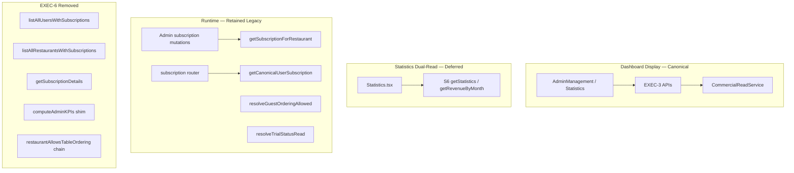

# EXEC-6 — Legacy Authority Retirement

**Program:** Commercial Authority Program — Execution  
**Phase:** EXEC-6 — Controlled legacy authority retirement  
**Date:** 2026-06-08  
**Status:** Complete  

**Mode:** Proof-based retirement only. No UI redesign, no business-rule changes, no CRS rewrite.

**Prerequisites:** EXEC-1–5 complete; dashboard consumers migrated (EXEC-5); canonical authority backfilled (EXEC-4).

---

## 1. Executive Summary

EXEC-6 retires **proven-obsolete** commercial authority paths after EXEC-5 consumer migration. Items with **zero production consumers** were removed. Items with **any remaining consumer** were kept and documented.

| Outcome | Status |
|---------|--------|
| S3 `listAllRestaurantsWithSubscriptions` | **Removed** — replaced by `admin.listRestaurants` |
| S5 `listAllUsersWithSubscriptions` | **Removed** — replaced by `admin.getOwnerOverviewList` |
| S6 `getSubscriptionDetails` | **Removed** — replaced by `admin.getSubscriptionOverview` |
| Client `computeAdminKPIs.ts` shim | **Removed** — zero TS/TSX imports |
| ASN-5 dead ordering helpers (`restaurantAllowsTableOrdering`, etc.) | **Removed** — zero router consumers since ASN-5 |
| S6 dual-read (`getStatistics`, `getRevenueByMonth`) | **Deferred** — `Statistics.tsx` still consumes |
| S2/S3/S4 mutation paths | **Deferred** — admin writes + subscription router |
| H-01 `resolveTrialStatusRead` legacy fallback | **Deferred** — `subscription.checkTrialStatus` |

**Authority consolidation:** Dashboard **display** now has a single canonical path (`CommercialReadService` via EXEC-3 APIs). Legacy fragmentation is materially reduced for admin list/KPI/subscription-table surfaces. Remaining dual-read is isolated to two Statistics chart/metric bindings.

---

## 2. Retirement Inventory

Classification key: **ACTIVE** | **DUAL-READ** | **DEPRECATED** | **REMOVE-CANDIDATE** | **BLOCKED**

### 2.1 Legacy authority readers (S2)

| Item | Location | Classification | Notes |
|------|----------|----------------|-------|
| `getSubscriptionForRestaurant` | `server/db.ts` | **ACTIVE** | Admin restaurant subscription mutations |
| `getCanonicalUserSubscription` | `server/db.ts` | **ACTIVE** | Subscription router, admin user-sub mutations |
| `getUserSubscription` | `server/db.ts` | **DEPRECATED** | Alias of canonical; test mocks only |
| `resolveOrderingSubscriptionRow` | `server/subscriptionResolver.ts` | **ACTIVE** | `resolvePlanLimitsForUser(restaurantId)` |
| `getSubscriptionByRestaurantId` | `server/db.ts` | **REMOVED** | Deprecated alias; zero callers |

### 2.2 Legacy entitlement readers (S3)

| Item | Location | Classification | Notes |
|------|----------|----------------|-------|
| `resolvePlanLimitsForUser` | `server/subscriptionPlanLimits.ts` | **ACTIVE** | Restaurant-scoped limits |
| `restaurantAllowsTableOrdering` | `server/db.ts` | **REMOVED** | ASN-5: ordering uses `resolveGuestOrderingAllowed` |
| `getOrderingSubscriptionForRestaurant` | `server/db.ts` | **REMOVED** | Only caller was removed ordering helper |
| `resolveGuestOrderingAllowed` | `server/commercial/guestOrderingAuthority.ts` | **ACTIVE** | Canonical ordering gate |

### 2.3 Legacy metrics readers (S4/S6)

| Item | Location | Classification | Notes |
|------|----------|----------------|-------|
| `getAdminStatistics` | `server/db.ts` | **DUAL-READ** | `Statistics.tsx` renewal/churn/expired/canceled |
| `getRevenueByMonth` | `server/db.ts` | **DUAL-READ** | `Statistics.tsx` revenue chart |
| `admin.getStatistics` | `server/routers.ts` | **DUAL-READ** | tRPC wrapper; marked `@deprecated EXEC-6` |
| `admin.getRevenueByMonth` | `server/routers.ts` | **DUAL-READ** | tRPC wrapper; marked `@deprecated EXEC-6` |
| `CanonicalMetricsService` | `server/commercial/metrics/` | **ACTIVE** | CRS + `analytics.*` |
| `getSubscriptionDetails` | `server/db.ts` | **REMOVED** | S6 flat row list + wrong restaurant join |

### 2.4 Legacy subscription selectors (S5)

| Item | Location | Classification | Notes |
|------|----------|----------------|-------|
| `getAllUsersWithSubscriptions` | `server/db.ts` | **REMOVED** | S5 `find()` first-row pick |
| `admin.listAllUsersWithSubscriptions` | `server/routers.ts` | **REMOVED** | Replaced by `getOwnerOverviewList` |
| `getAllRestaurantsWithSubscriptions` | `server/db.ts` | **REMOVED** | S3 scoped+fallback merge |
| `admin.listAllRestaurantsWithSubscriptions` | `server/routers.ts` | **REMOVED** | Replaced by `listRestaurants` |

### 2.5 Legacy dashboard-only helpers

| Item | Location | Classification | Notes |
|------|----------|----------------|-------|
| `computeAdminKPIs.ts` | `client/src/lib/admin/` | **REMOVED** | Re-export shim; zero imports |
| `mapDashboardSummaryToKPIs` | `dashboardSummaryKpis.ts` | **ACTIVE** | EXEC-5 canonical KPI mapper |
| `ownerCommercialDisplay.ts` | `client/src/lib/admin/` | **ACTIVE** | EXEC-5 restaurant badge helper |
| H-01 `resolveTrialStatusRead` | `wave1ReadAuthority.ts` | **DUAL-READ** | `subscription.checkTrialStatus`; legacy `isSubscriptionActive` fallback |
| `isSubscriptionActive` | `server/db.ts` | **ACTIVE** | Template/color/font premium gates in `routers.ts` |

### 2.6 ADA-0 / ADA-1 / EXEC-2 cross-reference

| Finding ID | Item | EXEC-6 disposition |
|------------|------|-------------------|
| ADA-0 C-05 | `computeAdminKPIs` S3+S6 merge | **Removed** |
| ADA-0 C-07 | Users panel S5 | **Procedure removed** (EXEC-5 migrated) |
| ADA-0 C-08 | Restaurant cards S3 | **Procedure removed** (EXEC-5 migrated) |
| ADA-0 C-09 | Statistics S6 table | **Procedure removed**; dual-read stats remain |
| EXEC-2 L-08 | `listAllRestaurantsWithSubscriptions` | **Removed** |
| EXEC-2 L-15 | `listAllUsersWithSubscriptions` | **Removed** |
| EXEC-2 L-19 | `getSubscriptionDetails` | **Removed** |
| EXEC-2 L-20 | `restaurantAllowsTableOrdering` | **Removed** |

---

## 3. Usage Proof (removal candidates)

### 3.1 Batch A — Safe immediately (removed)

#### `admin.listAllUsersWithSubscriptions` / `getAllUsersWithSubscriptions`

| Field | Evidence |
|-------|----------|
| Definition | `server/routers.ts` L1023–1027 (removed); `server/db.ts` L976–994 (removed) |
| Call sites (pre-removal) | `server/routers.ts` only |
| Client consumers | **0** — `grep` client: no matches post EXEC-5 |
| Replacement | `admin.getOwnerOverviewList` → `CommercialReadService.getOwnerCommercialStates` |
| EXEC-5 proof | `EXEC-5-DASHBOARD-CONSUMER-MIGRATION.md` §3: Users panel migrated |

#### `admin.listAllRestaurantsWithSubscriptions` / `getAllRestaurantsWithSubscriptions`

| Field | Evidence |
|-------|----------|
| Definition | `server/routers.ts` L852–856 (removed); `server/db.ts` L750–775 (removed) |
| Call sites (pre-removal) | `server/routers.ts` only |
| Client consumers | **0** — `AdminManagement.tsx` uses `admin.listRestaurants` |
| Replacement | `admin.listRestaurants` + `ownerCommercial` |
| EXEC-5 proof | EXEC-5 §2: Restaurant cards migrated |

#### `admin.getSubscriptionDetails` / `getSubscriptionDetails`

| Field | Evidence |
|-------|----------|
| Definition | `server/routers.ts` L956–960 (removed); `server/db.ts` L851–880 (removed) |
| Call sites (pre-removal) | `server/routers.ts` only |
| Client consumers | **0** — `Statistics.tsx` uses `getSubscriptionOverview` |
| Replacement | `admin.getSubscriptionOverview` |
| EXEC-5 proof | EXEC-5 §2: Subscription table migrated |

#### `client/src/lib/admin/computeAdminKPIs.ts`

| Field | Evidence |
|-------|----------|
| Definition | Re-export shim only |
| Call sites | **0** — `grep` `client/**/*.ts{,x}`: no imports |
| Replacement | `dashboardSummaryKpis.ts` (`AdminKPISection`, `AdminManagement` import directly) |

#### `restaurantAllowsTableOrdering` / `getOrderingSubscriptionForRestaurant` / `getSubscriptionByRestaurantId`

| Field | Evidence |
|-------|----------|
| Definition | `server/db.ts` (removed) |
| Call sites | **0** in `server/**/*.ts` production code |
| Replacement | `resolveGuestOrderingAllowed` (ASN-5 Wave A) |
| ASN-5 proof | `guestOrderingAuthority.ts` wired in `order.canOrder` + `order.create` |

### 3.2 Batch B — Deferred (dual-read)

#### `admin.getStatistics` / `getAdminStatistics`

| Field | Evidence |
|-------|----------|
| Consumer | `client/src/pages/Statistics.tsx` L68 — renewal rate, expired/canceled counts |
| Replacement (partial) | `analytics.getSubscriberCounts`, `analytics.getMRR` already wired |
| Blocker | No canonical renewal/churn/expired/canceled API in EXEC-3 |

#### `admin.getRevenueByMonth` / `getRevenueByMonth`

| Field | Evidence |
|-------|----------|
| Consumer | `client/src/pages/Statistics.tsx` L65 — revenue chart |
| Replacement (planned) | `analytics.getRevenueByMonth` — noted deferred in EXEC-3 |
| Blocker | EXEC-3 did not ship monthly revenue analytics endpoint |

### 3.3 Batch C — Blocked (mutations / runtime)

| Item | Consumer | Blocker |
|------|----------|---------|
| `getSubscriptionForRestaurant` | Admin restaurant sub CRUD | Write path not migrated |
| `getCanonicalUserSubscription` | `subscription.*`, admin user-sub CRUD | Billing/mutation authority |
| `resolvePlanLimitsForUser(restaurantId)` | Plan limit enforcement | S3 scoped limits active |
| `resolveTrialStatusRead` | `subscription.checkTrialStatus` | H-01 legacy fallback for scoped-only trial |
| `isSubscriptionActive` | Template/color/font gates | Not dashboard; premium feature gates |

### 3.4 Batch D — Future

| Item | Reason |
|------|--------|
| `getUserSubscription` deprecated alias | Low risk; test mocks reference name |
| `updateUserSubscription` deprecated | Activation path still referenced |
| Admin scoped subscription mutations | ADMIN-UX-1+ scope (out of EXEC-6) |

---

## 4. Removed Items

| Symbol | Type | File |
|--------|------|------|
| `admin.listAllRestaurantsWithSubscriptions` | tRPC procedure | `server/routers.ts` |
| `admin.listAllUsersWithSubscriptions` | tRPC procedure | `server/routers.ts` |
| `admin.getSubscriptionDetails` | tRPC procedure | `server/routers.ts` |
| `getAllRestaurantsWithSubscriptions` | DB helper | `server/db.ts` |
| `getAllUsersWithSubscriptions` | DB helper | `server/db.ts` |
| `getSubscriptionDetails` | DB helper | `server/db.ts` |
| `getSubscriptionByRestaurantId` | DB helper (deprecated alias) | `server/db.ts` |
| `getOrderingSubscriptionForRestaurant` | DB helper | `server/db.ts` |
| `restaurantAllowsTableOrdering` | DB helper (deprecated) | `server/db.ts` |
| `computeAdminKPIs.ts` | Client shim | `client/src/lib/admin/` (deleted) |

**Deprecation markers added (kept, not removed):**

- `getAdminStatistics` — `@deprecated EXEC-6`
- `getRevenueByMonth` — `@deprecated EXEC-6`
- `admin.getStatistics` — `@deprecated EXEC-6`
- `admin.getRevenueByMonth` — `@deprecated EXEC-6`

---

## 5. Deferred Items

| Batch | Items | Unblock condition |
|-------|-------|-------------------|
| **B** | `getStatistics`, `getRevenueByMonth` + tRPC wrappers | Ship `analytics` renewal/churn + monthly revenue; migrate `Statistics.tsx` |
| **C** | S2/S3/S4 mutation readers, `resolveTrialStatusRead`, `isSubscriptionActive` gates | Admin write normalization; premium gate migration to CRS entitlements |
| **D** | Deprecated DB aliases (`getUserSubscription`, etc.) | Consumer audit after Batch C |

---

## 6. Validation

### 6.1 Automated tests

**Result:** 7 files, **43/43 passed** (2026-06-08).

| Suite | Tests | Result |
|-------|-------|--------|
| `exec3DashboardApi.test.ts` | 8 | Pass |
| `dashboardSummaryKpis.test.ts` | 2 | Pass |
| `exec4BackfillLogic.test.ts` | 4 | Pass |
| `exec4PostBackfill.parity.test.ts` | 3 | Pass |
| `admin-subscription.test.ts` | 10 | Pass |
| `statistics.test.ts` | 6 | Pass |
| `CommercialReadService.parity.test.ts` | 10 | Pass |

`pnpm run check`: pre-existing `CanonicalMetricsService.ts` TS2802 (unrelated to EXEC-6 removals).

### 6.2 Route / surface checks

| Surface | Expected behavior |
|---------|-------------------|
| `/admin` KPI strip | `getDashboardSummary` — unchanged |
| `/admin` Users | `getOwnerOverviewList` — unchanged |
| `/admin` Restaurants | `listRestaurants` + `ownerCommercial` — unchanged |
| `/statistics` metrics | `analytics.*` + `getSubscriptionOverview` — unchanged |
| `/statistics` dual-read | `getStatistics` + `getRevenueByMonth` — still works |
| Commercial APIs | `commercial.*` — unchanged |
| Ordering | `resolveGuestOrderingAllowed` — unchanged |

### 6.3 Backfill assumptions

EXEC-4 backfill logic and parity tests unchanged. Retirement does not alter `CommercialReadService` or canonical row selection.

---

## 7. Risks

| Risk | Severity | Mitigation |
|------|----------|------------|
| External client called removed tRPC procedures | Low | No client references found; procedures were admin-only |
| Statistics dual-read divergence | Medium | Documented; canonical analytics partial migration in EXEC-5 |
| Premature S2/S3 removal | High | **Not attempted** — mutation paths retained |
| Scoped-only trial via H-01 | Medium | `resolveTrialStatusRead` kept; parity tests document mismatch |

---

## 8. Post-EXEC-6 Architecture

**Single canonical display path:** `CommercialReadService` via `commercial.*` / `admin.*` / `analytics.*`.

**Remaining fragmentation:** Two Statistics bindings (Batch B) + mutation/runtime paths (Batch C). No further dashboard list/KPI authority duplication.

---

## 9. Retirement Batches Summary

| Batch | Action | Status |
|-------|--------|--------|
| **A** | Remove zero-consumer dashboard list/detail procedures + dead ordering helpers + client shim | **Done** |
| **B** | Retire S6 dual-read after analytics completion | **Deferred** |
| **C** | Retire S2/S3/S4 mutation readers after admin write migration | **Deferred** |
| **D** | Deprecated alias cleanup | **Future** |

---

*Stop boundary: EXEC-6 complete. ADMIN-UX-1 not started.*
