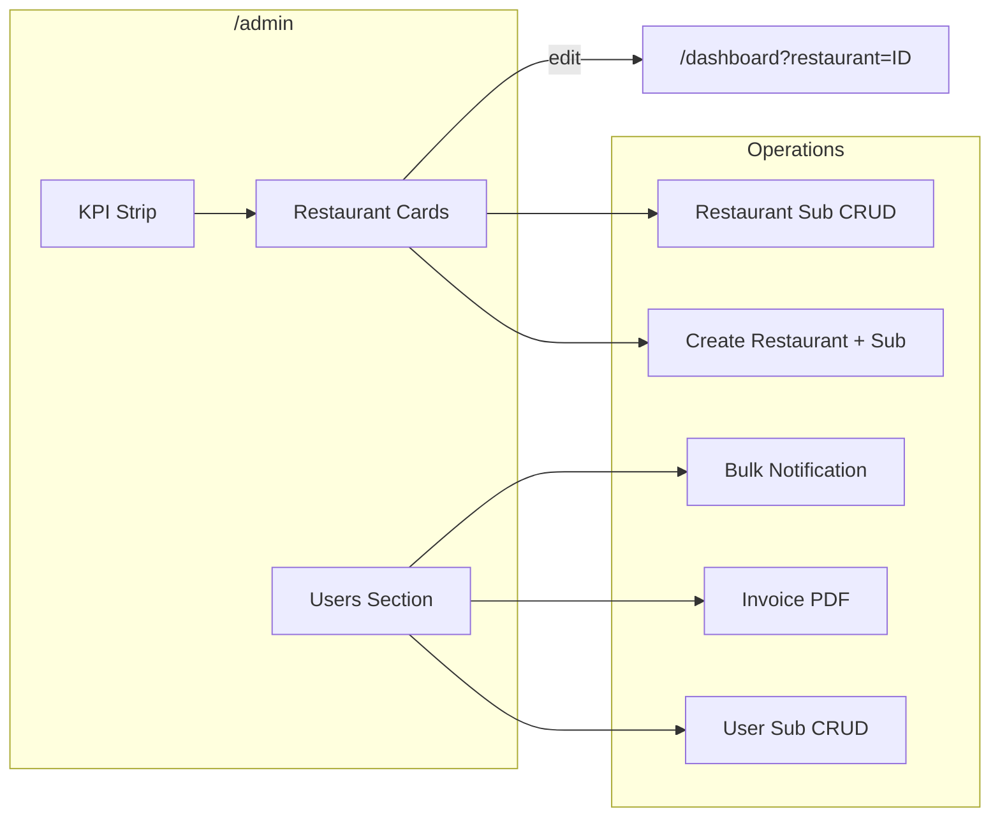
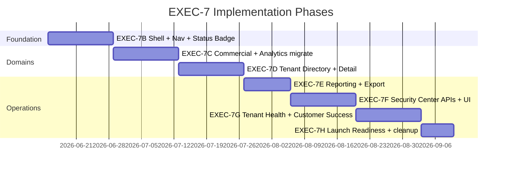

# EXEC-7A — Admin Dashboard Rebuild Architecture

**Program:** Commercial Authority Program — Execution  
**Phase:** EXEC-7A — Discovery, Information Architecture, and Operational Design  
**Date:** 2026-06-08  
**Status:** Complete (architecture only)  

**Mode:** Planning and documentation only. **No production code changes.** No React rewrite. No visual redesign. No component replacement.

**Prerequisites:** EXEC-1–6 complete. Canonical commercial authority in production. Dashboard consumers migrated to CRS-backed APIs.

**Stop boundary:** EXEC-7A ends here. UI implementation begins in EXEC-7B+.

---

## 1. Executive Summary

MineuQR’s admin experience is **functionally correct** after the Commercial Authority Program but **operationally incomplete** as a SaaS Operations Center. Commercial data is now canonical (`CommercialReadService` + `CanonicalMetricsService`), yet the UI still presents it as a **single long scroll page** (`/admin`) with analytics relegated to a **hidden secondary route** (`/statistics`).

EXEC-7A defines the target architecture to transform the admin surface into a **multi-domain operations hub** covering commercial visibility, tenant management, security monitoring, customer success, and launch readiness — without changing business rules or rewriting authority layers.

| Domain | Current state | Target (ADMIN-UX-1) |
|--------|---------------|---------------------|
| Commercial visibility | Split across `/admin` KPI strip + `/statistics` | Unified Commercial Overview + Analytics Suite |
| Tenant visibility | Restaurant cards + embedded users list | Tenant Directory + Tenant Detail View |
| Security visibility | Server-side ops logs only | Security & Threat Monitoring Center |
| Customer success | Partial subscription fields in dialogs | Customer Success Center with full CRS slice |
| Launch readiness | No consolidated view | Launch Readiness Dashboard |
| Navigation | Top bar, one small Statistics button | Persistent sidebar + domain sections |
| Status consistency | Three badge systems | Commercial Status Consistency Layer |

**Key constraint:** All new surfaces must consume **existing EXEC-3 APIs** first. New server endpoints are allowed only where data exists in ops logs/DB but has no admin read API (security, health signals).

---

## 2. Current State Audit

### 2.1 Pages and routes

| Route | Component | Role | Linked from UI? |
|-------|-----------|------|-----------------|
| `/admin` | `AdminManagement.tsx` | Primary admin — KPIs, restaurants, users | Yes — `LandingNavbar` (admin role) |
| `/statistics` | `Statistics.tsx` | Analytics — charts, subscription table, CSV | **Only** small nav button on `/admin` |
| `/users` | `Users.tsx` | User list + role edit + delete | **No links** (orphan) |
| `/super-admin` | `SuperAdminDashboard.tsx` | Stripped stats + user delete | **No links** (orphan) |
| `/commercial/diagnostics` | `CommercialDiagnostics.tsx` | CRS migration diagnostics | **No admin nav** (dev tool) |

**Registration:** `client/src/App.tsx` L65–68.

### 2.2 `AdminManagement.tsx` structure

Single-page layout inside `AdminPageShell` — **no tabs, no sidebar**.

| Section | Lines (approx.) | Data sources | Operations |
|---------|-----------------|--------------|------------|
| KPI overview | 1052–1072 | `admin.getDashboardSummary` → `mapDashboardSummaryToKPIs` | Read-only |
| Restaurants | 1074–1371 | `admin.listRestaurants`, `subscription.listPlans` | Search, status filter, create restaurant, scoped sub CRUD, delete restaurant, navigate to owner dashboard |
| Users (`UsersSection`) | 58–761, 1373–1379 | `admin.getOwnerOverviewList`, `admin.listRestaurants` | Role edit, delete, user-sub CRUD, notifications, invoice PDF |

**Auth:** `useAuthGate()` → `AuthGatePending` / `AdminAccessDenied`.

**Notable gaps:**
- `Download` icon imported but unused (L24).
- Restaurant subscription edit/delete gated on `subscriptionStatus === "active"` only — trial/canceled paths partial.
- UsersSection uses hardcoded Arabic badge colors (`getStatusBadge` L263–271) alongside i18n elsewhere.

### 2.3 `Statistics.tsx` structure

Standalone page — **not** wrapped in `AdminPageShell`. Nine parallel tRPC queries.

| Section | Data source | Authority |
|---------|-------------|-----------|
| Platform KPIs (5 cards) | `admin.getExtendedStats` | DB aggregates (operational) |
| Subscription KPIs (4 cards) | `analytics.getMRR/ARR`, `analytics.getSubscriberCounts`, `admin.getStatistics` (renewal) | Canonical + **legacy dual-read** |
| Revenue chart | `admin.getRevenueByMonth` | **Legacy (deprecated EXEC-6)** |
| Growth chart | `admin.getExtendedStats.userGrowth` | DB aggregates |
| Plan pie chart | `analytics.getPlanDistribution` | Canonical |
| Status grid | `analytics.getSubscriberCounts`, `admin.getStatistics` | Canonical + legacy |
| Subscription table | `admin.getSubscriptionOverview` | CRS |
| CSV export | Client-side from overview rows | CRS display helpers |

Dual-read comments at L63–68 document intentional legacy retention.

### 2.4 Navigation model (current)

```
LandingNavbar (admin) ──► /admin
                              │
                              └── AdminPageShell nav
                                    ├── Brand → /
                                    └── [Statistics] (outline, sm, text-xs) → /statistics
                                          └── back arrow → /admin
```

**No sidebar.** No section switcher. No breadcrumbs beyond Statistics back button.

`AdminPageShell.tsx` L43–47 — Statistics button is `variant="outline" size="sm" className="text-xs"`.

### 2.5 Current KPIs

**Admin KPI strip** (`AdminKPISection` + `dashboardSummaryKpis.ts`):

| KPI | Server field | Semantics |
|-----|--------------|-----------|
| Active Restaurants | `activeRestaurants` | `restaurants.isActive === true` (operational, not subscription) |
| Active Subscriptions | `activeSubscriptions` | Owners with `subscriptionStatus === "active"` (canonical) |
| Expiring Soon | `expiringAccounts` | CRS entitled owners within 30-day window |
| Estimated MRR | `mrr` | `CanonicalMetricsService` |
| Total Users | `totalUsers` | DB count |

**Statistics KPIs** overlap but differ:
- “Total Restaurants” = `extendedStats.totalRestaurants` (all venues, not `isActive`)
- MRR/ARR from `analytics.*` with `getDashboardSummary` fallback
- Renewal/churn from legacy `getStatistics`

**Unused server capability:** `analytics.getExpiringAccounts` exists but **no client consumer** — expiring count only appears via `getDashboardSummary`.

### 2.6 Admin operations workflow (current)



Operations are **embedded in list cards** — no dedicated tenant detail view, no workflow state, no audit trail visibility.

### 2.7 Duplicate and hidden surfaces

| Surface | Locations | Issue |
|---------|-----------|-------|
| User management | `/admin` UsersSection, `/users`, `/super-admin` | Three implementations; only `/admin` is complete |
| Platform stats | `/statistics`, `/super-admin` (partial), `/admin` KPI strip | Overlapping counts with different semantics |
| Commercial analytics | `/statistics` only | Poor discoverability |
| CRS diagnostics | `/commercial/diagnostics` | Hidden; useful for ops but not linked |
| Invoice PDF | UsersSection dialog only | No reporting hub |

### 2.8 Server capabilities not surfaced in admin UI

| Capability | Location | Admin visibility |
|------------|----------|------------------|
| `analytics.getExpiringAccounts` | `analyticsRouter.ts` | None (bundled in summary only) |
| `admin.getOwnerOverview` | `adminDashboardRouter.ts` | None (list only, no detail page) |
| `commercial.getOwnerEntitlements` | `commercial` router | None |
| Ops events (`OPS_EVENT.*`) | `opsTaxonomy.ts`, `authAudit.ts` | Log-only |
| `trackSuspiciousActivity` | `suspiciousActivity.ts` | Log-only |
| Cascade audit context | `cascadeDeletes.ts` | Log-only |
| Tenant boundary violations | `routers.ts` + `[AuthAudit]` | Log-only |

### 2.9 Commercial authority baseline (post EXEC-6)

Dashboard **display** reads are canonical. Remaining legacy is isolated:
- `Statistics.tsx` dual-read: `getStatistics`, `getRevenueByMonth`
- Admin **mutations** still use scoped subscription writes (S2/S3)
- Premium feature gates still use `isSubscriptionActive` (not dashboard)

---

## 3. UX Findings

### 3.1 Special review items

| # | Issue | Severity | Evidence | Root cause |
|---|-------|----------|----------|------------|
| 1 | **Statistics discoverability** | **High** | Analytics only via `text-xs` outline button in `AdminPageShell` | Statistics treated as secondary route, not primary nav domain |
| 2 | **Small analytics button** | **High** | `size="sm" className="text-xs"` vs prominent “Add restaurant” CTA | Visual hierarchy inverts operations vs analytics priority |
| 3 | **Restaurant status inconsistencies** | **Medium** | Restaurant cards: i18n `Badge` with binary default/secondary variant | No shared status component; filter uses CRS status, badge styling does not |
| 4 | **Owner status inconsistencies** | **Medium** | UsersSection: hardcoded Arabic colored badges; Statistics: variant from `subscriptionStatus` not `ownerSubscriptionStatus()` | Three parallel badge implementations |
| 5 | **Subscription badge inconsistencies** | **Medium** | Statistics L444–454: label from `ownerSubscriptionStatus()` but variant from `subscriptionStatus` — trial label can show “active” styling | Display helper vs styling source mismatch |
| 6 | **Missing customer subscription visibility** | **High** | No dedicated view for plan, renewal, expiration, limits, upgrade path | Data exists in `OwnerCommercialState` but only shown in cramped dialogs/table columns |
| 7 | **Missing export/reporting** | **Medium** | Only CSV on Statistics + per-user invoice PDF | No executive reports, no Excel, no scheduled exports |
| 8 | **Missing threat monitoring** | **High** | `logFailedLogin`, `trackSuspiciousActivity`, `OPS_EVENT` exist; zero admin UI | Ops instrumentation complete; observability layer not built |
| 9 | **Missing tenant health visibility** | **High** | No configuration issue surfacing, no restaurant health scoring | Operational warnings scattered; `isActive` only signal on restaurant cards |

### 3.2 Additional UX findings

| Finding | Detail |
|---------|--------|
| **Monolithic scroll** | `/admin` combines KPIs + restaurants + users — poor scanability at scale |
| **No tenant detail** | Admin must open owner dashboard or dialogs to inspect a tenant |
| **KPI semantic confusion** | “Active Restaurants” (operational) vs “Active Subscriptions” (commercial) — hints added in EXEC-5 but still easy to misread |
| **Statistics isolation** | Different shell, no shared nav — feels like a separate app |
| **i18n inconsistency** | `SuperAdminDashboard` Arabic-only; `UsersSection` mixed hardcoded Arabic + i18n |
| **Role badge variance** | English “Admin/User” in `/admin`; icon badges in `/users`; solid colors in `/super-admin` |
| **Legacy labels on Statistics** | Page claims “canonical authority” but shows “(legacy)” / “pending canonical API” on some metrics |
| **No global search** | Restaurant search only; no cross-tenant owner/email search |
| **No alerting** | Expiring accounts shown as KPI number only — no list, no drill-down |

---

## 4. Information Architecture

### 4.1 Target domain map (ADMIN-UX-1A–1I)

```mermaid
flowchart TB
  ROOT[SaaS Operations Center]

  ROOT --> HOME[1A Dashboard Home]
  ROOT --> COMM[1B Commercial Overview]
  ROOT --> TENANT[1C Tenant Management]
  ROOT --> ANALYTICS[1D Analytics Foundation]
  ROOT --> REPORT[1E Reporting and Export]
  ROOT --> SEC[1F Security Center]
  ROOT --> HEALTH[1G Tenant Health Center]
  ROOT --> CS[1H Customer Success Center]
  ROOT --> LAUNCH[1I Launch Readiness]

  HOME --> EXEC_SUM[Executive Summary]
  HOME --> NAV[Navigation Model]

  COMM --> MRR[Current MRR / ARR]
  COMM --> PLANS[Plan Distribution]
  COMM --> REV[Revenue Trends]

  TENANT --> DIR[Tenant Directory]
  TENANT --> DETAIL[Tenant Detail View]
  TENANT --> STATUS[Status Consistency Layer]

  ANALYTICS --> SUITE[Commercial Analytics Suite]
  ANALYTICS --> HEALTH_SCORE[Commercial Health Score]

  REPORT --> CSV[CSV Export]
  REPORT --> XLS[Excel Export]
  REPORT --> EXEC_RPT[Executive Reports]

  SEC --> FAILED[Failed Logins]
  SEC --> SUSP[Suspicious Activity]
  SEC --> EVENTS[Security Events]

  HEALTH --> REST_HEALTH[Restaurant Health]
  HEALTH --> CONFIG[Configuration Issues]
  HEALTH --> EXPIRING[Expiring Plans]

  CS --> SUB_VIS[Subscription Visibility]
  CS --> LIMITS[Plan Limits]
  CS --> UPGRADE[Upgrade Path]

  LAUNCH --> COMM_RDY[Commercial Readiness]
  LAUNCH --> SEC_RDY[Security Readiness]
  LAUNCH --> DATA_RDY[Data Readiness]
  LAUNCH --> OPS_RDY[Operations Readiness]
```



### 4.2 Route proposal (future — not implemented in 7A)

| Route | Domain | Replaces / consolidates |
|-------|--------|----------------------|
| `/admin` | Dashboard Home (1A) | Current `/admin` KPI strip → executive summary |
| `/admin/commercial` | Commercial Overview (1B) | Statistics subscription KPIs + MRR/ARR headline |
| `/admin/tenants` | Tenant Directory (1C) | Restaurant cards + users list |
| `/admin/tenants/:ownerId` | Tenant Detail (1C) | New — `getOwnerOverview` + restaurants |
| `/admin/analytics` | Analytics Suite (1D) | Current `/statistics` charts |
| `/admin/reports` | Reporting (1E) | CSV + new export types |
| `/admin/security` | Security Center (1F) | New |
| `/admin/health` | Tenant Health (1G) | New |
| `/admin/customer-success` | Customer Success (1H) | New — expiring, renewal pipeline |
| `/admin/launch-readiness` | Launch Readiness (1I) | New |
| `/statistics` | — | **Redirect** → `/admin/analytics` (deprecate standalone) |
| `/users`, `/super-admin` | — | **Retire** — merge into `/admin/tenants` |

### 4.3 Content hierarchy principles

1. **Home answers “how is the business?”** — 6–8 executive KPIs, trend sparklines, alerts strip.
2. **Commercial answers “what is revenue?”** — MRR, ARR, plan mix, revenue trend.
3. **Tenants answers “who are customers?”** — searchable directory, consistent badges, detail drill-down.
4. **Analytics answers “what changed?”** — time-series, cohorts, churn (once canonical APIs ship).
5. **Security/Health/Success answer “what needs attention?”** — actionable queues, not raw logs.
6. **Launch Readiness answers “are we safe to ship?”** — checklist scoring across domains.

---

## 5. Navigation Model

### 5.1 Proposed shell

Replace top-only nav with **persistent left sidebar** + **top context bar**.

```
┌─────────────────────────────────────────────────────────────┐
│ [Logo]  SaaS Operations Center          [Search] [User] [⚙]  │
├──────────┬──────────────────────────────────────────────────┤
│ Home     │  Page title + breadcrumbs                        │
│ Commercial│                                                 │
│ Tenants  │  Main content area                               │
│ Analytics│                                                 │
│ Reports  │                                                 │
│ Security │                                                 │
│ Health   │                                                 │
│ Success  │                                                 │
│ Launch   │                                                 │
└──────────┴──────────────────────────────────────────────────┘
```

### 5.2 Navigation rules

| Rule | Rationale |
|------|-----------|
| Analytics is a **first-class nav item**, not a small button | Fixes discoverability (review items 1–2) |
| Tenants is the **default landing** for operational work | Restaurants + owners are primary admin workflow |
| Home is the **default route** after login | Executive summary for daily check-in |
| Retire orphan routes | Eliminate `/users`, `/super-admin` fragmentation |
| Breadcrumbs on detail views | `Tenants → Owner Name → Subscription` |
| Global search in top bar | Owner email, restaurant name, slug — server-side filter |

### 5.3 Analytics discoverability fix (immediate design intent)

| Current | Target |
|---------|--------|
| `outline sm text-xs` button | Sidebar item with icon + label “Analytics” |
| Separate shell on `/statistics` | Shared `AdminOperationsShell` |
| Back arrow only | Breadcrumb: `Home → Analytics` |

---

## 6. Dashboard Layout Proposal

### 6.1 Dashboard Home (ADMIN-UX-1A)

**Purpose:** Executive summary — 30-second operational snapshot.

| Zone | Content | Data source |
|------|---------|-------------|
| Alert strip | Expiring accounts, failed login spike, webhook failures | `analytics.getExpiringAccounts`, new `admin.getSecuritySummary` (future) |
| KPI row (6) | MRR, ARR, Entitled Owners, Active Trials, Expiring (30d), Total Tenants | `getDashboardSummary`, `analytics.*` |
| Trend row | MRR sparkline (30d), subscriber growth | `analytics.getRevenueByMonth` (when shipped) + `extendedStats.userGrowth` |
| Quick actions | View expiring, View failed logins, Export executive summary | Navigation + reports |
| Activity feed | Recent admin mutations, cascade deletes | New `admin.getAuditFeed` (future) |

**Layout:** 12-column grid, responsive collapse to 2-column on mobile.

### 6.2 Commercial Overview (ADMIN-UX-1B)

| Zone | Content |
|------|---------|
| Headline cards | MRR, ARR, MoM delta (when historical API exists) |
| Plan distribution | Donut chart — `analytics.getPlanDistribution` |
| Revenue trends | Line chart — migrate from legacy `getRevenueByMonth` |
| Subscriber summary | Entitled / active / trial — `analytics.getSubscriberCounts` |

### 6.3 Tenant Management (ADMIN-UX-1C)

| Zone | Content |
|------|---------|
| Directory table | Owner, plan, status, restaurants count, last activity, actions |
| Filters | Status, plan, entitled, expiring, search |
| Restaurant sub-grid | Optional toggle — venue list with `ownerCommercial` |
| Detail drawer/page | Full `getOwnerOverview` + `listRestaurants` filtered by `userId` |

### 6.4 Analytics Suite (ADMIN-UX-1D)

Migrate existing `Statistics.tsx` sections into tabbed analytics:
- **Overview** — platform + subscription KPIs
- **Revenue** — MRR, ARR, monthly revenue chart
- **Growth** — user/restaurant growth, subscriber growth
- **Churn** — renewal/churn (blocked on canonical API — show placeholder until EXEC-7B server work)

### 6.5 Cross-cutting: Commercial Status Consistency Layer

**New shared component (design spec only):** `CommercialStatusBadge`

| Input | Display |
|-------|---------|
| `OwnerCommercialState` or `RestaurantOwnerCommercial` | Unified label, color, icon |
| Status resolution | Always via `ownerSubscriptionStatus()` for label |
| Variant mapping | Single table: trial=blue, active=green, expired=red, canceled=gray, inactive=outline |
| Entitlement indicator | Secondary dot: entitled vs not (`isOwnerEntitled`) |
| i18n | All labels from `t("subscription.status.*")` — **no hardcoded Arabic** |

**Replaces:**
- `UsersSection.getStatusBadge` (hardcoded)
- Restaurant card binary Badge
- Statistics table variant mismatch

---

## 7. KPI Strategy

### 7.1 KPI taxonomy

| Tier | Audience | Refresh | Examples |
|------|----------|---------|----------|
| **Executive** | Daily leadership check | On load + 5m stale | MRR, ARR, entitled owners, expiring 30d |
| **Operational** | Admin operators | On load | Active restaurants (`isActive`), total users, total venues |
| **Analytical** | Weekly review | On tab focus | Plan distribution, growth rates, churn |
| **Alerting** | Immediate action | Real-time/poll | Failed login burst, expiring this week |

### 7.2 Canonical source mapping

| KPI | Authoritative API | Never use |
|-----|-------------------|-----------|
| MRR | `analytics.getMRR` | `getAdminStatistics.totalRevenue` |
| ARR | `analytics.getARR` | Client calculation |
| Entitled owners | `analytics.getSubscriberCounts.entitledOwners` | Raw row counts |
| Plan distribution | `analytics.getPlanDistribution` | `subscriptionsByPlan` (legacy) |
| Expiring accounts | `analytics.getExpiringAccounts` | Client re-derivation |
| Owner subscription status | `OwnerCommercialState` via CRS | Scoped restaurant row |
| Active restaurants | `getDashboardSummary.activeRestaurants` | Subscription status proxy |

### 7.3 KPI display rules

1. Every KPI card shows **source badge**: “Canonical” or “Operational (DB)” where semantics differ.
2. **No client-side commercial derivation** — formatting only (`ownerCommercialDisplay`, `formatAdminCurrency`).
3. Legacy dual-read metrics display **deprecation banner** until Batch B retirement (EXEC-6 deferred).
4. MoM/delta requires historical snapshots — **defer** until `analytics.getRevenueByMonth` + time-series storage.

### 7.4 Commercial Health Score (ADMIN-UX-1D — design)

Composite index (0–100) for executive dashboard:

| Factor | Weight | Signal |
|--------|--------|--------|
| Revenue stability | 25% | MRR trend (when available) |
| Churn pressure | 25% | Expiring + canceled ratio |
| Tenant activation | 25% | Entitled owners with ≥1 active restaurant |
| Payment health | 25% | Webhook failure rate (ops events) |

**Implementation note:** Score computation belongs server-side (`CanonicalMetricsService` extension or new `admin.getCommercialHealthScore`). Not in 7A scope.

---

## 8. Reporting Strategy (ADMIN-UX-1E)

### 8.1 Current capabilities

| Export | Location | Format | Scope |
|--------|----------|--------|-------|
| Subscription overview | `Statistics.tsx` L102–134 | CSV | Owner-centric CRS rows |
| Invoice PDF | `AdminManagement` UsersSection | PDF | Per-user, on-demand |

### 8.2 Target reporting layer

| Report | Format | Source | Priority |
|--------|--------|--------|----------|
| Subscription overview | CSV, Excel | `getSubscriptionOverview` | P1 — extend existing CSV |
| Executive summary | PDF | `getDashboardSummary` + `analytics.*` | P2 |
| Expiring accounts | CSV, Excel | `getExpiringAccounts` + owner list | P1 |
| Tenant directory | CSV, Excel | `getOwnerOverviewList` + `listRestaurants` | P2 |
| Revenue by month | CSV | Canonical analytics (post API) | P3 |
| Security events | CSV | New ops read API | P3 |

### 8.3 Export architecture

```
ReportRequest → server/adminReportsRouter (new, EXEC-7B+)
              → query existing CRS/analytics APIs
              → format (csv | xlsx | pdf)
              → download or async job for large datasets
```

**Client rule:** No new commercial aggregation in export builders — reuse API response shapes.

### 8.4 Excel strategy

Use lightweight server-side generation (e.g. `exceljs`) for:
- Multi-sheet workbooks: Summary + Tenants + Subscriptions
- Formatted headers, date columns in APP_TIMEZONE

Defer scheduled/email reports to EXEC-7C+.

---

## 9. Security Center Strategy (ADMIN-UX-1F)

### 9.1 Existing server instrumentation

| Signal | Emitter | Event type |
|--------|---------|------------|
| Failed logins | `authAudit.logFailedLogin` | `OPS_EVENT.failed_login` |
| Suspicious activity | `trackSuspiciousActivity` | Various AUTH signals |
| Rate limiting | Auth middleware | `rate_limit_exceeded` |
| Tenant violations | Restaurant/offer routers | `tenant_boundary_violation` |
| Unauthorized admin | `assertAdminAccess` | `unauthorized_admin_access` |
| CSRF mismatches | Core middleware | `csrf_origin_mismatch` |
| Token brute-force | Auth token handlers | `auth_token_bruteforce_suspected` |
| Cascade deletes | `cascadeDeletes.ts` | `cascade_*_deleted` |

**Gap:** All signals go to `opsLog` — **no admin read API, no UI**.

### 9.2 Security Center layout (target)

| Panel | Content |
|-------|---------|
| Threat summary | 24h failed logins, rate limits, suspicious IPs |
| Failed logins table | Email (masked), reason, IP, timestamp |
| Suspicious activity feed | Correlation ID, signal type, severity |
| Admin access denials | Actor, procedure, timestamp |
| Tenant boundary violations | Actor, resource, restaurant ID |
| Abuse indicators | Brute-force suspected, email amplification |

### 9.3 Server work required (EXEC-7B+)

New read-only admin APIs (aggregating ops log store):
- `admin.getSecuritySummary({ windowHours })`
- `admin.getSecurityEvents({ type, limit, cursor })`

**Constraints:**
- Never expose passwords, full tokens, or session secrets
- Mask email partials in list views
- Admin-only via `assertAdminAccess`
- Read-only — no mutation from security center

### 9.4 Alerting thresholds (design)

| Condition | Severity | Action |
|-----------|----------|--------|
| >10 failed logins / IP / 1h | Warn | Highlight in feed |
| `auth_token_bruteforce_suspected` | Critical | Top of dashboard alert strip |
| >5 tenant violations / user / 24h | Warn | Link to tenant detail |
| CSRF spike | Critical | Launch readiness flag |

---

## 10. Tenant Health Center Strategy (ADMIN-UX-1G)

### 10.1 Health dimensions

| Dimension | Signals (current) | Signals (target) |
|-----------|-------------------|------------------|
| Restaurant operational | `isActive`, view counts | + menu item count, category count |
| Configuration | Manual inspection | Missing currency, empty menu, no tables (ordering) |
| Commercial | `ownerCommercial` entitlement | Expiring, NONE plan with active restaurant |
| Engagement | `getRestaurantStats` | Views trend, order volume |

### 10.2 Health score per restaurant (design)

| Check | Weight | Source |
|-------|--------|--------|
| Is active | 20% | `restaurant.isActive` |
| Has menu content | 20% | `extendedStats` / per-restaurant query |
| Owner entitled | 30% | CRS `isEntitled` |
| Configuration complete | 15% | Country, currency, phone present |
| Not expiring soon | 15% | CRS `currentPeriodEnd` |

### 10.3 Operational warnings queue

| Warning type | Example | Action link |
|--------------|---------|-------------|
| `EXPIRING_PLAN` | Owner trial ends in 7d | Customer Success → owner |
| `NONE_PLAN_ACTIVE_VENUE` | Entitled false, restaurant active | Tenant detail |
| `MISSING_CURRENCY` | `currencyCode` null | Restaurant edit |
| `INACTIVE_WITH_ORDERS` | isActive false but recent orders | Tenant detail |

### 10.4 Expiring plans visibility

**Current:** Single KPI number on admin home.

**Target:** Dedicated list from `analytics.getExpiringAccounts` + `getAllOwnerCommercialStates` filtered by window — sortable table with owner email, plan, end date, days remaining, CSM action buttons.

---

## 11. Customer Success Center Strategy (ADMIN-UX-1H)

### 11.1 Data already available in `OwnerCommercialState`

| Field | Customer success use |
|-------|---------------------|
| `planCode`, `planName` | Current plan display |
| `subscriptionStatus` | Subscription status |
| `trialStatus` | Trial flag, `trialEndsAt`, `daysRemaining` |
| `currentPeriodEnd` | Renewal / expiration date |
| `billingCycle` | Monthly/yearly |
| `maxRestaurants` | Plan limit |
| `features` | Feature entitlements |
| `entitlements` | Full entitlement object |
| `commercialStatus.isEntitled` | Access gate |
| `commercialStatus.isPaid` | Paid vs trial |
| `subscriptionId` | Link to admin mutation dialogs |

**Gap is UI, not data** — CRS already exposes the slice.

### 11.2 Customer Success Center layout

| Section | Content |
|---------|---------|
| Pipeline | Expiring (7d, 30d), recently canceled, trial ending |
| Owner card | Plan, status, renewal date, limits, feature summary |
| Upgrade path | Compare current plan → next tier (from `subscription.listPlans`) |
| Actions | Edit subscription, send notification, generate invoice |
| History | Placeholder for future subscription event log |

### 11.3 Subscription visibility requirements (from brief)

| Requirement | Source | Current UI |
|-------------|--------|--------------|
| Current plan | `planName` / `planCode` | Table column + dialog |
| Subscription status | `ownerSubscriptionStatus()` | Inconsistent badges |
| Renewal date | `currentPeriodEnd` | Table column only |
| Expiration date | `trialEndsAt` or `currentPeriodEnd` | Not prominently shown |
| Plan limits | `maxRestaurants`, `features` | Not shown in admin |
| Upgrade path | Plan catalog comparison | Not shown |

### 11.4 Consistency layer integration

Customer Success Center **must** use `CommercialStatusBadge` and `ownerCommercialDisplay` helpers exclusively — no local status logic.

---

## 12. Launch Readiness Strategy (ADMIN-UX-1I)

### 12.1 Purpose

Single pane answering: **“Is MineuQR safe to operate at scale?”** post Commercial Authority Program.

### 12.2 Readiness domains

| Domain | Checks | Source |
|--------|--------|--------|
| **Commercial** | CRS parity tests pass; no S5/S6 list procedures; dual-read documented | EXEC-2/6 docs, test CI |
| **Security** | Auth ops signals flowing; rate limits active; no `auth_secret_weak` | Ops events |
| **Data** | Account-scoped rows backfilled; 0 orphan scoped-only owners (post EXEC-4) | Backfill script output |
| **Operations** | Webhook success rate; cascade audit logging; admin access gated | Ops events |

### 12.3 Launch Readiness Dashboard layout

| Card | Green criteria | Red criteria |
|------|----------------|--------------|
| Commercial Authority | All dashboard reads use CRS | Any client `computeAdminKPIs`-style merge |
| Metrics Canonical | MRR/ARR from `analytics.*` | Legacy `getStatistics` for MRR |
| Security Posture | 0 critical ops events (24h) | Brute-force suspected active |
| Data Integrity | Backfill complete | Scoped-only entitled owners exist |
| Analytics Debt | Dual-read count = 0 | `getRevenueByMonth` still consumed |
| Admin UX | Single nav model | Orphan routes active |

### 12.4 Scoring

Each domain: **Ready** / **At Risk** / **Blocked** — manual override allowed for launch decisions with audit note.

**EXEC-7A delivers the checklist definition.** Automated scoring is EXEC-7B+ server work.

---

## 13. Recommended Implementation Phases

### Phase map



### EXEC-7B — Dashboard Foundation (ADMIN-UX-1A)

| Deliverable | Scope |
|-------------|-------|
| `AdminOperationsShell` | Sidebar + top bar + breadcrumbs |
| Navigation model | Home, Commercial, Tenants, Analytics, Reports, Security, Health, Success, Launch |
| `CommercialStatusBadge` | Shared component per §6.5 |
| Dashboard Home | Executive summary reusing `getDashboardSummary` + `analytics.*` |
| Route redirects | `/statistics` → `/admin/analytics` |
| Retire orphan pages | Remove `/users`, `/super-admin` routes after parity check |

**No business rule changes.** Layout and navigation only.

### EXEC-7C — Commercial Overview + Analytics (ADMIN-UX-1B, 1D)

| Deliverable | Scope |
|-------------|-------|
| Commercial Overview page | MRR, ARR, plan distribution, revenue trends |
| Analytics Suite | Migrate `Statistics.tsx` into shell |
| Server: `analytics.getRevenueByMonth` | Replace legacy dual-read |
| Server: churn/renewal canonical APIs | Replace `getStatistics` dual-read |
| Retire legacy procedures | Batch B from EXEC-6 |

### EXEC-7D — Tenant Management (ADMIN-UX-1C)

| Deliverable | Scope |
|-------------|-------|
| Tenant Directory | Unified owners + restaurants table |
| Tenant Detail view | `getOwnerOverview` + filtered `listRestaurants` |
| Global search | Owner email, restaurant name |
| Migrate admin mutations | Embed in detail view (same mutations, better UX) |

### EXEC-7E — Reporting & Export (ADMIN-UX-1E)

| Deliverable | Scope |
|-------------|-------|
| Reports hub page | Report catalog |
| Excel export | Subscription overview, expiring accounts |
| Executive PDF | Dashboard summary snapshot |

### EXEC-7F — Security Center (ADMIN-UX-1F)

| Deliverable | Scope |
|-------------|-------|
| `admin.getSecuritySummary` | New read API over ops log |
| `admin.getSecurityEvents` | Paginated event feed |
| Security Center UI | Panels per §9.2 |
| Dashboard alert strip integration | Failed login spike |

### EXEC-7G — Tenant Health + Customer Success (ADMIN-UX-1G, 1H)

| Deliverable | Scope |
|-------------|-------|
| Expiring accounts list | `analytics.getExpiringAccounts` drill-down |
| Health warnings queue | Configuration + commercial checks |
| Customer Success Center | Full subscription visibility per §11 |
| Plan limits + upgrade path UI | CRS entitlements + plan catalog |

### EXEC-7H — Launch Readiness + Cleanup (ADMIN-UX-1I)

| Deliverable | Scope |
|-------------|-------|
| Launch Readiness Dashboard | Checklist per §12 |
| Remove deprecated legacy APIs | Post dual-read migration |
| Documentation | EXEC-7 completion report |
| i18n pass | Eliminate hardcoded Arabic in admin |

### Dependency graph

```
EXEC-7B (shell + badge)
  ├── EXEC-7C (commercial/analytics) — needs shell
  ├── EXEC-7D (tenants) — needs shell + badge
  └── EXEC-7E (reports) — needs 7C data shapes

EXEC-7F (security) — independent server work, UI needs 7B shell
EXEC-7G (health/success) — needs 7D tenant detail + 7B badge
EXEC-7H (launch) — after all domains have first version
```

### What NOT to do in implementation

| Prohibition | Reason |
|-------------|--------|
| Rewrite `CommercialReadService` | Authority program complete |
| Change subscription/billing rules | UX program only |
| Client-side commercial derivation | EXEC-5/6 established server authority |
| Big-bang rewrite | Phased migration per route |
| New visual design system | Use existing `adminDash` tokens; refine incrementally |

---

## Appendix A — API inventory for UX rebuild

### Ready today (consume in 7B+)

| API | Domain |
|-----|--------|
| `admin.getDashboardSummary` | Home, Commercial |
| `admin.getOwnerOverview` | Tenant detail |
| `admin.getOwnerOverviewList` | Tenant directory |
| `admin.getSubscriptionOverview` | Analytics, Reports, Success |
| `admin.listRestaurants` | Tenant directory, Health |
| `analytics.getMRR` / `getARR` | Commercial, Analytics |
| `analytics.getPlanDistribution` | Commercial, Analytics |
| `analytics.getSubscriberCounts` | Commercial, Analytics |
| `analytics.getExpiringAccounts` | Health, Success, Home alerts |
| `admin.getExtendedStats` | Analytics (operational counts) |
| `subscription.listPlans` | Success upgrade path |
| `commercial.getOwnerEntitlements` | Success feature detail |

### Needed (new server work)

| API | Domain | Priority |
|-----|--------|----------|
| `analytics.getRevenueByMonth` | Analytics | P1 (replaces legacy) |
| `analytics.getChurnMetrics` | Analytics | P1 (replaces legacy) |
| `admin.getSecuritySummary` | Security | P1 |
| `admin.getSecurityEvents` | Security | P1 |
| `admin.getTenantHealth` | Health | P2 |
| `admin.getCommercialHealthScore` | Analytics | P3 |
| `admin.getLaunchReadiness` | Launch | P2 |

### Deprecated (retire during 7C)

| API | Replacement |
|-----|-------------|
| `admin.getStatistics` | `analytics.getChurnMetrics` + `getSubscriberCounts` |
| `admin.getRevenueByMonth` | `analytics.getRevenueByMonth` |

---

## Appendix B — Orphan route retirement plan

| Route | Action | Validation |
|-------|--------|------------|
| `/users` | Remove after 7D tenant directory ships | Grep zero links |
| `/super-admin` | Remove after 7D | Feature parity: user delete in tenant detail |
| `/statistics` | Redirect to `/admin/analytics` in 7C | Bookmark compatibility |
| `/commercial/diagnostics` | Keep; link from Launch Readiness “dev tools” | Admin-only |

---

*EXEC-7A complete. No production code modified. Implementation begins at EXEC-7B.*
