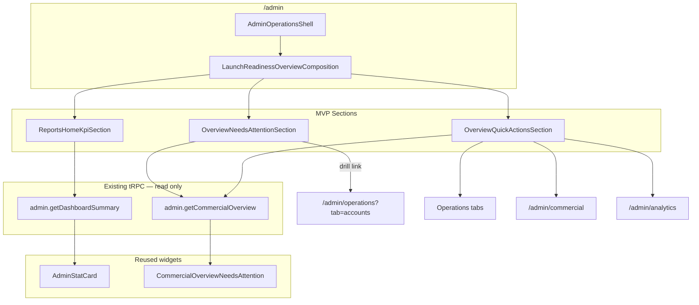

# Overview Command Center — MVP Architecture & UX Plan

**Project:** MineuQR  
**Program:** ADMIN-DASHBOARD-UX-REFINE-1 (Command Center evolution)  
**Mode:** Planning only — no implementation, no code changes, no UI mockups  
**Date:** 2026-06-07  
**Authority:** `OVERVIEW-COMMAND-CENTER-DISCOVERY.md`  
**Related:** `OPERATIONS-EXPERIENCE-AUDIT.md`, `EXEC-7C.1-COMMERCIAL-OVERVIEW-DATA-CONTRACT.md`, `ADMIN-DASHBOARD-REBUILD-5BD.md`

---

## Executive Summary

MVP transforms `/admin` from a **navigation hub** (KPI strip + shortcut grids) into a **minimal command center** using **only existing read APIs and routes**. Three content blocks replace two navigation sections. No new backend contracts, no hub CRUD, no search bar.

| Today | MVP |
|-------|-----|
| KPI strip → Featured shortcuts → All sections grid | Executive snapshot → Needs attention → Quick actions |
| Passive link cards | Counted, drill-linked attention + intent actions |
| `getDashboardSummary` only | `getDashboardSummary` + `getCommercialOverview` |
| Static status legend in header | Header legend removed or demoted (non-live) |

---

## 1. Final Section Structure

### Page composition tree (MVP)

```
/admin — AdminDashboardHome
└── AdminOperationsShell (compact, max-w-7xl — unchanged)
    └── OverviewDashboardSections
        └── LaunchReadinessOverviewComposition  [composition host — content replaced]
            └── div.opsWorkspace
                ├── [1] Executive Snapshot      — Reports domain
                ├── [2] Needs Attention           — Customer Success domain
                └── [3] Quick Actions             — Cross-domain (composition-level)
```

### Section specifications

#### Section 1 — Executive Snapshot

| Attribute | Value |
|-----------|-------|
| **Domain owner** | Reports |
| **Purpose** | Answer: “Is the business healthy right now?” |
| **Position** | First content block; above the fold |
| **Shell** | `AdminPageSection` — `spacing="tight"`, no visible H2 (aria-label only, per UXR-1C) |
| **Content** | Five KPI tiles in one grid |

**KPI set (MVP — replaces current strip):**

| # | Metric | Authority | Source field |
|---|--------|-----------|--------------|
| 1 | Estimated MRR (USD) | Canonical | `getDashboardSummary.mrr` |
| 2 | Active subscriptions | Canonical | `getDashboardSummary.activeSubscriptions` |
| 3 | Active trials | Canonical | `getDashboardSummary.activeTrials` *(in API today; not rendered)* |
| 4 | Expiring within 30 days | Canonical | `getDashboardSummary.expiringAccounts` |
| 5 | Total users | Operational | `getDashboardSummary.totalUsers` |

**Demoted from hero strip:** Active restaurants — valid operational signal but not in MVP Tier A set; available on Commercial/Analytics. Do not show as sixth hero KPI in MVP.

**Operational subline (optional within section):** Single muted line below grid: active restaurants count with `statOperational` label — only if space allows without reintroducing six-tile fragmentation. **Default MVP:** omit subline; keep five-tile strip clean.

---

#### Section 2 — Needs Attention

| Attribute | Value |
|-----------|-------|
| **Domain owner** | Customer Success |
| **Purpose** | Answer: “What needs my attention?” |
| **Position** | Primary body; second block |
| **Shell** | `AdminSection` `density="console"` with title + short description (reuse Commercial copy keys) |
| **Content** | Three attention counts in alert-weighted cards |

| Queue | Field | Severity | MVP drill target |
|-------|-------|----------|------------------|
| Expiring within 30 days | `needsAttention.expiringWithin30Days` | High | `/admin/operations?tab=accounts` |
| Canceled accounts | `needsAttention.canceledAccounts` | Medium | `/admin/operations?tab=accounts` |
| Expired accounts | `needsAttention.expiredAccounts` | High | `/admin/operations?tab=accounts` |

**MVP interaction:** Each card is a **link** (or link-wrapped card) to Accounts workspace. Filtered deep links (`?attention=expiring`) are **Phase 2** — MVP uses tab-level drill only.

**Zero state:** When all three counts are `0`, show calm empty state (“No accounts requiring attention”) — not hidden section.

**Excluded:** `graceAccounts`, `suspendedAccounts` (null in contract).

---

#### Section 3 — Quick Actions

| Attribute | Value |
|-----------|-------|
| **Domain owner** | Composition / Launch Readiness host (cross-domain intents) |
| **Purpose** | Answer: “Where do I go to act?” |
| **Position** | Third block; replaces featured + all-sections grids |
| **Shell** | `AdminPageSection` `titleVariant="compact"` |
| **Content** | Five pinned operator intents |

| Action | Label source | Target | Count (MVP) |
|--------|--------------|--------|-------------|
| Accounts | `admin.nav.operations` / accounts tab | `operationsTabHref("accounts")` | `executive.commercialSubscribers` from `getCommercialOverview` *(entitled owners — honest proxy)* |
| Tenants | `admin.operations.tabTenants` | `operationsTabHref("tenants")` | `listRestaurants` item count *(optional second query)* |
| Announcement | `admin.operations.tabCommunications` | `operationsTabHref("communications")` | Same owner count or omit |
| Commercial | `admin.nav.commercial` | `/admin/commercial` | None |
| Analytics | `admin.nav.analytics` | `/admin/analytics` | None |

**Design intent:** Actions are **intent rows** (icon + label + optional count + arrow), not description-heavy nav cards. Visually closer to Operations list rows than current `NavShortcutCard` tiles.

**Count policy:** Show counts only where data is already loaded or cheaply shared:
- **Required:** Accounts count via `getCommercialOverview.executive.commercialSubscribers` (same query as attention).
- **Optional MVP:** Tenants count via `admin.listRestaurants` — defer if avoiding extra query; use label-only row.
- **No fake counts** for Commercial or Analytics.

---

### Header chrome (Level 0)

| Element | MVP decision |
|---------|--------------|
| `AdminOperationsShell` title + breadcrumbs | Unchanged |
| `ReportsStatusIndicator compact` in `headerActions` | **Remove** — static legend (active/trial/grace) is not live state; violates P5/P6 from discovery |
| Page subtitle | Remains omitted (UXR-1C) |

---

### Explicitly excluded from MVP

| Section | Phase |
|---------|-------|
| Subscription health strip | Phase 2 |
| Priority work queue (row-level) | Phase 2 |
| Platform scale panel | Phase 2 |
| Global search toolbar | Phase 2 |
| Security / Health / Launch Readiness summaries | Mature |
| Recent activity feed | Mature |
| “All sections” / sidebar replay | **Removed permanently from hub** |

---

## 2. Existing Components That Can Be Reused

### Shell & routing (no changes)

| Component | Path | Role in MVP |
|-----------|------|-------------|
| `AdminDashboardHome` | `pages/admin/AdminDashboardHome.tsx` | Page host; remove `headerActions` status legend |
| `AdminOperationsShell` | `components/admin/layout/AdminOperationsShell.tsx` | Outer shell |
| `OverviewDashboardSections` | `components/admin/sections/overview/OverviewDashboardSections.tsx` | Body entry point |
| `LaunchReadinessOverviewComposition` | `components/admin/domains/launch-readiness/LaunchReadinessOverviewComposition.tsx` | Composition host — **rewire children only** |

### Layout primitives

| Component | Path | Role in MVP |
|-----------|------|-------------|
| `AdminPageSection` | `components/admin/sections/AdminPageSection.tsx` | Executive snapshot + quick actions wrapper |
| `AdminSection` | `components/admin/layout/AdminSection.tsx` | Needs attention section header |
| `AdminStatCard` | `components/admin/layout/AdminStatCard.tsx` | Executive KPI tiles |
| `adminDash.opsWorkspace` | `adminDashStyles.ts` | Vertical rhythm between sections |

### Reports domain (executive snapshot)

| Component | Path | Role in MVP |
|-----------|------|-------------|
| `ReportsHomeKpiSection` | `components/admin/domains/reports/ReportsHomeKpiSection.tsx` | **Extend** — swap KPI set, add `activeTrials` |
| `mapDashboardSummaryToKPIs` | `lib/admin/dashboardSummaryKpis.ts` | **Extend** — map `activeTrials` from summary |
| `PageDataLoading` | `components/AuthGate.tsx` | KPI loading state |

### Customer Success domain (needs attention)

| Component | Path | Role in MVP |
|-----------|------|-------------|
| `CommercialOverviewNeedsAttention` | `components/admin/commercial/CommercialOverviewNeedsAttention.tsx` | **Extend** — add drill `href` per card |
| `CustomerSuccessAttentionSection` | `components/admin/domains/customer-success/CustomerSuccessAttentionSection.tsx` | **Pattern reference** — same widget + `AdminSection` shell |
| `useReportsCommercialOverviewData` | `components/admin/domains/reports/useReportsCommercialOverviewData.ts` | Attention labels, hints, query |
| `useCustomerSuccessCommercialData` | Re-export of above | CS domain import path |

### Operations routing

| Utility | Path | Role in MVP |
|---------|------|-------------|
| `operationsTabHref` | `pages/admin/operations/operationsTab.ts` | Quick action + attention drill URLs |

### i18n (reuse existing keys)

| Key group | Usage |
|-----------|-------|
| `admin.commercial.attention.*` | Attention section title + card labels |
| `admin.expiringSoonHint` | Expiring card hint |
| `admin.estimatedMrr*`, `admin.activeSubscriptions`, `admin.totalUsers` | KPI labels |
| `admin.nav.*` | Quick action labels |
| `subscription.status.*` | Trial label for active trials KPI |

---

## 3. Components That Should Be Removed

### Remove from MVP composition (stop rendering)

| Component | Path | Reason |
|-----------|------|--------|
| `OverviewFeaturedShortcutsSection` | `sections/overview/OverviewFeaturedShortcutsSection.tsx` | Replaced by Quick Actions |
| `OverviewAllSectionsSection` | `sections/overview/OverviewAllSectionsSection.tsx` | Sidebar duplication — discovery §8 |
| `ReportsStatusIndicator` (from overview header) | `domains/reports/ReportsStatusIndicator.tsx` | Static legend, not live evidence |

### Do not delete files in MVP (deprecation only)

| Component | Disposition |
|-----------|-------------|
| `OverviewFeaturedShortcutsSection` | Retain file; remove from composition; mark `@deprecated` in JSDoc |
| `OverviewAllSectionsSection` | Retain file; remove from composition; mark `@deprecated` |
| `NavShortcutCard` | Retain for registry/launch-readiness asset `nav-shortcut-card`; unused by hub after MVP |
| `OverviewWelcomeSection` | Already unmounted; remain for registry exports |
| `OverviewKpiSection` / `OverviewStatusIndicator` | Deprecated re-exports — unchanged |

### Remove from domain registries (metadata update at implementation time)

| Registry entry | Change |
|----------------|--------|
| `launchReadinessDomain` — shortcut / all-sections assets | Update `surfaces` from `overview` to `deprecated` or remove |
| `customerSuccessDomain` — `needs-attention` | Add `overview` surface |
| `reportsDomain` — `home-kpi-strip` | Update KPI contract note |

---

## 4. Data Sources Already Available Today

### Primary queries (MVP required)

| Procedure | Returns (MVP fields) | Used by |
|-----------|---------------------|---------|
| `admin.getDashboardSummary` | `mrr`, `activeSubscriptions`, `activeTrials`, `expiringAccounts`, `totalUsers`, `metricsSource` | Executive Snapshot |
| `admin.getCommercialOverview` | `needsAttention.{expiringWithin30Days, canceledAccounts, expiredAccounts}`, `executive.commercialSubscribers` | Needs Attention + Accounts quick-action count |

**Query strategy:** Two parallel read queries on hub load — same pattern as Commercial page (which already calls `getCommercialOverview`). React Query cache deduplicates if user navigates Overview → Commercial.

**Authority invariant:** No client-side metric derivation beyond `mapDashboardSummaryToKPIs` field mapping. Attention counts consumed as server-assembled snapshot.

### Optional query (MVP — tenants count only)

| Procedure | Returns | Used by |
|-----------|---------|---------|
| `admin.listRestaurants` | `items.length` | Quick Actions tenants row count |

**Recommendation:** Omit in MVP to minimize hub query fan-out; add in Phase 2 with quick actions polish.

### Available but not used in MVP

| Procedure | Why deferred |
|-----------|--------------|
| `admin.getOwnerOverviewList` | Phase 2 priority queue + search |
| `admin.getCommercialAnalytics` | Analytics page only |
| `admin.getExtendedStats` | Platform inventory — Phase 2 scale panel |
| `analytics.*` | Orphaned parallel authority path; not needed |

### Field availability matrix

| Signal | `getDashboardSummary` | `getCommercialOverview` | MVP surface |
|--------|----------------------|-------------------------|-------------|
| MRR | ✅ | ✅ `executive.mrr` | Snapshot (prefer summary — Reports ownership) |
| Active subscriptions | ✅ | ✅ | Snapshot |
| Active trials | ✅ | ✅ `executive.activeTrials` | Snapshot |
| Expiring 30d | ✅ | ✅ `needsAttention` | Snapshot + Attention |
| Total users | ✅ | ✅ `executive.totalUsers` | Snapshot |
| Canceled / expired | — | ✅ `needsAttention` | Attention only |
| Commercial subscribers | — | ✅ `executive.commercialSubscribers` | Quick action count |
| Subscription health buckets | — | ✅ `subscriptionHealth` | Phase 2 |
| Grace / suspended | — | `null` | **Never** |
| Recent activity | — | `available: false` | Mature |

---

## 5. New Components Required

MVP requires **thin composition sections** and **minimal extensions** to existing widgets — not a parallel component tree.

### New section components

| Component | Proposed path | Domain | Responsibility |
|-----------|---------------|--------|----------------|
| `OverviewNeedsAttentionSection` | `components/admin/domains/customer-success/OverviewNeedsAttentionSection.tsx` | Customer Success | `AdminSection` + `CommercialOverviewNeedsAttention` + drill links |
| `OverviewQuickActionsSection` | `components/admin/sections/overview/OverviewQuickActionsSection.tsx` | Composition | Five intent rows with `operationsTabHref` + optional counts |

**Naming note:** `OverviewNeedsAttentionSection` lives in CS domain (attention asset owner). Quick Actions stays in `sections/overview` as cross-domain composition glue.

### Extensions to existing components (not new files — listed for planning clarity)

| Target | Extension |
|--------|-----------|
| `CommercialOverviewNeedsAttention` | Add optional `drillHref: Record<AttentionKey, string>` or wrap cards in `Link` from parent |
| `ReportsHomeKpiSection` | Replace KPI column set; add `activeTrials` card; reorder per §1 |
| `mapDashboardSummaryToKPIs` | Add `activeTrials: summary?.activeTrials ?? 0` |
| `LaunchReadinessOverviewComposition` | Replace children: `kpiSlot` + `OverviewNeedsAttentionSection` + `OverviewQuickActionsSection` |

### New presentation primitive (optional)

| Component | Proposed path | When |
|-----------|---------------|------|
| `OverviewQuickActionRow` | `sections/overview/OverviewQuickActionRow.tsx` | If quick actions need shared row markup (icon, label, count badge, arrow) |

**Alternative:** Inline rows in `OverviewQuickActionsSection` without extracting row primitive — acceptable for MVP scope.

### New i18n keys (planning estimate)

| Key | Purpose |
|-----|---------|
| `admin.commandCenter.attentionEmpty` | Zero-state copy for attention section |
| `admin.commandCenter.quickActions` | Section title |
| `admin.commandCenter.activeTrials` | KPI label (if no existing key) |
| `admin.commandCenter.accountsCount` | Optional screen-reader label for count badge |

Reuse existing keys wherever possible before adding new ones.

### Domain registry updates (metadata only)

| Asset ID | Owner | New surface |
|----------|-------|-------------|
| `overview-needs-attention` | Customer Success | `overview` |
| `overview-quick-actions` | Launch Readiness / composition | `overview` |
| `home-kpi-strip` | Reports | `overview` (updated KPI contract) |

---

## 6. Migration Path from Current Overview

### Current state (baseline)

```
LaunchReadinessOverviewComposition
├── ReportsHomeKpiSection          (getDashboardSummary — 5 KPIs, no trials)
├── OverviewFeaturedShortcutsSection   (3 NavShortcutCards)
└── OverviewAllSectionsSection         (9 NavShortcutCards)

AdminDashboardHome headerActions: ReportsStatusIndicator compact
```

### Target state (MVP)

```
LaunchReadinessOverviewComposition
├── ReportsHomeKpiSection              (extended KPI set)
├── OverviewNeedsAttentionSection      (getCommercialOverview)
└── OverviewQuickActionsSection        (links + optional counts)

AdminDashboardHome: no headerActions status legend
```

### Migration phases

#### Phase A — Data layer readiness (no visible UX change)

1. Extend `mapDashboardSummaryToKPIs` with `activeTrials`.
2. Verify `getDashboardSummary` and `getCommercialOverview` align on shared fields (existing `exec7c2CommercialOverview.test.ts` coverage).
3. Add `drillHref` contract to `CommercialOverviewNeedsAttention` design (props interface only in planning; implemented in Phase B).

#### Phase B — Composition swap

1. Create `OverviewNeedsAttentionSection` — wire `useCustomerSuccessCommercialData`, reuse `CommercialOverviewNeedsAttention`.
2. Create `OverviewQuickActionsSection` — static route map + `commercialSubscribers` count.
3. Update `LaunchReadinessOverviewComposition` — remove featured + all-sections; insert new sections in hierarchy order.
4. Update `OverviewDashboardSections` JSDoc to reference Command Center MVP.

#### Phase C — Executive snapshot alignment

1. Update `ReportsHomeKpiSection` KPI order and icons:
   - MRR → Active subs → Active trials → Expiring → Total users
2. Remove `activeRestaurants` from hero grid (or move to optional subline).
3. Confirm grid column strategy (`grid-cols-1 lg:grid-cols-5` per grid optimization audit).

#### Phase D — Header cleanup

1. Remove `headerActions={<ReportsStatusIndicator compact />}` from `AdminDashboardHome`.
2. Retain `ReportsStatusIndicator` component for potential Phase 2 live health binding.

#### Phase E — Deprecation & registry

1. Mark `OverviewFeaturedShortcutsSection`, `OverviewAllSectionsSection` deprecated.
2. Update `launchReadinessDomain`, `customerSuccessDomain`, `reportsDomain` asset surfaces.
3. Update `OVERVIEW-COMMAND-CENTER-DISCOVERY.md` cross-reference with implementation completion doc (future).

#### Phase F — Validation

| Check | Expected |
|-------|----------|
| Overview loads with 3 sections only | No nav grids |
| Attention cards link to Accounts tab | Drill works |
| Quick actions link to correct routes | 5 targets |
| KPI strip shows active trials | Field from summary API |
| Commercial page unchanged | Shared query cache OK |
| No grace/suspended counts | Contract honored |
| `npm run check` + admin tests | Pass |

### Rollback strategy

Revert `LaunchReadinessOverviewComposition` children to previous three-section hub layout. No API changes — rollback is composition-only.

### Risk register

| Risk | Mitigation |
|------|------------|
| Dual query load on hub | Acceptable — same as Commercial; React Query cache |
| Attention cards not clickable today | Required extension to `CommercialOverviewNeedsAttention` |
| `activeTrials` not in KPI mapper | Extend `dashboardSummaryKpis.ts` |
| CS attention duplicated on Commercial + Overview | Intentional for MVP — Commercial remains deep reporting; dedupe hosting in Phase 2 per REBUILD-5BD |
| Tenants count requires extra query | Defer to Phase 2 |

---

## Architecture Diagram (MVP)



---

## Domain Ownership After MVP

| Domain | Overview responsibility |
|--------|-------------------------|
| **Reports** | Executive snapshot KPI strip (`getDashboardSummary`) |
| **Customer Success** | Needs attention section (`getCommercialOverview.needsAttention`) |
| **Launch Readiness** | Composition host (`LaunchReadinessOverviewComposition`) |
| **Security** | None on hub (governance stays in Accounts workspace) |
| **Health** | None on hub |
| **Commercial** | Drill target only; executive/attention widgets remain on Commercial page until Phase 2 relocation |

---

## MVP Success Criteria (Experiential)

| Criterion | Validation |
|-----------|------------|
| Operator names top attention queue within 5 seconds | Usability check |
| No navigation-only grids below KPIs | Visual / DOM audit |
| Page reads “what’s happening” not “where can I go” | UX review vs `OPERATIONS-EXPERIENCE-AUDIT.md` |
| All metrics are canonical or labeled operational | Data contract review |
| No new backend procedures | API inventory |

---

## Phase 2 Preview (out of MVP scope)

For planning continuity only — not part of this implementation plan:

- `CommercialOverviewSubscriptionHealth` on hub
- Priority work queue from `getOwnerOverviewList`
- Attention filter deep links on Accounts tab
- Relocate CS attention/health hosting from Commercial to hub-primary
- Global owner search toolbar
- Live header status from `subscriptionHealth` buckets

---

## Related Documents

| Document | Role |
|----------|------|
| `OVERVIEW-COMMAND-CENTER-DISCOVERY.md` | Product authority for MVP scope |
| `OPERATIONS-EXPERIENCE-AUDIT.md` | UX rhythm target (count → drill → act) |
| `EXEC-7C.1-COMMERCIAL-OVERVIEW-DATA-CONTRACT.md` | Metric inclusion/exclusion rules |
| `ADMIN-DASHBOARD-REBUILD-5BD.md` | Phase 2 CS widget relocation |
| `OVERVIEW-REPORTS-LAYOUT-AUDIT.md` | Shell context (unchanged for MVP) |

---

## Summary Checklist

| # | Plan item | Answer |
|---|-----------|--------|
| 1 | Final section structure | Executive Snapshot → Needs Attention → Quick Actions |
| 2 | Reuse | Shell, `ReportsHomeKpiSection`, `CommercialOverviewNeedsAttention`, `AdminSection`, data hooks |
| 3 | Remove | Featured shortcuts, all sections grid, header status legend |
| 4 | Data today | `getDashboardSummary` + `getCommercialOverview` |
| 5 | New components | `OverviewNeedsAttentionSection`, `OverviewQuickActionsSection`, attention drill extension |
| 6 | Migration | Composition swap in 6 phases; no API changes; composition-only rollback |

---

*Planning only. No implementation. No code changes. No mockups.*
