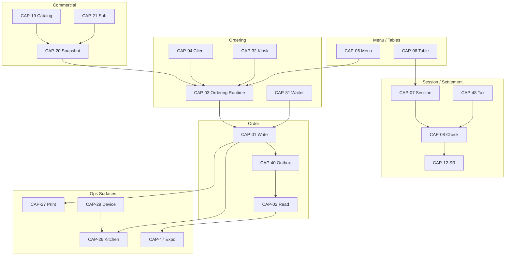

# Capability Relationship Graph

**Program:** CAPABILITY-DISCOVERY-PLATFORM-RECONSTRUCTION-1  
**Rule:** Relationships supported by code/ADR evidence only. Types: Requires · Extends · Optional · Depends On · Consumes · Provides.

---

## Legend

| Type | Meaning |
|------|---------|
| **Requires** | Hard dependency to function |
| **Depends On** | Soft/config dependency |
| **Consumes** | Reads events/APIs from provider |
| **Provides** | Emits events/APIs used by others |
| **Extends** | Specialization of parent capability |
| **Optional** | Enhances when present |

---

## Core operating graph (evidence)

```
CAP-05 Menu ──Provides──► CAP-03 Ordering ──Requires──► CAP-01 Order Write
CAP-06 Table ──Optional──► CAP-07 Session ──Requires──► CAP-08 Check
CAP-01 ──Provides──► CAP-40 Outbox ──Provides──► consumers
CAP-01 ──Provides──► CAP-02 Read
CAP-08 ──Extends──► CAP-09 / CAP-10 / CAP-11 / CAP-13
CAP-08 ──Provides──► CAP-12 Settlement Record
CAP-12 ──Consumes──► CAP-16 attribution (fail-open)
CAP-01 ──Consumes──► CAP-27 Printing (auto-dispatch)
CAP-02/01 ──Consumes──► CAP-26 Kitchen / CAP-47 Expo
CAP-28 Realtime ──Optional──► CAP-26 / CAP-47 / CAP-02 tracking
CAP-29 Device ──Requires──► CAP-30 Screen pairing
CAP-20 Entitlements ──Provides──► CAP-03 guest gate (ordering)
CAP-19 Catalog ──Provides──► CAP-20 Snapshot definitions
CAP-21 Subscription ──Requires──► CAP-19 / CAP-23
CAP-48 Tax ──Provides──► CAP-08 snapshot capture
```

---

## Relationship matrix (selected edges with evidence)

| From | Type | To | Evidence |
|------|------|----|----------|
| CAP-03 | Requires | CAP-01 | Place order services |
| CAP-03 | Requires | CAP-05 | Menu facts in runtime |
| CAP-03 | Depends On | CAP-20 | `guestOrderingAuthority` → `hasFeature("ordering")` |
| CAP-04 | Requires | CAP-03 | Client hosts runtime |
| CAP-07 | Depends On | CAP-06 | Table-anchored sessions |
| CAP-08 | Requires | CAP-07 | Check under session (dine-in path) |
| CAP-08 | Depends On | CAP-48 | `taxPolicySnapshot` on Check |
| CAP-09 | Extends | CAP-08 | Order settlement under Check |
| CAP-10 | Extends | CAP-08 | Split under Check |
| CAP-11 | Extends | CAP-08 | Allocation under Check |
| CAP-12 | Requires | CAP-08 | Check publishes SR |
| CAP-13 | Requires | CAP-08 | Refund façade on Check |
| CAP-13 | Optional | CAP-16 | Register attribution fail-open |
| CAP-16 | Consumes | CAP-12 | Settlement attribution hooks |
| CAP-17 | Requires | CAP-16 | Shift on Register |
| CAP-20 | Requires | CAP-19 | Snapshot from catalog definitions |
| CAP-20 | Requires | CAP-21 | Binding to subscription |
| CAP-21 | Requires | CAP-23 | Checkout providers |
| CAP-22 | Consumes | CAP-12 | Net / settlement publications |
| CAP-22 | Consumes | CAP-01 | Order sales facts |
| CAP-26 | Consumes | CAP-01/02 | Queue from order facts |
| CAP-27 | Consumes | CAP-01 | Order print dispatch adapter |
| CAP-27 | Depends On | CAP-29 | Connector/device topology |
| CAP-28 | Provides | CAP-26/47 | Kitchen/Expo realtime tickets |
| CAP-30 | Requires | CAP-29 | Devices registry |
| CAP-31 | Requires | CAP-01 | `order.placeAsWaiter` |
| CAP-31 | Requires | CAP-07 | Attach table → session |
| CAP-32 | Requires | CAP-03/04 | Kiosk channel |
| CAP-33 | Requires | CAP-01 | Staff settle APIs |
| CAP-33 | Depends On | CAP-16 | Register/shift settle context |
| CAP-34 | Consumes | CAP-01 | OrderReady → push |
| CAP-40 | Requires | CAP-01 | Outbox on order path |
| CAP-41 | Provides | CAP-05 | Image uploads |
| CAP-43 | Consumes | CAP-21 | SaaS metrics |
| CAP-46 | Consumes | CAP-01 | Lifecycle stages |
| CAP-47 | Extends | CAP-26 | Shared panel; Ready exclusivity |
| CAP-47 | Optional | CAP-28 | Expo realtime channel |

---

## Mermaid (overview)



No inferred edges without file/ADR evidence are listed.
