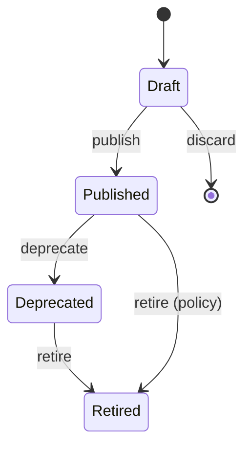

# Lifecycle & State Machines

**Program:** COMMERCIAL-CATALOG-PLATFORM-ARCHITECTURE-1  
**Status:** Architecture only  
**Date:** 2026-07-29

---

## 1. Plan Version lifecycle

```
Draft
  → Published
    → Deprecated
      → Retired
```

| State | Meaning |
|-------|---------|
| **Draft** | Editable commercial composition; not sellable |
| **Published** | Immutable; may accept new subscriptions |
| **Deprecated** | Immutable; may still accept **renewals** of existing; typically no (or limited) new acquisitions |
| **Retired** | Immutable; **cannot** accept new subscriptions; renewals per Retirement Policy |
| Historical | Always readable (**CC-10**, **CC-11**) |

**CC-02:** Published (and later) versions are immutable.  
**CC-10:** Retirement never deletes history.

---

## 2. State machine (Plan Version)



| Transition | Guard |
|------------|-------|
| Draft → Published | **Publication Validation Gate (CC-16)** — all mandatory components valid; then ids frozen |
| Draft → Published (fail) | Incomplete pricing, cycle, feature bundle, limit profile, migration policy, or retirement policy |
| * → mutate features/prices on Published | **Forbidden** |
| Published → Deprecated | Admin policy |
| Deprecated → Retired | Admin policy |
| Retired → Published | **Forbidden** — publish a new Version instead |

---

## 2.1 Publication Validation Gate (**CC-16**)

A Plan Version **MUST NOT** leave Draft for Published unless validation passes.

### Mandatory (fail closed)

| Component | Required |
|-----------|----------|
| Pricing exists | ✓ |
| Billing Cycle exists | ✓ |
| Feature Bundle exists | ✓ |
| Limit Profile exists | ✓ |
| Migration Policy defined | ✓ |
| Retirement Policy defined | ✓ |
| Version Compatibility declarations (**CC-14**) | ✓ (upgrade/downgrade targets + migration requirements + breaking changes) |
| Regional commercial readiness (**CC-15**) | ✓ when Version is marked for regional sale (at least one valid regional price) |

### Optional

Trial Policy · Promotion Eligibility  

**Purpose:** Prevent incomplete commercial products from reaching production.

```
Draft ──validate(CC-16)──► Published
              │
              └─ fail → remain Draft (errors surfaced to Admin)
```

---

## 3. Plan Identity lifecycle

Plan Identity is created once and remains. It may be **hidden** from storefront via presentation flags without deleting identity (**CC-01**).

---

## 4. Trial policy lifecycle (catalog template)

```
Draft → Active → Deprecated → Retired
```

Trial **templates** are Catalog-owned. Subscription instances hold trial **state** (Subscription Platform).

---

## 5. Lifecycle diagram (commercial change)

```
Admin edits Draft Version
        ↓
   Publish Version N
        ↓
  Customers subscribe → bind Version N
        ↓
  Admin needs change → Draft Version N+1 → Publish
        ↓
  Version N → Deprecated / Retired per policy
  Existing subs on N unchanged until Migration Policy applies
```

---

## 6. Historical readability

Deprecated and Retired versions remain queryable forever for:

- Subscription reconstruction  
- Invoice/report reproducibility  
- Audit and support  

No hard-delete of commercial contract identity.
