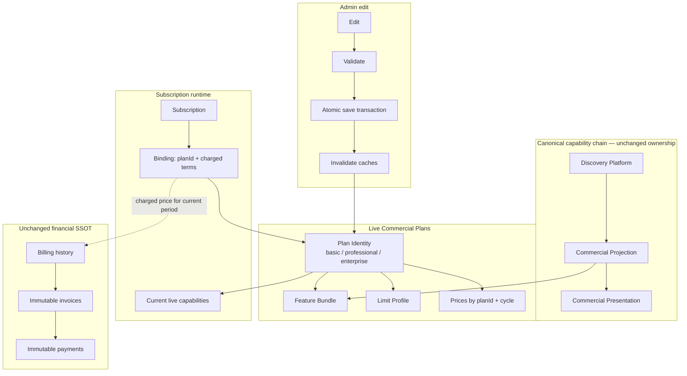

# FINAL-REPORT.md — COMMERCIAL-LIVE-PLANS-SIMPLIFICATION-1

**Date:** 2026-08-14  
**Verdict:** **SUPERSEDED** — Architecture Authority reviewed this implementation and issued **BLOCKED**. See [FINAL-ARCHITECTURE-DECISION.md](./FINAL-ARCHITECTURE-DECISION.md).

This file remains the implementation report only. It is not certification.

Architecture simplification is implemented: Versioned Commercial Catalog is replaced by Live Commercial Plans. No commit, push, or deploy was performed.

---

## 1. Architecture summary

A Plan is a live business entity. There is no draft / published / retired version layer, no publication pipeline, and no capability snapshot freeze for standard plans.

**Standard plans (only):** Basic · Professional · Enterprise (`basic` | `professional` | `enterprise`).

**Edit path:** Edit → Validate → Atomic Save Transaction (plan composition + prices) → Cache invalidation → runtime immediately sees the updated plan. Partial updates are rolled back in memory if validation or persistence fails.

**Runtime capabilities:** Subscription → Current Plan → Current Capabilities.

**Pricing:** The current billing period keeps the charged amount stored on the catalog-owned subscription binding. Renewal / upgrade / trial bind recaptures the **current published price**. Invoices and payment records are unchanged.

**SSOT chain (unchanged ownership):** Discovery → Projection → Presentation. Plans remain capability filters over Projection.

---

## 2. Removed components

| Removed | Replacement |
|---------|-------------|
| Draft / Published / Retired version lifecycle | Live plan identity + `isHidden` |
| Version publication pipeline (`CatalogPublishingService`, overlays) | `PlanService.saveLive` |
| Bootstrap-as-publication | Bootstrap seeds three live plans from Projection; never publishes |
| Catalog version state machine | `STANDARD_LIVE_PLAN_CODES` + live save validation |
| `PlanVersionService`, `PublicationService`, `CommercialSnapshotService` | Live plan + feature bundle + limit profile |
| Snapshot entitlement freeze | `resolveLivePlanCapabilities` / `resolveEntitlementsFromLivePlan` |
| Versioning APIs (`createVersion`, `publishVersion`, snapshots, retirement policies) | `saveLivePlan`, `validatePlanSave` |
| Versioning UI (publish/deprecate/retire/clone-version) | Live plan editor |
| Versioning tables (`commercial_plan_versions`, snapshots, publication rules, retirement policies) | Composition columns on `commercial_plans`; prices/bindings by `planId` |

Financial, invoice, payment, subscription instance, Discovery, and Projection platforms were not removed.

---

## 3. Simplified flows

### Plan edit

```
Admin Edit
  → validateLivePlanSave (pricing, cycle, bundle, limits)
  → atomic persist (plan row + replace prices in one transaction)
  → invalidate public catalog cache + entitlement cache
  → public catalog and runtime read the live definition
```

### Capability resolution

```
Subscription
  → commercial_subscription_bindings.planId
  → live commercial_plans composition
  → current feature bundle + limit profile
```

Unbound subscriptions still use the Legacy Bridge only (no overlay).

### Pricing / renewal

```
Current period: binding.chargedAmount / chargedCurrency / billingCycle* (immutable for the period)
Renewal / plan change: re-bind using current plan price
Invoices: unchanged, immutable
```

---

## 4. Risk assessment

| Risk | Severity | Mitigation |
|------|----------|------------|
| Migration `0086` drops versioning tables after backfill | High (ops) | Historical `0084`/`0085` retained. Apply `0086` only after Architecture Authority review. Bindings with no resolvable `planId` are deleted then `planId` is NOT NULL. |
| Immediate capability rollout to all subscribers | Accepted (policy) | Approved Architecture Authority rule — not a defect. |
| Price edit leaking into the current period | Medium | Charged terms live on the binding; plan price edits do not rewrite them. Renewal recaptures current price. |
| Partial plan+price save | Medium | `saveLive` snapshots plan + prices, validates, persists; restores both on validation or persist failure. |
| Residual naming (`snapshotLoader.ts`, error code `publication_validation_failed`) | Low | Behavior is live-plan; leftover identifiers are not a version lifecycle. |
| Locale leftovers (publish/deprecate copy unused by UI) | Low | New live-plan keys added; unused historical strings do not drive APIs. |

---

## 5. Runtime validation

Verified by architecture guards + service/runtime tests (not a production deploy):

| Criterion | Result |
|-----------|--------|
| Existing subscriptions still function | ✓ Bindings resolve by `planId`; unbound path remains Legacy Bridge |
| Renewals use current prices | ✓ Bind/renew captures current plan price into charged terms |
| Billing history unchanged | ✓ Invoice / payment models not modified |
| Invoice history unchanged | ✓ Invoice schema/APIs not modified |
| Live capabilities update immediately | ✓ Save invalidates entitlement + public catalog caches |
| No version lifecycle remains | ✓ No draft/published/retired state machine in catalog services |
| No publication pipeline remains | ✓ `catalogPublishingService.ts` and `publicationPersistence.ts` deleted |
| No dead versioning code remains | ✓ Version services/APIs/UI/tables removed from production paths |

Test runs in this implementation (representative):

- Live-plan catalog + operational + enforcement suites: **52 passed**
- Bootstrap / UI guards / audit / wave1 / adoption guards: **24 passed** (after leftover test rewrites)

---

## 6. Files modified

Admin UI, locales, Pricing, Drizzle journal/schema re-exports, bootstrap script, commercial catalog APIs, webhooks/trial/register, catalog store/services/bootstrap/adoption, subscription runtime, entitlements hub, plan limits, and shared catalog types/ownership/dashboard/visibility.

See git working tree (`81 files changed, +1911 / −8752` excluding new files) for the full modified set.

---

## 7. Files deleted

- `client/src/components/admin/platform-ops/commercial-catalog/useCatalogPublishingMutations.ts`
- `server/commercial-catalog/publishing/catalogPublishingService.ts`
- `server/commercial-catalog/publishing/publicationOverlay.ts`
- `server/commercial/snapshotRuntimeAuthority.ts`
- `server/services/commercial-catalog/publicationPersistence.ts`
- `shared/commercial-catalog/contracts/commercialSnapshot.ts`
- `shared/commercial-catalog/contracts/publicationValidation.ts`
- `shared/commercial-catalog/types/snapshot.ts`

## Files added

- `drizzle/0086_commercial_live_plans.sql`
- `server/services/commercial-catalog/livePlanPersistence.ts`
- `shared/commercial-catalog/contracts/planSaveValidation.ts`
- `shared/commercial-catalog/types/chargedTerms.ts`
- `docs/engineering/programs/COMMERCIAL-LIVE-PLANS-SIMPLIFICATION-1/00-PROGRAM-PACKAGE.md`
- `docs/engineering/programs/COMMERCIAL-LIVE-PLANS-SIMPLIFICATION-1/FINAL-REPORT.md`

---

## 8. Breaking changes

**Admin / catalog APIs**

- Removed: version CRUD, publish / approve / deprecate / retire / archive, snapshot capture, retirement policies, publication workflow queries.
- Added: `commercialCatalog.saveLivePlan`, `commercialCatalog.validatePlanSave`.
- Public catalog: offerings keyed by **`planId`** (not plan version id).

**Database**

- `commercial_prices.planId` replaces `planVersionId`.
- `commercial_subscription_bindings.planId` + charged-term columns replace `planVersionId` / `snapshotId`.
- Promotions: `eligiblePlanIds` replaces `eligiblePlanVersionIds`.
- Dropped: `commercial_plan_versions`, `commercial_snapshot_definitions`, `commercial_publication_rules`, `commercial_retirement_policies`.

**Runtime**

- Entitlement source is `live_plan` / `live_plan_fail_closed` (no snapshot freeze).
- Enforcement decision exposes `planId` instead of `snapshotId`.

**Not breaking (intentionally)**

- Invoice rows, payment records, subscription instance table, Discovery, Projection, Presentation, commercial permissions, security model.

---

## 9. Migration notes

1. Apply `drizzle/0086_commercial_live_plans.sql` only after review. It backfills live composition from the **published** version (fallback: any version), copies prices and bindings to `planId`, copies charged terms from snapshot JSON, then drops versioning structures.
2. Keep `0084` and `0085` in history; do not rewrite them.
3. After migrate: hydrate catalog from DB (existing durable hydrate path). Bootstrap remains idempotent for empty catalogs and seeds the three standard live plans from Projection.
4. Operators edit live plans in Platform Ops; there is no publish gate.
5. Existing customer subscriptions continue until expiration. Capability set follows the live plan immediately. Charged price for the open period stays on the binding until renewal.

---

## 10. Final Architecture Diagram



---

**STOP** — Do NOT commit · push · deploy. Await Architecture Authority review.
