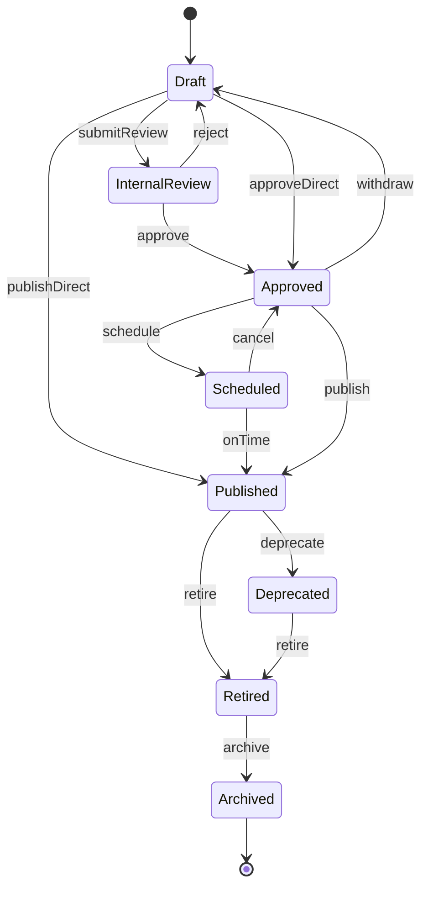
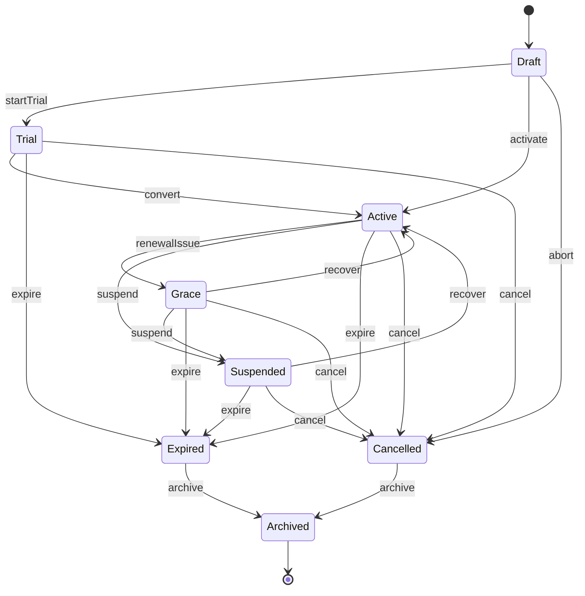

# COMMERCIAL PLAN STATE MACHINE

| Field | Value |
|-------|-------|
| **Program** | COMMERCIAL-PLAN-LIFECYCLE-EXPERIENCE-1 |
| **Date** | 2026-07-30 |
| **Amendment** | Revision 1 — Commercial Snapshot Invariant · **I-CPL-13** |
| **Role** | Canonical state machines (architecture) |

---

## 1. Plan Version state diagram (textual)

```
[*]
  → Draft
       ├─ submitReview → InternalReview
       │                    ├─ reject → Draft
       │                    └─ approve → Approved
       ├─ approveDirect → Approved
       └─ publishDirect → Published          [guard: CC-16]

  Approved
       ├─ schedule(effectiveAt) → Scheduled
       │                             ├─ cancel → Approved
       │                             └─ onTime → Published   [guard: CC-16]
       ├─ publish → Published                [guard: CC-16]
       └─ withdraw → Draft                   [audited]

  Published
       ├─ deprecate → Deprecated
       └─ retire → Retired

  Deprecated
       └─ retire → Retired

  Retired
       └─ archive → Archived

  Archived → [*]
```

---

## 2. Subscription Instance state diagram (textual)

```
[*]
  → Draft
       ├─ startTrial → Trial
       ├─ activate → Active
       └─ abort → Cancelled / Archived

  Trial
       ├─ convert → Active
       ├─ expire → Expired
       └─ cancel → Cancelled

  Active  ←──────────────┐
       ├─ renewalIssue → Grace
       │                    ├─ recover → Active
       │                    ├─ suspend → Suspended
       │                    ├─ expire → Expired
       │                    └─ cancel → Cancelled
       ├─ suspend → Suspended
       │               ├─ recover → Active
       │               ├─ expire → Expired
       │               └─ cancel → Cancelled
       ├─ expire → Expired
       └─ cancel → Cancelled

  Active (same state): upgrade / downgrade / migrate / admin replace / renew
       ├─ commercial definition unchanged (renew retain) → keep active Snapshot
       └─ commercial plan change → bind NEW Snapshot; preserve historical Snapshot (I-CPL-13)

  Expired / Cancelled → Archived → [*]
```

**Grandfathered:** overlay on Trial|Active|Grace when Snapshot.version ∈ {Deprecated, Retired}.

---

## 3. Commands (by plane)

### Catalog — Plan Version

| Command | Effect |
|---------|--------|
| `CreatePlanVersion` | → Draft |
| `UpdateDraftComposition` | Draft only |
| `SubmitForInternalReview` | Draft → InternalReview |
| `RejectReview` | InternalReview → Draft |
| `ApproveVersion` | InternalReview\|Draft → Approved |
| `WithdrawApproval` | Approved → Draft |
| `SchedulePublish` | Approved → Scheduled |
| `CancelSchedule` | Scheduled → Approved |
| `PublishPlanVersion` | Draft\|Approved\|Scheduled → Published |
| `DeprecatePlanVersion` | Published → Deprecated |
| `RetirePlanVersion` | Published\|Deprecated → Retired |
| `ArchivePlanVersion` | Retired → Archived |

### Subscription

| Command | Effect |
|---------|--------|
| `CreateSubscriptionDraft` | → Draft |
| `ActivateTrial` | Draft → Trial + Snapshot bind |
| `ActivatePaid` | Draft\|Trial → Active + Snapshot |
| `UpgradePlan` | Active + new Snapshot (upgrade) |
| `DowngradePlan` | Active + new Snapshot (downgrade) |
| `RenewSubscription` | Active\|Grace→Active; retain Snapshot if definition unchanged; else new Snapshot |
| `MigratePlan` | Active + new Snapshot (migration) |
| `ReplacePlanAdmin` | Active + new Snapshot (admin replacement) |
| `EnterGrace` | Active → Grace |
| `SuspendSubscription` | Active\|Grace → Suspended |
| `ResumeSubscription` | Suspended\|Grace → Active |
| `ExpireSubscription` | → Expired |
| `CancelSubscription` | → Cancelled |
| `ArchiveSubscription` | Expired\|Cancelled → Archived |

### Snapshot

| Command | Effect |
|---------|--------|
| `CaptureSnapshot` | Created from immutable Version (never from mutable Catalog Draft) |
| `BindSnapshot` | Bind to Subscription; **permanent immutability begins** |
| `ActivateSnapshot` | Exclusive entitlement authority for the active bind |
| `SupersedeSnapshot` | Create+bind **new** Snapshot as sole active; prior remains historical (never mutate/repoint) |

---

## 4. Events (architecture names)

### Catalog

`CommercialPlanVersionCreated` · `CommercialPlanVersionUpdated` · `CommercialPlanVersionSubmittedForReview` · `CommercialPlanVersionApproved` · `CommercialPlanVersionScheduled` · `CommercialPlanVersionPublished` · `CommercialPlanVersionDeprecated` · `CommercialPlanVersionRetired` · `CommercialPlanVersionArchived`

*(Maps to existing OPS `commercial_catalog_*` where present; review/schedule/archive are additive architecture events.)*

### Subscription / commercial experience

`CommercialPlanSelected` · `CommercialTrialActivated` · `CommercialSubscriptionActivated` · `CommercialUpgrade` · `CommercialDowngrade` · `CommercialRenewal` · `CommercialGraceEntered` · `CommercialSubscriptionSuspended` · `CommercialSubscriptionResumed` · `CommercialSubscriptionExpired` · `CommercialSubscriptionCancelled` · `CommercialGrandfatheredRecognized`

### Snapshot

`CommercialSnapshotCreated` · `CommercialSnapshotBound` · `CommercialSnapshotActivated` · `CommercialSnapshotResolved` · `CommercialUpgradeSnapshotCreated` · `CommercialDowngradeSnapshotCreated` · `CommercialRenewalSnapshotCreated`

---

## 5. Guards

| Guard | Applies | Rule |
|-------|---------|------|
| **G-CC16** | Publish | Publication Validation Gate pass |
| **G-IMM** | Any post-publish mutate | Deny composition mutation |
| **G-SEL** | New acquisition | Version state ∈ {Published} (default) |
| **G-REN** | Renew | Version not Archived; if Retired then `allowRenewals` |
| **G-UP** | Upgrade | Target ∈ CC-14 upgradeTargets |
| **G-DN** | Downgrade | Target ∈ CC-14 downgradeTargets |
| **G-SNAP** | Entitlement resolve | Bound active Snapshot exclusive; never Catalog |
| **G-SNAP-ID** | Plan change bind | Exactly one active Snapshot; new id on plan change (**I-CPL-13**) |
| **G-AUTH** | Catalog commands | Publishing/approval authority roles |
| **G-BILL** | Grace/Suspend from non-pay | Future Billing signal accepted by Subscription only |

---

## 6. Invariants

| ID | Invariant |
|----|-----------|
| **I-CPL-01** | Catalog Offering SM and Subscription Instance SM are distinct; no shared state enum |
| **I-CPL-02** | Published+ Plan Versions are immutable |
| **I-CPL-03** | Runtime entitlement never resolves from mutable Catalog data (Draft or otherwise) |
| **I-CPL-04** | Bound Snapshot is permanently immutable; commercial changes require a **new** Snapshot |
| **I-CPL-05** | Existing Subscriptions remain stable across Catalog Deprecate/Retire (Grandfathered mode) |
| **I-CPL-06** | Check/Order/Restaurant never own commercial plan states |
| **I-CPL-07** | AI consumes entitlements only (Snapshot-derived), never Catalog |
| **I-CPL-08** | Reporting consumes immutable Subscription/Snapshot facts, not live Catalog |
| **I-CPL-09** | Billing (future) emits signals; does not own Catalog or Snapshot schema |
| **I-CPL-10** | Retired → Published is illegal; successor Version required |
| **I-CPL-11** | Grandfathered is a mode, not a Catalog Version state |
| **I-CPL-12** | Cancelled/Expired → Active in-place is illegal without explicit reactivation product path |
| **I-CPL-13** | **Snapshot Identity** — Subscription has exactly one **active** Snapshot; plan changes bind a newly created Snapshot; historical Snapshots immutable, preserved, never overwritten or repointed |

---

## 7. Illegal transitions (quick list)

- Published → Draft  
- Retired → Published  
- Archived → anything  
- Mutate Published prices/features  
- Entitlement from Draft Version  
- Mutate bound Snapshot  
- Reuse Snapshot after Commercial Plan definition change  
- Repoint / overwrite historical Snapshot  
- Entitlement resolve from Catalog while Snapshot bound  
- Two active Snapshots on one Subscription  

- Subscription state machine used as Catalog state  
- Catalog Deprecate used to Suspend tenant (wrong plane)  
- Billing writes Catalog Version state  

---

## 8. Mermaid (Plan Version)



## 9. Mermaid (Subscription)


