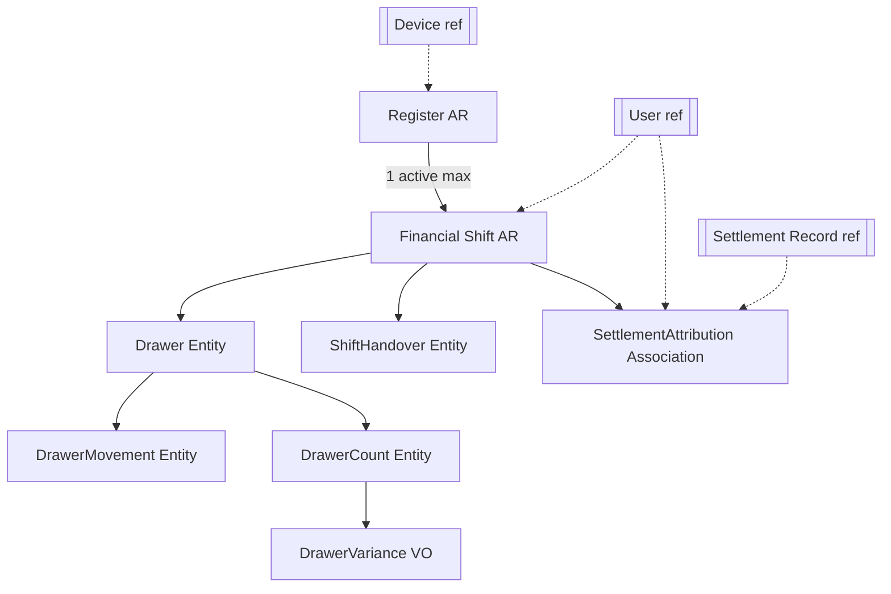

# CRMP-DOMAIN-DESIGN-1 — Domain Design Contracts

| Field | Value |
|---|---|
| **Program** | CRMP-DOMAIN-DESIGN-1 |
| **Date** | 2026-07-24 |
| **Mode** | Domain contracts only — **no implementation** |
| **Constitutional inputs (immutable)** | ADR-ARCH-020 · 022 · 026 · **028** |
| **Verdict** | **DOMAIN DESIGN CERTIFIED** |

> This document elaborates ADR-ARCH-028 into implementation-independent domain contracts.  
> It does **not** modify or reinterpret ADR-ARCH-020 / 022 / 026 / 028.  
> **No production implementation is authorized.**

---

## 1. Executive Summary

CRMP domain model consists of two Aggregate Roots — **Register** and **Financial Shift** — plus drawer custody entities, derived variance, handover, and **Settlement Attribution** (association referencing Settlement Record).

| Owns money? | Owns accountability? |
|-------------|----------------------|
| **Check** (unchanged) | **Financial Shift** (CRMP) |

Settlement Attribution proves operational custody linkage and **never owns money**.

**Drawer is an Entity** under Financial Shift (not a Value Object): it has shift-scoped identity and an append-only movement/count history that evolves over the shift lifetime.

No Cashier / Employee aggregates. Staff = User reference. Device = optional reference on Register.

**STOP condition:** Not triggered — no certified ADR change required.

---

## 2. Domain Overview

```
Restaurant
  └── Register* (AR)
        ├── status, optional deviceRef
        └── Financial Shift* (AR)  [at most one active per Register]
              ├── operatorUserRef
              ├── Drawer (Entity)
              │     ├── OpeningFloat (VO / initial movement)
              │     ├── DrawerMovement[] (Entity, append-only)
              │     └── DrawerCount[] → DrawerVariance (derived VO)
              ├── ShiftHandover? (Entity)
              └── SettlementAttribution[] (Association → Settlement Record)
```

\* Aggregate Roots.

External references (never owned): `User`, `OperationalDevice`, `SettlementRecord`.

---

## 3. Aggregate Contracts

### 3.1 Register (Aggregate Root)

| Aspect | Contract |
|--------|----------|
| **Mission** | Represent a restaurant’s operational financial station that hosts Financial Shifts. |
| **Identity** | `registerId` + `restaurantId` (tenant-scoped). Display name is presentation, not identity. |
| **Responsibilities** | Lifecycle of station availability; enforce single-active-shift rule at open; optional device binding reference; never custody math. |
| **Owned entities** | None required (Shifts are separate ARs referenced by `registerId`). |
| **Owned VOs** | `RegisterStatus` |
| **References** | `OperationalDeviceId?`, restaurant tenant |
| **Does not own** | Money, Settlement, Users, Devices, Shifts’ drawer facts (Shift AR owns those) |

#### Lifecycle / status

| Status | Meaning |
|--------|---------|
| `provisioned` | Created; cannot host shifts until activated |
| `active` | May open Financial Shifts |
| `inactive` | Must not open new Shifts; must have zero active Shifts |

```
provisioned → active ⇄ inactive
```

Terminal: none required (registers are long-lived). Soft-decommission = `inactive` forever.

#### Commands

| Command | Allowed when | Effect |
|---------|--------------|--------|
| `ProvisionRegister` | Restaurant scope | → `provisioned` |
| `ActivateRegister` | `provisioned` \| `inactive` | → `active` |
| `DeactivateRegister` | `active` **and** no active Shift | → `inactive` |
| `BindDevice` | any non-forbidden | Set/replace `deviceRef` (reference only) |
| `UnbindDevice` | bound | Clear `deviceRef`; historical shifts untouched |

#### Forbidden commands / behaviors

- Settle / attribute settlements  
- Open Shift when not `active`  
- Deactivate while active Shift exists  
- Own or transfer money  
- Delete historical shifts via register change  

#### Concurrency

- Register status changes optimistic-concurrency on Register version.  
- Opening a Shift is a **cross-aggregate** rule: Register must be `active` + no other Shift `open|handover_pending` for that `registerId` (enforced in application/domain service coordinating both ARs — still no money ownership).

#### Failure scenarios

| Failure | Expectation |
|---------|-------------|
| Deactivate with active Shift | Reject |
| Bind unknown device | Reject (reference integrity) |
| Duplicate display name | Policy optional; identity remains `registerId` |

---

### 3.2 Financial Shift (Aggregate Root)

| Aspect | Contract |
|--------|----------|
| **Mission** | Own operational financial **accountability** for one Register over a time window. |
| **Identity** | `financialShiftId` + `restaurantId` |
| **Responsibilities** | Open/close; own Drawer, movements, counts, handover; own Settlement Attribution collection for the shift; expose custody read model. |
| **Owned entities** | `Drawer`, `DrawerMovement[]`, `DrawerCount[]`, `ShiftHandover?`, `SettlementAttribution[]` (associations) |
| **Owned VOs** | `ShiftStatus`, `OpeningFloat`, `DrawerVariance` (derived per count) |
| **References** | `registerId`, `operatorUserId` (opening/current), Settlement Record ids via Attribution |

#### Lifecycle

| Status | Meaning |
|--------|---------|
| `open` | Accepts movements, counts, attributions |
| `handover_pending` | Handover offered; limited mutations (no new attributions except policy; no new paid movements except reject/accept path) |
| `closed` | Immutable custody + attribution set |

```
open → handover_pending → closed
open → closed            (direct close with final count)
```

#### Opening contract

`OpenFinancialShift`:

- Register must be `active`  
- No other non-closed Shift on Register  
- Requires `operatorUserId`  
- Requires `OpeningFloat` (amount ≥ 0, currency = restaurant ops currency policy)  
- Creates Drawer entity; records opening float movement  
- Status → `open`  

#### Closing contract

`CloseFinancialShift`:

- Status `open` (or after accepted handover terminalization)  
- Requires **final** `DrawerCount` (or reuse last approved final count per policy)  
- Computes final `DrawerVariance`  
- Status → `closed`  
- After close: no movements, attributions, counts, or handover changes  

#### Ownership within Shift

| Concern | Owner inside Shift |
|---------|-------------------|
| Opening Float | VO + initial movement |
| Drawer | Entity |
| Movements | Append-only entities |
| Settlement Attribution | Association collection |
| Counts / Variance | Count entities; variance derived |
| Handover | Entity |

#### Read model requirements (conceptual)

Shift read must answer:

- Operator, register, opened/closed timestamps, status  
- Expected cash (formula)  
- Movement ledger  
- Attribution list (SR refs + operator + time)  
- Counts + variances  
- Handover state if any  

**Must not** expose Check internals or recompute Settlement money.

#### Forbidden

- Mutate Settlement / SR  
- Span multiple Registers  
- Reopen closed Shift  
- Change opening float after open (compensating movement only)  

---

## 4. Entity Contracts

### 4.1 Drawer — **Entity** (decision)

**Decision: Entity, not Value Object.**

| Justification |
|---------------|
| Has identity within Shift (`drawerId` or implicit singleton id per Shift) |
| Accumulates an **append-only history** of movements and counts over time |
| Replacing the whole drawer as a VO on each movement would erase audit semantics |
| Lifecycle is bound to Shift open→closed, not a single replaceable value |

**Singleton rule:** Exactly **one Drawer** per Financial Shift.

| Aspect | Contract |
|--------|----------|
| **State** | Exists while Shift exists; “balanced” is not a stored authority — derived from expected vs last count |
| **Responsibilities** | Be the custody container; accept movements/counts via Shift commands |
| **Lifecycle** | Created at Shift open → frozen at Shift close |
| **Ownership** | Financial Shift |
| **Mutation rules** | Only via Shift commands; never direct money authority |

---

### 4.2 Drawer Movement (Entity)

Append-only. Once recorded, immutable (compensating movement for corrections).

| Type | Purpose | Authority | Validation | Immutability |
|------|---------|-----------|------------|--------------|
| `opening_float` | Seed expected cash at open | Shift open command only | Amount ≥ 0; exactly one per Shift; currency valid | Immutable |
| `paid_in` | Non-settlement cash added to drawer | Operator on `open` Shift | Amount > 0; reason required | Immutable |
| `paid_out` | Non-settlement cash removed | Operator on `open` Shift | Amount > 0; ≤ current expected; reason required | Immutable |
| `safe_drop` | Move cash to safe (reduces drawer expected) | Operator on `open` Shift | Amount > 0; ≤ current expected; reason/ref optional | Immutable |
| `manual_adjustment` | Explicit custody correction (policy-gated) | Elevated permission on `open` Shift | Amount ≠ 0; signed direction; mandatory reason; audit actor | Immutable |

**Forbidden movement purposes:** recording Settlement tenders as movements (tenders enter expected cash **only** via Settlement Attribution + cash tender facts from SR/ST).

---

### 4.3 Drawer Count (Entity)

| Aspect | Contract |
|--------|----------|
| **Purpose** | Capture declared **actual** cash at a moment |
| **Expected amount** | **Derived** at count time (not operator-authored authority) |
| **Actual amount** | Operator-declared ≥ 0 |
| **Variance** | Derived VO: `actual − expected` |
| **Timing** | Mid-shift (interim) or close/handover (final) |
| **Multiple counts** | Allowed; each append-only with timestamp + actor |
| **Final count** | Exactly one `final=true` count required to close Shift (or handover accept) |
| **Approval** | Optional second-actor approval when `abs(variance) ≥ threshold` (policy); does not change Settlement |
| **Audit** | Actor, timestamp, expected snapshot, actual, variance, interim/final flag |

---

### 4.4 Shift Handover (Entity)

| Aspect | Contract |
|--------|----------|
| **Initiator** | Current `operatorUserId` (closing operator) |
| **Receiver** | Distinct `acceptingUserId` |
| **States** | `pending` → `accepted` \| `rejected` |
| **Acceptance** | Receiver accepts; requires final count on outgoing Shift; closes Shift A; opens Shift B with Opening Float = counted actual (or policy float) and operator = receiver |
| **Rejection** | Receiver or timeout policy; Shift returns to `open`; handover entity terminal `rejected` |
| **Audit trail** | Initiator, receiver, offeredAt, resolvedAt, count ref, outcome |
| **Invariants** | Two distinct Users (D-INV-12); Register unchanged; no money mutate on SR |
| **Forbidden** | Handover on `closed` Shift; self-handover; accept without final count |

---

## 5. Value Object Contracts

| VO | Definition | Equality / notes |
|----|------------|------------------|
| **OpeningFloat** | `{ amount, currencyCode }` at shift open | Amount ≥ 0; currency must match restaurant ops currency |
| **DrawerVariance** | `{ expected, actual, variance, currencyCode }` | `variance = actual − expected`; always derived |
| **RegisterStatus** | `provisioned \| active \| inactive` | See Register lifecycle |
| **ShiftStatus** | `open \| handover_pending \| closed` | See Shift lifecycle |
| **MoneyAmount** | `{ amount, currencyCode }` | Shared VO for movements/counts |
| **MovementType** | enum of movement kinds | See §4.2 |
| **AttributionId** | Identity of association | Platform-unique |
| **DeviceBinding** | `{ deviceId }?` on Register | Reference VO |

Additional VOs as needed: `HandoverOutcome`, `CountKind` (`interim` \| `final`).

---

## 6. Association Contract — Settlement Attribution

| Aspect | Contract |
|--------|----------|
| **Kind** | Association (not Aggregate Root, not money document) |
| **Owner** | CRMP — written in context of an **open** Financial Shift |
| **Identity** | `attributionId`; business uniqueness on `settlementRecordId` |
| **Referenced object** | Settlement Record (**required**) |
| **Also references** | `registerId`, `financialShiftId`, `operatorUserId`, `attributedAt` |
| **Creation timing** | After Settlement Record exists (post Check finalize / staff settle success) |
| **Failure handling** | Attribution failure **MUST NOT** roll back Check settlement; mark ops gap / retry |
| **Idempotency** | Same `settlementRecordId` → return existing attribution (no duplicate) |
| **Relationship to SR** | Reference only; read cash tender facts for expected cash; never write SR |
| **Relationship to Shift** | Belong to active Shift’s attribution set |
| **Relationship to Register** | Copied/denormalized from Shift’s register at attribution time |
| **Relationship to User** | Operator responsible at attribution time (usually Shift operator) |

### Proof — Attribution never owns money

| Claim | Evidence in contract |
|-------|----------------------|
| No totals authority | No `grandTotal` ownership; may **copy display** refs only if needed |
| No tender mutation | Cannot insert/update SettlementTransaction |
| No SR rewrite | Cannot change `paymentSnapshot` / amounts |
| Expected cash use | **Reads** cash tender facts from published SR/ST; custody formula lives in Shift |
| Settle independence | Check settle succeeds even if attribution retries later |

---

## 7. Reference Contracts

| Reference | Kind | Rules |
|-----------|------|-------|
| **User** | Staff identity | Shift operator / handover parties / count actors; CRMP never owns User |
| **Operational Device** | Optional Register bind | Device Platform owns device; unbind does not rewrite history |
| **Settlement Record** | Attribution target | Must exist; immutable money (ADR-026) |

Never ownership. Never Cashier/Employee types inside CRMP.

---

## 8. Lifecycle Specifications (state machines)

### 8.1 Register

```
[*] → provisioned → active ⇄ inactive
```

| From | To | Guard |
|------|----|-------|
| provisioned | active | Activate |
| active | inactive | No active Shift |
| inactive | active | Activate |

**Forbidden:** `active → inactive` with open/handover_pending Shift; any transition that deletes history.

**Recovery:** Stuck inactive with no shifts — activate again. Orphan open shift — close/handover shift first (ops recovery), then deactivate.

### 8.2 Financial Shift

```
[*] → open → handover_pending → closed
         ↘___________________↗
```

| From | To | Guard |
|------|----|-------|
| (new) | open | OpenShift invariants |
| open | handover_pending | InitiateHandover |
| handover_pending | open | RejectHandover |
| handover_pending | closed | AcceptHandover (closes A; opens B separately) |
| open | closed | CloseShift + final count |

**Forbidden:** reopen `closed`; open second concurrent shift on same Register; attribute on `closed`.

**Recovery:** Lost `handover_pending` — reject by policy timeout → `open`; duplicate close — idempotent if already `closed`.

### 8.3 Drawer

```
[*] → active_with_shift → frozen_with_closed_shift
```

No independent commands; follows Shift. **Forbidden:** mutate when Shift closed.

### 8.4 Settlement Attribution

```
[*] → attributed (terminal)
```

Single state after success. Retries resolve to same attribution (idempotent).  
**No** `unattribute` that deletes audit — corrections via compensating attribution policy only if ever required (default: immutable).

---

## 9. Domain Command Catalog

| Command | Aggregate | Preconditions | Result | Forbidden if |
|---------|-----------|---------------|--------|--------------|
| `ProvisionRegister` | Register | Restaurant access | `provisioned` | — |
| `ActivateRegister` | Register | provisioned/inactive | `active` | — |
| `DeactivateRegister` | Register | active; no active Shift | `inactive` | Active Shift |
| `BindDevice` / `UnbindDevice` | Register | Register exists | Binding updated | Unknown device |
| `OpenFinancialShift` | Shift (+ Register guard) | Register active; no active Shift; float; operator | Shift `open` + Drawer + opening movement | Concurrent open |
| `CloseFinancialShift` | Shift | `open`; final count | `closed` | Missing final count |
| `RecordDrawerMovement` | Shift | `open`; type rules | Movement appended | `closed` / handover_pending (except policy) |
| `RecordDrawerCount` | Shift | `open` or handover path | Count + derived variance | Closed |
| `CreateSettlementAttribution` | Shift / CRMP assoc | SR exists; Shift `open`; unique SR | Attribution | Duplicate; closed Shift; missing SR |
| `InitiateHandover` | Shift | `open`; receiver ≠ initiator | `handover_pending` | Same user |
| `AcceptHandover` | Shift (+ open B) | pending; final count; receiver | A `closed`; B `open` | Wrong receiver |
| `RejectHandover` | Shift | pending | `open` | Already resolved |

**Analyzed non-commands (forbidden in CRMP):** `SettleCheck`, `CreateSettlementRecord`, `UpdateSettlementMoney`, `OpenCashierSession`, `CreateEmployee`.

---

## 10. Domain Event Catalog (conceptual only)

| Event | Meaning |
|-------|---------|
| `RegisterProvisioned` | Station identity created |
| `RegisterActivated` / `RegisterDeactivated` | Availability changed |
| `DeviceBoundToRegister` / `DeviceUnboundFromRegister` | Reference binding changed |
| `FinancialShiftOpened` | Accountability period started; float recorded |
| `FinancialShiftClosed` | Accountability period ended; final variance frozen |
| `DrawerMovementRecorded` | Custody ledger appended |
| `DrawerCountRecorded` | Actual counted; variance derived |
| `SettlementAttributed` | SR linked to Register+Shift+User |
| `HandoverInitiated` | Transfer offered |
| `HandoverAccepted` | Transfer completed; successor shift opened |
| `HandoverRejected` | Transfer cancelled; shift remains open |

Publishing/transport **not** designed here. Consumers (reporting, audit) are future programs.

---

## 11. Invariant Catalog

| ID | Invariant |
|----|-----------|
| **D-INV-01** | Register has exactly one lifecycle status at a time (`provisioned` \| `active` \| `inactive`). |
| **D-INV-02** | At most **one** Financial Shift in `{open, handover_pending}` per Register. |
| **D-INV-03** | Closed Financial Shift is immutable (movements, counts, attributions, handover). |
| **D-INV-04** | Settlement Attribution requires an existing Settlement Record reference. |
| **D-INV-05** | Register cannot deactivate while a Shift is `open` or `handover_pending`. |
| **D-INV-06** | Handover initiator and receiver MUST be two distinct Users. |
| **D-INV-07** | Drawer Variance is derived from expected + actual facts; not an independent authority. |
| **D-INV-08** | Settlement values (Check / ST / SR) are immutable to CRMP. |
| **D-INV-09** | CRMP never mutates Settlement or Settlement Record money. |
| **D-INV-10** | Financial Shift never owns money assets; it records custody facts only. |
| **D-INV-11** | Exactly one Drawer per Financial Shift. |
| **D-INV-12** | Exactly one `opening_float` movement per Shift. |
| **D-INV-13** | At most one Settlement Attribution per `settlementRecordId`. |
| **D-INV-14** | Expected cash formula uses OpeningFloat + movements ± attributed **cash** tenders only — never Order totals or open Checks. |
| **D-INV-15** | Final Drawer Count required to close Shift (direct or via accepted handover). |
| **D-INV-16** | Tenant isolation: all CRMP ids carry `restaurantId`; cross-tenant refs forbidden. |
| **D-INV-17** | No Cashier/Employee aggregate inside CRMP. |
| **D-INV-18** | Device unbind/rebind MUST NOT rewrite closed Shift history. |
| **D-INV-19** | Attribution MUST NOT be required for Check settle success. |
| **D-INV-20** | Manual adjustments require reason + authorized actor. |

Aligns with ADR-028 CR-INV-01…14 (domain IDs D-INV-* are design-level elaboration).

---

## 12. Expected Cash Formula (domain)

```
expectedCash =
    OpeningFloat.amount
  + Σ paid_in
  − Σ paid_out
  − Σ safe_drop
  + Σ manual_adjustment   // signed
  + Σ cashTenderAmounts(attributed Settlement Records)
```

Non-cash tenders on attributed SRs **do not** change `expectedCash` (may appear on shift sales mix reports later).

---

## 13. Failure Analysis

| Scenario | Expectation | Idempotency |
|----------|-------------|-------------|
| **Duplicate attribution** | Return existing attribution for `settlementRecordId` | Yes |
| **Concurrent shift opening** | One wins; loser rejected (D-INV-02) | Retry safe if first succeeded |
| **Concurrent shift closing** | One wins; loser sees `closed` / conflict | Close idempotent if already closed |
| **Lost handover** | Timeout/reject → Shift `open`; audit retained | Reject idempotent |
| **Register reassignment** (rename/move) | Identity stable; display metadata only | N/A |
| **Device reassignment** | Bind/unbind reference; history intact | Last bind wins |
| **Staff reassignment** mid-shift | Prefer handover; forbidding silent operator swap without handover | Operator change only via AcceptHandover |
| **Attribution after settle failure window** | Async/retry attribution; settle remains committed | Attribution retry idempotent |
| **Count with wrong currency** | Reject | — |
| **Paid out > expected** | Reject | — |

---

## 14. Aggregate Relationship Diagrams

### 14.1 Ownership



### 14.2 Settle → Attribute (channel-agnostic)

```mermaid
sequenceDiagram
  participant Ch as Any channel settle
  participant Check as Check AR
  participant SR as Settlement Record
  participant Shift as Financial Shift
  participant Attr as Settlement Attribution

  Ch->>Check: finalize paid
  Check->>SR: publish
  Note over Check,SR: ADR-020 / 026 — unchanged
  Ch-->>Shift: CreateSettlementAttribution(srId)
  alt Shift open for Register+User context
    Shift->>Attr: create association
  else No active shift / failure
    Note over Attr: Ops gap — retry; settle NOT rolled back
  end
```

---

## 15. Compatibility Validation

| Channel | Place/serve owner | Settle | CRMP behavior |
|---------|-------------------|--------|---------------|
| Waiter / Table | Dining Session | Check via session façade | Attribute on active Shift |
| QR | Order | Check | Same |
| Self Ordering | Order | Staff Check settle | Same — no channel fork |
| Counter Pickup | Order | Staff Check settle | Same |
| Future | Channel business owner | Check finalize | Same attribution command |

**Validated:** No channel-specific aggregates, movements, or attribution types.

---

## 16. Domain Certification

| Criterion | Status |
|-----------|--------|
| Complete AR / Entity / VO / Association / Reference contracts | **Met** |
| Drawer Entity justified | **Met** |
| Movements classified | **Met** |
| Handover / Count / Attribution designed | **Met** |
| Lifecycles + commands + conceptual events | **Met** |
| Invariant catalog (D-INV-01…20) | **Met** |
| Failure / idempotency analysis | **Met** |
| Channel-agnostic compatibility | **Met** |
| ADR-020 / 022 / 026 / 028 unmodified | **Met** |
| Architecture Impact STOP | **Not triggered** |
| Implementation authorized | **No** |

### Verdict

**CRMP-DOMAIN-DESIGN-1 — DOMAIN DESIGN CERTIFIED**

---

## 17. Successor Implementation Roadmap (unauthorized)

| Program | Scope |
|---------|-------|
| `CRMP-DOMAIN-IMPLEMENTATION-1` | Persist Register + Financial Shift + Drawer model per these contracts |
| `CRMP-SETTLEMENT-ATTRIBUTION-1` | Hook staff settle → `CreateSettlementAttribution` + SR actor adoption |
| `CRMP-HANDOVER-CLOSE-1` | Count / variance / handover / close UX on Operational Screens |
| `CRMP-DEVICE-BINDING-1` | Optional device bind + screen capability |
| `CRMP-SHIFT-REPORTING-1` | Operational reports from attribution + custody (Revenue unchanged) |

Each successor: Audit → Impact → Implement → Certify.  
**None authorized by this document.**
