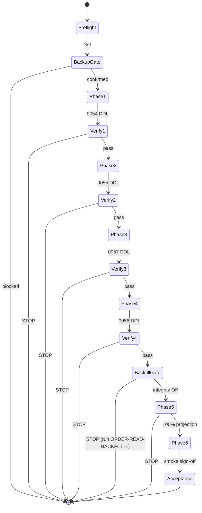

# MIGRATION-EXECUTION-ALIGNMENT-1 — Recovery Tooling Alignment

**Classification:** Operational Governance  
**Priority:** Critical  
**Status:** COMPLETE — awaiting certification (no production DDL executed)

## Root Cause

MIGRATION-EXECUTION-VALIDATION-1 established a **certification gap** between repository tooling and the certified operational recovery plan:

| Dimension | Before (recovery tool) | Certified plan |
|-----------|------------------------|----------------|
| Execution mechanism | Single `drizzle-kit migrate` transaction | Phased, one migration per gate |
| Migration order | Journal idx: `0054→0055→0056→0057` | Operational: `0054→0055→0057→0056` |
| Verification | Post-migrate `verify-schema` only | VERIFY after **each** phase |
| Backfill gate | Warning in preflight only | STOP after `0056` if legacy rows |
| Resume | None | `phase-3`, `phase-4`, `verify`, `smoke` |
| Backup gate | `--confirm-gateway01` only | Backup confirmation required |

The journal remains authoritative for **lineage** (idx, `when`, hashes). The operational plan is authoritative for **execution order**. These are intentionally independent.

**No migration SQL, journal entries, or hashes were modified in this program.**

---

## Tool Architecture

```
scripts/recovery/migration-0054-0057-execute.mjs     (entry — delegates, blocks bulk migrate)
        │
        ▼
scripts/recovery/migration-0054-0057-phased-execute.mjs   (CLI + gates + phase loop)
        │
        ├── scripts/lib/phased-recovery-contract.cjs   (phase definitions, operational order)
        ├── scripts/lib/phased-recovery-engine.cjs     (DDL per tag, hash record, schema probes)
        ├── scripts/recovery/migration-0054-0057-preflight.mjs   (read-only readiness)
        ├── scripts/verify-schema-deployment.cjs       (per-phase schema gate)
        └── scripts/order-read-category-backfill-execute.ts --verify-only   (phase-5)
```

### Design principles

1. **Orchestration only** — reads approved `.sql` files; does not alter them.
2. **Explicit allowlist** — only `0054`, `0055`, `0057`, `0056` tags via `APPROVED_MIGRATION_TAGS`.
3. **No bulk migrate** — no `spawnSync`/`drizzle-kit migrate` in recovery path.
4. **Per-phase transaction** — each migration DDL + hash insert in one DB transaction.
5. **Idempotent skip** — completed phases detected by schema + `__drizzle_migrations` hash.

---

## Execution State Machine



| Phase | Migration | Purpose |
|-------|-----------|---------|
| phase-1 | `0054` | Operational device registry |
| phase-2 | `0055` | `screenConfig` column |
| phase-3 | `0057` | `screenConfigRevision` — HTTP 500 recovery |
| phase-4 | `0056` | `categoryProjection` + backfill gate |
| phase-5 | — | ORDER-READ-BACKFILL-1 verify-only |
| phase-6 | — | Production smoke checklist |

---

## Recovery Flow

### Certified sequence

```
0054 → VERIFY → 0055 → VERIFY → 0057 → VERIFY → 0056 → VERIFY →
  [backfill if needed] → ORDER-READ-BACKFILL → VERIFY → Smoke → Acceptance
```

### Operator commands

```bash
# Dry-run (default)
pnpm db:recovery:execute

# Full phased execution (after backup)
TIDB_BACKUP_CONFIRMED=YES pnpm db:recovery:execute -- \
  --execute --confirm-gateway01 --confirm-backup

# Resume after partial completion
pnpm db:recovery:execute -- --execute --confirm-gateway01 --confirm-backup --resume-from phase-3

# Backfill only path
ORDER_READ_CATEGORY_BACKFILL_CONFIRM=YES pnpm exec tsx \
  scripts/order-read-category-backfill-execute.ts --scope full

pnpm db:recovery:execute -- --execute --confirm-gateway01 --confirm-backup --resume-from verify
```

### Per-phase verification gates

Each migration phase verifies:

| Check | Mechanism |
|-------|-----------|
| Migration success | Transaction commit / no rollback |
| Schema | `INFORMATION_SCHEMA` tables/columns/indexes per phase spec |
| Indexes | Phase-1 index probes |
| Constraints | Implicit via DDL success + schema presence |
| Hashes | `__drizzle_migrations` SHA-256 match journal |
| Application health | `verify-schema-deployment.cjs` after each migration phase |

**Failure policy:** STOP — do not continue to next phase.

---

## Resume Logic

| Flag | Starts at |
|------|-----------|
| `--resume-from phase-3` | phase-3 (0057) through phase-6 |
| `--resume-from phase-4` | phase-4 (0056) through phase-6 |
| `--resume-from verify` | phase-5 (backfill integrity) |
| `--resume-from smoke` | phase-6 (smoke checklist) |
| `--phase phase-N` | Single phase only |

**Idempotency:** Migration phases with schema + hash already recorded are skipped. Hash-only reconciliation (`schema_only_needs_hash`) registers hash without re-running DDL.

---

## Validation Results

| Requirement | Status |
|-------------|--------|
| Phased execution | ✓ `RECOVERY_PHASES` + per-tag DDL |
| Checkpoint verification | ✓ `verifyPhaseGate` + `verify-schema` per migration phase |
| Resume support | ✓ `--resume-from` / `--phase` |
| Deterministic ordering | ✓ `OPERATIONAL_MIGRATION_ORDER` |
| No bulk migrate | ✓ No `drizzle-kit migrate` spawn in recovery scripts |
| Governance preserved | ✓ Journal unchanged; `migration-governance-guard` unchanged |
| Journal preserved | ✓ No `_journal.json` edits |
| Migration lineage preserved | ✓ Hashes from existing SQL files |
| Production safety improved | ✓ Backup gate + backfill stop + gateway01 lock |

**Tests:** `scripts/__tests__/phasedRecovery.test.ts` (10), extended `migrationGovernance.test.ts` (9).

```bash
pnpm test scripts/__tests__/phasedRecovery.test.ts scripts/__tests__/migrationGovernance.test.ts
```

---

## Safety Analysis

| Risk | Mitigation |
|------|------------|
| Accidental bulk migrate | Recovery entry delegates to phased tool; tests guard against `spawnSync` + drizzle-kit |
| Wrong migration order | Hard-coded `OPERATIONAL_MIGRATION_ORDER`; phase-3 is 0057 before phase-4 (0056) |
| Future/unrelated migrations | `assertApprovedMigrationTag` allowlist of 4 tags only |
| Skipped verification | Each phase calls `verifyPhaseGate` + `verify-schema`; failure exits non-zero |
| Skipped backup | `TIDB_BACKUP_CONFIRMED=YES` or `--confirm-backup` required for `--execute` |
| Skipped backfill | Phase-4 gate stops if legacy projection rows; phase-5 runs verify-only |
| Skipped smoke | Phase-6 prints mandatory checklist |
| Re-run completed DDL | Idempotent skip on hash + schema complete |
| Wrong database | `--confirm-gateway01` + host/db assertion |

**Not executed:** No production DDL. PRODUCTION-MIGRATION-EXECUTION-1 remains stopped pending certification.

---

## Regression Protection

| Guard | Location |
|-------|----------|
| Operational order ≠ journal order | `phasedRecovery.test.ts` |
| No bulk drizzle in recovery | `phasedRecovery.test.ts`, `migrationGovernance.test.ts` |
| Package checksum unchanged | `phasedRecovery.test.ts` |
| Backup confirmation gate | `phasedRecovery.test.ts` |
| Journal 58 entries | `migrationGovernance.test.ts` |
| CI governance guard | `migrationGovernance.test.ts`, `vercel.json` |

---

## Operational Runbook

### Prerequisites

1. MIGRATION-GOVERNANCE-RESTORATION-1 certified
2. `pnpm db:governance-check` PASS
3. `pnpm db:recovery:preflight` GO on gateway01
4. TiDB backup completed

### Execution (PRODUCTION-MIGRATION-EXECUTION-1 resume)

| Step | Action |
|------|--------|
| 0 | `pnpm db:governance-check` |
| 1 | `pnpm db:recovery:preflight` |
| 2 | TiDB backup → `TIDB_BACKUP_CONFIRMED=YES` |
| 3 | `pnpm db:recovery:execute -- --execute --confirm-gateway01 --confirm-backup` |
| 4 | If stopped at phase-4: `ORDER_READ_CATEGORY_BACKFILL_CONFIRM=YES pnpm exec tsx scripts/order-read-category-backfill-execute.ts --scope full` |
| 5 | `--resume-from verify` |
| 6 | Complete phase-6 smoke checklist |
| 7 | Record production acceptance |

### Resume scenarios

- **After phase-2 complete, HTTP 500 persists until 0057:** `--resume-from phase-3`
- **After 0057, before 0056:** `--resume-from phase-4`
- **After backfill manual run:** `--resume-from verify`
- **After integrity verified:** `--resume-from smoke`

---

## Production Acceptance

**Pending operator certification.** Criteria:

- [ ] Phased tool certified against this implementation report
- [ ] Dry-run reviewed on gateway01
- [ ] Backup confirmation workflow acknowledged
- [ ] Backfill gate path understood (258 line items on production preflight)
- [ ] Smoke checklist assigned to operator

**After certification:** Resume PRODUCTION-MIGRATION-EXECUTION-1 from Phase 2 (backup) using phased executor.

---

## Files Changed

| File | Change |
|------|--------|
| `scripts/lib/phased-recovery-contract.cjs` | **New** — phase definitions, operational order |
| `scripts/lib/phased-recovery-engine.cjs` | **New** — per-tag DDL, verification probes |
| `scripts/recovery/migration-0054-0057-phased-execute.mjs` | **New** — phased CLI |
| `scripts/recovery/migration-0054-0057-execute.mjs` | **Rewritten** — delegate, block bulk migrate |
| `scripts/recovery/migration-0054-0057-preflight.mjs` | Updated phased execution note |
| `scripts/__tests__/phasedRecovery.test.ts` | **New** regression guards |
| `scripts/__tests__/migrationGovernance.test.ts` | Extended recovery guard |
| `package.json` | `db:recovery:execute` |
| `docs/DB_MIGRATION_GOVERNANCE.md` | Phased recovery workflow |
| `docs/MIGRATION_STAGING_CHECKLIST.md` | Production promotion steps |

**Unchanged:** `drizzle/*.sql`, `drizzle/meta/_journal.json`, migration hashes, `schema.ts`.

---

## Constraints Compliance

| Constraint | Met |
|------------|-----|
| No migration SQL changes | ✓ |
| No journal changes | ✓ |
| No hash changes | ✓ |
| No production DDL | ✓ |
| No schema changes | ✓ |
| Governance preserved | ✓ |
| Architecture preserved | ✓ |
