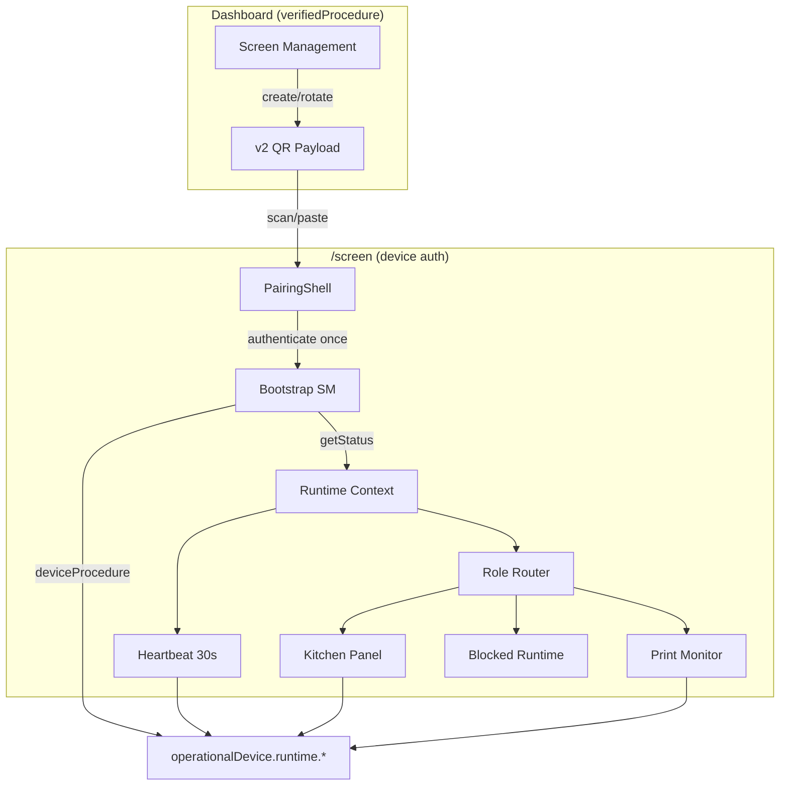

# OPERATIONAL-SCREEN-CLIENT-1 — Phase B Implementation Report

**Program:** OPERATIONAL-SCREEN-CLIENT-1  
**Phase:** B — Implementation  
**Date:** 2026-07-05  
**Authority:** PAIRING-CONTRACT-1, RUNTIME-BOOTSTRAP-CONTRACT-1, DEVICE-MANAGEMENT-INVESTIGATION-1

---

## Architecture Compliance Report

| Contract | Status | Notes |
|----------|--------|-------|
| PAIRING-CONTRACT-1 v2 payload | ✅ | Server emits v2; client parses v2; v1 rejected |
| RUNTIME-BOOTSTRAP-CONTRACT-1 | ✅ | State machine, context, heartbeat, role router |
| DEVICE-MANAGEMENT-INVESTIGATION-1 | ✅ | Independent `/screen` runtime; no dashboard auth |
| No architecture redesign | ✅ | Pairing/bootstrap boundaries preserved |

---

## Implementation Summary

### Server
- `OperationalScreenPairingPayload` v2 with `tokenId` in QR
- `runtime.getStatus` extended with `screenConfig` + `configVersion` (`device.updatedAt`)

### Client Runtime Shell
- Routes: `/screen`, `/screen/pair`, `/screen/run`
- Isolated `screenTrpc` + device `Authorization` header
- Credential store: `mineuqr:operational-screen:credentials:v1`
- Pairing UI (JSON paste + manual entry)
- Bootstrap state machine + `OperationalScreenRuntimeContext`
- Heartbeat scheduler (30s, immediate first beat)
- Role router: Kitchen/Expo, Print Monitor, Blocked Runtime
- Diagnostics panel (dev), error boundary, degraded recovery

### Explicitly NOT implemented (per scope)
- Kitchen Category Filter application
- Display Density application
- Pickup / Customer Display / Kiosk runtimes
- Management UI changes
- Dashboard integration

---

## Runtime State Machine

```
LoadingCredentials → PairingRedirect (no credentials)
LoadingCredentials → Validating (credentials found)
Validating → Revoked (401 / disabled)
Validating → ContextReady → HeartbeatActive → Running | Blocked
Running → Degraded (network) → Running (recovery)
Running → Revoked (401) → PairingRedirect
Running → ConfigReload (version change) → Running
```

---

## Bootstrap Validation

| Step | Implementation |
|------|----------------|
| Load credentials | `credentialStore.ts` |
| Device transport | `createScreenRuntimeTrpcLinks` |
| Load context | `runtime.getStatus` |
| Validate credentials | Implicit via `deviceProcedure` |
| Screen configuration | `getStatus.screenConfig` |
| Config version | `getStatus.configVersion` |
| Fingerprint | `collectRuntimeFingerprint` |
| Heartbeat | `useRuntimeOrchestrator` (HARDENING-1) |
| Role resolve | `RoleRouter` |
| Mount runtime | Role panels / Blocked |

> Superseded by OPERATIONAL-SCREEN-HARDENING-1: lifecycle now owned by `OperationalScreenRuntimeProvider` + `useRuntimeOrchestrator`, driven by the explicit `bootstrapStateMachine`. See `docs/engineering/programs/OPERATIONAL-SCREEN-HARDENING-1/IMPLEMENTATION.md`.

---

## Pairing Compliance

- v2 protocol discriminator `mineuqr: operational-screen-pairing`
- Mandatory: `deviceId`, `tokenId`, `secret`
- `runtime.authenticate` once; session deviceId verified
- Credential persistence on success
- No heartbeat/data queries during pairing
- v1 QR rejected with actionable message

---

## Runtime Context Validation

| Classification | Fields |
|----------------|--------|
| Immutable | `deviceId`, `role`, `restaurantId`, `branchId`, credential tuple |
| Reloadable | `screenConfig`, `configVersion`, `displayName` |
| Dynamic | `runtimeStatus.*` |
| Derived | `presentation`, `capabilities` |
| Client-local | `fingerprint` |

---

## Heartbeat Validation

- Starts immediately after context ready
- Interval: 30s
- Backoff on failure: 5s → 30s cap
- Stops on 401 → clear credentials → pairing
- Continues during Blocked Runtime

---

## Role Routing Validation

| Role | Outcome |
|------|---------|
| `kitchen_display`, `expo_display` | KitchenScreenPanel |
| `print_monitor` | PrintMonitorScreenPanel |
| `pickup_display`, `customer_display`, `self_ordering_kiosk` | BlockedRuntimeScreen |

---

## Diagnostics Validation

- Fingerprint: platform, browser, viewport, capabilities
- Never used for auth/authorization
- Dev-only diagnostics panel with bootstrap snapshot

---

## Architecture Fitness Results

| ID | Result |
|----|--------|
| FF-OSC-01 | ✅ No `verifiedProcedure` in screen modules |
| FF-OSC-02 | ✅ No `useAuth()` |
| FF-OSC-03 | ✅ `operationalDevice.runtime.*` only |
| FF-BOOT-01 | ✅ No `authenticate` on normal boot |
| FF-BOOT-05 | ✅ `/screen` exempt from login redirect |
| FF-PAIR-01 | ✅ Pairing isolated from heartbeat |
| FF-BOOT-07 | ✅ Blocked roles reach blocked phase |

---

## Security Validation

- Device credentials in `localStorage` (v1 contract)
- Secrets never logged
- `credentials: omit` on screen transport (no cookie bleed)
- Server-authoritative role/restaurant after bootstrap
- 401 clears local credentials

---

## Performance Considerations

- Separate QueryClient per screen session (no dashboard cache pollution)
- Data polls: 10s, visibility-gated
- Status poll: 60s + window focus
- `placeholderData` for degraded UX
- Single heartbeat timer per session

---

## Scalability Assessment

- Stateless server; device auth per request
- No global mutable singletons in runtime
- Horizontal scaling via existing tRPC layer
- Ready for future push (heartbeat + status poll extension points)

---

## Production Readiness Assessment

| Area | Status |
|------|--------|
| Independent runtime | ✅ |
| E2E device auth path | ✅ (server + client) |
| Error recovery | ✅ |
| Config hot-reload | ✅ |
| Blocked roles | ✅ |
| Camera QR scan | ⏳ Deferred (paste/manual per MVP) |
| Management UI v2 display | ⏳ Out of scope |

---

## Updated Architecture Diagram



---

## Operational Validation

1. Create screen in Screen Management → copy v2 JSON from API response `qrPayload`
2. Open `/screen/pair` → paste JSON → redirects to `/screen`
3. Kitchen/Expo roles show queue columns via `runtime.getKitchenQueue`
4. Print monitor shows summary via `runtime.getPrintMonitorSummary`
5. Pickup role shows blocked screen with active heartbeat
6. Rotate token → 401 → pairing redirect

---

## File Index

| Path | Purpose |
|------|---------|
| `client/src/pages/screen/*` | Route entries |
| `client/src/components/operational-screen/*` | UI shell, pairing, role panels |
| `client/src/lib/operational-screen/*` | Contracts, bootstrap, transport |
| `server/operational-device/routers/operationalDeviceRuntimeRouter.ts` | Extended getStatus |
