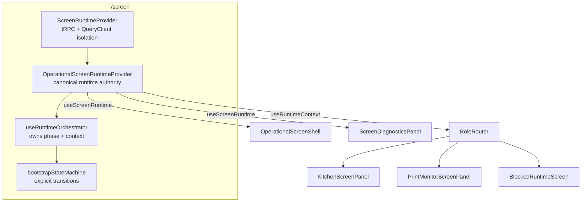
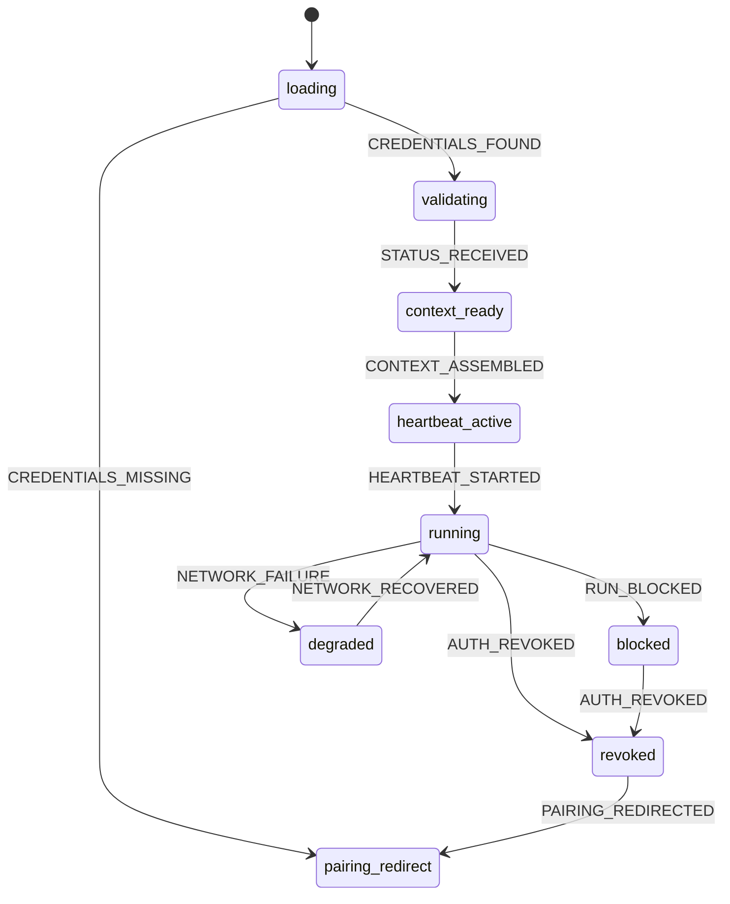

# OPERATIONAL-SCREEN-HARDENING-1 — Implementation Report

**Program:** OPERATIONAL-SCREEN-HARDENING-1 (Architecture Hardening)
**Date:** 2026-07-05
**Authority:** DEVICE-MANAGEMENT-INVESTIGATION-1, PAIRING-CONTRACT-1, RUNTIME-BOOTSTRAP-CONTRACT-1, OPERATIONAL-SCREEN-CLIENT-1 Phase B
**Constraint:** Hardening only. No architectural redesign, no new contracts, no new auth model.

---

## Implementation Summary

Closed the four conditions from the Architecture Authority Compliance Audit:

| ID | Finding | Resolution |
|----|---------|-----------|
| HARDENING-01 | FF-PAIR-04: Management UI stored `tokenId` but displayed secret only | Full credential tuple (Device ID, Token ID, Secret) rendered in provisioning dialog with copy actions |
| HARDENING-02 | Bootstrap skipped intermediate phases | Explicit state machine (`bootstrapStateMachine.ts`); every phase and transition declared; single dispatch choke point |
| HARDENING-03 | Duplicated runtime/phase state | Single authoritative `phase`; exposed context always carries authoritative phase; legacy `useScreenBootstrap` removed |
| HARDENING-04 | No canonical runtime provider; prop-drilling | `OperationalScreenRuntimeProvider` + `useScreenRuntime` / `useRuntimeContext`; panels consume via hooks |

### Files added
- `client/src/lib/operational-screen/bootstrapStateMachine.ts` — pure state machine
- `client/src/lib/operational-screen/useRuntimeOrchestrator.ts` — lifecycle owner
- `client/src/components/operational-screen/OperationalScreenRuntimeProvider.tsx` — canonical provider + consumer hooks
- `client/src/lib/operational-screen/__tests__/bootstrapStateMachine.test.ts`

### Files changed
- `ScreenManagementWorkspacePanel.tsx` — full tuple display (`CredentialField`)
- `OperationalScreenEntry.tsx`, `OperationalScreenShell.tsx`, `RoleRouter.tsx`, `KitchenScreenPanel.tsx`, `PrintMonitorScreenPanel.tsx`, `BlockedRuntimeScreen.tsx`, `ScreenDiagnosticsPanel.tsx` — consume provider (no props)
- `bootstrapLogic.ts` — removed dead `resolveBootstrapPhaseAfterStatus`
- `architectureGuards.test.ts` — updated + new hardening guards

### Files removed
- `client/src/lib/operational-screen/useScreenBootstrap.ts` (duplicated lifecycle ownership)

---

## Architecture Compliance Report

| Requirement | Status | Evidence |
|-------------|--------|----------|
| Runtime Context is only runtime authority | PASS | `OperationalScreenRuntimeProvider` sole owner; panels use `useRuntimeContext` |
| Bootstrap follows approved state machine | PASS | `bootstrapStateMachine.ts` `ALLOWED_TRANSITIONS` |
| Pairing contract unchanged | PASS | `pairingPayload.ts`, `authenticate` flow untouched |
| Bootstrap contract unchanged | PASS | Entry via `getStatus` only; no `authenticate` on boot |
| No duplicated lifecycle state | PASS | Single `setPhase` inside `dispatch`; exposed context derives phase |
| No duplicated Runtime Context | PASS | One provider; `useScreenBootstrap` deleted |

---

## State Machine Validation

Phases: `loading → validating → context_ready → heartbeat_active → running → {blocked | degraded | revoked}`, plus `pairing_redirect`.

- Every phase has a declared transition set (`ALLOWED_TRANSITIONS`).
- All lifecycle changes route through `transition()` (pure) then `dispatch()` (single `setPhase`).
- Implicit jumps rejected: `canTransition("loading","running") === false`; skipping context assembly is a no-op.
- Tests: `bootstrapStateMachine.test.ts` (8 tests) — happy path, missing-credentials, degraded recovery, block, revoke, illegal-jump rejection, revoke-from-any-active.

---

## Runtime Context Validation

- Single source of truth: `useRuntimeOrchestrator` owns `context` and `phase`.
- Exposed context memoized so `context.bootstrap.phase` always equals authoritative `phase`:
  `bootstrap: { ...context.bootstrap, phase }`.
- Reloadable fields (`configuration`, `configVersion`, `displayName`) reconciled on status without lifecycle jump.
- No parallel runtime state; `ScreenBootstrapState` type deleted.

---

## Provider Validation

`OperationalScreenRuntimeProvider` owns: Runtime Context, bootstrap phase, configuration, capabilities, fingerprint, runtime status, role, plus `unpair`/`retry`/`diagnostics`.

- `useScreenRuntime()` — full authority (shell, diagnostics, entry).
- `useRuntimeContext()` — assembled context (role panels).
- No prop-drilling: `RoleRouter`, `KitchenScreenPanel`, `PrintMonitorScreenPanel`, `BlockedRuntimeScreen` take zero runtime props.
- Transport clients remain in `ScreenRuntimeProvider` (tRPC/query isolation); runtime authority nested inside.

---

## Pairing Validation (FF-PAIR-04)

- Provisioning dialog renders Device ID, Token ID, Secret via `CredentialField`.
- Displayed only within provisioning workflow (`createdQr` state on create/rotate); not persisted, not shown elsewhere.
- Security model unchanged: secret hashed server-side, returned once, warning copy retained.

---

## Architecture Fitness Results

| Rule | Result |
|------|--------|
| FF-OSC-01 no `verifiedProcedure` in screen modules | PASS |
| FF-OSC-02 no `useAuth()` | PASS |
| FF-OSC-03 `operationalDevice.runtime.*` only | PASS |
| FF-BOOT-01 no `authenticate` on normal boot | PASS |
| FF-BOOT-05 no dashboard login redirect on `/screen` | PASS |
| FF-BOOT-07 unsupported role → blocked after heartbeat | PASS |
| FF-PAIR-01 pairing isolated from heartbeat | PASS |
| FF-PAIR-04 management displays full tuple | **PASS (newly closed)** |
| HARDENING-02 lifecycle via state machine dispatch | PASS |
| HARDENING-03 single runtime authority | PASS |
| HARDENING-04 panels consume provider | PASS |

---

## Performance

- Polling intervals unchanged: heartbeat 30s, status 60s, data 10s.
- No new network requests; `getStatus` reused for reconciliation.
- One provider render root; exposed context/diagnostics memoized to limit re-renders.
- Memory: removed a hook; no new singletons.

---

## Production Readiness Update

Audit blockers resolved: FF-PAIR-04 closed; state machine complete; single runtime authority; canonical provider.
Out-of-scope deferrals unchanged (camera QR scanner, push/SSE, remaining role runtimes) — explicitly excluded by program scope.

---

## Updated Architecture Diagram

State machine:

---

## Test Results

- `npm run check` (tsc --noEmit): PASS
- Program scope: `server/operational-device` + `client/src/lib/operational-screen` — **44/44 PASS** (10 files)
- Full suite: 1465 passed, 3 failed, 3 skipped. The 3 failures are in `server/connector-product` (PRINT-CONNECTOR-RELEASE-1 manifest/version checks) — pre-existing and unrelated to this program (no changed file touches `connector-product`).

---

## Remaining Risks

1. localStorage secret exposure (inherent web model; unchanged, out of scope).
2. Unpair remains single-click without confirmation (UX, out of scope).
3. `configVersion` server-side abstraction wiring (`resolveConfigVersion`) still client-only — noted; contract-compliant via `device.updatedAt`.
4. Pre-existing connector-release test failures should be triaged by that program's owner.
