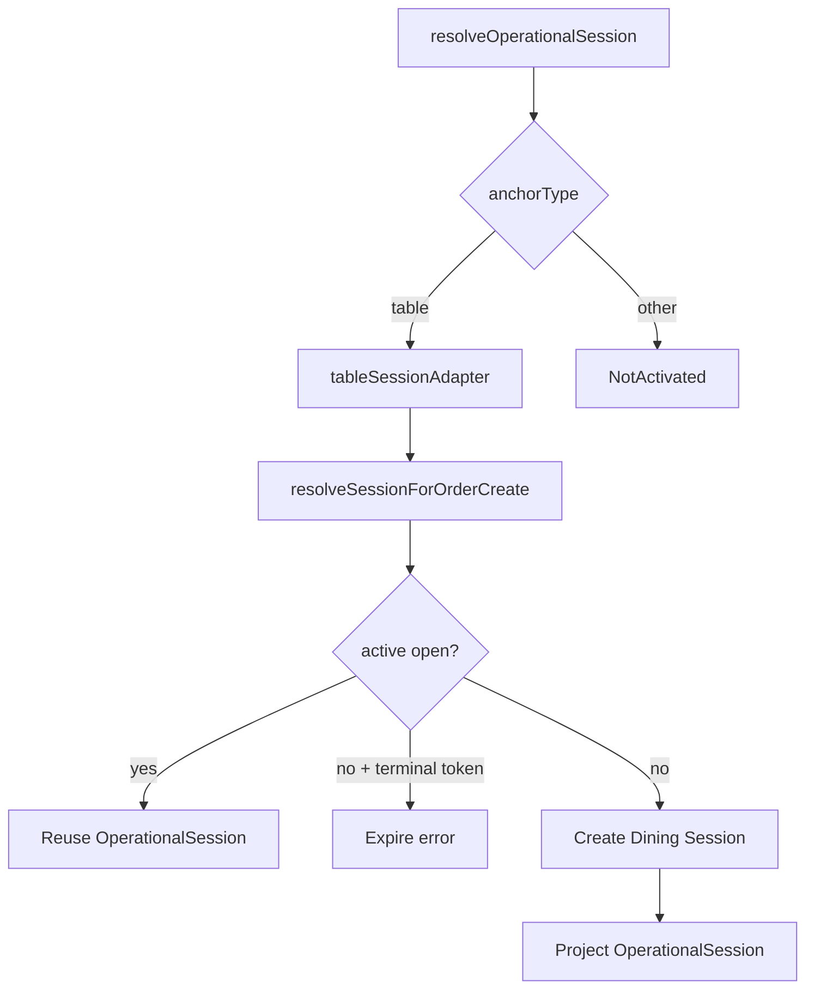

# OPERATIONAL-SESSION-PLATFORM-1 — Architecture

**Status:** Implemented  
**Depends on:** ADR-ARCH-019 (Accepted), ORDER-IDENTITY-RUNTIME-1 (Certified), Dining Session / SESSION-PLATFORM  
**Date:** 2026-07-14  
**Type:** Architecture Implementation (Session Platform generalization)  
**Constraint:** No global DiningSession rename; table specialization remains production persistence

---

## 1. Forensic architecture audit

### 1.1 Production chain (as-is before this program)

```
order.create(tableNumber, sessionToken?)
      → restaurant_tables lookup
      → resolveSessionForOrderCreate(restaurantId, tableId, tableNumber)
      → dining_sessions (openGuard uniqueness)
      → PlaceOrder (sessionId pointer)
      → Order.sessionId FK
```

| Area | Finding | Classification |
|------|---------|----------------|
| `dining_sessions` | `tableId` NOT NULL; `UNIQUE(restaurantId, tableId, openGuard)` | Operational — table occupancy |
| `resolveSessionForOrderCreate` | Authoritative Order-attach resolver | Session responsibility |
| No reopen / no TTL expire | Terminal token → expired; next visit → new session | Session lifecycle |
| PlaceOrder | Does not create/close sessions; stores pointer | Order ↔ Session boundary |
| Business Identity | Day/display sequence only | Orthogonal — untouched |
| ORDER-IDENTITY-RUNTIME-1 | Service Mode + Fulfilment Anchor + session **pointer** | Runtime identity |
| Ops UI / Kitchen / Print | Consume table labels / session workspace | Out of scope |

### 1.2 Separation of concerns

| Concern | Owner |
|---------|--------|
| Physical table master data | `restaurant_tables` |
| Visit occupancy + settlement | **Operational Session Platform** (table specialization = Dining Session) |
| Session uniqueness policy | **Session Anchor type** (table → one open per table) |
| Fulfilment label / where served | **Fulfilment Anchor** on Order Identity |
| Order lifecycle (pending→served) | Order Domain |
| Channel UX | QR / Kiosk / Waiter shells — never session identity |

### 1.3 Root cause

Historical assumption: **table is the universal session key**.  
That is correct for QR table service and incorrect as a platform law.  
Generalization must add typed Session Anchors without renaming or rewriting Dining Session.

---

## 2. Current Session ownership map (before → after)

| Responsibility | Before | After |
|----------------|--------|-------|
| Canonical Order-attach resolve | `resolveSessionForOrderCreate` | **`resolveOperationalSession`** (table adapter → Dining Session) |
| Table uniqueness | Dining Session `openGuard` | Unchanged — table Session Anchor policy |
| Staff settle/close | `markPaid` / `markComplimentary` / `closeSession` | Lifecycle facade + Dining Session implementation |
| Persistence | `dining_sessions` | **Unchanged** (no schema redesign) |
| Platform vocabulary | Implicit table-only | `shared/operational-session` contracts |

---

## 3. Fulfilment Anchor ownership question

### Question

**Option A**

```
Fulfilment Anchor
        │
        ▼
Operational Session
```

**Option B**

```
Operational Session
        ├── Session Identity
        ├── Session Anchor
        ├── Status
        ├── Lifecycle
        └── Orders (attached)
```

### Verdict: **Option B** (canonical for Session Platform)

ADR-ARCH-019 is **not** disproven. Option B refines “keyed by anchor type” without making Fulfilment Anchor the parent aggregate of Session.

### Evidence

| Evidence | Implication |
|----------|-------------|
| ADR-019 rejected “Session-only identity without Order-stamped mode/anchor” | Order stamps **Fulfilment Anchor** independently of session |
| ORDER-IDENTITY-RUNTIME-1 models siblings: `serviceMode` + `fulfilmentAnchor` + `operationalSession` pointer | Session is not a child of Fulfilment Anchor on Order |
| Service Mode matrix: session **optional** for counter / take_away / pickup | Fulfilment Anchor cannot own session hierarchy when session may be absent |
| Order status machine ≠ session status machine | Orders **attach** to sessions; sessions do not own Order Domain |
| Table uniqueness is occupancy law, not fulfilment-label law | Session Anchor keys uniqueness; Fulfilment Anchor keys ops label |

### Ownership split (normative)

| Concept | Platform owner | Role |
|---------|----------------|------|
| **Fulfilment Anchor** | Ordering / Order Identity | Where/how the order is fulfilled; ops label |
| **Session Anchor** | Operational Session Platform | Keys session uniqueness / occupancy |
| Correlation (table path) | Same physical table today | Same facts, **different ownership** |

```
Order Identity                          Operational Session
├── Service Mode                        ├── Session Identity
├── Fulfilment Anchor  ←correlate→      ├── Session Anchor
└── Operational Session Identity ──────►├── Status / Lifecycle
                                        └── Orders (sessionId)
```

**Option A rejected** as canonical ownership: it collapses Order Identity into Session ownership and cannot express optional sessions or post-session immutable fulfilment semantics.

---

## 4. Proposed Operational Session model

```
OperationalSession
  id, restaurantId, sessionToken
  status: open | paid | complimentary | closed
  anchor: SessionAnchor   // discriminated
  openedAt / settledAt / closedAt / aggregates…
```

**Dining Session** = specialization for `anchorType = table`, persisted in `dining_sessions`.  
Not a rename. Not deleted.

---

## 5. Anchor model

| AnchorType | Uniqueness (open) | Activated this program |
|------------|-------------------|------------------------|
| `table` | one_open_per_anchor | **Yes** |
| `station` | configurable | No |
| `pickup_point` | none | No |
| `queue` | none | No |
| `drive_lane` | none | No |

Extend vocabulary only via Architecture programs.

---

## 6. Session lifecycle

```
resolveOperationalSession(anchor)
        │
        ├── table → Dining Session: active? reuse : (terminal hint? expire : create)
        └── other → AnchorNotActivated (this program)

Staff lifecycle (table specialization):
  settle_paid / settle_complimentary / close
        → Dining Session markPaid / markComplimentary / closeSession
```

Channel-independent. QR / Kiosk / Waiter only supply anchor facts.



---

## 7. QR adoption / compatibility

- `order.create` input, routes, UX unchanged  
- Dual-write flag behaviour unchanged  
- Table uniqueness unchanged  
- QR becomes consumer of `resolveOperationalSession` + `createTableSessionAnchor`  
- Dining Session remains production table implementation  

---

## 8. Boundaries

**In scope:** Shared Operational Session contracts, table adapter, resolve entry, lifecycle facade, QR Order-attach wire, docs  

**Out of scope:** Non-table activation, DB redesign, BI, Ops UI, Kitchen/Expo/Print, PlaceOrder business-rule changes, channel-specific session forks
