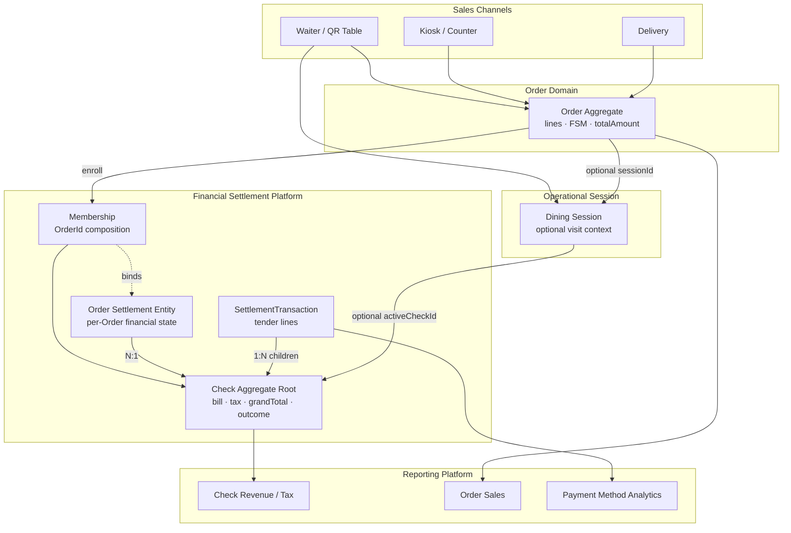
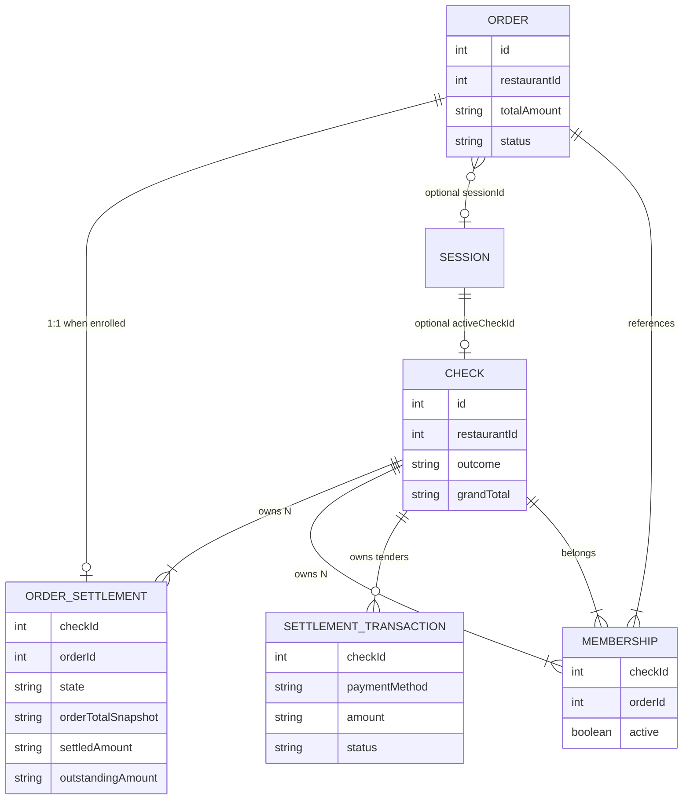
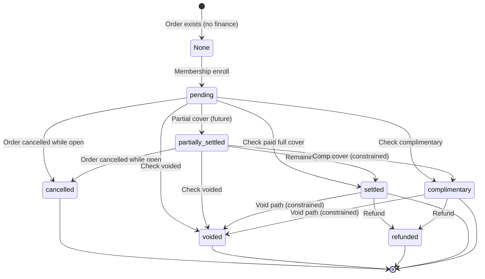

# ORDER-SETTLEMENT-ARCHITECTURE-1 — Architecture

| Field | Value |
|---|---|
| **Status** | Published |
| **Date** | 2026-07-22 |
| **Revision** | **1.1** — ORDER-SETTLEMENT-ARCHITECTURE-HARDENING-1 |
| **Type** | Architecture Design (no implementation) |
| **Constitutional ADR** | [ADR-ARCH-022](../../../architecture/adrs/ADR-ARCH-022-order-settlement-platform.md) (rev 1.1) |
| **Refines** | [ADR-ARCH-020](../../../architecture/adrs/ADR-ARCH-020-financial-settlement-platform.md) |
| **Prior certified baseline** | Membership Authority · Check Authority · Compatibility Cleanup |
| **Hardening program** | ORDER-SETTLEMENT-ARCHITECTURE-HARDENING-1 |
| **Successor** | ORDER-SETTLEMENT-DOMAIN-1 |

### Revision notes

| Rev | Program | Change |
|-----|---------|--------|
| 1.0 | ORDER-SETTLEMENT-ARCHITECTURE-1 | Initial architecture publication |
| 1.1 | ORDER-SETTLEMENT-ARCHITECTURE-HARDENING-1 | I-OS-14; lifecycle terminal/non-terminal + forbidden regressions; Aggregate Ownership diagram/boundaries. No change to ADR-020, Revenue SSOT, Membership authority, Check ownership, or runtime/schema. |

---

## 1. Purpose

Design the **Order Settlement Platform** so MineuQR can represent the **financial settlement state of each Order** without redesigning ADR-ARCH-020.

This program publishes architecture only:

- No code  
- No schema  
- No migrations  
- No APIs  

Success criterion: **ORDER-SETTLEMENT-DOMAIN-1** can begin without architectural redesign.

---

## 2. Background and problem

### 2.1 Current certified model

```
Order  →  Membership  →  Check  →  SettlementTransaction[]
```

| Concern | Authority |
|---------|-----------|
| Operational Order | Order Aggregate |
| Bill composition | Check-owned Membership |
| Bill money / outcome | Check |
| Tenders | SettlementTransaction under Check |
| Visit | Dining Session (optional) |

### 2.2 Missing capability

There is no first-class object answering:

> What is the **financial settlement state of this Order**?

Today that answer is inferred from Check outcome + Membership. That is insufficient for durable per-Order lifecycle, partial coverage, and channel UX.

### 2.3 Non-goals

- Replace Check as Revenue SSOT  
- Move settlement into Order Aggregate  
- Introduce Invoice / ERP ledger  
- Split Check / seat transfer (future ADR)  
- Revive financial compatibility layers  

---

## 3. Architecture questions (answered with evidence)

### Q1 — What is Order Settlement?

| Option | Verdict | Evidence |
|--------|---------|----------|
| Aggregate | **No** | ADR-020 R5 / I-FIN-01 — one monetary root (Check) |
| Entity | **Yes** | Identity + lifecycle + mutable coverage amounts |
| Value Object | **No** | Lifecycle transitions are first-class |
| Projection | **No** | Must be writable for partial settle / refunds |

**Decision:** Order Settlement is a **Check-owned Entity** inside the Financial Settlement Platform.

### Q2 — Who owns Order Settlement?

| Option | Verdict |
|--------|---------|
| Order Domain | Forbidden (I-FIN-12) |
| Standalone Settlement Aggregate | Forbidden (second root) |
| Check Domain / FSP | **Owner** |
| Separate Aggregate | No — entity under Check boundary |

### Q3 — Relationship with Order

| Aspect | Decision |
|--------|----------|
| Cardinality | **1:1** while enrolled on a Check |
| Before enrollment | **Optional** (Order may exist with no OS) |
| After enrollment | **Required** |
| After terminal Check | Terminal OS retained for history |

### Q4 — Relationship with Check

| Aspect | Decision |
|--------|----------|
| Cardinality | **N:1** (many OS per Check) |
| Model | **Allocation / coverage** within one bill |
| Composition | Membership remains discovery authority |

### Q5 — Relationship with Settlement Transactions

| Aspect | Decision |
|--------|----------|
| Direct OS→tender ownership | **No** |
| Path | OS state changes **through Check** finalize / coverage rules |
| Separate ledger | **Forbidden** |
| v1 behavior | Atomic Check settle updates all active OS on that Check |

### Q6 — Relationship with Membership

| Aspect | Decision |
|--------|----------|
| Membership authoritative? | **Yes** |
| OS replaces Membership? | **No** |
| OS consumes Membership? | **Yes** — bound to `(checkId, orderId)` |

### Q7 — Financial SSOT after introduction

| Concern | SSOT |
|---------|------|
| Check Revenue / Tax | **Check** |
| Payment methods | **SettlementTransaction** |
| Order Sales | **Order Read** |
| Order operational total | **Order.totalAmount** |
| Bill membership | **Membership** |
| **Per-Order settlement state** | **Order Settlement** (new) |

---

## 4. Context diagram



---

## 5. Relationship diagram



### Cardinality summary

| Relation | Cardinality | Notes |
|----------|-------------|-------|
| Order ↔ Order Settlement | 0..1 / 1 while enrolled | No OS until enrollment |
| Check ↔ Order Settlement | 1 → N | Allocation model |
| Order Settlement ↔ Membership | 1 ↔ 1 at create | Same `(checkId, orderId)` |
| Order Settlement ↔ SettlementTransaction | Indirect via Check | No direct FK required in v1 |
| Order ↔ Check | N → 1 via Membership | I-FIN-06 |

---

## 6. Aggregate Ownership

### 6.1 Canonical aggregate boundary diagram

```
+------------------------------------------------------+
|                 Check Aggregate                      |
|------------------------------------------------------|
| Check                                                |
| Membership[]                                         |
| SettlementTransaction[]                              |
| OrderSettlement[]                                    |
+------------------------------------------------------+

                 references
                       │
                       ▼
+------------------------------------------------------+
|                 Order Aggregate                      |
|------------------------------------------------------|
| Order                                                |
| Order Items                                          |
| Notes                                                |
| Modifiers                                            |
| Operational Lifecycle                                |
+------------------------------------------------------+
```

Tree view (same boundary):

```
Financial Settlement Platform
└── Check  (aggregate root)
      ├── Membership[]              // composition authority
      ├── OrderSettlement[]         // per-Order financial state
      └── SettlementTransaction[]   // tenders
```

### 6.2 Boundary explanation

- **Check owns Order Settlement.** OS is inside the Check aggregate boundary.  
- **Order Aggregate never owns financial settlement.** Operational lifecycle stays on Order.  
- **Order Settlement references Order** (`orderId`) but **does not belong** to the Order Aggregate.  
- Membership and SettlementTransaction remain Check-owned children; OS does not absorb them.

### 6.3 Ownership boundaries (explicit)

| Owner | Owns | Does not own |
|-------|------|--------------|
| **Order Aggregate** | Operational lifecycle · Order items · Notes · Modifiers · Customer intent · line/`totalAmount` | Membership · Check · Order Settlement · Settlement Transactions · tax snapshots · Revenue |
| **Financial Settlement Platform (Check Aggregate)** | Membership · Check · Order Settlement · Settlement Transactions · bill tax/grandTotal/outcome | Order items · Notes · Modifiers · operational FSM · customer intent |

| Concern | Owner | Forbidden |
|---------|-------|-----------|
| Order lines / FSM / `totalAmount` | Order | Check, OS, UI formulas |
| Visit occupancy | Dining Session | Check, OS |
| Which Orders are on the bill | Membership | OS, Session scan, BI |
| Bill tax / grandTotal / outcome | Check | Order, OS-as-Revenue |
| Per-Order settlement state | **Order Settlement** | Order Aggregate fields as SSOT |
| Tender capture | SettlementTransaction | Order, OS |
| Revenue KPI | Reporting ← Check | Sum of OS, sum of tenders |

---

## 7. Lifecycle (hardened)



### 7.1 Canonical states

| State | Meaning |
|-------|---------|
| `pending` | Enrolled; unpaid outstanding |
| `partially_settled` | Partial coverage (reserved) |
| `settled` | Fully paid |
| `complimentary` | Fully complimentary |
| `refunded` | Coverage reversed |
| `voided` | Check void path |
| `cancelled` | Order cancelled without collection |

### 7.2 Terminal vs non-terminal

| Class | States |
|-------|--------|
| **Non-terminal** | `pending`, `partially_settled` |
| **Terminal** | `settled`, `complimentary`, `refunded`, `voided`, `cancelled` |

### 7.3 Allowed business transitions

| From | To | Meaning |
|------|----|---------|
| *(none)* | `pending` | Enroll |
| `pending` | `partially_settled` | Partial cover (future) |
| `pending` / `partially_settled` | `settled` | Full paid cover |
| `pending` / `partially_settled` | `complimentary` | Comp cover |
| `pending` / `partially_settled` | `cancelled` | Order cancel while open |
| `pending` / `partially_settled` | `voided` | Check void |
| `settled` / `complimentary` | `refunded` | Refund |
| `settled` / `complimentary` / `refunded` | `voided` | Constrained void (domain legality) |

### 7.4 Architecturally forbidden transitions (I-OS-14)

Terminal → non-terminal is **architecturally forbidden** (not merely unimplemented):

| Forbidden | Example |
|-----------|---------|
| `settled` → `pending` | Re-open paid OS as unpaid |
| `settled` → `partially_settled` | Regress paid to partial |
| `refunded` → `pending` | Treat refund as unpaid reopen |
| `voided` → `pending` | Revive voided OS |
| `cancelled` → `pending` | Revive cancelled OS |
| Any other terminal → `pending` / `partially_settled` | Lifecycle regression |

**Business transitions** = §7.3 only.  
**Architecturally forbidden transitions** = §7.4 (I-OS-14).  
**Exception:** requires a new ADR + Architecture Authority approval.

### 7.5 Amount algebra (conceptual)

```
orderTotalSnapshot = contributing Order total (recalc while Check open)
settledAmount      ∈ [0, orderTotalSnapshot]
outstandingAmount  = orderTotalSnapshot − settledAmount
```

---

## 8. Sequence diagrams

### 8.1 Enroll Order → create Order Settlement

```mermaid
sequenceDiagram
  participant Ch as Channel / Order events
  participant Mem as Membership (Check-owned)
  participant OS as Order Settlement
  participant Ck as Check

  Ch->>Mem: enrollOrder(checkId, orderId)
  Mem-->>Mem: assert I-FIN-06 / tenant
  Mem->>OS: create OrderSettlement(pending)
  OS-->>OS: orderTotalSnapshot = Order.totalAmount
  OS-->>OS: settled=0; outstanding=snapshot
  Mem->>Ck: request recalculate (open)
  Ck-->>Ck: money from Membership Orders (I-FIN-04)
```

### 8.2 Atomic Check paid settle (v1)

```mermaid
sequenceDiagram
  participant UI as Dashboard / Channel
  participant Ck as Check
  participant T as SettlementTransactions
  participant OS as Order Settlements

  UI->>Ck: settleCheckPaidById(checkId, tenders)
  Ck->>Ck: refresh money; freeze totals
  Ck->>T: insert captured tenders (sum = grandTotal)
  Ck->>Ck: outcome = paid
  loop each active OS on Check
    Ck->>OS: transition → settled
    OS-->>OS: settledAmount = orderTotalSnapshot
    OS-->>OS: outstandingAmount = 0
  end
  Ck-->>UI: paid Check
```

### 8.3 Check void

```mermaid
sequenceDiagram
  participant Life as Operational lifecycle / channel
  participant Ck as Check
  participant OS as Order Settlements
  participant Mem as Membership

  Life->>Ck: voidCheckById(checkId)
  Ck->>Ck: freeze; outcome = voided (no tenders)
  loop each active OS
    Ck->>OS: transition → voided
  end
  Ck->>Mem: deactivate memberships
```

### 8.4 Sessionless 1:1 channel (kiosk / counter)

```mermaid
sequenceDiagram
  participant Place as PlaceOrder
  participant Ck as Check
  participant Mem as Membership
  participant OS as Order Settlement

  Place->>Ck: ensureCheckForOrder(orderId)
  Ck->>Mem: enroll
  Mem->>OS: create pending
  Note over Ck,OS: Later settle uses Check ById;<br/>OS becomes settled with Check
```

---

## 9. Event model

| Event | When |
|-------|------|
| `OrderSettlementCreated` | Enrollment opens OS |
| `OrderSettlementRecalculated` | Open Check amount refresh |
| `OrderSettlementPartiallySettled` | Partial cover |
| `OrderSettlementSettled` | Full paid cover |
| `OrderSettlementComplimentary` | Comp cover |
| `OrderSettlementRefunded` | Refund |
| `OrderSettlementVoided` | Void |
| `OrderSettlementCancelled` | Order cancel without collection |

Governance: ADR-ARCH-014 transport ledger + ADR-ARCH-021 business-fact idempotency.  
Do not implement events in this program.

---

## 10. Invariants

### Inherited (ADR-ARCH-020)

I-FIN-01 … I-FIN-12 remain binding — especially:

- Check sole monetary bill/Revenue root  
- Membership sole composition discovery  
- Settlement not inside Order Aggregate  
- Revenue ≠ tender sum ≠ Order Sales  

### Order Settlement (ADR-ARCH-022)

| ID | Invariant |
|----|-----------|
| I-OS-01 | Unique `(restaurantId, checkId, orderId)` |
| I-OS-02 | Created only with Membership for same pair |
| I-OS-03 | `settled + outstanding = orderTotalSnapshot` (active algebra) |
| I-OS-04 | `settledAmount ≤ orderTotalSnapshot` |
| I-OS-05 | Active OS snapshots reconcile to Check orders subtotal (rounding policy in domain) |
| I-OS-06 | Consistent with I-FIN-06 (one non-void Check contribution) |
| I-OS-07 | Check `paid` ⇒ all active OS `settled` (v1) |
| I-OS-08 | Check `complimentary` ⇒ all active OS `complimentary` |
| I-OS-09 | Check `voided` ⇒ OS `voided` |
| I-OS-10 | OS must not redefine Revenue / PMA |
| I-OS-11 | Tenant `restaurantId` isolation |
| I-OS-12 | No BI keys |
| I-OS-14 | Terminal OS states MUST NOT transition to non-terminal (`pending`, `partially_settled`); exceptions require a new ADR |

> I-OS-13 is reserved/unused so the review-assigned **I-OS-14** id is preserved without renumbering I-OS-01…I-OS-12.

---

## 10A. Architecture consistency review (HARDENING-1)

Verified that rev 1.1 **does not change**:

| Topic | Status after hardening |
|-------|------------------------|
| ADR-ARCH-020 decisions | Unchanged |
| Revenue SSOT (paid Check `grandTotal`) | Unchanged |
| Membership composition authority | Unchanged |
| Check as sole monetary aggregate root | Unchanged |
| SettlementTransaction under Check | Unchanged |
| I-OS-01 … I-OS-12 meaning | Unchanged |
| Production / schema / runtime | Not touched |

Hardening **only** adds: I-OS-14, lifecycle terminal documentation, Aggregate Ownership clarity.

---

## 11. Projection model

| Layer | Role |
|-------|------|
| Write model | Order Settlement entity under Check |
| Operational DTOs | Expose OS `state` + amounts next to Order identity for ops UIs |
| Presentation DTOs | Labels/colors only; no formula invention |
| Read models | Optional OS read projection later; not required for DOMAIN-1 |
| Reporting | Revenue unchanged; optional non-Revenue OS metrics in a later program |

---

## 12. Backward compatibility

| Strategy | Policy |
|----------|--------|
| Migration | Additive entity; Check settle path stays production authority |
| Backfill | Historical Membership + terminal Checks → terminal OS rows |
| Deployment | Expand (write OS) → backfill → contract (read OS in channels) |
| Zero downtime | Co-transactional OS sync inside Check enroll/finalize unit of work |
| Compatibility layers | Do **not** revive Session-scan money or dual Revenue APIs |

### Suggested rollout phases

1. **DOMAIN** — contracts + pure lifecycle + guards  
2. **PERSISTENCE** — tables/repos  
3. **INTEGRATION** — enroll/recalc/finalize writers  
4. **BACKFILL** — validate historical parity  
5. **CHANNEL ADOPTION** — expose state in UX/APIs  
6. **REPORTING** (optional) — non-Revenue OS metrics  

---

## 13. Implementation roadmap

| Program | Outcome |
|---------|---------|
| **ORDER-SETTLEMENT-ARCHITECTURE-1** (this) | ADR-022 + this document |
| **ORDER-SETTLEMENT-DOMAIN-1** | Shared contracts, invariants, lifecycle functions, architecture guards |
| **ORDER-SETTLEMENT-PERSISTENCE-1** | Schema + repositories |
| **ORDER-SETTLEMENT-INTEGRATION-1** | Wire Membership + Check finalize |
| **ORDER-SETTLEMENT-BACKFILL-1** | Historical OS + certification |
| **ORDER-SETTLEMENT-CHANNEL-ADOPTION-1** | Channel/API/UX adoption |
| **ORDER-SETTLEMENT-REPORTING-1** | Optional non-Revenue metrics |

`ORDER-SETTLEMENT-DOMAIN-1` entry criteria:

- ADR-ARCH-022 accepted  
- This ARCHITECTURE.md published  
- No unresolved ownership/SSOT conflicts with ADR-020  

---

## 14. Risks and mitigations

| Risk | Mitigation |
|------|------------|
| OS becomes second Revenue | I-OS-10 + reporting guards; labels forbid “Revenue” |
| OS absorbs tenders | Tenders remain Check children |
| Dual composition with Membership | Membership remains discovery; OS is state |
| Multi-Order discount allocation ambiguity | Domain program must define proportional/policy rules before partial settle productization |
| Sync drift vs Check outcome | Finalize must update OS in same unit of work |

---

## 15. Final architecture statement

**Order Settlement is the Check-owned financial state of each enrolled Order.**  
**Membership remains composition authority.**  
**Check remains bill, tender, and Revenue authority.**  
**Order remains operational authority and does not own settlement.**  
**Terminal Order Settlement states MUST NOT regress to non-terminal states (I-OS-14).**  

**Financial Settlement Platform contains no revived financial compatibility layer; Order Settlement extends the platform without replacing Check.**

---

## References

- [ADR-ARCH-022 Order Settlement Platform](../../../architecture/adrs/ADR-ARCH-022-order-settlement-platform.md)  
- [ADR-ARCH-020 Financial Settlement Platform](../../../architecture/adrs/ADR-ARCH-020-financial-settlement-platform.md)  
- [ADR-ARCH-021 Event Idempotency Governance](../../../architecture/adrs/ADR-ARCH-021-EVENT-IDEMPOTENCY-GOVERNANCE.md)  
- CHECK-MANAGEMENT-ARCHITECTURE-1 · CHECK-SETTLEMENT-METHODS-1 · COMPATIBILITY-CLEANUP-1  
