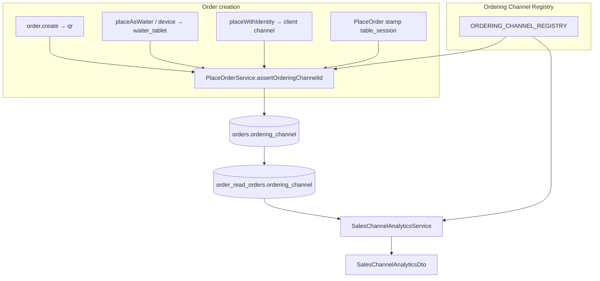

# ORDERING-CHANNEL-GOVERNANCE-1 — Architecture Diagram

## Boundary

Business Identity `identityScope` (TABLE / WAITER / KIOSK) remains **display-sequence partitioning only** — not channel provenance.
