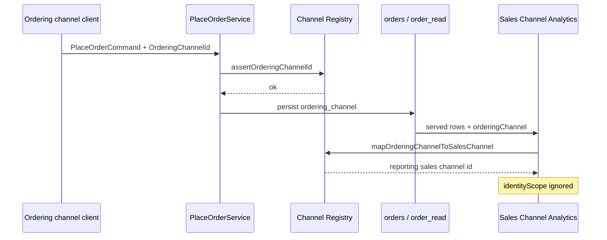

# ORDERING-CHANNEL-GOVERNANCE-1 — Data Flow Diagram

```mermaid
sequenceDiagram
  participant Channel as Ordering channel client
  participant Place as PlaceOrderService
  participant Reg as Channel Registry
  participant DB as orders / order_read
  participant Rep as Sales Channel Analytics

  Channel->>Place: PlaceOrderCommand + OrderingChannelId
  Place->>Reg: assertOrderingChannelId
  Reg-->>Place: ok
  Place->>DB: persist ordering_channel
  DB->>Rep: served rows + orderingChannel
  Rep->>Reg: mapOrderingChannelToSalesChannel
  Reg-->>Rep: reporting sales channel id
  Note over Rep: identityScope ignored
```
