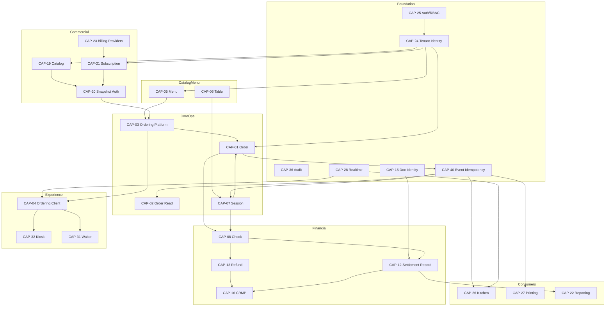

# CAPABILITY DEPENDENCY GRAPH

| Field | Value |
|-------|-------|
| **Program** | PLATFORM-CAPABILITY-DISCOVERY-1 |
| **Date** | 2026-07-30 |

---

## Foundational capabilities

These sit at the bottom of most dependency chains:

```
CAP-44 Architecture Governance
CAP-25 Auth & RBAC
CAP-24 Tenant Identity
CAP-36 Audit & Ops Taxonomy
CAP-41 Media & Storage
CAP-42 Country & Currency
CAP-40 Event Delivery & Idempotency
CAP-28 Realtime Platform
CAP-15 Operational Document Identity
```

---

## Mermaid — primary dependency flow



---

## Upstream / Downstream summary

| Capability | Upstream (depends on) | Downstream (dependents) |
|------------|----------------------|-------------------------|
| CAP-01 Order | Menu, Tenant, Ordering, Session optional | Read model, Kitchen, Print, Session consumers, Check membership, Notifications, Latency |
| CAP-08 Check | Session, Order membership, Doc Identity | SR, Refund, Split, Allocation, Reporting, CRMP attribution |
| CAP-19 Catalog | Auth/Admin, CountryCurrency | Snapshot, Pricing UI, Subscription bindings |
| CAP-20 Snapshot | Catalog, Subscription | Feature gates across Ordering/Admin |
| CAP-21 Subscription | Auth, Catalog/Snapshot, Billing providers | Entitlements product-wide |
| CAP-22 Reporting | Order facts, SR Net, sales channels | Admin reporting UI |
| CAP-16 CRMP | Tenant, SR publications | Register UI, Refund attribution, DRAP |
| CAP-27 Printing | Order events, Device/Connector | Ops print |
| CAP-28 Realtime | Auth tickets | Client, Kitchen, Device consumers |
| CAP-29 Device | Realtime, Tenant | Screens, Connectors |

---

## Critical dependency chains

1. **Place order → fulfil**  
   `Auth/Tenant → Menu → Ordering → Order → Outbox → Kitchen/Print/Session/Notifications`

2. **Settle money**  
   `Session/Order → Check → Settlement Record → Reporting Net`  
   (+ optional `CRMP attribution`, `Refund`)

3. **Gate commercial features**  
   `Catalog publish → Snapshot bind → Entitlement resolve → Ordering/UI feature visibility`

4. **SaaS collect**  
   `Pricing/Catalog → Subscription checkout → PayPal/Tap webhook → Subscription active → Snapshot/entitlements`

5. **Register custody**  
   `Check SR publish → Attribution → Financial Shift window → (future) DRAP archive`

---

## Circular dependency detection

| Pair / cycle | Observation |
|--------------|-------------|
| Order ↔ Session | **Risk:** Session consumes Order events (intended) but legacy inline session aggregate writes create **bidirectional coupling**. ADR-010 mandates events-only session integration. |
| Catalog ↔ Subscription | **Managed duality:** Catalog SSOT for offerings; Subscription owns entitlement runtime/bindings. Not a write-cycle if boundaries held; **historical dual SSOT** when unbound (legacy plans). |
| Check ↔ CRMP | **Fail-open attribution:** Check does not wait on Register; Register must not own money. No hard cycle if fail-open preserved. |
| Reporting ↔ Settlement | Reporting consumes SR; must not write money. Safe if KPI ownership held. |
| Device ↔ Realtime | Device consumes Realtime connectivity SSOT; Realtime must not own devices. One-way. |
| Ops Runtime ↔ Order Outbox | **Ambiguity:** architecture package vs concrete outbox workers — documentation overlap, not a proven runtime cycle. |

**No hard circular write-authority cycle** was proven across monetary aggregate roots (Check remains sole monetary AR). Soft operational cycles exist around Session↔Order and Catalog↔Subscription bridging.

---

## Dependent capability tiers

| Tier | Capabilities |
|------|----------------|
| L0 Foundation | CAP-24,25,36,40,41,42,44,28,15 |
| L1 Product core | CAP-05,06,07,01,03,19,21 |
| L2 Financial | CAP-08–14,16–18,12,13 |
| L3 Experience & ops consumers | CAP-02,04,26,27,31,32,33,34,29,30,22,35,43 |
| L4 Cross-cutting maturity | CAP-37,38,39,45,46 |
