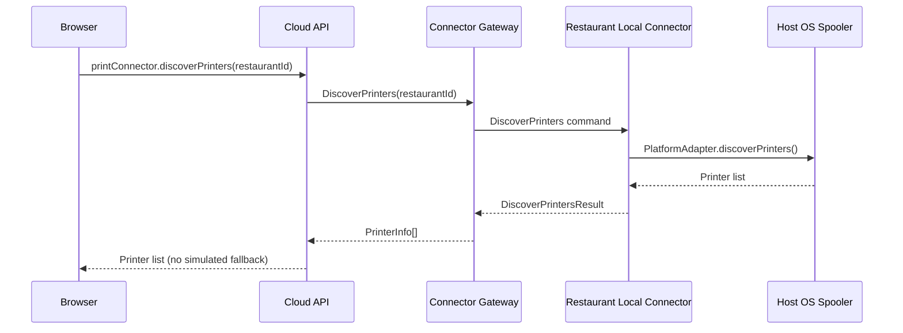
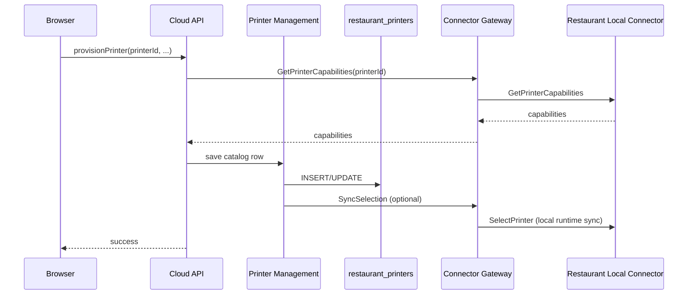
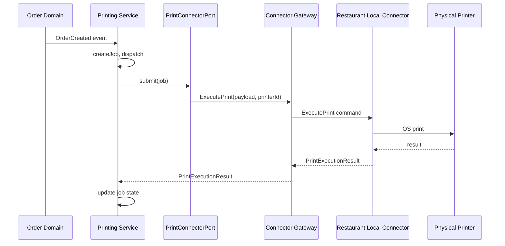
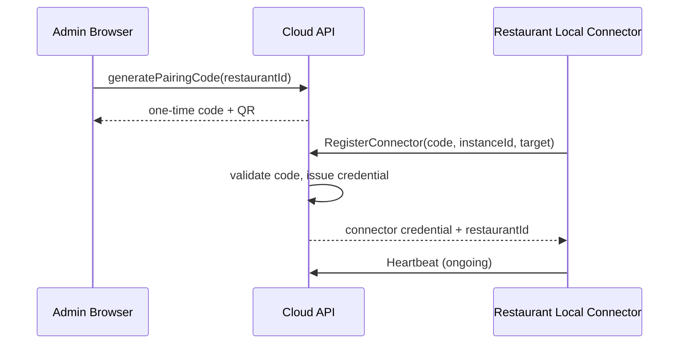
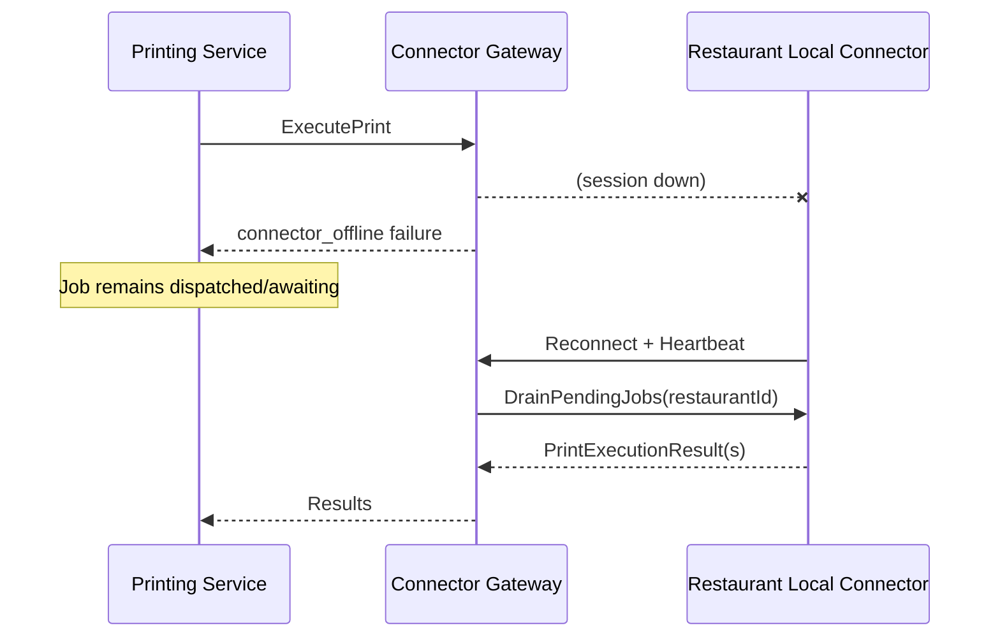
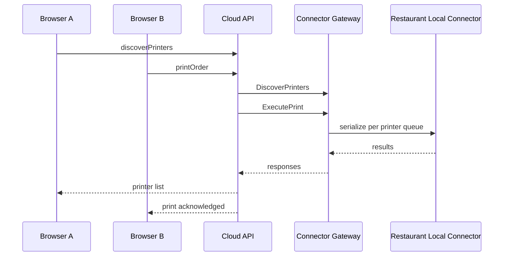

# PRINT-ARCHITECTURE-2 — Sequence Diagrams

**Date:** 2026-06-30

---

## SD-1 — Printer Discovery (Distributed)

---

## SD-2 — Provision Printer

---

## SD-3 — Order Print (Production Path)

---

## SD-4 — Connector Pairing

---

## SD-5 — RLC Offline / Job Queue

---

## SD-6 — Multi-Browser Concurrent Access

