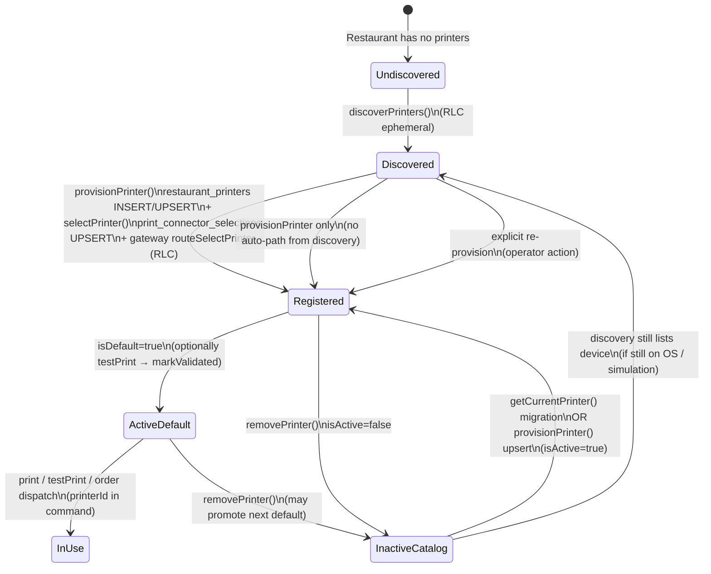

# PRINT-CONNECTOR-ONBOARDING-1A — Printer Catalog Lifecycle Investigation

**Date:** 2026-06-30  
**Phase:** Architecture investigation only (no code changes)  
**Scope:** Printer Catalog ownership, lifecycle, persistence contracts, and consistency  
**Prior work:** [`SIMULATED-PRINTER-INVESTIGATION.md`](./SIMULATED-PRINTER-INVESTIGATION.md) proved deletion is undone by legacy selection re-migration.

---

## Executive Summary

**Intended architecture (documented):** Cloud owns the **Printer Catalog** (`restaurant_printers`). RLC executes **ephemeral discovery**. `PrinterManagementService` orchestrates registration, default selection, and operational reads. Discovery never mutates the catalog.

**Actual architecture (implemented):** The catalog has **dual persistence** without coordinated lifecycle:

| Store | Documented role | Runtime role |
|-------|-----------------|--------------|
| `restaurant_printers` | SSOT for configured printers | Primary catalog (soft delete) |
| `print_connector_selections` | Legacy integration selection | Still written on provision; still read by `getCurrentPrinter` migration |

The system therefore has **missing lifecycle ownership**. Delete soft-deactivates the catalog row but leaves selection intact. `getCurrentPrinter()` re-migrates selection into the catalog and reactivates deleted printers. Discovery is correctly ephemeral and is **not** the reappearance mechanism.

**Production readiness:** The Printer Catalog architecture is **not production-ready** as a coherent lifecycle model. Domain services exist, but **ownership boundaries and delete/migration contracts are undefined and contradictory in code**.

**Architectural decisions required before implementation:**

1. Canonical status of `print_connector_selections` (retire, subordinate cache, or equal SSOT).
2. Coordinated delete contract across catalog + selection (+ optional RLC sync).
3. Migration semantics (`getCurrentPrinter` one-time vs permanent fallback).
4. Rediscovery/re-provision policy for previously deleted printers.
5. Whether catalog lifecycle belongs in ADR-ARCH-016 or a dedicated printer-catalog ADR.

---

## 1. Domain Ownership

### Intended owner (documented)

| Candidate | Intended role | Evidence |
|-----------|---------------|----------|
| **`restaurant_printers`** | **SSOT for configured/registered printers** | `PRINT-ARCHITECTURE-2/03-Connector-Placement.md` L16; `06-Discovery-Lifecycle.md` L15–18 |
| **`PrinterManagementService`** | **Lifecycle orchestration** (provision, remove, default, diagnostics) | `PRINT-UX-1/02-Printer-Management.md` L42; `PrinterManagementService` class comment L29–31 |
| **Discovery (RLC)** | **Execute only** — no catalog ownership | `06-Discovery-Lifecycle.md` L9–14 |
| **Connector** | **Runtime I/O** (discover, status, print) — not catalog | ADR-ARCH-016 Rule 6–7; `GatewayRoutedPrintConnectorApi` L35–36 |
| **`print_connector_selections`** | **Not catalog SSOT** — pre-UX-1 integration artifact | `PRINT-CONNECTOR-1/05-Workspace-Integration.md` L29; superseded by `restaurant_printers` in `PRINT-UX-1` |

Formal decision matrix:

```12:13:docs/engineering/programs/PRINT-ARCHITECTURE-2/12-Decision-Matrix.md
| 2 | Who owns printer discovery? | **RLC executes**; cloud presents and provisions catalog |
| 3 | Who owns printer selection? | **Cloud catalog SSOT**; RLC validates at execution |
```

### Actual owner (implemented)

| Component | What it actually owns |
|-----------|----------------------|
| **`DrizzleRestaurantPrinterRepository`** | Registered printer rows, `isActive`, `isDefault`, capabilities snapshot |
| **`DrizzlePrinterSelectionRepository`** | Per-restaurant connector selection row (PK = `restaurantId`) |
| **`PrinterManagementService`** | Orchestrates both stores on provision/set-default/rename; migration on read |
| **`GatewayRoutedPrintConnectorApi`** | Declares selection persistence is `PrinterSelectionRepository` only for `getSelectedPrinter` |
| **RLC `InMemoryPrinterSelectionRepository`** | Separate in-process selection on connector host (not cloud DB) |

```34:37:server/connector-gateway/adapters/GatewayRoutedPrintConnectorApi.ts
/**
 * Routes all native connector operations through Connector Gateway → RLC.
 * Cloud printer selection persistence uses PrinterSelectionRepository only.
 */
```

**Conclusion:** **Intended owner = `restaurant_printers` + `PrinterManagementService`.**  
**Actual owner = split between catalog and legacy selection**, with migration code elevating selection to effective SSOT when no active default exists.

---

## 2. Source of Truth Matrix

| Concern | Documented SSOT | Read path (code) | Write path (code) | Actual SSOT quality |
|---------|-------------------|------------------|-------------------|---------------------|
| **Registered printers** | `restaurant_printers` | `listPrinters` → `listByRestaurant` (`isActive=true`) | `provisionPrinter` → `save`; `removePrinter` → soft delete | **Primary**, but **overwritable** by migration upsert |
| **Discovered printers** | None (ephemeral RLC snapshot) | `discoverPrinters` → gateway → RLC | None | **Correct** — no persistence |
| **Selected / default printer** | `restaurant_printers.isDefault` | `getCurrentPrinter` → `getDefault` **then** `getSelectedPrinter` fallback | `provisionPrinter`, `setDefaultPrinter`, `selectPrinter` | **Dual** — catalog default + `print_connector_selections` |
| **Printer status** | RLC live probe | `getStatus` / `getPrinterCapabilities` via gateway | None (read-only) | **Correct** — ephemeral per request |
| **Capabilities snapshot** | `restaurant_printers.capabilitiesJson` | Catalog row | `provisionPrinter` at provision time | **Catalog-owned** snapshot |
| **Connector runtime selection** | Documented: synced from cloud catalog | RLC `getSelectedPrinter` → local `InMemoryPrinterSelectionRepository` | `routeSelectPrinter` → RLC `discover_printers` action=select | **Split** — cloud DB + RLC memory |

### `getCurrentPrinter` read precedence (actual)

```46:61:server/printer-management/services/PrinterManagementService.ts
  async getCurrentPrinter(restaurantId: number): Promise<CurrentPrinterDto> {
    let printer = await this.printers.getDefault(restaurantId);

    if (!printer) {
      const legacy = await this.connector.getSelectedPrinter(restaurantId);
      if (legacy) {
        printer = await this.printers.save({
          restaurantId,
          printerId: legacy.printerId,
          displayName: legacy.printerName,
          platform: legacy.platform,
          transport: legacy.transport,
          isDefault: true,
        });
      }
    }
```

This inverts documented precedence when catalog default is absent: **selection becomes write authority for catalog**.

---

## 3. Lifecycle

### Documented lifecycle

From `PRINT-ARCHITECTURE-2/06-Discovery-Lifecycle.md` L22–34 and `PRINT-UX-1/03-Provisioning-Lifecycle.md` L9–25:

```
Discovery → Select (UI) → Capabilities → Provision (catalog) → Test → Ready
```

From `06-Discovery-Lifecycle.md` L44–45 (OS removal vs admin removal):

- Printer removed from OS → status `printer_offline`; **catalog row remains until admin removes**
- Stale catalog → diagnostics compare catalog vs live discovery

### Implemented lifecycle (all transitions)



### Transition reference table

| Transition | Trigger | Writer | Stores touched |
|------------|---------|--------|----------------|
| **Discovery** | `discoverPrinters` query | None | None |
| **Registration** | `provisionPrinter` | `PrinterManagementService` | `restaurant_printers` INSERT/UPSERT; `print_connector_selections` via `selectPrinter`; RLC via gateway |
| **Selection (default)** | `setDefaultPrinter` | `PrinterManagementService` | `restaurant_printers.isDefault`; `selectPrinter` |
| **Selection (rename default)** | `renamePrinter` (if default) | `PrinterManagementService` | `restaurant_printers.displayName`; `selectPrinter` |
| **Activation / validation** | `testPrint` success | `PrinterManagementService` | `lastValidatedAt` on catalog row |
| **Usage** | `print` / order dispatch | Printing path via gateway | None on catalog; command carries `printerId` |
| **Deletion** | `removePrinter` | `DrizzleRestaurantPrinterRepository.remove` | `restaurant_printers.isActive=false` only |
| **Rediscovery** | `discoverPrinters` | None | None |
| **Re-registration (bug path)** | `getCurrentPrinter` with empty default + stale selection | `PrinterManagementService` | `restaurant_printers` UPSERT `isActive=true` |
| **Re-registration (intended)** | `provisionPrinter` | `PrinterManagementService` | Same as registration |

### Undefined transitions (gaps)

| Gap | Detail |
|-----|--------|
| Delete → clear selection | **Not implemented** |
| Delete → RLC deselect | **Not implemented** |
| Migration → respect soft delete | **Not implemented** — upsert ignores prior `isActive=false` |
| Auto re-register on rediscovery | **Not implemented** (correct per docs) |

---

## 4. Persistence Responsibilities

### `restaurant_printers`

| Attribute | Detail |
|-----------|--------|
| **Purpose** | Restaurant printer catalog — registered devices operators manage |
| **Owner (intended)** | Cloud `PrinterManagementService` / `RestaurantPrinterRepository` |
| **Lifecycle** | Created/updated on provision; soft-deleted on remove; default flag mutable |
| **Write authority** | `provisionPrinter`, `removePrinter`, `renamePrinter`, `setDefaultPrinter`, `markValidated`, **migration `save()`** |
| **Read authority** | `listPrinters`, `getCurrentPrinter` (primary), `getDiagnostics`, workspace presence |
| **Schema** | `drizzle/0049_restaurant_printers.sql`; unique `(restaurantId, printerId)` |

Key fields: `printerId`, `displayName`, `platform`, `transport`, `isDefault`, `isActive`, `capabilitiesJson`, `lastValidatedAt`.

List/read filters active only:

```27:35:server/printer-management/infrastructure/DrizzleRestaurantPrinterRepository.ts
  async listByRestaurant(restaurantId: number): Promise<RestaurantPrinterDto[]> {
    // ...
      .where(and(eq(restaurantPrinters.restaurantId, restaurantId), eq(restaurantPrinters.isActive, true)))
```

Upsert reactivates inactive rows:

```106:115:server/printer-management/infrastructure/DrizzleRestaurantPrinterRepository.ts
      .onDuplicateKeyUpdate({
        set: {
          displayName: input.displayName,
          platform: input.platform,
          transport: input.transport,
          isActive: true,
```

### `print_connector_selections`

| Attribute | Detail |
|-----------|--------|
| **Purpose** | Per-restaurant connector printer choice (PRINT-CONNECTOR-1 integration layer) |
| **Owner (original)** | `PrintConnectorApi.selectPrinter` / `PrinterSelectionRepository` |
| **Lifecycle** | Created/updated on `selectPrinter`; **no delete path in codebase** |
| **Write authority** | `GatewayRoutedPrintConnectorApi.selectPrinter` → `saveSelection`; triggered by `provisionPrinter`, `setDefaultPrinter`, `renamePrinter` (default only) |
| **Read authority** | `getSelectedPrinter` → migration in `getCurrentPrinter` only (production path) |
| **Schema** | `drizzle/0048_print_connector.sql`; PK = `restaurantId` (one row per restaurant) |

```1:11:drizzle/0048_print_connector.sql
-- PRINT-CONNECTOR-1 — per-restaurant printer selection (integration layer only)
CREATE TABLE `print_connector_selections` (
  `restaurantId` int NOT NULL,
  `printerId` varchar(128) NOT NULL,
  ...
  CONSTRAINT `print_connector_selections_restaurant_id` PRIMARY KEY(`restaurantId`)
);
```

### RLC local selection (non-DB)

| Attribute | Detail |
|-----------|--------|
| **Store** | `InMemoryPrinterSelectionRepository` on RLC host |
| **Purpose** | Runtime selection for embedded `PrintConnectorRuntime` on connector process |
| **Lifecycle** | In-memory only; lost on RLC restart |
| **Write** | `routeSelectPrinter` → RLC `discover_printers` action=select |
| **Read** | RLC diagnostics (`WindowsRuntimeDiagnostics`) |

This is a **third selection surface**, not coordinated with catalog delete.

### Discovery (no table)

| Attribute | Detail |
|-----------|--------|
| **Purpose** | Live OS/simulated printer enumeration |
| **Owner** | RLC `PlatformAdapter.discoverPrinters()` |
| **Persistence** | **None** |
| **Write authority** | **None** |
| **Read authority** | `PrintWorkspaceDiscoveryReadService`, `PrinterManagementService.discoverPrinters` |

---

## 5. Delete Contract

### Documented intent

| Source | Statement |
|--------|-----------|
| `PRINT-UX-1/02-Printer-Management.md` L18 | Remove via `printerManagement.commands.removePrinter` |
| `06-Discovery-Lifecycle.md` L44 | Printer removed from OS → catalog **remains until admin removes** |
| `09-Failure-Recovery.md` L56 | Wrong printer → **Re-provision in Management** (implies delete + replace is operator-driven) |

Documentation implies **administrative removal from catalog** is durable until explicit re-provision. It does **not** document selection cleanup or migration interaction.

### Implementation assumption (inferred from code)

The implementation behaves closest to **interpretation A + partial D**:

| Interpretation | Meaning | Supported? |
|----------------|---------|------------|
| **A — Forget registration only** | Remove from active catalog | **Yes** — `isActive=false` |
| **B — Forget selection only** | Clear connector selection | **No** |
| **C — Forget both** | Clear catalog + selection | **No** |
| **D — Disable printer** | Soft delete, row retained | **Yes** |
| **E — Ignore future discovery** | Block rediscovery auto-add | **N/A** — discovery never auto-adds |

**Critical gap:** Implementation assumes registration can be forgotten independently of selection, but **read path treats selection as authoritative fallback**, undermining A and D.

```114:116:server/printer-management/services/PrinterManagementService.ts
  async removePrinter(restaurantId: number, printerId: string): Promise<boolean> {
    return this.printers.remove(restaurantId, printerId);
  }
```

No call to `connector.selectPrinter` clear, no `PrinterSelectionRepository` delete API exists.

---

## 6. Rediscovery Contract

### Documented intent

- Discovery is a **live snapshot**, not catalog mutation (`06-Discovery-Lifecycle.md` L18).
- Same device may appear again in discovery after deletion.
- Operator must **explicitly provision** to register again (`03-Provisioning-Lifecycle.md`).

### Current behavior

| Scenario | Behavior | Evidence |
|----------|----------|----------|
| Discovery after delete | Returns printer if still on OS / simulation | `SimulatedPlatformAdapter` deterministic IDs |
| Auto-recreate registration | **No** | No code writes catalog from discovery |
| Reactivate soft-deleted row | **Yes** (unintended) | `save()` upsert `isActive=true` via migration or re-provision |
| Require explicit provisioning | **Yes** (intended path) | `provisionPrinter` only |
| Remain discovered-only | **Yes** | Discovery queries return list without DB writes |

### Re-provision of same `printerId`

`save()` uses `onDuplicateKeyUpdate` — re-provisioning or migration **reactivates** the same row rather than creating a duplicate. Unique index `(restaurantId, printerId)` prevents duplicate active rows.

**Conclusion:** Rediscovery contract is **correct for discovery**; **incorrect for catalog** when migration or upsert reactivates without operator intent.

---

## 7. Selection Contract

### What is `print_connector_selections`?

| Classification | Applies? | Rationale |
|----------------|----------|-----------|
| **Configuration** | Partial | Stores chosen printer metadata |
| **Cache** | Partial | Denormalized copy of catalog default |
| **Reference** | Partial | Points to `printerId` in discovery namespace |
| **Source of truth** | **De facto yes on read fallback** | Migration writes catalog from selection |
| **Migration artifact** | **Documented yes** | `PRINT-UX-1/02-Printer-Management.md` L55 |

### Evolution timeline (evidence)

1. **PRINT-CONNECTOR-1** — `print_connector_selections` introduced as per-restaurant printer choice (`0048`, `05-Workspace-Integration.md` L29).
2. **PRINT-UX-1** — `restaurant_printers` introduced as management catalog (`0049`).
3. **PRINT-CONNECTOR-DISCOVERY-1** — `getSelectedPrinter` reads cloud `PrinterSelectionRepository` only; catalog not mentioned for selection read.
4. **Migration code** — bridges old → new on `getCurrentPrinter`, documented as "first read" but implemented as **conditional fallback**.

### Why it is not purely legacy

Selection is **still written** on every provision and default change:

```87:111:server/printer-management/services/PrinterManagementService.ts
  async provisionPrinter(command: ProvisionPrinterCommand): Promise<RestaurantPrinterDto> {
    // ...
    const saved = await this.printers.save({ /* ... */ });
    await this.connector.selectPrinter({ /* ... */ });
    return saved;
  }
```

**Conclusion:** `print_connector_selections` is a **migration artifact that was never retired**, still actively written, and still read as **fallback SSOT** — not a read-only cache.

---

## 8. Legacy Analysis — `getCurrentPrinter()` Migration

### Documented characterization

```55:55:docs/engineering/programs/PRINT-UX-1/02-Printer-Management.md
Legacy `print_connector_selections` rows are migrated into `restaurant_printers` on first `getCurrentPrinter` read.
```

```47:47:docs/engineering/programs/PRINT-UX-1/09-Final-Executive-Summary.md
Shared `PrinterSelectionDialog` used from workspace and management. Legacy connector selections auto-migrate on first current-printer read.
```

**Documented:** transitional, one-time, compatibility.

### Actual characterization

| Aspect | Documented | Implemented |
|--------|----------|-------------|
| Frequency | First read only | **Every read** where `getDefault()` is null and selection exists |
| Respects soft delete | Not stated | **No** — upsert reactivates |
| Idempotency marker | Not stated | **None** — no "migration completed" flag |
| Clears selection after migrate | Not stated | **No** |

**Classification:** **Compatibility code behaving as permanent fallback SSOT**, not one-time migration. Functionally **forgotten legacy** relative to PRINT-UX-1 catalog model.

### All production callers of `getCurrentPrinter`

| Caller | File | Side effect risk |
|--------|------|------------------|
| tRPC `printWorkspace.read.getCurrentPrinter` | `printWorkspaceRouter.ts` L72–74 | **Yes** — may migrate |
| `useOperationalPrintStatus` | `useOperationalPrintStatus.ts` L20–23 | **Yes** — polls every 30s |
| `useCurrentPrinter` | `useCurrentPrinter.ts` L6–7 | **Yes** |
| `PrintWorkspacePresenceReadService.getDiagnosticsSummary` | L144 | **Yes** |
| `PrintWorkspacePresenceReadService.getTechnicalReport` | L187 | **Yes** |
| `PrinterManagementService.testPrint` | L170 | **Yes** — before print |

### All callers of `getSelectedPrinter` (cloud)

| Caller | File |
|--------|------|
| `PrinterManagementService.getCurrentPrinter` (migration) | `PrinterManagementService.ts` L50 |
| `GatewayRoutedPrintConnectorApi.getSelectedPrinter` | `GatewayRoutedPrintConnectorApi.ts` L110–111 |
| RLC diagnostics (local runtime) | `WindowsRuntimeDiagnostics.ts` L29 |

`getSelectedPrinter` is **not** exposed as a public tRPC procedure (architecture guard: `discovery.architecture.guards.test.ts`).

---

## 9. Consistency Rules

### Guarantees evaluated

| Rule | Guaranteed? | Why / why not |
|------|-------------|---------------|
| **No orphan selections** | **No** | `removePrinter` does not clear `print_connector_selections` |
| **No orphan registrations** | **No** | Soft-deleted rows remain (`isActive=false`); not orphaned but inactive |
| **No duplicate registrations** | **Yes** (same `printerId`) | Unique index `(restaurantId, printerId)` |
| **No stale references** | **No** | Selection references deleted printers; migration revives them |
| **Selection ⊆ active catalog** | **No** | Selection can exist without active catalog row |
| **Default ⊆ active catalog** | **Mostly** | `getDefault` filters `isActive=true`, but migration can recreate |
| **Discovery ⊄ catalog** | **Yes** | Discovery never writes DB |

### Why consistency is not guaranteed

1. **Two write paths to catalog** — `provisionPrinter` and migration `save()`.
2. **Selection write without delete** — asymmetric lifecycle.
3. **Upsert ignores delete state** — `isActive: true` on any `save()`.
4. **RLC selection is a third store** — in-memory, not invalidated on cloud delete.
5. **No transactional coupling** — catalog save and `selectPrinter` are sequential, not atomic.

---

## 10. Domain Invariants

### Invariants documented (inferred from design — not constitutional ADR)

| ID | Invariant | Source |
|----|-----------|--------|
| INV-1 | Discovery never mutates catalog | `06-Discovery-Lifecycle.md` L18 |
| INV-2 | Catalog is SSOT for **configured** printers | `06-Discovery-Lifecycle.md` L18; `03-Connector-Placement.md` L16 |
| INV-3 | Cloud owns default printer selection | `07-Printing-Lifecycle.md` L13; Decision Matrix #3 |
| INV-4 | RLC executes discovery; cloud presents results | `06-Discovery-Lifecycle.md` L9–14 |
| INV-5 | OS printer removal ≠ catalog removal | `06-Discovery-Lifecycle.md` L44 |
| INV-6 | Diagnostics compare catalog vs live discovery | `06-Discovery-Lifecycle.md` L45; `getDiagnostics` L155–165 |
| INV-7 | Tenant isolation on catalog rows | `05-Authentication-Model.md` L43 |
| INV-8 | Operator provisions explicitly (no auto-register) | `03-Provisioning-Lifecycle.md` |

### Invariants implied by UX but not enforced in code

| ID | Invariant | Enforced? |
|----|-----------|-----------|
| INV-9 | Selected printer must exist in active catalog | **No** — migration creates from selection |
| INV-10 | Inactive printer cannot be selected/default | **No** — selection survives delete |
| INV-11 | Delete is durable until re-provision | **No** — migration reactivates |
| INV-12 | Migration runs once per restaurant | **No** — runs on every qualifying read |
| INV-13 | Selection cannot recreate deleted entities | **Violated** |
| INV-14 | Catalog and selection lifecycle are coordinated | **Violated** |

### Invariants correctly enforced

| ID | Invariant | Evidence |
|----|-----------|----------|
| INV-1 | Discovery read-only | No DB writes in discovery services |
| INV-4 | RLC discovery execution | Gateway routes to RLC command |
| INV-7 | `restaurantId` scoping | Repository queries filter by tenant |

---

## 11. Risks

### Architectural risks

| Risk | Severity | Description |
|------|----------|-------------|
| **Dual SSOT** | High | Catalog and selection disagree; read path picks selection |
| **Migration as permanent fallback** | High | Documented transitional code acts as ongoing write path |
| **Triple selection state** | Medium | Cloud catalog + cloud selection + RLC in-memory |
| **No catalog ADR** | Medium | Lifecycle not in ADR-ARCH-016; only program docs |
| **PRINT-UX-1 "complete" vs lifecycle gaps** | Medium | Executive summary claims production-ready; delete contract broken |

### Operational risks

| Risk | Impact |
|------|--------|
| Deleted printers reappear after refresh | Operator trust erosion; incorrect print target |
| Stale simulated printers in selection | Test print to invalid device in simulation mode |
| Admin confusion (registered vs discovered) | Two UIs show different truths |
| `testPrint` triggers migration | Side-effecting read before print |

### Data consistency risks

| Risk | Mechanism |
|------|-----------|
| Reactivation without audit trail | Upsert sets `isActive=true` silently |
| Orphan `print_connector_selections` | No FK to `restaurant_printers`; no delete API |
| `isDefault` drift | Delete promotes next default in catalog but not selection if not default deleted |
| Capabilities snapshot stale | Only updated on provision, not on rediscovery |

### Future scalability risks

| Risk | Detail |
|------|--------|
| Multi-printer departments | `print_connector_selections` PK is one row per restaurant — cannot model multiple selections |
| Multi-connector per site | Catalog is per restaurant, not per connector instance |
| Selection sync at scale | Every default change writes DB + gateway command — no batch/reconcile |
| Migration debt | Cannot retire `print_connector_selections` without explicit cutover program |

---

## Evidence Index

| Topic | Primary references |
|-------|-------------------|
| Catalog SSOT (documented) | `docs/engineering/programs/PRINT-ARCHITECTURE-2/06-Discovery-Lifecycle.md` |
| Catalog placement | `docs/engineering/programs/PRINT-ARCHITECTURE-2/03-Connector-Placement.md` |
| Selection ownership | `docs/engineering/programs/PRINT-ARCHITECTURE-2/07-Printing-Lifecycle.md` |
| Provisioning flow | `docs/engineering/programs/PRINT-UX-1/03-Provisioning-Lifecycle.md` |
| Legacy migration (documented) | `docs/engineering/programs/PRINT-UX-1/02-Printer-Management.md` L55 |
| Original selection table | `drizzle/0048_print_connector.sql` |
| Catalog table | `drizzle/0049_restaurant_printers.sql` |
| Orchestration | `server/printer-management/services/PrinterManagementService.ts` |
| Catalog repository | `server/printer-management/infrastructure/DrizzleRestaurantPrinterRepository.ts` |
| Selection repository | `server/print-connector/infrastructure/persistence/DrizzlePrinterSelectionRepository.ts` |
| Gateway connector API | `server/connector-gateway/adapters/GatewayRoutedPrintConnectorApi.ts` |
| Discovery read service | `server/print-workspace/read/services/PrintWorkspaceDiscoveryReadService.ts` |
| Workspace read entry | `server/print-workspace/printWorkspaceRouter.ts` |
| Prior root-cause analysis | `SIMULATED-PRINTER-INVESTIGATION.md` |

---

## Final Recommendation

### Is the current Printer Catalog architecture production-ready?

**No.** The **documented** model (cloud catalog SSOT, ephemeral discovery, explicit provisioning) is sound and aligns with ADR-ARCH-016 distributed printing topology. The **implemented** lifecycle is **not production-ready** because:

1. **Ownership is split** between `restaurant_printers` and `print_connector_selections` without a coordinated contract.
2. **Delete semantics are incomplete** relative to both documented admin intent and operator expectations.
3. **`getCurrentPrinter` migration violates** documented one-time migration semantics and catalog SSOT.
4. **Side-effecting reads** (migration on query) create hidden write paths that bypass management commands.
5. **No constitutional ADR** defines catalog lifecycle invariants (unlike connector session in ADR-ARCH-016).

Software UX and API surfaces from PRINT-UX-1 are complete; **catalog lifecycle integrity is not**.

### Architectural decisions required before implementation

| # | Decision | Options to resolve (decision phase only — not prescribed here) |
|---|----------|----------------------------------------------------------------|
| **D-1** | Status of `print_connector_selections` | Retire after migration / read-only cache / remain dual SSOT |
| **D-2** | Delete contract | Coordinated catalog+selection clear / hard delete / tombstone with migration guard |
| **D-3** | Migration lifecycle | One-time job vs guarded fallback vs remove entirely |
| **D-4** | Default printer authority | `restaurant_printers.isDefault` only vs selection table |
| **D-5** | RLC selection sync | Cloud-authoritative push vs RLC stateless command `printerId` only |
| **D-6** | Rediscovery after delete | Explicit provision only (documented) vs auto-reactivate policy |
| **D-7** | ADR scope | Amend ADR-ARCH-016 vs new printer-catalog ADR |
| **D-8** | Read purity | `getCurrentPrinter` must not write; migration via explicit command or batch job |

### Suggested next program (investigation outcome only)

**PRINT-CONNECTOR-ONBOARDING-1B — Architecture Decision: Printer Catalog Lifecycle** should resolve D-1 through D-8 before any implementation program modifies delete, migration, or selection stores.

---

**Investigation complete. No code modified.**
