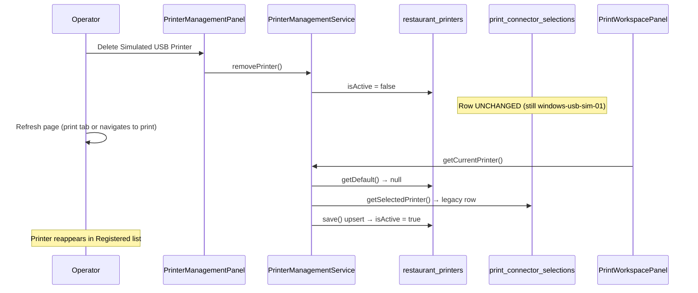

# PRINT-CONNECTOR-ONBOARDING-1 — Simulated USB Printer Reappears After Deletion

**Date:** 2026-06-30  
**Phase:** Investigation only (no code changes)  
**Problem:** Deleting "Simulated USB Printer" succeeds; after refreshing the page, the printer automatically reappears.

---

## Executive Summary

**Root cause:** Printer deletion is a **soft delete** on `restaurant_printers` only. It does **not** clear the legacy connector selection in `print_connector_selections`. On page refresh, Print Workspace loads `getCurrentPrinter`, which **automatically re-migrates** the stale selection back into `restaurant_printers` and **reactivates** the row (`isActive: true` via upsert).

**"Simulated USB Printer" origin:** Hardcoded in `SimulatedPlatformAdapter` at runtime discovery time (not database seed). It is returned whenever the RLC platform adapter runs in simulation mode (`NODE_ENV=test` or `PRINT_CONNECTOR_MODE=simulated`, and `RLC_RUNTIME !== "1"`).

**Discovery does not recreate registered printers by itself.** Discovery is ephemeral and read-only. Reappearance in the **Registered printers** list is caused by the **legacy selection migration path**, not by discovery merging into the catalog.

---

## Root Cause

### Primary mechanism — legacy selection re-migration

1. User provisions "Simulated USB Printer" → row written to `restaurant_printers` **and** `print_connector_selections`.
2. User deletes printer → `restaurant_printers.isActive` set to `false`; **`print_connector_selections` row remains**.
3. Page refresh loads Print Workspace (or any code path calling `getCurrentPrinter`).
4. `getCurrentPrinter` finds no active default, reads legacy selection, calls `printers.save(...)`.
5. `save()` upsert sets `isActive: true` on duplicate key → **soft-deleted printer is reactivated**.

### Contributing factor — simulated printer is rediscoverable

If the operator opens **Add printer**, discovery returns the same deterministic simulated printer (`windows-usb-sim-01`) whenever RLC runs in simulation mode. That enables manual re-provisioning but is **not** the automatic reappearance path on refresh.

---

## 1. Where Does "Simulated USB Printer" Originate?

| Source | Verdict | Evidence |
|--------|---------|----------|
| Hardcoded runtime fixture | **Yes (primary)** | `SimulatedPlatformAdapter.samplePrinters()` |
| Seed data / migration | **No** | `0049_restaurant_printers.sql` creates empty table |
| Bootstrap auto-provision | **No** | Bootstrap composes runtime only |
| Database default row | **No** | No seed inserts |
| Configuration file | **No** | No config entry for this name |
| UI mock | **No** | UI reads API results |
| RLC / platform discovery | **Yes (delivery path)** | Gateway → Session → RLC → `WindowsPlatformAdapter` → `SimulatedPlatformAdapter` when simulation mode active |

### Code — name and ID generation

```5:16:server/print-connector/platform/SimulatedPlatformAdapter.ts
function samplePrinters(platform: PrinterInfo["platform"]): PrinterInfo[] {
  const transports: TransportType[] = ["usb", "ethernet", "wifi", "bluetooth"];
  return transports.map((transport, index) => ({
    id: `${platform}-${transport}-sim-01`,
    name: `Simulated ${transport.toUpperCase()} Printer`,
    platform,
    transport,
    isDefault: index === 0,
    isOnline: true,
    location: "simulated",
    manufacturer: "MineuQR",
  }));
}
```

On Windows with simulation enabled, USB transport yields:
- **ID:** `windows-usb-sim-01`
- **Name:** `Simulated USB Printer`

### Code — when simulation is used on Windows

```22:25:server/print-connector/platform/windows/WindowsPlatformAdapter.ts
  async discoverPrinters(): Promise<PrinterInfo[]> {
    if (shouldUseSimulatedConnector() && process.env.RLC_RUNTIME !== "1") {
      return new SimulatedPlatformAdapter("windows").discoverPrinters();
    }
```

```39:44:server/print-connector/platform/resolveHostPlatform.ts
export function shouldUseSimulatedConnector(): boolean {
  return (
    process.env.NODE_ENV === "test" ||
    process.env.PRINT_CONNECTOR_MODE === "simulated"
  );
}
```

Production RLC (`RLC_RUNTIME=1`) is documented to forbid simulated discovery (`docs/engineering/programs/PRINT-CONNECTOR-WINDOWS-1/02-Windows-Architecture.md`).

---

## 2. Page Refresh — Complete Execution Flow

### A. Registered printers list (Printer Management tab)

```
Browser refresh (section=printer-management)
  ↓
Dashboard.tsx mounts PrinterManagementPanel
  ↓
trpc.printerManagement.read.listPrinters.useQuery({ restaurantId })
  ↓
printerManagementRouter.read.listPrinters
  ↓
PrinterManagementService.listPrinters()
  ↓
DrizzleRestaurantPrinterRepository.listByRestaurant()
  ↓
SELECT * FROM restaurant_printers WHERE restaurantId = ? AND isActive = true
  ↓
Response → UI "Registered printers" list
```

**Components involved:** `PrinterManagementPanel.tsx`, `printerManagementRouter.ts`, `PrinterManagementService.ts`, `DrizzleRestaurantPrinterRepository.ts`.

This path alone does **not** call discovery or `getCurrentPrinter`.

### B. Print Workspace refresh (triggers re-migration)

```
Browser refresh (section=print)
  ↓
Dashboard.tsx mounts PrintWorkspacePanel
  ↓
useOperationalPrintStatus() + useCurrentPrinter()
  ↓
trpc.printWorkspace.read.getCurrentPrinter.useQuery({ restaurantId })
  ↓
printWorkspaceRouter.read.getCurrentPrinter
  ↓
PrinterManagementService.getCurrentPrinter()   ← SAME service as management
  ↓
  1. printers.getDefault(restaurantId)          → null (isActive=false)
  2. connector.getSelectedPrinter(restaurantId)   → STALE row in print_connector_selections
  3. printers.save({ ...legacy })               → REACTIVATES printer (isActive=true)
  ↓
Optional status: GatewayRoutedPrintConnectorApi.getStatus() → Gateway → Session → RLC
```

**Components involved:** `PrintWorkspacePanel.tsx`, `useOperationalPrintStatus.ts`, `printWorkspaceRouter.ts`, `PrinterManagementService.ts`, `GatewayRoutedPrintConnectorApi.ts`, `ConnectorGatewayService`, `SessionConnectorExecutionPort`, RLC runtime.

### C. Discovery flow (if Add printer or discover endpoint runs)

```
PrinterSelectionDialog / discoverPrinters query
  ↓
printWorkspace.read.discoverPrinters OR printerManagement.read.discoverPrinters
  ↓
PrintWorkspaceDiscoveryReadService / PrinterManagementService.discoverPrinters
  ↓
GatewayRoutedPrintConnectorApi.discoverPrinters()
  ↓
ConnectorGatewayService.routeDiscoverPrinters()
  ↓
SessionConnectorExecutionPort.executeDiscoverPrinters()
  ↓
ConnectorCommandRouter → RLC transport command discover_printers
  ↓
RuntimeConnectorCommandHandler → LocalConnectorRuntimeFacade.discoverPrinters()
  ↓
PrintConnectorRuntime.discoverPrinters() → PlatformAdapter.discoverPrinters()
  ↓
SimulatedPlatformAdapter (if simulation mode) OR native OS discovery
  ↓
Ephemeral PrinterInfo[] returned (no DB write)
```

---

## 3. Is the Printer Actually Deleted?

| Question | Answer | Evidence |
|----------|--------|----------|
| Which repository receives delete? | `DrizzleRestaurantPrinterRepository.remove()` | `PrinterManagementService.removePrinter()` → `this.printers.remove()` |
| Is database row removed? | **No — soft delete** | `SET isActive = false, isDefault = false` |
| Is only UI state removed? | **No** | Mutation hits server; list filters `isActive = true` |
| Is deletion persisted? | **Partially** | Row remains in DB with `isActive=false` |
| Is another process recreating it? | **Yes — `getCurrentPrinter` migration** | Reads `print_connector_selections`, calls `save()` upsert |

### Delete implementation

```141:160:server/printer-management/infrastructure/DrizzleRestaurantPrinterRepository.ts
  async remove(restaurantId: number, printerId: string): Promise<boolean> {
    const db = await getDb();
    if (!db) return false;

    const target = await this.findByPrinterId(restaurantId, printerId);
    if (!target) return false;

    await db
      .update(restaurantPrinters)
      .set({ isActive: false, isDefault: false })
      .where(
        and(eq(restaurantPrinters.restaurantId, restaurantId), eq(restaurantPrinters.printerId, printerId))
      );
    // ...
    return true;
  }
```

### What delete does NOT do

- Does **not** delete row from `restaurant_printers`
- Does **not** clear `print_connector_selections` (written by `provisionPrinter` → `selectPrinter`)
- Does **not** call gateway/RLC to deselect printer

### Reactivation via upsert

```93:116:server/printer-management/infrastructure/DrizzleRestaurantPrinterRepository.ts
    await db
      .insert(restaurantPrinters)
      .values({ /* ... */ isActive: true, /* ... */ })
      .onDuplicateKeyUpdate({
        set: {
          displayName: input.displayName,
          platform: input.platform,
          transport: input.transport,
          isActive: true,   // ← reactivates soft-deleted printer
          // ...
        },
      });
```

### Legacy migration trigger

```46:61:server/printer-management/services/PrinterManagementService.ts
  async getCurrentPrinter(restaurantId: number): Promise<CurrentPrinterDto> {
    let printer = await this.printers.getDefault(restaurantId);

    if (!printer) {
      const legacy = await this.connector.getSelectedPrinter(restaurantId);
      if (legacy) {
        printer = await this.printers.save({
          restaurantId,
          printerId: legacy.printerId,
          displayName: legacy.printerName,
          platform: legacy.platform,
          transport: legacy.transport,
          isDefault: true,
        });
      }
    }
```

Documented as intentional one-time migration:

```55:55:docs/engineering/programs/PRINT-UX-1/02-Printer-Management.md
Legacy `print_connector_selections` rows are migrated into `restaurant_printers` on first `getCurrentPrinter` read.
```

---

## 4. Printer Discovery — Exact Flow and Persistence Behavior

| Behavior | Implementation |
|----------|----------------|
| Always recreate printers in DB? | **No** |
| Merge with existing catalog? | **No** |
| Overwrite `restaurant_printers`? | **No** |
| Insert missing printers automatically? | **No** |
| Return ephemeral snapshot? | **Yes** |

Discovery endpoints delegate to gateway and return live platform state:

```13:24:server/print-workspace/read/services/PrintWorkspaceDiscoveryReadService.ts
  async discoverPrinters(restaurantId: number): Promise<WorkspaceDiscoverPrintersResultDto> {
    const result = await this.gateway.routeDiscoverPrinters({
      restaurantId,
      requestedAt: new Date(this.now()).toISOString(),
    });

    return {
      printers: result.printers ?? [],
      discoveredAt: new Date(this.now()).toISOString(),
      unavailable: !result.routed,
      message: result.message,
    };
  }
```

**Persistence into catalog happens only on explicit `provisionPrinter`**, not on discovery.

```87:111:server/printer-management/services/PrinterManagementService.ts
  async provisionPrinter(command: ProvisionPrinterCommand): Promise<RestaurantPrinterDto> {
    const capabilities = await this.connector.getPrinterCapabilities({ /* ... */ });
    const saved = await this.printers.save({ /* ... */ });
    await this.connector.selectPrinter({ /* ... */ });  // also writes print_connector_selections
    return saved;
  }
```

---

## 5. Printer Identity

### Simulated printers

| Attribute | Value |
|-----------|-------|
| ID format | `{platform}-{transport}-sim-01` e.g. `windows-usb-sim-01` |
| Name | `Simulated {TRANSPORT} Printer` |
| USB path / device ID | **Not used** |
| Generated UUID | **No** — deterministic string |
| Connector ID | **Not part of printer ID** |
| Location marker | `location: "simulated"` |

Detection helper:

```15:17:server/print-connector/platform/windows/windowsPrinterId.ts
export function isSimulatedPrinterId(printerId: string): boolean {
  return printerId.includes("-sim-");
}
```

### Real Windows printers

| Attribute | Value |
|-----------|-------|
| ID format | `win-{printerName}` via `encodeWindowsPrinterId()` |
| Identity key | OS printer **name** (not USB path) |

### Duplicate detection

| Layer | Mechanism |
|-------|-----------|
| Database catalog | Unique index `(restaurantId, printerId)` on `restaurant_printers` |
| Discovery | No dedup across runs; same simulated IDs every time in simulation mode |
| UI provisioning picker | `filterProductionPrinters()` excludes simulated IDs from operator picker |

```411:413:client/src/lib/print-workspace/operationalViewModels.ts
export function filterProductionPrinters<T extends { id: string }>(printers: T[]): T[] {
  return printers.filter((p) => !isSimulatedPrinterId(p.id));
}
```

**Note:** Simulated printers can still enter the catalog if provisioned before filtering existed, via `printerManagement.read.discoverPrinters` (no client-side filter on that path), or via legacy migration.

---

## 6. Discovery Policy

| Policy | Intended? | Actual? |
|--------|-----------|---------|
| **Authoritative** (discovery defines catalog) | No | No |
| **Incremental** (add only new) | No | No |
| **Synchronizing** (merge add/remove) | No | No |
| **Replace-all** (discovery replaces catalog) | No | No |
| **Ephemeral snapshot** (live probe, no catalog writes) | **Yes** | **Yes** |

Discovery answers: *"What printers does the RLC see right now?"*  
Catalog answers: *"What printers has the operator registered?"* (`restaurant_printers`)

These layers are **separate by design** (`PrinterManagementService` orchestration). The bug is not discovery overwriting the catalog; it is **delete + migration inconsistency** across two persistence stores.

---

## 7. Delete Semantics

### Intended architecture (documented)

| Action | Expected store | Documented? |
|--------|----------------|-------------|
| Provision | `restaurant_printers` + connector selection | Yes — `PRINT-UX-1/02-Printer-Management.md` |
| Remove | `printerManagement.commands.removePrinter` | Yes — same doc |
| Legacy migration | One-time `print_connector_selections` → `restaurant_printers` | Yes — line 55 |

### Gaps (undocumented / inconsistent)

| Gap | Detail |
|-----|--------|
| Delete vs selection | No documented requirement to clear `print_connector_selections` on remove |
| Migration idempotency | Migration runs whenever `getDefault()` is empty, not only once |
| Soft delete vs upsert | `save()` reactivation contradicts delete semantics |
| Simulated printer provisioning | Architecture docs say production must not use simulated printers; no server-side block on `provisionPrinter` for `-sim-` IDs |

### Should future discovery recreate a deleted printer?

**No** — for registered catalog entries, deletion should persist until operator re-provisions.  
**Yes (ephemerally)** — discovery will always list simulated printers in simulation mode, but that should not repopulate the catalog without an explicit provision/migration action.

### Does implementation match intent?

**No.** Delete appears successful (list empty immediately after mutation + invalidate). Refresh via Print Workspace **undoes** the soft delete through legacy migration.

---

## 8. Why "Simulated USB Printer" Returns After Deletion

### Exact responsible component

**`PrinterManagementService.getCurrentPrinter()`** — specifically the legacy migration block that calls `DrizzleRestaurantPrinterRepository.save()` when `print_connector_selections` still contains the printer.

### Sequence (reproduction)



### Why it is specifically "Simulated USB Printer"

1. It was previously provisioned with ID `windows-usb-sim-01` from `SimulatedPlatformAdapter`.
2. `provisionPrinter` wrote that ID to **both** `restaurant_printers` and `print_connector_selections`.
3. Delete only deactivated `restaurant_printers`.
4. Migration restores the same ID and display name (`Simulated USB Printer`) from the stale selection row.

---

## 9. Architecture Assessment

| Classification | Applies? | Rationale |
|----------------|----------|-----------|
| Expected behavior | **No** | Operators expect delete to persist |
| Implementation bug | **Yes** | Delete does not clear selection; migration reactivates soft-deleted rows |
| Architectural inconsistency | **Yes** | Two SSOTs (`restaurant_printers` vs `print_connector_selections`) without coordinated lifecycle |
| Missing policy | **Yes** | No ADR/rule for delete semantics across catalog + connector selection |
| Missing persistence design | **Partial** | Soft delete exists but upsert ignores deleted state |
| Missing ADR | **Yes** | Printer catalog lifecycle (provision/delete vs discovery) not constitutional |

### Related prior findings

`PRINT-CONNECTOR-WINDOWS-1/01-Root-Cause-Analysis.md` documents simulated printers appearing in discovery when native discovery failed. Current code no longer falls back to simulation on catch (returns `[]`), but **explicit simulation mode** still returns simulated printers — separate from this delete/migration bug.

---

## 10. Evidence Index

| Topic | File | Lines |
|-------|------|-------|
| Simulated name/ID | `server/print-connector/platform/SimulatedPlatformAdapter.ts` | 5–16, 27–28 |
| Simulation gate | `server/print-connector/platform/resolveHostPlatform.ts` | 39–44 |
| Windows simulation branch | `server/print-connector/platform/windows/WindowsPlatformAdapter.ts` | 22–25 |
| Soft delete | `server/printer-management/infrastructure/DrizzleRestaurantPrinterRepository.ts` | 141–160 |
| Upsert reactivation | `server/printer-management/infrastructure/DrizzleRestaurantPrinterRepository.ts` | 93–116 |
| Legacy migration | `server/printer-management/services/PrinterManagementService.ts` | 46–61 |
| Provision writes selection | `server/printer-management/services/PrinterManagementService.ts` | 87–111 |
| Selection persistence | `server/print-connector/infrastructure/persistence/DrizzlePrinterSelectionRepository.ts` | 35–59 |
| Gateway discovery (no DB) | `server/connector-gateway/adapters/GatewayRoutedPrintConnectorApi.ts` | 44–55 |
| Print workspace refresh | `client/src/lib/print-workspace/useOperationalPrintStatus.ts` | 20–23 |
| Management list (no migration) | `client/src/components/printer-management/PrinterManagementPanel.tsx` | 26, 32–34 |
| Simulated ID filter (picker only) | `client/src/lib/print-workspace/operationalViewModels.ts` | 104–107, 411–413 |
| Migration documented | `docs/engineering/programs/PRINT-UX-1/02-Printer-Management.md` | 55 |

---

## Conclusion

The observed behavior is an **implementation bug** caused by **incomplete delete semantics** and an **idempotent legacy migration** that treats `print_connector_selections` as authoritative whenever no active default exists. Discovery returning the same simulated printer is **orthogonal** — it explains why the printer can be added again manually, but **not** why it reappears automatically after refresh.

**No fix applied in this investigation phase.**
