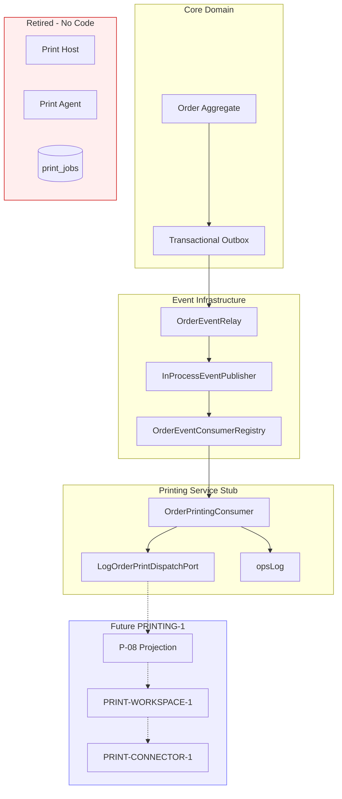

# PRINT-MIGRATION-CLEANUP-AUDIT-1 — Dependency Analysis

**Date:** 2026-06-26

---

## Upstream Dependencies (What Printing Depends On)

| Dependency | Consumer / module | Coupling type | Violation? |
|------------|-------------------|---------------|------------|
| Order domain events | `OrderPrintingConsumer` | Event subscription (`OrderCreated`, `OrderReady`) | **No** — ADR-ARCH-012 pattern |
| Event outbox + relay | `OrderEventRelay` → publisher | Infrastructure | **No** |
| Event envelope schema | `EventEnvelope`, serializer | Contract | **No** |
| `getOrderById` | `OrderPrintingConsumer` on `OrderReady` | Direct DB read for `orderNumber` | **Minor** — not Order mutation |
| Ops logging | `opsLog`, `opsTaxonomy` | Cross-cutting observability | **No** |
| Consumer idempotency store | `DrizzleConsumerIdempotencyStore` | Infrastructure | **No** |
| Consumer registry | `OrderEventConsumerRegistry` | Dispatch | **No** |

---

## Downstream Dependencies (What Depends on Printing)

| Dependent | Relationship | Status |
|-----------|--------------|--------|
| Order aggregate | None — no print fields | **Independent** |
| Order read projections | P-08 defined but not wired | **No runtime dependency** |
| Client UI | No print components | **Independent** |
| Commercial entitlements | Print keys removed | **Independent** |
| Kitchen consumer | Parallel sibling — no cross-calls | **Independent** |
| Notification consumer | Parallel sibling | **Independent** |
| Session consumer | Parallel sibling | **Independent** |

**No production module depends on active print execution.**

---

## Dependency Map (Current)

---

## Hidden Coupling Assessment

| Coupling | Finding |
|----------|---------|
| Order router → print inline | **None** |
| Order mutation → print_jobs insert | **None** |
| Client → print API | **None** |
| Shared types for print in order domain | **None** |
| Feature gate → print service | **None** (keys removed) |
| `categories.stationId` → print routing | **Removed** (0043) |

---

## Layer Violations

| Check | Result |
|-------|--------|
| Printing in Core Domain | **PASS** — consumer in infrastructure layer |
| Printing bypasses events | **PASS** — no alternate path |
| Publisher owns dispatch logic | **PASS** — registry owns dispatch |
| Consumer → consumer calls | **PASS** — ORDER-EVENTS-1B independence |
| Read projection in integration consumer | **PASS** — port only, no P-08 writes |
| Print owns authoritative order data | **PASS** |

---

## Package / Module Dependencies

| Module | Exists | Imports print runtime? |
|--------|--------|------------------------|
| `server/printing/` | **No** | — |
| `shared/printing/` | **No** | — |
| `server/order/` | Yes | Internal consumer only |
| `client/` | Yes | **No** print imports |
| `drizzle/schema.ts` | Yes | **No** print tables |

---

## Future Dependency Risks (For Upcoming Programs)

| Risk | Mitigation (from architecture) |
|------|-------------------------------|
| PRINT-WORKSPACE-1 reads `order.list` instead of P-08 | RA-06 ownership matrix; gap register BOT-06 |
| PRINTING-1 revives inline print on commit | ADR-ARCH-012 forbids |
| Duplicate queue (DB + projection) | RA-06: P-08 owns read; PRINTING-1 owns write path via port |
| Connector bypasses events | PRINT-CONNECTOR-1 must consume P-08 / job state, not mutate orders |

---

## Verdict

**No architecture violations** in current printing footprint. Coupling is limited to the certified event-consumer pattern. Hidden coupling from the legacy stack has been eliminated by RESET-1.
