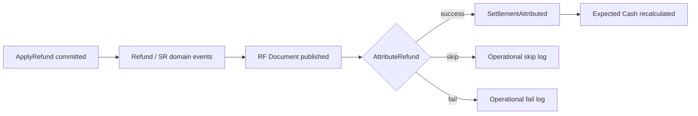

# REGISTER-REFUND-SETTLEMENT-ARCHITECTURE-1 — Event Flow

| Field | Value |
|---|---|
| **Program** | REGISTER-REFUND-SETTLEMENT-ARCHITECTURE-1 |
| **Verdict** | **ARCHITECTURE CERTIFIED** |

---

| Event / outcome | Plane | Money? |
|-----------------|-------|--------|
| Refund applied + SR created | Financial | Yes (already committed) |
| `SettlementAttributed` | Custody | Custody only |
| Skip / fail | Ops control | No |

**Decision:** Do not introduce a parallel `RefundSettlementCompleted` SSOT; treat it as a semantic alias of `SettlementAttributed` for refund SRs if product naming requires it.

---

## Final Certification

**ARCHITECTURE CERTIFIED**
