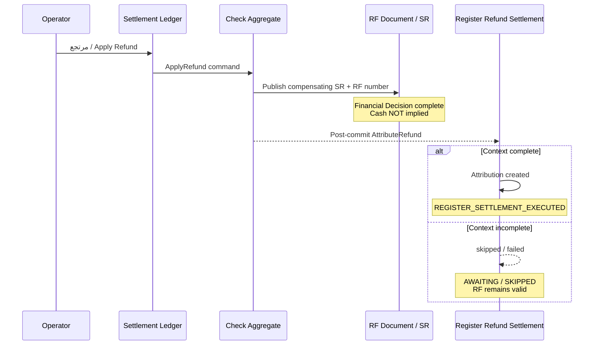
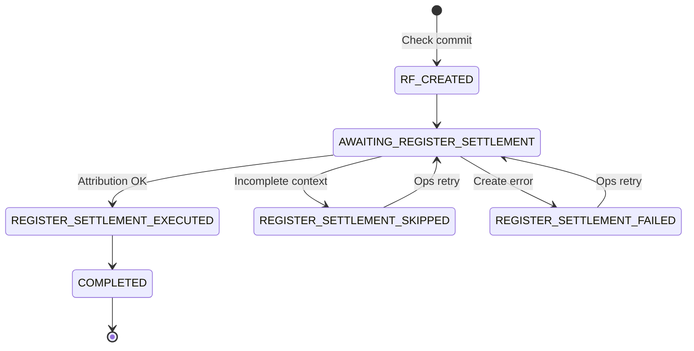

# REGISTER-REFUND-SETTLEMENT-ARCHITECTURE-1 — Lifecycle & State Machine

| Field | Value |
|---|---|
| **Program** | REGISTER-REFUND-SETTLEMENT-ARCHITECTURE-1 |
| **Verdict** | **ARCHITECTURE CERTIFIED** |

---

## Lifecycle (planes)

---

## Custody state machine

| State | Financial RF | Cash custody |
|-------|--------------|--------------|
| RF_CREATED | Exists | Unchanged |
| AWAITING… | Exists | Unchanged |
| EXECUTED / COMPLETED | Exists | Updated if cash tender |
| SKIPPED / FAILED | Exists | Unchanged |

---

## Final Certification

**ARCHITECTURE CERTIFIED**
