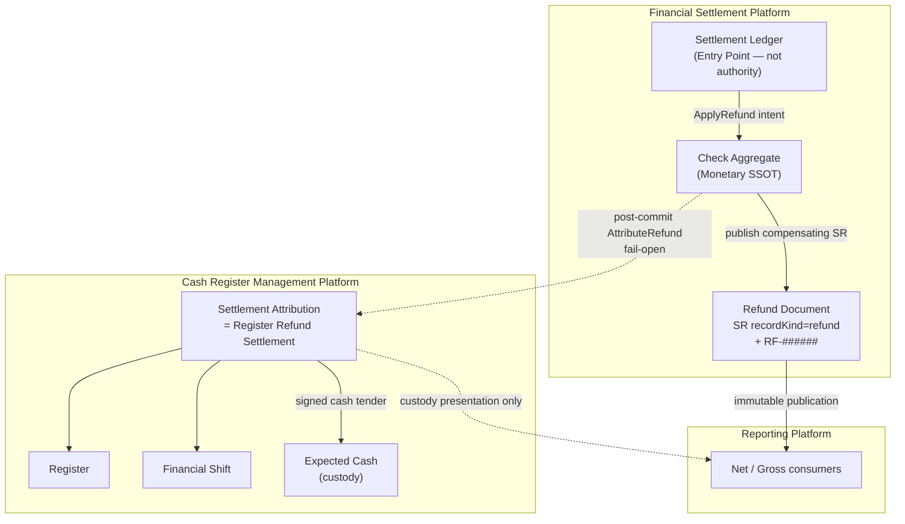

# REGISTER-REFUND-SETTLEMENT-ARCHITECTURE-1 — Ownership Diagram

| Field | Value |
|---|---|
| **Program** | REGISTER-REFUND-SETTLEMENT-ARCHITECTURE-1 |
| **Verdict** | **ARCHITECTURE CERTIFIED** |

---

| Plane | Owns | Does not own |
|-------|------|--------------|
| Check | Refund money, RF SR publish | Drawer cash |
| Identity | RF- number | Money / custody |
| CRMP Attribution | Register Refund Settlement | Refund authorization |
| Ledger | Operator entry | Money / custody SSOT |
| Reporting | Derived analytics | Money mutation |

---

## Final Certification

**ARCHITECTURE CERTIFIED**
