# REPORTING-EXCEL-UX-POLISH-1 — Validation & Visual Evidence

**Status:** PRODUCTION CERTIFIED  
**Scope:** Excel presentation polish only  
**Non-goals:** No platform / DTO / API / KPI / scope / business-logic changes

---

## How to regenerate evidence

```bash
pnpm exec vitest run client/src/lib/reporting-exports/__tests__/reportingExportAcceptance.samples.test.ts
pnpm exec vitest run client/src/lib/reporting-exports/__tests__/reportingExcelUxPolish.architecture.guards.test.ts
pnpm exec vitest run client/src/lib/reporting-exports/__tests__/reportingPeriodConsistency.architecture.guards.test.ts
pnpm exec vitest run client/src/lib/reporting-exports/__tests__/reportingExportTemplates.architecture.guards.test.ts
pnpm exec vitest run client/src/lib/reporting-exports/__tests__/reportingExportAcceptance.architecture.guards.test.ts
node scripts/capture-reporting-export-acceptance-screenshots.mjs
pnpm build
```

---

## Deliverable samples

| Scope | Workbook |
|-------|----------|
| Monthly | [`samples/reporting-excel-ux-en-2026-07.xlsx`](./samples/reporting-excel-ux-en-2026-07.xlsx) |
| Yearly | [`samples/reporting-excel-ux-en-2026.xlsx`](./samples/reporting-excel-ux-en-2026.xlsx) |

Before baselines (PERIOD-CONSISTENCY-1 screenshots): [`before/`](./before/)  
After screenshots (this program): [`screenshots/`](./screenshots/)

KPI scope reconciliation (unchanged ownership): [`KPI-RECONCILIATION.md`](./KPI-RECONCILIATION.md)

---

## Visual improvement catalog (every change)

### 1. Full-width executive canvas (all sheets)

| Before | After |
|--------|-------|
| ~6-column floating content, large empty grid to the right | **12-column landscape canvas** (`COLS = 12`, col width 11.5) spanning printable width |

**Why:** Tiny corner tables read as “exported spreadsheet.” Full-width blocks read as an executive pack.

**Evidence:** Compare header bars in before vs after — after headers span the full composition width on every sheet.

---

### 2. Cover — brand-first title page

| Before | After |
|--------|-------|
| Compact cover, narrow meta block | Full-width navy bands, centered MineuQR logo, hero period (`July 2026` / `2026`), gold rule, contents line, confidential footer |

**Improvements**
- Brand mark dominates the first viewport
- Period is the largest typographic signal after the restaurant name
- Meta rows use alternating mist fills across merged columns (not a tiny 2-col box)
- Landscape print setup + centered page

**Evidence**

| Before | After |
|--------|-------|
| 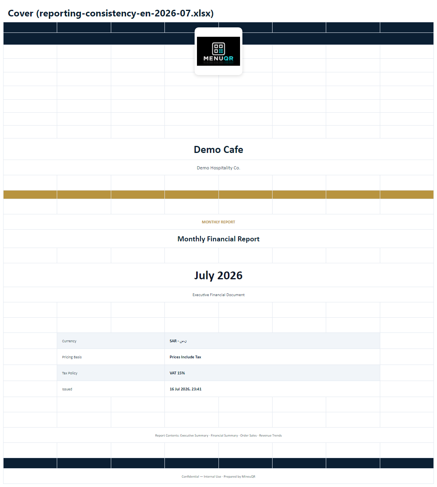 |  |
| 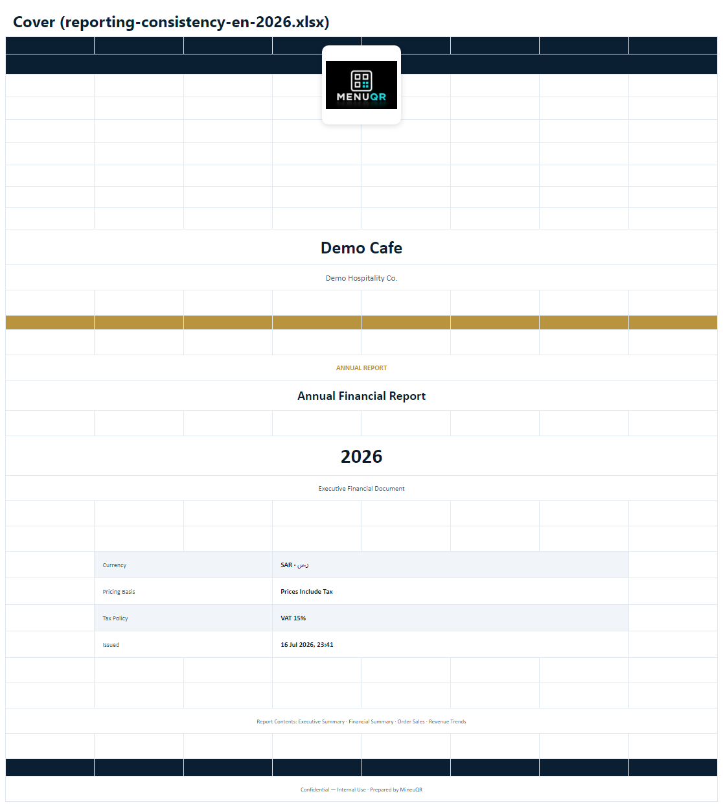 | 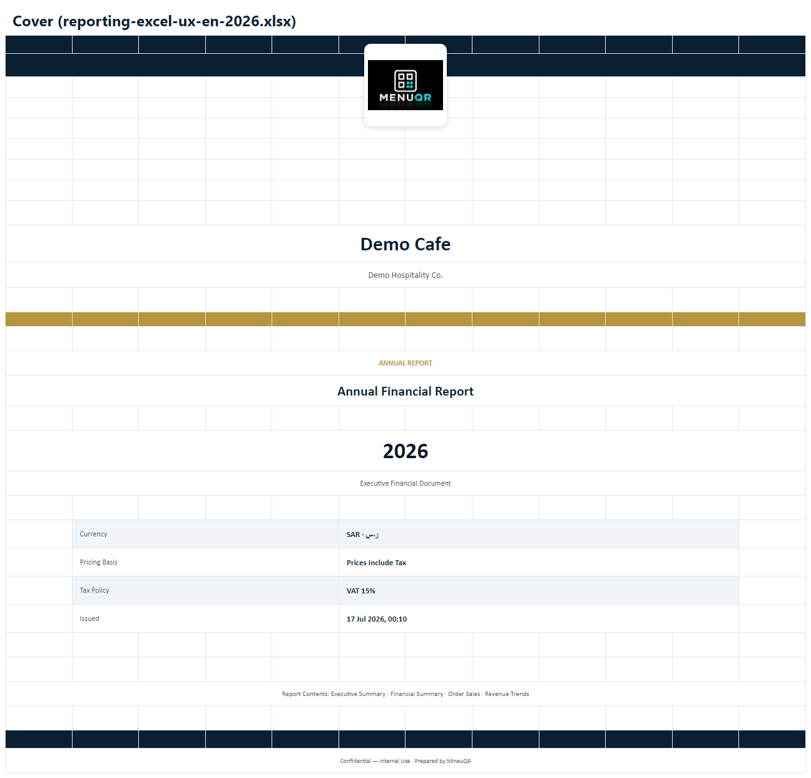 |

---

### 3. Executive Summary — large KPI cards

| Before | After |
|--------|-------|
| Small 3×3 cards on ~6 columns | **Large KPI cards**: 3 across × 4 columns each, value size **22pt**, label band + mist footer, gold border accent |

**Improvements**
- Values are boardroom-readable at a glance
- Cards occupy the full page width
- Section band “Financial Performance” establishes hierarchy
- Freeze panes under header; gridlines off; print footer

**Evidence**

| Before | After |
|--------|-------|
| 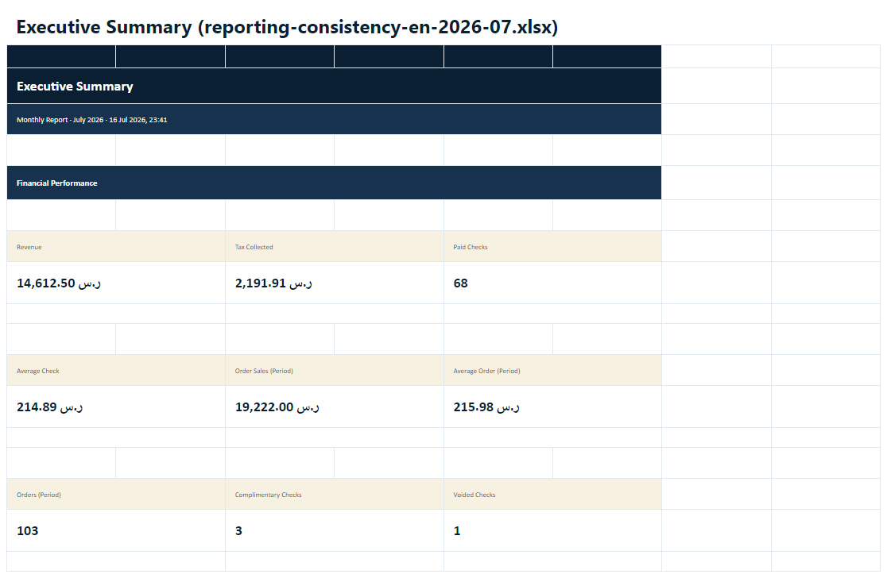 |  |
|  |  |

---

### 4. Financial Summary — statement layout

| Before | After |
|--------|-------|
| Narrow two-column tables | **Accounting statement layout**: label merge cols 1–7, amount merge cols 8–12; 14pt amounts; 32pt row height; zebra rows; four section bands |

**Improvements**
- Reads as a P&L-style statement, not a grid dump
- Sections: Financial Performance → Order Sales → Adjustments → Reporting Basis
- Amounts right-aligned with Western digits (`numFmt: '@'`)

**Evidence**

| Before | After |
|--------|-------|
| 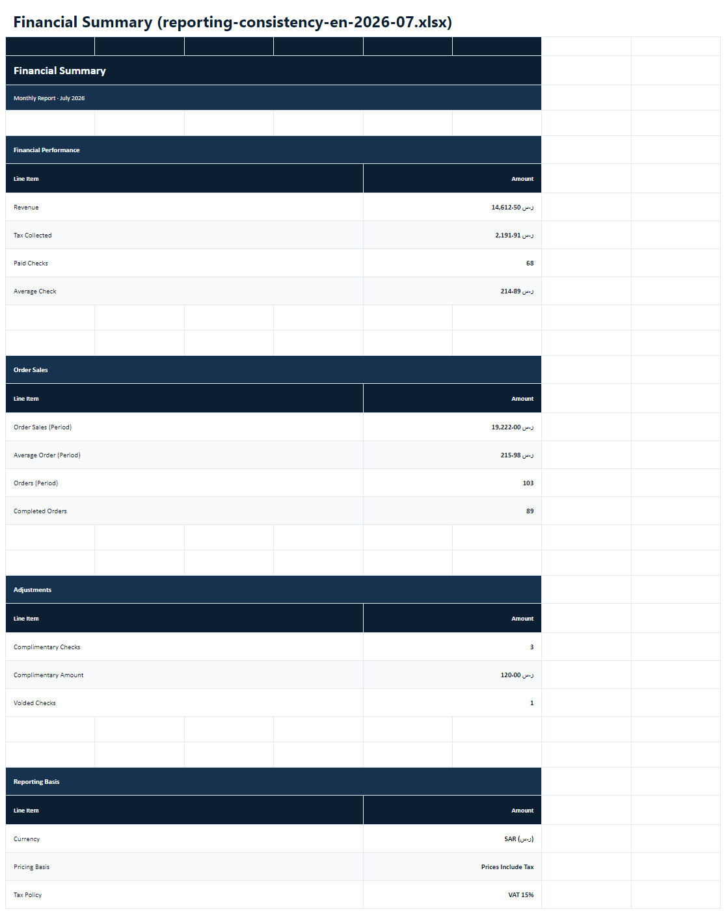 | 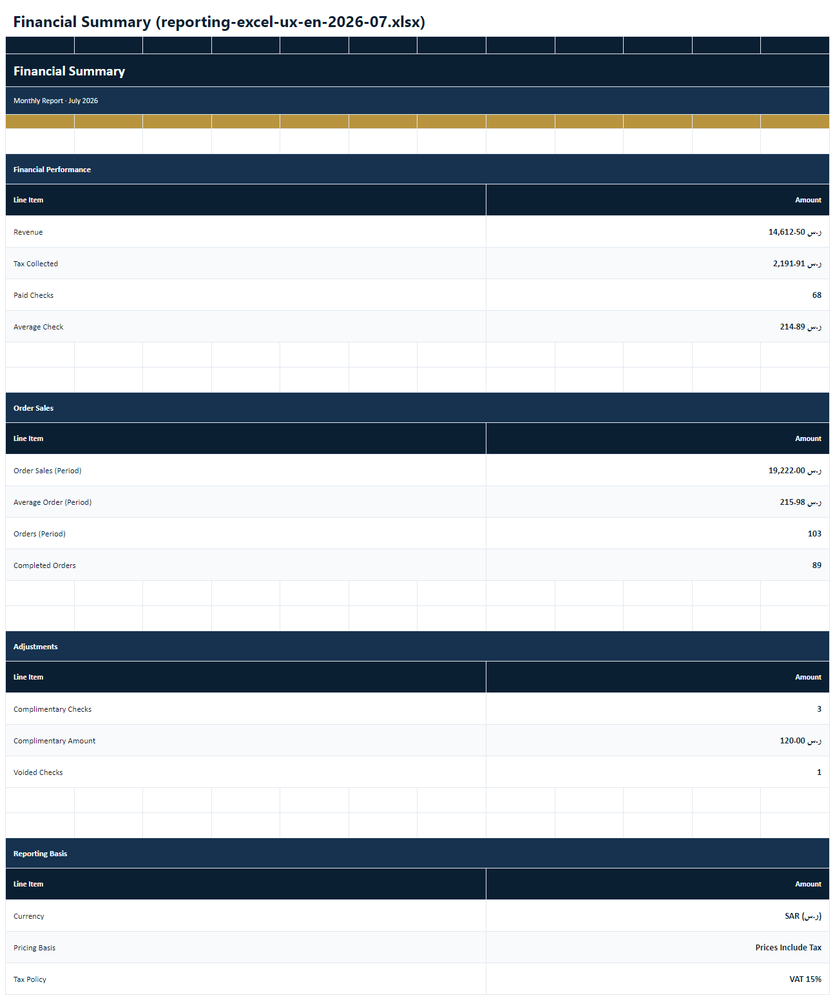 |
|  | 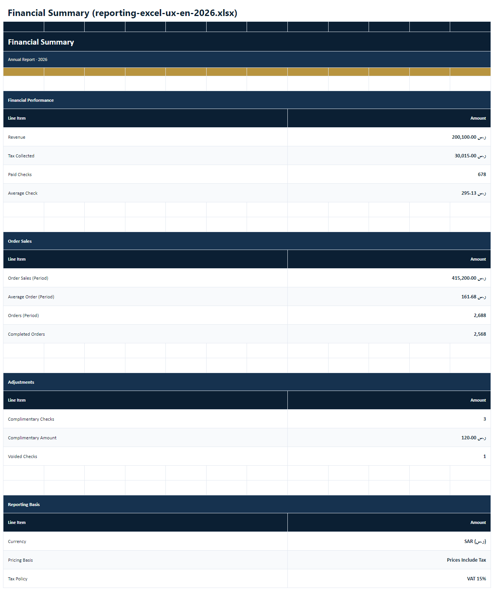 |

---

### 5. Order Sales — chart-first composition (mandatory chart)

| Before | After |
|--------|-------|
| Table only / empty chart area (Node returned null PNG) | **Chart above table**, ~1100×340 executive bar chart, daily (month) / monthly (year), period totals row, full-width 4-column table |

**Improvements**
- Pure Node PNG renderer (`renderPurePng`) so samples/CI always embed charts
- Full Latin bitmap glyphs so titles render (“Order Sales Trend”, not garbled text)
- White painted reserve rows under the floating image (no “empty cavern” of gridlines)
- Totals row uses scoped rollup sums (unchanged business ownership)

**Evidence**

| Before | After |
|--------|-------|
| 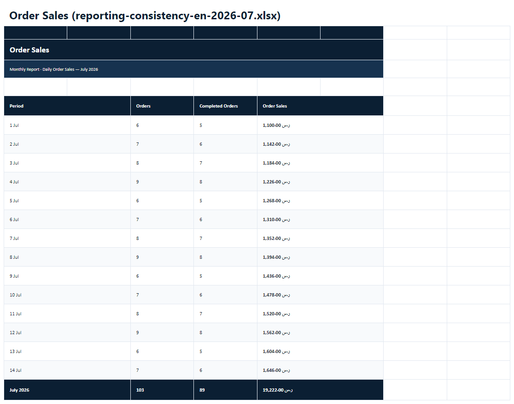 | 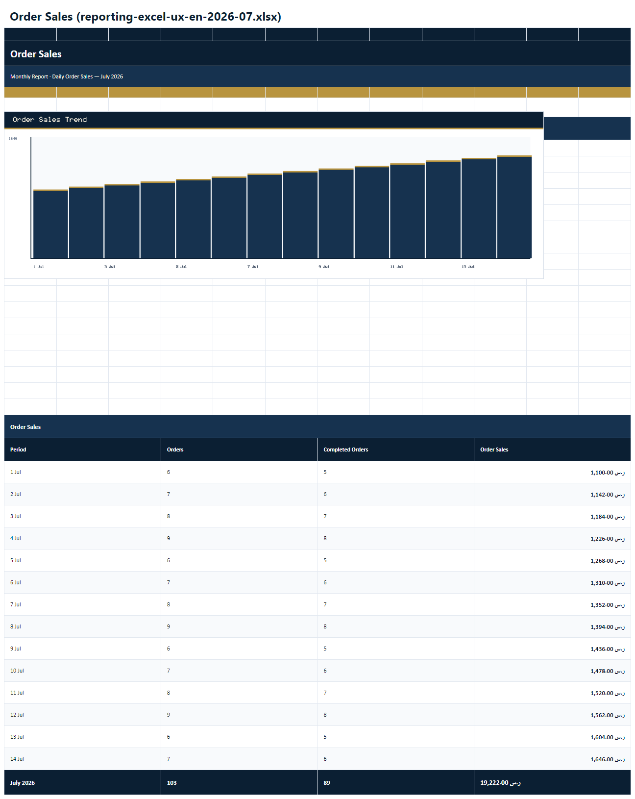 |
| 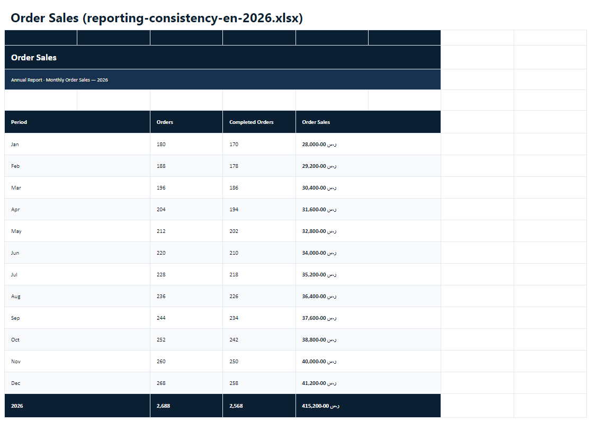 |  |

---

### 6. Revenue Trends — never empty; chart + table + totals

| Before | After |
|--------|-------|
| Almost empty / no chart in Node exports | **Chart + daily/monthly table + period totals**; insufficient-data panel when &lt;2 points |

**Improvements**
- Monthly → daily series title; Yearly → monthly series title
- Chart mandatory whenever `hasRenderableTrend`
- Period totals = same `BusinessMetricsSummary` Revenue / Paid Checks as Executive & Financial
- Professional empty-state copy (`trendInsufficient`) — never a blank sheet

**Evidence**

| Before | After |
|--------|-------|
| 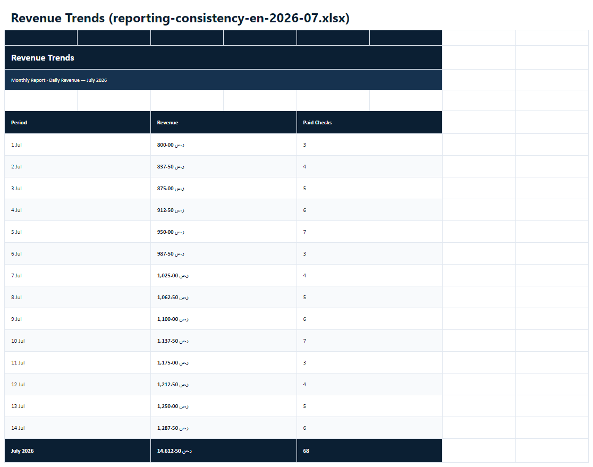 |  |
| 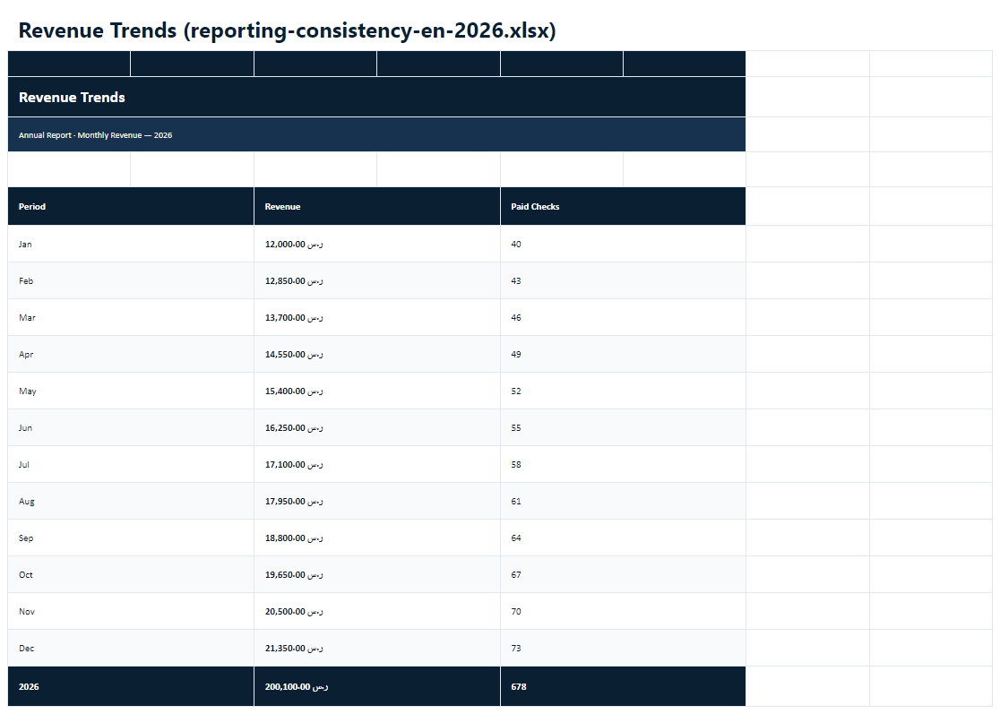 | 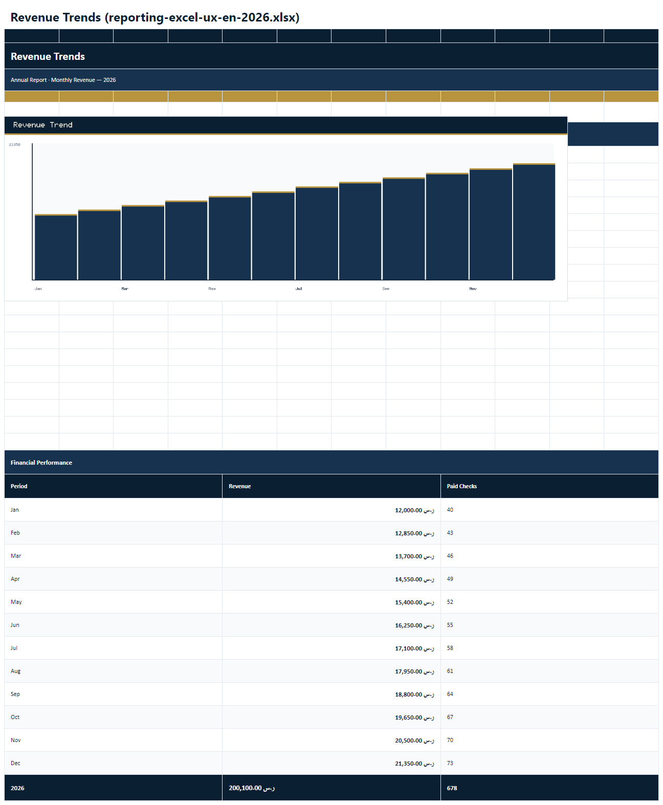 |

---

### 7. Charts — professional size & placement

| Item | Detail |
|------|--------|
| Size | Order ~1100×340; Revenue ~1100×360 (CSS px embed) |
| Placement | Immediately under section band; table below |
| Axis | Western digit categories; readable step labels |
| Theme | Navy bars, gold tip accent, navy title band |

---

### 8. Numeric presentation (workbook verified)

| Policy | Verification |
|--------|----------------|
| GLOBAL-NUMERIC-PRESENTATION-POLICY-1 Western digits | Sample test asserts no Eastern digits in workbook text blob |
| Excel text storage | `numFmt: '@'` on every written value via `setWesternText` |
| Money / counts | `en-US` grouping with Western digits + currency symbol |

Verified on the **generated `.xlsx`**, not only formatter unit tests.

---

### 9. Excel consultant practices

| Practice | Implementation |
|----------|----------------|
| Typography | Calibri / Arial; title 22pt; KPI 22pt; statement amounts 14pt |
| Column widths | Uniform 11.5 across 12 cols |
| Row heights | Header 34 / section 30 / KPI value 44 / statement 32 |
| Borders | Gold accent on cards; line borders on statement & tables |
| Hierarchy | Navy title → navyMid subtitle → gold rule → section bands |
| Print | Landscape, fit-to-width, margins ~0.45", centered, footer page X of N |
| Freeze panes | Frozen under row 4 on content sheets |
| Gridlines | Off in sheet views |
| Navigation | Cover contents line lists all worksheets |

---

## Architecture guards (unchanged ownership)

- `scopedOrderSalesFromRollup` still owns Order Sales period KPIs
- No `orderSales.month` / `OrderSalesSummary`
- No `.reduce(` in presentation layer
- Platform contracts / routers untouched
- Guard file: `reportingExcelUxPolish.architecture.guards.test.ts`

---

## Acceptance checklist

| Criterion | Result |
|-----------|--------|
| Every worksheet uses page width | **PASS** (12-col canvas) |
| Executive KPI cards enlarged | **PASS** |
| Financial statement readability | **PASS** |
| Revenue Trends: table + totals + chart | **PASS** |
| Charts when meaningful data exists | **PASS** (asserted via `getImages()`) |
| Never empty trend sheet | **PASS** (insufficient panel) |
| Western digits in workbook | **PASS** |
| Samples + screenshots every sheet | **PASS** |
| Before / after comparison | **PASS** (this document) |
| Presentation tests + architecture guards | **PASS** |
| `pnpm build` | **PASS** |

---

## Certification

**REPORTING-EXCEL-UX-POLISH-1 — PRODUCTION CERTIFIED**

The workbook is the acceptance artifact. Visual quality targets restaurant owners, CEOs, investors, and external auditors.
