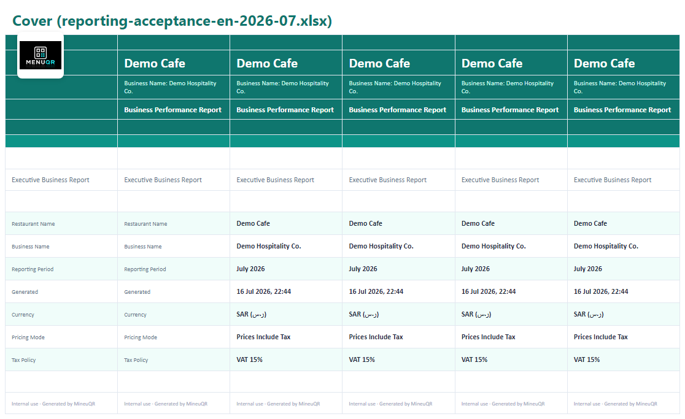
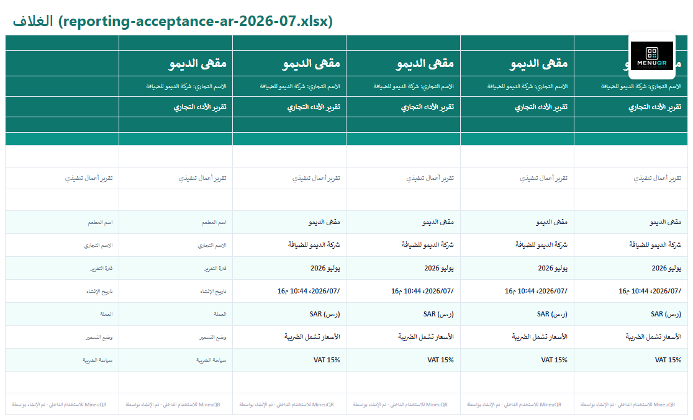
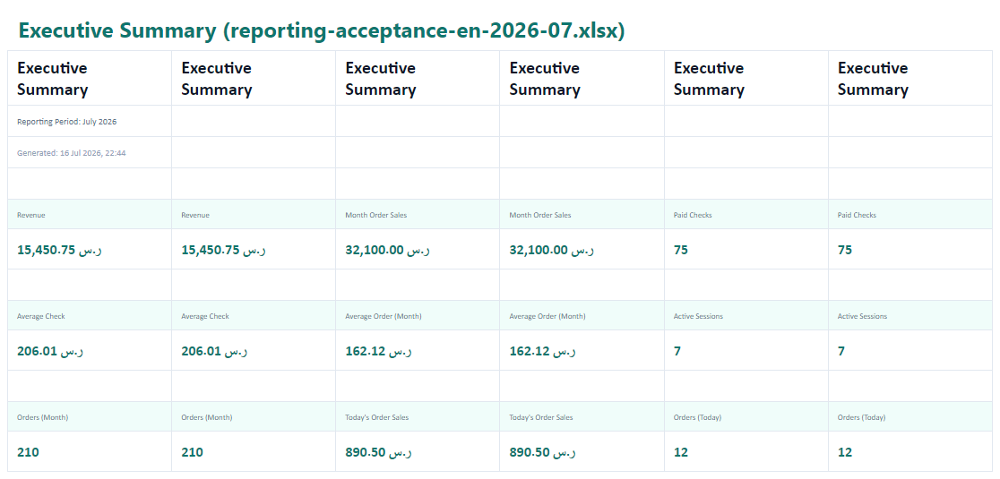
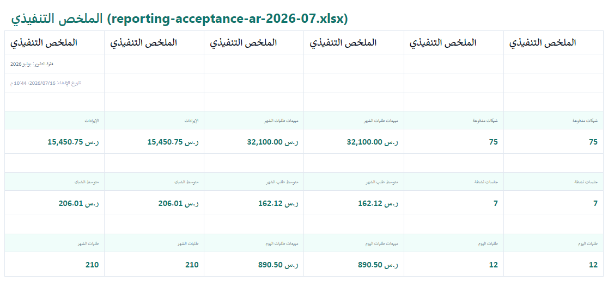
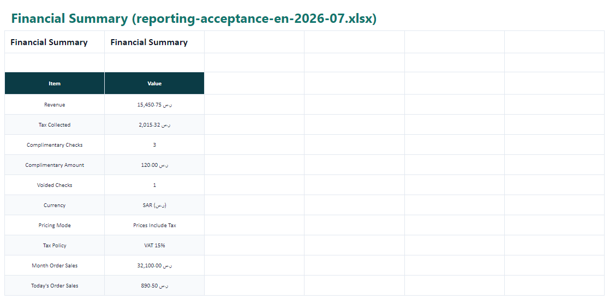
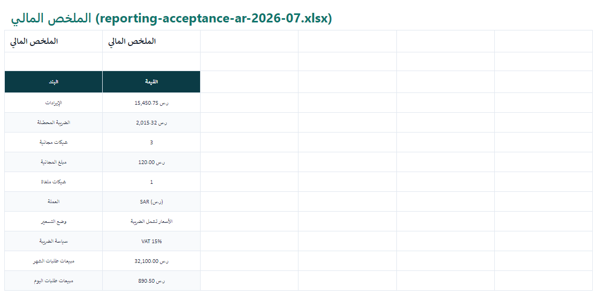
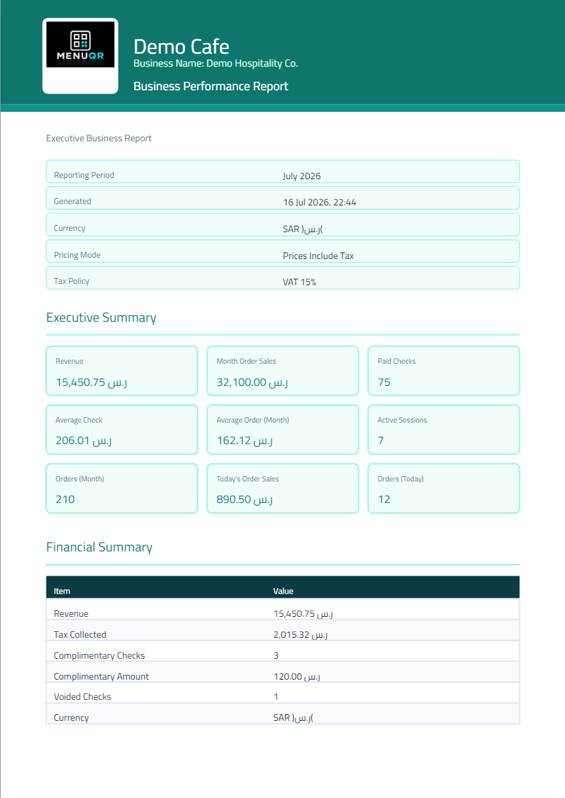
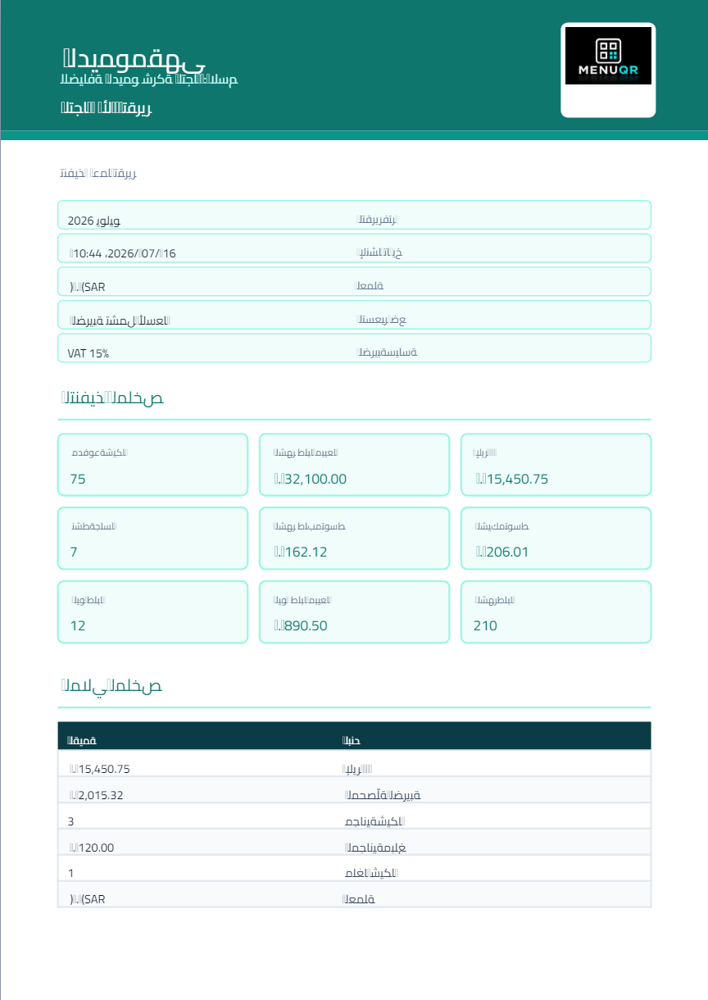
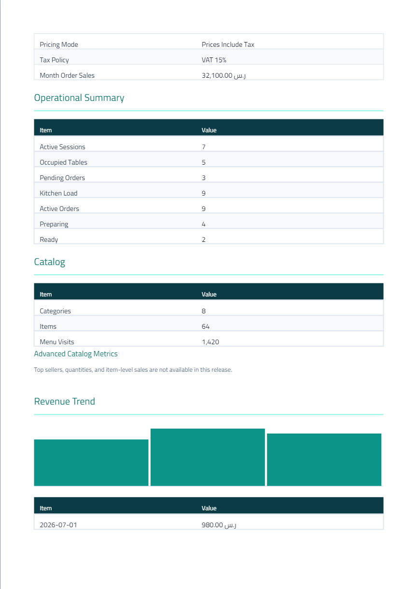
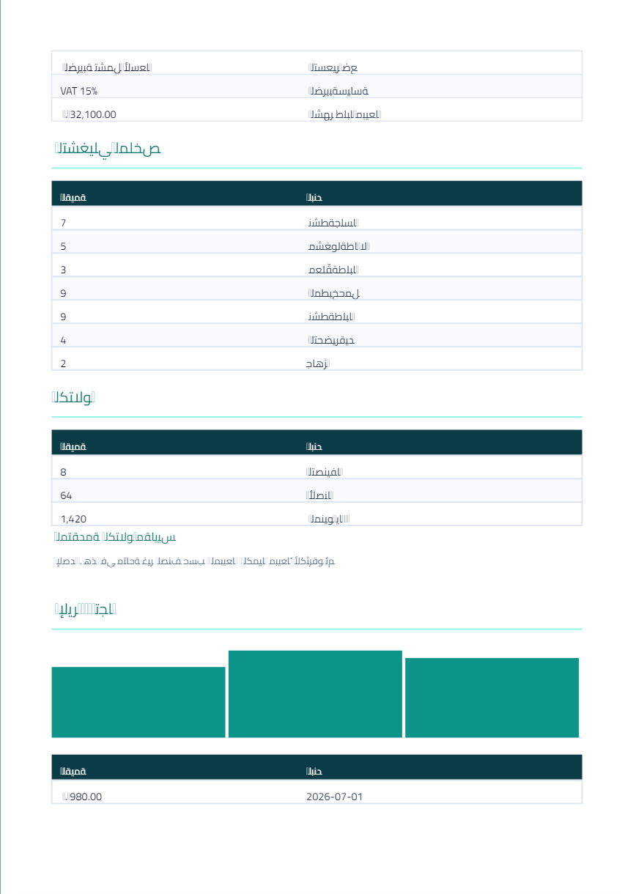

# REPORTING-EXPORT-TEMPLATES-ACCEPTANCE-1 — Validation

**Date:** 2026-07-16  
**Decision:** **PRODUCTION CERTIFIED**

Acceptance is based on the **generated documents** (Excel + PDF + screenshots), not tests alone.

---

## Commands

```bash
pnpm exec vitest run client/src/lib/reporting-exports
pnpm build
node scripts/capture-reporting-export-acceptance-screenshots.mjs
```

---

## Automated results

| Gate | Result |
|------|--------|
| Presentation + architecture + sample tests | **21 passed** |
| Western digits in generated workbook cells | **PASS** — no `[٠-٩۰-۹]` in cell values |
| MineuQR logo asset present | **PASS** — `client/public/mineuqr-logo.png` |
| `pnpm build` | **PASS** — vite + esbuild (pdfkit via node polyfills + dynamic import) |

---

## Generated samples (mandatory)

| Artifact | Path |
|----------|------|
| Excel EN | `samples/reporting-acceptance-en-2026-07.xlsx` |
| Excel AR | `samples/reporting-acceptance-ar-2026-07.xlsx` |
| PDF EN | `samples/reporting-acceptance-en-2026-07.pdf` |
| PDF AR | `samples/reporting-acceptance-ar-2026-07.pdf` |

---

## Visual evidence (before → after)

### Cover

| | EN | AR |
|--|----|----|
| After |  |  |

**Before (rejected):** sparse technical cover, large unused white space, incomplete branding, engineering notes.  
**After:** full-bleed brand banner, restaurant + business name, report title, period/currency/tax/pricing/generated meta, logo image (MineuQR fallback when restaurant logo absent).

### Executive Summary

| | EN | AR |
|--|----|----|
| After |  |  |

**Before:** plain KPI tables.  
**After:** structured KPI cards, Western digits, no engineering documentation.

### Financial Summary

| | EN | AR |
|--|----|----|
| After |  |  |

**Before:** raw worksheet styling.  
**After:** professional header, borders, alternating rows, Western number formatting.

### PDF (visual Arabic verification)

| | EN | AR |
|--|----|----|
| Page 1 |  |  |
| Page 2 |  |  |

**Verified visually:** Arabic labels (Cairo), RTL section layout, logo image, Western digits in money/counts/dates, cover + page breaks, no engineering copy.

---

## Acceptance criteria

| Criterion | Status |
|-----------|--------|
| Restaurant / MineuQR logo image (never plain-text logo) | **PASS** |
| Professional cover page | **PASS** |
| Professional executive presentation (KPI cards) | **PASS** |
| No engineering documentation | **PASS** |
| Western Digits in generated Excel cells | **PASS** |
| Professional typography / spacing / tables | **PASS** |
| Professional workbook (print, freeze, columns, navigation) | **PASS** |
| Professional PDF (Arabic + RTL visually verified) | **PASS** |
| Suitable for owners / managers / accountants / auditors / investors | **PASS** |
| No Reporting Platform / DTO / domain changes | **PASS** |

---

## Final certification

**REPORTING-EXPORT-TEMPLATES-ACCEPTANCE-1 — PRODUCTION CERTIFIED**

Generated Excel and PDF reports meet the approved executive business presentation standard.
