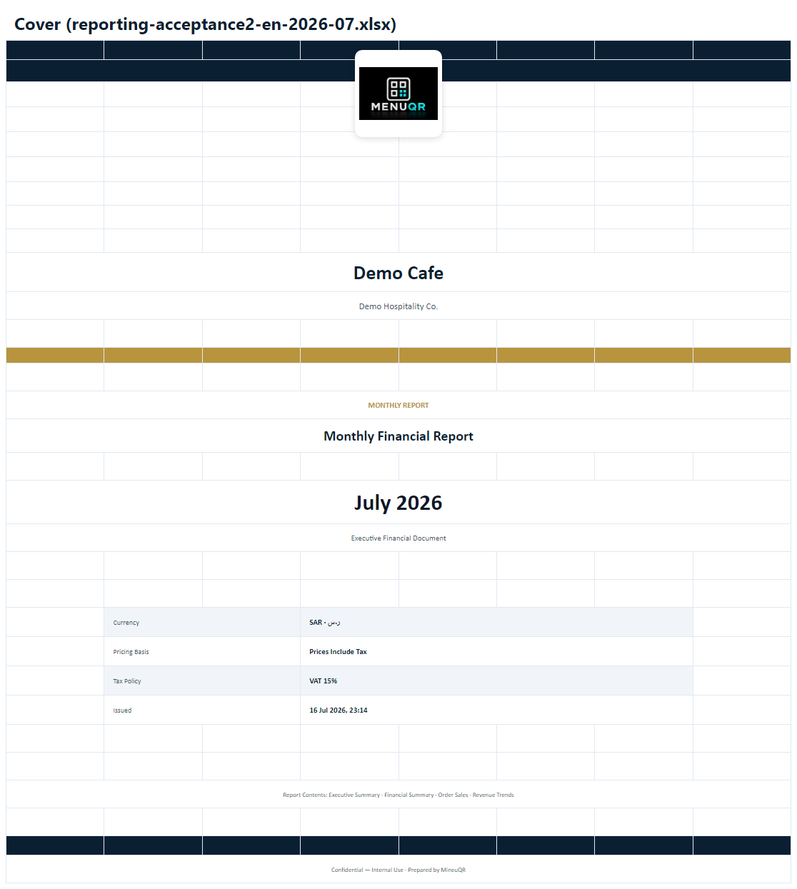
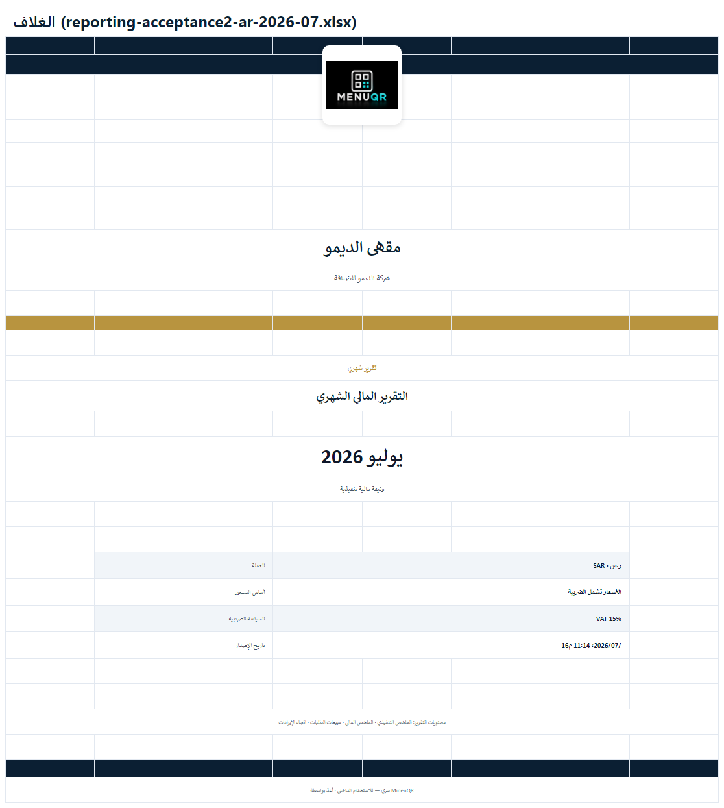
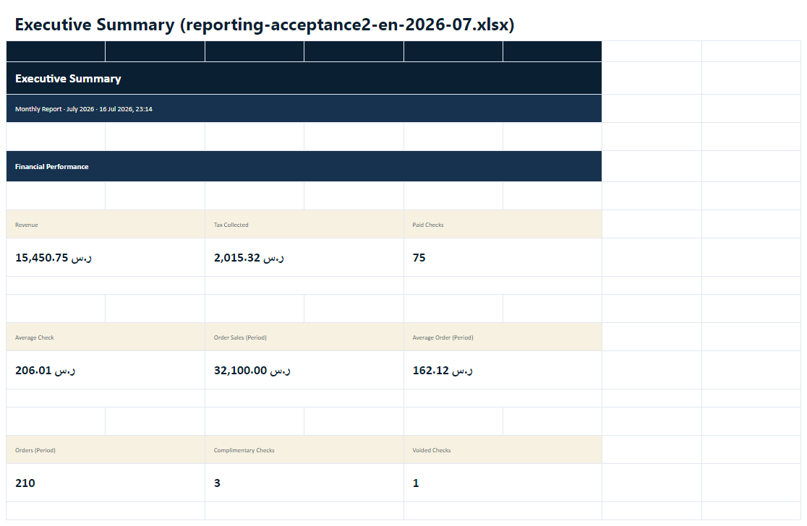
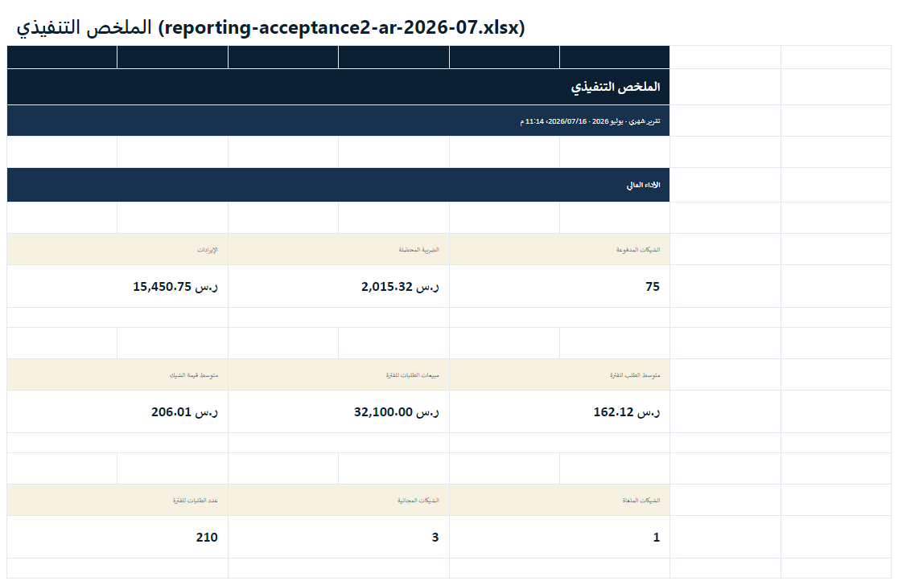
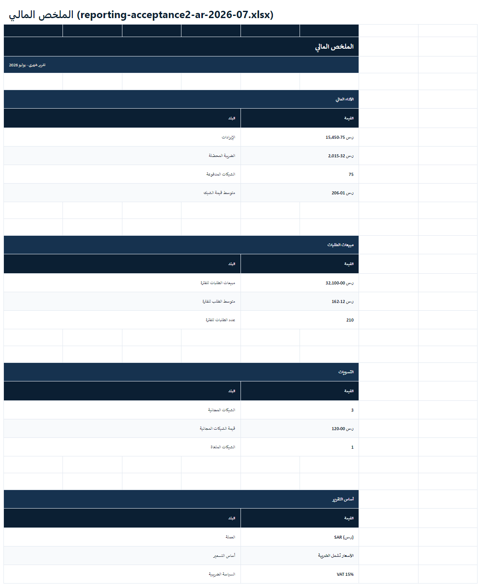
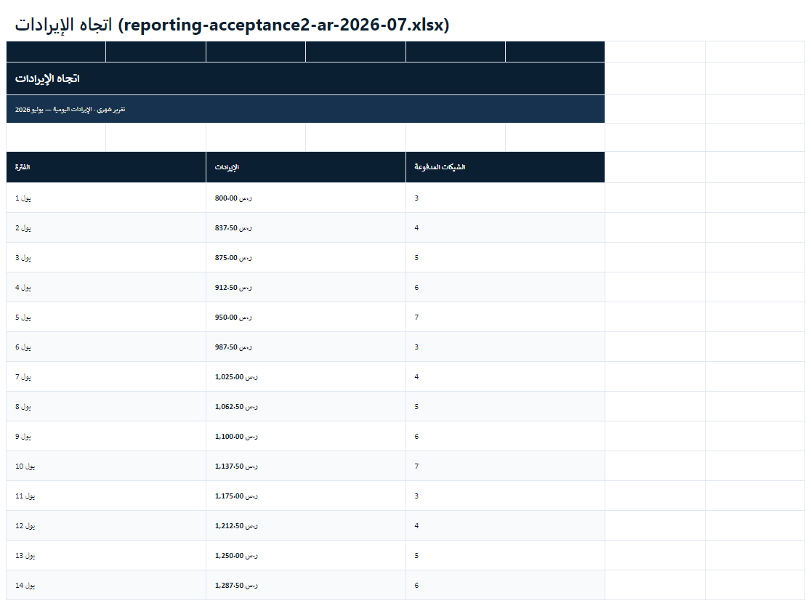
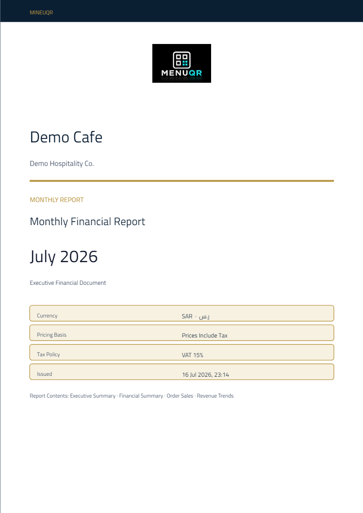
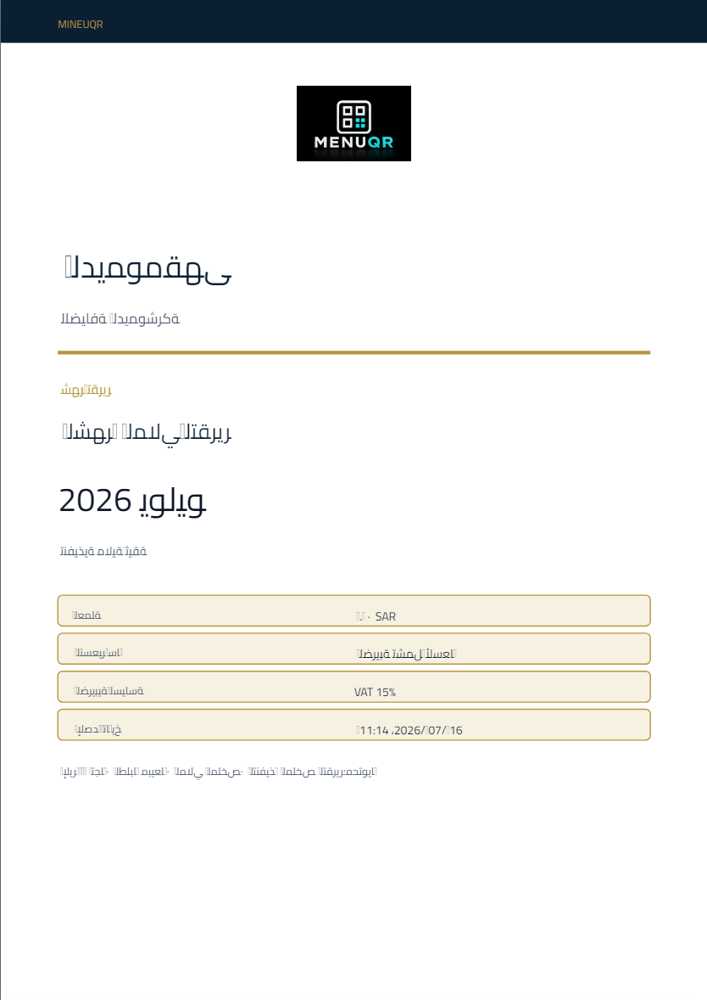

# REPORTING-EXPORT-TEMPLATES-ACCEPTANCE-2 — Validation

**Date:** 2026-07-16  
**Decision:** **PRODUCTION CERTIFIED**

Acceptance is based on the **generated workbook and PDF**, not tests alone.

---

## Commands

```bash
pnpm exec vitest run client/src/lib/reporting-exports
pnpm build
node scripts/capture-reporting-export-acceptance-screenshots.mjs
```

---

## Automated results

| Gate | Result |
|------|--------|
| Presentation + architecture + samples | **22 passed** |
| Western digits in workbook cells | **PASS** |
| Exactly 5 sheets (no Ops/Catalog) | **PASS** |
| `pnpm build` | **PASS** |

---

## Generated samples

| Artifact | Path |
|----------|------|
| Excel monthly EN/AR | `samples/reporting-acceptance2-{en,ar}-2026-07.xlsx` |
| Excel annual EN/AR | `samples/reporting-acceptance2-{en,ar}-2026.xlsx` |
| PDF monthly/annual | matching `.pdf` files |

---

## Visual evidence

### Cover (annual-report composition)

| EN | AR |
|----|----|
|  |  |

**Before (rejected):** spreadsheet-like banner + meta grid.  
**After:** masthead, centered logo, restaurant identity, gold rule, Monthly/Annual badge, large period, dossier meta, contents line.

### Executive Summary

| EN | AR |
|----|----|
|  |  |

KPI cards — not ordinary data dumps.

### Financial Summary

| EN | AR |
|----|----|
|  |  |

Statement sections: Performance, Order Sales, Adjustments, Reporting Basis.

### Revenue Trends

| EN | AR |
|----|----|
|  |  |

Daily axis for monthly reports (`1 Jul` …). Multi-observation series only.

### PDF

| EN p1 | AR p1 |
|-------|-------|
|  |  |

---

## Acceptance criteria

| Criterion | Status |
|-----------|--------|
| Not a raw spreadsheet — executive financial report | **PASS** |
| Cover redesigned (annual-report quality) | **PASS** |
| Only Cover / Executive / Financial / Order Sales / Revenue Trends | **PASS** |
| Ops + Catalog removed (not hidden) | **PASS** |
| Monthly period = month name + year; Yearly = year only | **PASS** |
| Trends multi-point; insufficient-data message otherwise | **PASS** |
| Business language only | **PASS** |
| Western Digits | **PASS** |
| Samples + screenshots provided | **PASS** |
| No platform/domain/logic changes | **PASS** |

---

## Final certification

**REPORTING-EXPORT-TEMPLATES-ACCEPTANCE-2 — PRODUCTION CERTIFIED**

The generated Excel and PDF are executive financial documents suitable for owners, boards, investors, accountants, and auditors.
