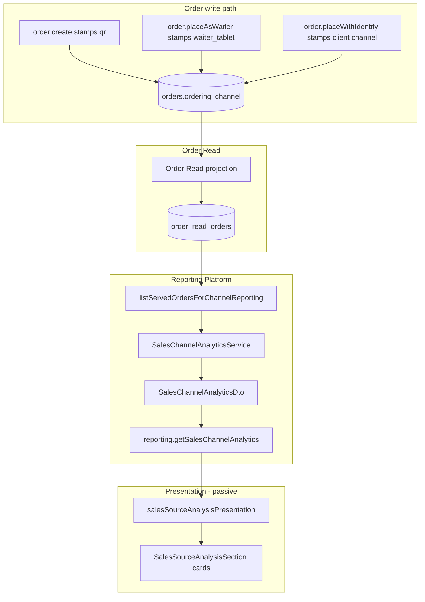

# REPORTING-SALES-CHANNEL-ANALYTICS-1 — Data Flow Diagram

## Boundary notes

- Check Revenue / Payment Analytics remain on Settlement Record paths (unchanged).
- Channel analytics never writes financial law or settlement snapshots.
