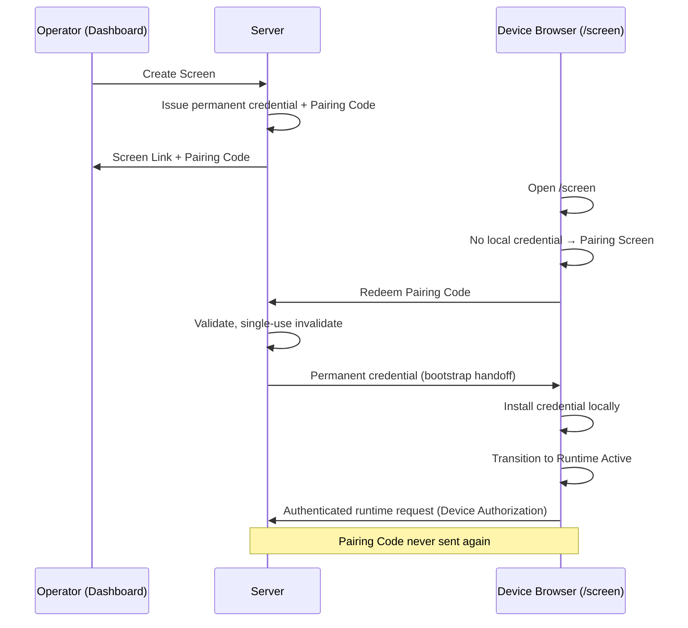
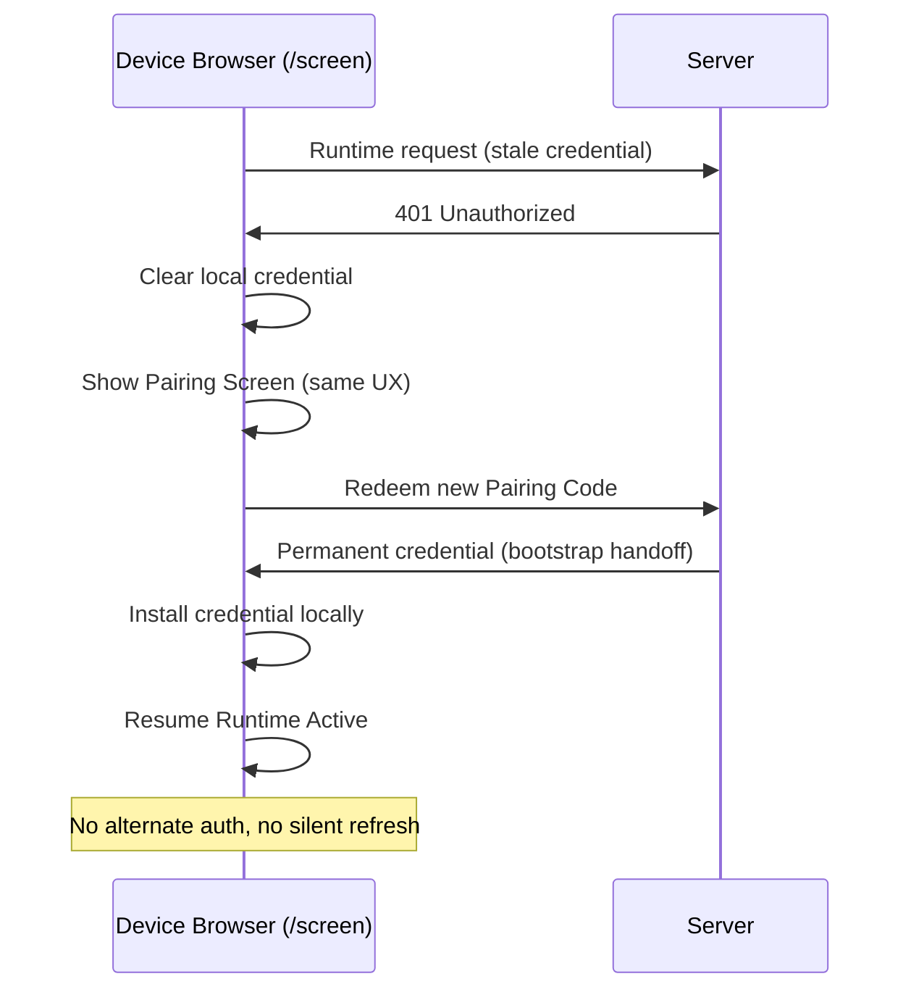

# SCREEN-PAIRING-CODE-ARCHITECTURE-1

**Classification:** Product Architecture Program  
**Status:** REVISION B — Architecture Review Required  
**Date:** 2026-07-12  
**Priority:** High

---

## Executive Summary

MineuQR already implements **permanent device credentials** for runtime authentication. That model is production-proven and must not change.

The operator onboarding experience is unnecessarily complex: QR payloads carrying technical credential material, separate pairing routes, and manual entry of Device ID, Token ID, and Secret. For the primary use case — a staff member opening a browser on a kitchen display — this friction provides no security benefit.

**SCREEN-PAIRING-CODE-ARCHITECTURE-1** introduces a dedicated **Pairing** domain centered on a **Pairing Code**: a short, human-enterable, one-time bootstrap voucher. The code redeems into the existing permanent credential, which is installed locally and used for all subsequent runtime authentication.

This program separates three distinct responsibilities:

1. **Pairing** — identify the screen and redeem a one-time voucher  
2. **Permanent Credential Installation** — store the long-term device credential locally  
3. **Runtime Authentication** — prove identity on every session using the permanent credential  

Authentication architecture is frozen. Only pairing experience and pairing domain terminology change.

---

## Revision History

| Revision | Date | Summary |
|----------|------|---------|
| A | 2026-07-12 | Initial architecture proposal |
| B | 2026-07-12 | Mandatory decisions AD-1 through AD-7; dedicated Pairing domain; single `/screen` entry; QR as compatibility transport; removed API/schema/implementation detail |

---

## Mandatory Architecture Decisions

These decisions are binding for certification. Implementation must not begin until the revised architecture is approved.

### AD-1 — Dedicated Pairing Domain

The new pairing experience is built around **Pairing Code**, not the historical **Activation Code** concept.

| Allowed (product architecture) | Forbidden (product architecture) |
|--------------------------------|----------------------------------|
| Pairing Code | Activation Code |
| Pairing Voucher | Activation Voucher |
| Pair Screen | Activate Screen |
| Pair Device | Activate Device |

**Pairing** and **Activation** represent different business responsibilities. Future engineers must understand the architecture without interpreting legacy implementation details.

Internal reuse of existing storage, hashing, or generation utilities is acceptable at implementation time. **Domain terminology is not.** The product architecture, operator UX, documentation, and public contracts speak only in **Pairing** terms.

### AD-2 — Single Screen Entry Point

The only public entry point for operational screens is:

```text
https://mineuqr.com/screen
```

The operator must never need to know `/screen/pair` or any other pairing-specific URL.

Runtime decides automatically:

```text
Open /screen
        ↓
Existing valid credential?
        ├─ Yes → Start Runtime
        └─ No  → Show Pairing Screen

Invalid credential (401)?
        ↓
Recover (clear local credential)
        ↓
Show Pairing Screen
```

The routing decision belongs to **Runtime**, not the operator.

### AD-3 — Pairing Code Is Bootstrap Only

Pairing Code is **never** an authentication credential.

Its responsibilities are limited to:

- identify a pairing request  
- redeem exactly once  
- install the permanent credential  
- disappear from runtime  

After pairing completes, runtime continues using only:

```text
Device {deviceId}:{tokenId}:{secret}
```

Exactly as today. No runtime authentication redesign.

### AD-4 — QR Is Compatibility Mode

QR is **no longer** the primary onboarding mechanism.

Primary onboarding:

```text
Screen Link → Pairing Code → Enter Code → Runtime Starts
```

QR may continue to exist during transition. However:

- QR **transports the Pairing Code only**  
- QR must **not** introduce a second pairing protocol  
- QR must **not** contain an independent authentication model  
- QR must **not** become the primary UX  

Future product versions may hide QR entirely without affecting pairing architecture.

### AD-5 — Simplified Screen Management UX

Screen Management presents operators with:

| Field | Example |
|-------|---------|
| Screen Link | `https://mineuqr.com/screen` |
| Pairing Code | `A7KD92` |

Actions:

- Copy Link  
- Copy Pairing Code  

QR becomes optional. The following are **removed from operator-facing architecture**:

- Device ID  
- Token ID  
- Secret  
- Manual credential entry  

### AD-6 — Recovery Compatibility

**SCREEN-AUTH-RECOVERY-1** remains authoritative.

Recovery flow:

```text
401 Unauthorized
        ↓
Clear Local Credential
        ↓
Return to Pairing Screen (within /screen)
        ↓
Enter Pairing Code
        ↓
Install Permanent Credential
        ↓
Continue Runtime
```

No additional recovery mechanisms. No retries beyond existing recovery behavior. No silent refresh. No alternate authentication.

### AD-7 — Preserve Existing Authentication Architecture

The following remain **unchanged**:

- Device Authorization header  
- Permanent Device Credential  
- Credential Lifecycle  
- Credential Rotation  
- Revocation  
- Runtime Contracts  
- Runtime APIs  
- Authentication middleware  

Pairing architecture changes. Authentication architecture does not.

---

## Chapter 1 — Three Architectural Responsibilities

The system must be understood as three **separate** responsibilities. They must never be conflated in design, documentation, or operator UX.

```text
┌──────────────────────────────────────────────────────────────┐
│  1. PAIRING                                                  │
│     One-time operator action                                 │
│     Input: Pairing Code                                      │
│     Output: authorized bootstrap to install credential       │
│     Pairing Code never used again after success              │
└────────────────────────────┬─────────────────────────────────┘
                             │
                             ▼
┌──────────────────────────────────────────────────────────────┐
│  2. PERMANENT CREDENTIAL INSTALLATION                        │
│     Device stores deviceId + tokenId + secret locally        │
│     Happens once per successful pairing (or re-pair)         │
│     Pairing material is not persisted                        │
└────────────────────────────┬─────────────────────────────────┘
                             │
                             ▼
┌──────────────────────────────────────────────────────────────┐
│  3. RUNTIME AUTHENTICATION                                   │
│     Every session: Device Authorization header               │
│     Server validates against secretHash                      │
│     Unchanged from certified production model                │
└──────────────────────────────────────────────────────────────┘
```

Recovery re-enters at **Pairing** (step 1) after clearing installed credentials (step 2). Authentication (step 3) resumes only after a new successful pairing and installation.

---

## Chapter 2 — Problem Statement

### Current onboarding (certified baseline)

```text
Create Screen
        ↓
Server issues permanent credential + recovery QR
        ↓
Operator / device must obtain Device ID + Token ID + Secret
        ↓
Separate pairing route (/screen/pair)
        ↓
Paste QR JSON or manual three-field entry
        ↓
Authenticate and store credential
        ↓
/screen — Device Authorization forever after
```

### Why this is a problem

| Actor | Pain |
|-------|------|
| Kitchen staff | Cannot realistically copy Device ID / Token ID / Secret |
| Operator | Must understand routing and technical identifiers |
| Support | Recovery after Regenerate re-exposes complex material |

The **authentication model is sound**. The **pairing surface** is not aligned with restaurant operations.

### Target onboarding

```text
Create Screen
        ↓
Display: Screen Link + Pairing Code
        ↓
Operator opens https://mineuqr.com/screen
        ↓
Runtime shows Pairing Screen (no credential)
        ↓
Enter Pairing Code (single field)
        ↓
Redeem → Install Permanent Credential
        ↓
Runtime Starts
        ↓
Future launches: credential only, no code
```

---

## Chapter 3 — Pairing Domain

### 3.1 Domain definition

**Pairing** is the bounded context responsible for:

- issuing a Pairing Code when a screen is created or its credential is regenerated  
- presenting Pairing Code and Screen Link to operators  
- accepting Pairing Code entry on the device  
- redeeming the code exactly once  
- handing off to credential installation  

**Pairing is not Authentication.** Pairing never validates ongoing sessions. Pairing never appears in the Authorization header.

### 3.2 Pairing Code

A **Pairing Code** (synonym: **Pairing Voucher** in internal architecture discussions) is:

| Property | Requirement |
|----------|-------------|
| Form | Short, human-readable, easy to dictate verbally |
| Example | `A7KD92` |
| Character set | Resistant to accidental transcription (avoid ambiguous glyphs such as O/0, I/1 where practical) |
| Purpose | One-time bootstrap only |
| Visibility | Operator-facing in Screen Management; entered once on device |
| Persistence on device | **Never** stored locally after pairing |
| Server storage | Hashed only; plaintext not retained after display |
| Lifetime | Valid until redeemed once, credential regenerated, or screen deleted |
| Replay | Forbidden after successful redeem |

### 3.3 Pairing lifecycle

```text
Screen Created
        ↓
Pairing Code Issued (linked to pending credential)
        ↓
Operator shares Screen Link + Pairing Code
        ↓
Device enters code on Pairing Screen
        ↓
Redeem (single-use)
        ↓
Pairing Code invalidated server-side
        ↓
Permanent Credential installed on device
        ↓
Pairing domain complete — runtime authentication begins
```

On **Regenerate Credential**: prior Pairing Code invalidated; new Pairing Code issued.  
On **Delete Screen**: all Pairing Codes for that screen invalidated.

### 3.4 Terminology boundary

Legacy implementation artifacts may exist in the codebase under historical names. Those names are **not part of this architecture**. All product-facing surfaces, architecture documents, operator copy, and future public contracts use **Pairing** terminology exclusively.

---

## Chapter 4 — Runtime Architecture

### 4.1 Single public route

| Route | Role |
|-------|------|
| `https://mineuqr.com/screen` | **Only** public entry point for operational screens |

There is no operator-facing pairing URL. `/screen/pair` and similar routes, if they exist in the current implementation, are **not part of the target architecture** and must be absorbed into Runtime routing logic.

### 4.2 Runtime routing decision tree

```text
                    ┌─────────────────┐
                    │  Open /screen   │
                    └────────┬────────┘
                             │
              ┌──────────────┴──────────────┐
              │                             │
     Local credential exists?               │
              │                             │
         ┌────┴────┐                        │
         │         │                        │
        Yes        No                        │
         │         │                        │
         ▼         ▼                        │
   Authenticate   Show                      │
   with Device    Pairing Screen            │
   Authorization  (enter Pairing Code)      │
         │         │                        │
         ▼         │                        │
   Valid session? │                        │
         │         │                        │
    ┌────┴────┐    │                        │
   Yes       No    │                        │
    │         │    │                        │
    ▼         ▼    │                        │
 Start    401 /    │                        │
 Runtime  invalid  │                        │
           │       │                        │
           ▼       │                        │
      Clear local  │                        │
      credential   │                        │
           │       │                        │
           └───────┴────────────────────────┘
                   │
                   ▼
            Show Pairing Screen
            (same UX as first setup)
```

Runtime owns this tree. The operator always opens `/screen` and follows what the screen shows.

### 4.3 Pairing Screen (device UX)

When Runtime determines pairing is required, the device displays:

```text
Enter Pairing Code

[ ____________ ]

[ Pair Device ]
```

Properties:

- Single input field  
- No Device ID, Token ID, or Secret fields  
- No separate URL or navigation step  
- Same screen for first-time setup and post-recovery re-pair  
- On success: install credential → transition to Runtime  
- On failure: operator-readable error; no infinite spinner  

### 4.4 Runtime state model

```text
┌──────────────┐     no credential      ┌──────────────┐
│   PAIRING    │ ◄───────────────────── │   (entry)    │
│   SCREEN     │                        └──────────────┘
└──────┬───────┘
       │ redeem + install
       ▼
┌──────────────┐     401 / revoked      ┌──────────────┐
│   RUNTIME    │ ─────────────────────► │   PAIRING    │
│   ACTIVE     │   clear credential   │   SCREEN     │
└──────────────┘                        └──────────────┘
```

Pairing Screen and Runtime Active are **modes within `/screen`**, not separate product destinations.

---

## Chapter 5 — Pairing Sequence

### 5.1 First-time pairing



### 5.2 Recovery pairing (SCREEN-AUTH-RECOVERY-1)



---

## Chapter 6 — QR Compatibility Mode

### 6.1 Positioning

QR is a **compatibility transport** for the Pairing Code. It is not a primary onboarding path and not a separate pairing protocol.

| Aspect | Primary path | QR (compatibility) |
|--------|--------------|-------------------|
| Operator action | Copy Link + Copy Pairing Code | Optional scan |
| Device action | Type or paste code on Pairing Screen | Decode code from QR → same redeem path |
| Protocol | Single Pairing Code redeem | Same redeem — no fork |
| Credential in QR | **Forbidden** | **Forbidden** |
| Authentication in QR | **Forbidden** | **Forbidden** |

### 6.2 QR content contract (architectural)

QR encodes **only** the Pairing Code (or a deep link that resolves to `/screen` with code pre-filled). QR must **not**:

- embed Device ID, Token ID, or Secret  
- embed a self-contained authentication payload  
- bypass the single redeem path  
- create a "scan to authenticate" flow distinct from code entry  

Scanning a QR and typing a code are **equivalent inputs** to the same Pairing Screen redeem action.

### 6.3 Product evolution

QR may be hidden or removed in a future product version. Pairing architecture must not depend on QR visibility. Removing QR must not require authentication or runtime changes.

---

## Chapter 7 — Screen Management UX

### 7.1 Primary display (target)

When an operator views a screen's setup or access information:

```text
Screen Link
https://mineuqr.com/screen

Pairing Code
A7KD92

[ Copy Link ]  [ Copy Pairing Code ]
```

Optional (compatibility):

```text
[ Show QR ]   ← secondary, collapsible or de-emphasized
```

### 7.2 Removed from operator architecture

The following must not appear in Screen Management, provisioning workspace, or operator documentation as part of the target pairing model:

| Removed | Reason |
|---------|--------|
| Device ID | Technical identifier; not operator responsibility |
| Token ID | Technical identifier; not operator responsibility |
| Secret | Authentication material; governance prohibition |
| Manual credential entry | Replaced by Pairing Code |
| Pairing-specific URLs | Single entry point is `/screen` |
| "Activation" terminology | Superseded by Pairing domain (AD-1) |

### 7.3 Regenerate Credential

When an operator regenerates a credential:

```text
New Pairing Code issued
Prior Pairing Code invalidated
Operator shares new code with device
Device re-pairs via Pairing Screen (recovery-compatible flow)
```

Screen Management shows the new Pairing Code. It never shows the Secret.

---

## Chapter 8 — Recovery Architecture

### 8.1 Authoritative program

**SCREEN-AUTH-RECOVERY-1** defines invalid-credential recovery behavior. This architecture extends recovery **destination** to the Pairing Screen; it does not change recovery **triggers** or authentication semantics.

### 8.2 Recovery flow

```text
Runtime Active
        ↓
Authenticated request returns 401
        ↓
Runtime detects device auth failure
        ↓
Clear local permanent credential
        ↓
Show Pairing Screen (within /screen)
        ↓
Operator enters current Pairing Code
        ↓
Redeem → Install Permanent Credential
        ↓
Runtime Active (resume normal operation)
```

### 8.3 Recovery constraints

| Allowed | Forbidden |
|---------|-----------|
| Clear credential and return to Pairing Screen | Silent credential refresh |
| Re-enter Pairing Code from Screen Management | Retry stale credential indefinitely |
| Same Pairing UX as first setup | Alternate authentication path |
| Resume with Device Authorization after re-pair | Pairing Code in Authorization header |

Recovery is **not** a separate product flow. It is Runtime returning to Pairing mode at the same public URL.

---

## Chapter 9 — Authentication Architecture (Frozen)

Authentication is **out of scope** for modification. Certified behavior persists:

```text
Device Browser
        ↓
Authorization: Device {deviceId}:{tokenId}:{secret}
        ↓
Server validates secret against secretHash
        ↓
Runtime session established
        ↓
getStatus / heartbeat / display sync / …
```

| Element | Status |
|---------|--------|
| Permanent device credential shape | Unchanged |
| Device Authorization header format | Unchanged |
| secretHash validation | Unchanged |
| Credential regeneration semantics | Unchanged |
| Credential revocation semantics | Unchanged |
| Runtime contracts and middleware | Unchanged |
| SCREEN-CREDENTIAL-GOVERNANCE-1 material rules | Unchanged |

Pairing delivers the credential **once**. Authentication uses it **forever after**.

---

## Chapter 10 — Security Considerations

### 10.1 Material classification

| Material | Role | Authenticates runtime? | Operator visible? | Device persisted? |
|----------|------|------------------------|-------------------|-------------------|
| Pairing Code | Bootstrap voucher | **No** | **Yes** | **No** |
| Permanent credential (`deviceId`, `tokenId`, `secret`) | Session authentication | **Yes** | **Never** | **Yes** (local only) |
| QR (compatibility) | Pairing Code transport | **No** | Optional | **No** |

### 10.2 Pairing Code security properties

- Single-purpose: redeem once, then invalidated  
- Not sent on authenticated runtime requests  
- Invalidated on credential regeneration and screen deletion  
- Rate-limited at redeem time (implementation detail deferred)  
- Hashed server-side; plaintext not retained after operator display  

### 10.3 Threat considerations

| Threat | Architectural response |
|--------|------------------------|
| Pairing code guessing | Short code balanced with rate limiting and single-use invalidation |
| Replay after redeem | Code invalidated atomically on success |
| QR as second auth protocol | QR transports code only; same redeem path |
| Operator confusion (code vs secret) | UX shows Pairing Code only; Secret never in management |
| Stale credential after regenerate | Recovery → Pairing Screen → new code |

---

## Chapter 11 — Migration Strategy

### 11.1 Already-paired devices

Devices with valid locally installed permanent credentials continue operating **unchanged**. No migration action required.

### 11.2 New screens

New screens use Pairing Code as the primary onboarding path after implementation.

### 11.3 Transition period

| Capability | During transition | Target end state |
|------------|-------------------|------------------|
| Pairing Code entry | Primary | Primary |
| Legacy QR with credential payload | Supported for existing flows | Retired |
| Manual Device ID / Token ID / Secret | Deprecated | Removed |
| Public `/screen/pair` route | Redirect/absorb into `/screen` | Removed from operator knowledge |
| QR encoding Pairing Code only | Introduced | Optional; may be hidden |

### 11.4 Compatibility matrix

| Scenario | Behavior |
|----------|----------|
| Device paired before program | Runtime Active; no re-pair |
| New screen after program | Pairing Screen at `/screen` |
| Regenerate credential | New Pairing Code; old code invalid |
| 401 on stale credential | Recovery → Pairing Screen |
| QR scan (compatibility) | Same redeem as manual code entry |

---

## Chapter 12 — Out of Scope

This program is **architecture only**. Explicitly excluded:

- Implementation  
- Code changes  
- Schema changes  
- API design  
- Database migration  
- Runtime authentication redesign  
- Authorization header changes  
- Credential lifecycle redesign  
- QR removal (product decision, not architecture blocker)  

Implementation planning begins only after formal architecture certification.

---

## Chapter 13 — Relationship to Certified Programs

| Program | Relationship |
|---------|--------------|
| SCREEN-CREDENTIAL-GOVERNANCE-1 | Pairing Code is not authentication material; Secret remains operator-invisible |
| SCREEN-CREDENTIAL-LIFECYCLE-1 | Regenerate/delete invalidate Pairing Codes |
| SCREEN-AUTH-401-FORENSICS-1 | Root cause unchanged — stale permanent credential |
| SCREEN-AUTH-RECOVERY-1 | Authoritative recovery; destination is Pairing Screen at `/screen` |
| SCREEN-MANAGEMENT-UX-ARCHITECTURE-1 Rev B | Pairing Code completes "Create screen → open on device" journey |

---

## Chapter 14 — Risk Assessment

| Risk | Severity | Mitigation |
|------|----------|------------|
| Legacy "Activation" terminology leaks into UX | High | AD-1 domain boundary; glossary enforcement |
| Operators bookmark `/screen/pair` | Medium | Absorb into `/screen`; redirect internally during transition |
| QR treated as primary path | Medium | AD-4 positioning; de-emphasize in Screen Management |
| Pairing Code confused with Secret | Medium | AD-5 simplified management UX; material classification |
| Conflating pairing with authentication | High | Three-responsibility model; AD-3 bootstrap-only rule |
| Breaking existing paired devices | High | No migration for valid credentials; auth frozen |

---

## Chapter 15 — Acceptance Criteria (Architecture Certification)

Architecture is certified when stakeholders confirm:

- [ ] Dedicated **Pairing** domain terminology; no public "Activation Code" exposure (AD-1)  
- [ ] Single public entry point: `https://mineuqr.com/screen` (AD-2)  
- [ ] Pairing Code is bootstrap-only; never authenticates runtime (AD-3)  
- [ ] QR is compatibility transport for Pairing Code only (AD-4)  
- [ ] Screen Management shows Screen Link + Pairing Code; no Device ID / Token ID / Secret (AD-5)  
- [ ] Recovery compatible with SCREEN-AUTH-RECOVERY-1; no alternate auth (AD-6)  
- [ ] Authentication architecture unchanged (AD-7)  
- [ ] Three responsibilities clearly separated: Pairing → Installation → Authentication  
- [ ] Existing paired devices require no migration  
- [ ] No implementation, API, or schema detail required for certification  

---

## Appendix A — Operator Glossary

| Operator term | Meaning |
|---------------|---------|
| Screen Link | `https://mineuqr.com/screen` — where staff open the display |
| Pairing Code | One-time code to connect a browser to a screen |
| Pair Device / Pair Screen | Enter Pairing Code when Runtime shows Pairing Screen |
| Regenerate Credential | Issues new Pairing Code; old code stops working |
| Open screen | Navigate to Screen Link; Runtime handles the rest |

---

## Appendix B — Anti-Patterns (Rejected)

| Anti-pattern | Why rejected |
|--------------|--------------|
| "Activation Code" in product UX | Violates AD-1; conflates historical and pairing domains |
| Public `/screen/pair` URL | Violates AD-2; operator should not know pairing routes |
| Pairing Code in Authorization header | Violates AD-3; conflates bootstrap with auth |
| QR containing credential JSON | Violates AD-4; second protocol / independent auth model |
| Device ID / Token ID / Secret in Screen Management | Violates AD-5 |
| Silent credential refresh on 401 | Violates AD-6 |
| Pairing code sessions or TTL auth tokens | Creates parallel authentication model |
| Returning Secret in operator dashboard | Violates governance |

---

**Program:** SCREEN-PAIRING-CODE-ARCHITECTURE-1  
**Revision:** B  
**Status:** Architecture Review Required — not yet certified  
**Next step:** Stakeholder review → certification → implementation planning (separate programs)
