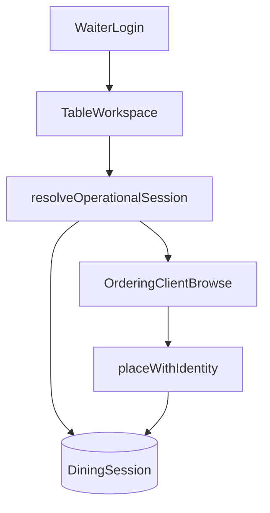

# WAITER-ORDERING-PLATFORM-ARCHITECTURE-1 — Architecture

**Program:** WAITER-ORDERING-PLATFORM-ARCHITECTURE-1  
**Type:** Platform Architecture (design only — no implementation)  
**Status:** Approved for Architecture / Ready for Phased Implementation  
**Date:** 2026-07-15  
**Depends on:** ORDERING-PLATFORM-ARCHITECTURE-1, ORDERING-CLIENT-PLATFORM-ARCHITECTURE-1, OPERATIONAL-SESSION-PLATFORM-1, NON-TABLE-PLACE-ORDER-1, KIOSK-IDENTITY-ADOPTION-1, KIOSK-PRESENTATION-ADOPTION-1, KIOSK-BROWSE-PRESENTATION-ADOPTION-1, ORDER-CONFIRMATION-PRESENTATION-ADOPTION-1, ADR-ARCH-019  

---

## 1. Platform Architecture

### 1.1 Vision

Waiter Ordering is a **new Ordering Channel**, not a new Ordering System.

```
Waiter (staff)
  → Waiter Device Shell (auth + table workspace)
  → Restaurant Session (Operational / Dining Session)
  → Ordering Client Platform (browse / cart / checkout)
  → Ordering Platform (place order / pricing / runtime)
  → Business Identity + Fulfilment + Operational Workspace
```

Ordering Platform remains the **single order owner**.  
Restaurant Session remains the **session owner**.  
Business Identity remains the **display identity owner**.

### 1.2 Channel family (normative)

| Channel | Entry | Session | Place path | BI scope |
|---------|-------|---------|------------|----------|
| QR | Guest table URL | Table Dining Session | `order.create` (compat) / identity-capable | `TABLE` → `T #` |
| Kiosk | Screen Runtime / `/kiosk` | Station ephemeral | `order.placeWithIdentity` | `KIOSK` → `K #` |
| **Waiter** | **Staff auth + table workspace** | **Table Dining Session (required)** | **`order.placeWithIdentity`** | **`WAITER` → `WT #`** |

### 1.3 Composition pattern (reuse)

Identical to certified QR/Kiosk hosts:

```
WaiterOrderingClientHost
  → OrderingClientProvider (ORDERING_CHANNEL_WAITER_TABLET)
  → OrderingBrowseProvider
  → OrderingCartProvider (Waiter CartScopeAdapter)
  → OrderingCheckoutProvider (identity submit)
```

Channel supplies: auth shell, session selection, navigator, checkout identity facts.  
Channel does **not** own cart engine, browse catalog logic, pricing, or place-order domain rules.

---

## 2. Ownership Matrix

| Concern | Owner | Waiter may… |
|---------|-------|-------------|
| Catalog / pricing / place order | Ordering Platform | Consume |
| Runtime materialization | Ordering Runtime | Consume via `getRuntimeBySlug` |
| Browse / cart / checkout orchestration | Ordering Client Platform | Compose |
| Shared browse UI (`MenuBrowseArea`, etc.) | Shared menu presentation | Consume |
| Operational Session lifecycle | Session Platform | Attach / select |
| Dining Session (table persistence) | Session Platform (table specialization) | Attach to open table session |
| Fulfilment Anchor semantics | Order Identity (ADR-ARCH-019) | Supply `table` + `table_service` |
| Business Display Identity | Business Identity | Request scope `WAITER`; never format locally |
| Operational cards / kitchen / print | Operational / Kitchen / Print | Consume projected DTO identity |
| Staff authentication | Waiter Channel (+ future staff auth module) | Own UX; gate place APIs |
| Table workspace / navigation chrome | Waiter Channel | Own |
| Screen pairing (kitchen/kiosk style) | Screen Platform | Optional later — not primary |

---

## 3. Session Lifecycle

### 3.1 Session-first rule (normative)

The waiter **never** creates a standalone order outside a Restaurant Session.

1. Waiter authenticates (staff).  
2. Waiter selects a **table** (or joins an open visit).  
3. Channel resolves **Operational Session** via existing `resolveOperationalSession` with `createTableSessionAnchor`.  
4. Open **Dining Session** (table specialization) is reused when present; otherwise Session Platform creates/attaches per existing table rules.  
5. All subsequent Place Order calls stamp that `sessionId` / `sessionToken`.

No waiter-private session type. No parallel “waiter order bag” outside Session Platform.

### 3.2 Session vs Fulfilment

| Concept | Role for Waiter |
|---------|-----------------|
| Session Anchor | Table uniqueness / occupancy (`table`) |
| Fulfilment Anchor | Ops label — same table (`createTableFulfilmentAnchor`) |
| Operational Session | Orders attach via `sessionId` |
| Dining Session | Persisted table visit (`dining_sessions`) |

Waiter and QR guests at the same table share the **same** Session Platform specialization when the product allows concurrent visit continuation (staff continues an open dining session via `sessionToken`).



---

## 4. Ordering Lifecycle

```
Waiter Login
  → Restaurant / Table Selection
  → Attach Restaurant Session
  → Browse (MenuBrowseArea)
  → Cart
  → Checkout
  → Place Order (IdentityPlaceOrderService)
  → Business Identity allocate (scope WAITER)
  → Confirmation (displayReference WT #NNN)
  → Fulfilment / Operational Workspace (projected stamps)
```

**Normative place command:**

```
serviceMode: table_service
fulfilmentAnchor: createTableFulfilmentAnchor({ tableId, tableNumber })
operationalSession: from resolveOperationalSession(...)
identityScope: WAITER   // explicit stamp for BI partition
→ order.placeWithIdentity (authenticated waiter procedure)
```

QR `order.create` remains the guest dual-compat path. Waiter does **not** primary-path through guest `order.create`.

---

## 5. Runtime Integration

| Item | Decision |
|------|----------|
| Runtime API | Reuse `ordering.getRuntimeBySlug` (same catalog materialization as QR/Kiosk) |
| Client runtime | Reuse `OrderingClientProvider` + channel id `ORDERING_CHANNEL_WAITER_TABLET` (already defined) |
| Gates | Reuse/extend gate derivation for authenticated staff (presentation only) |
| Policies | No waiter-specific pricing/tax rules |

Runtime ownership unchanged. Waiter is another consumer of OrderingRuntimeContext.

---

## 6. Business Identity Integration

### 6.1 Approved display form

```
WT #001
WT #002
…
```

Restart per **Business Day + Identity Scope** (existing allocator key shape).

### 6.2 Scope extension (Reuse With Extension — required)

Today scopes are `TABLE` | `KIOSK` only (`resolveBusinessIdentityScope.ts`).  
A waiter table order that only stamps `table` / `table_service` would incorrectly join the guest **TABLE** sequence.

**Normative design:**

1. Add `WAITER` to `BUSINESS_IDENTITY_SCOPES`.  
2. `businessIdentityScopeCode("WAITER") → "WT"`.  
3. Allocator continues to key `(restaurantId, businessDay, identityScope)` — **no new allocator**.  
4. Place path passes **explicit `identityScope: "WAITER"`** (or equivalent provenance stamp) into allocate / ensureAssigned.  
5. `DisplayReferenceFormatter` / `OrderDisplayIdentityResolver` remain the only formatters.  
6. Presentation renders `displayReference` only (same policy as confirmation / ops cards).

Fulfilment Anchor stays **`table`** for kitchen/ops labels. Scope is **channel provenance**, not a second fulfilment type.

### 6.3 Migration note (implementation phase)

Additive: extend sequence PK already includes `identity_scope`; new scope value needs no new table. Historic rows unchanged. Implementation program will own schema/governance if any backfill defaults are required — **out of scope for this architecture program**.

---

## 7. Navigation Architecture

```
Restaurant (context)
  → Tables (floor / list)
  → Active Session (selected table)
  → Browse
  → Cart
  → Checkout
  → Order Confirmation
  → (optional) Return to Session / Tables
```

Reuse `OrderingNavigator` stages already used by Kiosk (`browse` | `cart` | `checkout` | `confirmation`).  

**New (channel-owned):** table workspace routes and session attachment screens.  
**Not new:** browse/cart/checkout/confirmation orchestration inside Ordering Client Platform.

Suggested route family (non-normative naming):

```
/waiter/:slug                 → login / entry
/waiter/:slug/tables          → table workspace
/waiter/:slug/session         → active session chrome
/waiter/:slug/menu|cart|checkout|confirmed → Ordering Client stages
```

---

## 8. Security Model

### 8.1 Principles

- No privilege escalation above restaurant ownership.  
- Waiter may place orders only for restaurants they are authorized for.  
- Session attachment must respect Session Platform occupancy rules.  
- Public guest place-order procedures must **not** be the waiter production entry.

### 8.2 Auth architecture (New Component Required — justified)

| Layer | Requirement |
|-------|-------------|
| Staff identity | Authenticated restaurant staff (extend user/staff model; PIN/password TBD in implementation) |
| API | Authenticated waiter place procedure wrapping existing `IdentityPlaceOrderService` (auth middleware only — **not** a new PlaceOrder domain) |
| Session | Server validates table session belongs to restaurant; staff may only attach allowed tables |
| Device | Optional paired tablet later; **primary model is staff login**, not kitchen-style device pairing |

Screen Platform roles today (`kitchen_display`, `self_ordering_kiosk`, …) have **no waiter role**. Pairing is optional for locked tablets; it is not required for architecture certification.

### 8.3 Permissions checklist

| Permission | Rule |
|------------|------|
| Restaurant ownership | Staff ↔ restaurant membership |
| Session ownership | Orders attach only to resolved Session Platform session |
| Operational visibility | Kitchen/Expo see fulfilment + `WT #` via existing projections |
| Customer tracking URLs | Optional; guest tracking token remains capability-based if issued |

---

## 9. Reuse Matrix

| Subsystem | Classification | Justification |
|-----------|----------------|---------------|
| Ordering Platform / PlaceOrderService | **Reuse As-Is** | Single place engine |
| IdentityPlaceOrderService | **Reuse With Extension** | Prefer; wrap with authenticated API entry |
| Ordering Runtime / getRuntimeBySlug | **Reuse As-Is** | Same catalog |
| Ordering Client providers (browse/cart/checkout) | **Reuse As-Is** | Channel-agnostic |
| MenuBrowseArea / MenuItemsGrid / MenuSearchAndCategories | **Reuse As-Is** | Certified shared browse |
| CartScopeAdapter | **Reuse With Extension** | `createWaiterStationCartScopeAdapter` exists; refine table+session key policy in implementation |
| ORDERING_CHANNEL_WAITER_TABLET | **Reuse As-Is** | Already defined |
| Operational Session + Dining Session (table) | **Reuse As-Is** | Session-first; comments already cite waiter |
| resolveOperationalSession | **Reuse As-Is** | Channel-independent |
| Table Fulfilment Anchor + table_service | **Reuse As-Is** | Correct ops semantics |
| Business Identity allocator | **Reuse With Extension** | Add `WAITER` / `WT` scope only |
| DisplayReferenceFormatter / Resolver | **Reuse With Extension** | Scope code `WT` |
| Confirmation presentation (displayReference) | **Reuse As-Is** | Same policy as ORDER-CONFIRMATION-PRESENTATION-ADOPTION-1 |
| Kitchen / Expo / Print / Order Read | **Reuse As-Is** | Consume projected identity + fulfilment |
| WaiterOrderingClientHost + navigator | **New Component Required** | Thin host mirroring Kiosk/QR — no platform exists |
| Waiter shell (login, tables, session chrome) | **New Component Required** | Explicitly channel-owned; nothing exists |
| Staff authentication | **New Component Required** | No staff/waiter auth surface today; public place APIs insufficient |
| Screen Runtime waiter role | **Optional / defer** | Not required for first implementation |

### Justification for every New Component Required

1. **WaiterOrderingClientHost / navigator** — Same composition pattern as `KioskOrderingClientHost`; cannot reuse QR/Kiosk shells without wrong channel semantics. Thin adapter only.  
2. **Waiter shell (login + tables)** — Channel ownership per ORDERING-CLIENT-PLATFORM-ARCHITECTURE-1 §3.4; no existing UI.  
3. **Staff authentication** — Security requirement; cannot ship waiter place-order on `publicProcedure` without privilege model.

No new Cart, Checkout, Browse engine, Session engine, or BI allocator.

---

## 10. Future Extension Points

| Extension | Notes |
|-----------|-------|
| Continue adding items to open session | Checkout UX flag; same session + place again |
| Send order immediately vs hold | Channel UX; PlaceOrder still atomic per submit |
| Split check / courses | Future; may need Order Aggregate / bill programs — **not** this architecture |
| Waiter mobile phone form factor | Same channel, different shell layout |
| Paired waiter tablet role | Optional Screen Platform role later |
| Multi-waiter concurrent table | Session Platform occupancy + staff permissions |
| Tips / service charge waiter UX | Ordering Platform pricing already owns charges |

Document-only for checkout UX differences (Phase 6):  

- **Send order immediately** — default; reuse checkout submit.  
- **Continue adding items** — return to browse with same session attachment; new place creates another order on same session (platform already supports multi-order sessions).  
- **Split order** — future; do not implement in first waiter program.

---

## 11. Risk Analysis

| Risk | Mitigation |
|------|------------|
| Waiter orders steal guest `T #` sequence | Explicit `WAITER` identityScope at allocate |
| Forked browse/checkout | Architecture forbids; reuse MenuBrowseArea + OrderingCheckoutProvider |
| Parallel session inventing | Session-first + resolveOperationalSession only |
| Public API abuse | Authenticated waiter place procedure |
| Coupling waiter to Screen pairing | Brand staff-login as primary; pairing optional |
| Overbuilding split-check | Defer to future bill architecture |
| QR regression | Keep `order.create` guest path untouched |

---

## 12. Certification

### Acceptance criteria

| Criterion | Status |
|-----------|--------|
| Waiter is a channel, not a new Ordering System | **PASS** |
| Ordering Platform remains single order owner | **PASS** |
| Restaurant Session remains owner | **PASS** |
| Business Identity owns `WT #001` | **PASS** (extension design; no parallel allocator) |
| Shared Browse reused | **PASS** |
| Checkout / Cart / Fulfilment reused | **PASS** |
| No ownership violations / duplicated platforms | **PASS** |
| Ready for phased implementation | **PASS** |

### Phased implementation sketch (not this program)

1. **WAITER-AUTH-SHELL-1** — staff auth + table workspace  
2. **WAITER-CLIENT-HOST-1** — host/navigator/cart scope wiring  
3. **WAITER-BUSINESS-IDENTITY-1** — `WAITER` / `WT` scope exposure  
4. **WAITER-PLACE-ORDER-1** — authenticated `placeWithIdentity` + session attach  
5. **WAITER-CONFIRMATION-1** — displayReference adoption  

---

## Appendix A — Evidence anchors

| Topic | Path |
|-------|------|
| Channel id | `shared/ordering-platform/orderingPlatformContracts.ts` |
| Waiter cart stub | `client/src/lib/ordering-client/contracts/createChannelCartScopeAdapters.ts` |
| Client platform ownership | `docs/engineering/programs/ORDERING-CLIENT-PLATFORM-ARCHITECTURE-1/ARCHITECTURE.md` |
| Session resolve | `server/operational-session/resolveOperationalSession.ts` |
| Identity place | `server/order/application/IdentityPlaceOrderService.ts` |
| BI scopes | `server/order/business-identity/application/resolveBusinessIdentityScope.ts` |
| Shared browse | `client/src/components/menu/MenuBrowseArea.tsx` |
| Screen roles (no waiter) | `server/operational-device/domain/deviceRoles.ts` |
