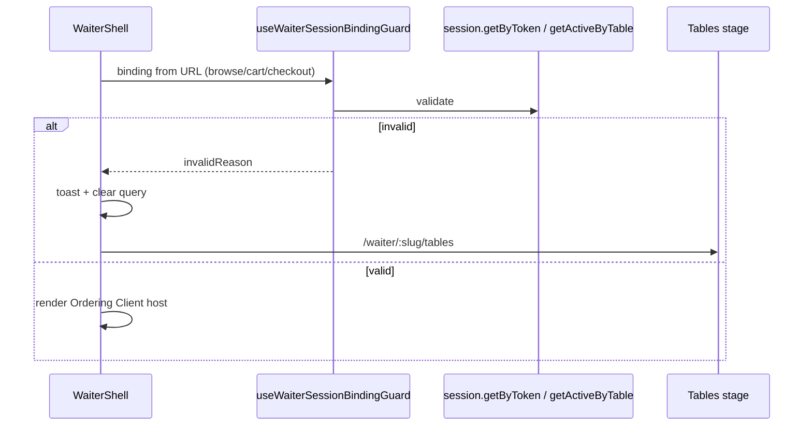

# WAITER-SESSION-BINDING-HARDENING-1 — Engineering Report

**Program:** WAITER-SESSION-BINDING-HARDENING-1  
**Type:** Platform Hardening  
**Date:** 2026-07-15  
**Decision:** **HARDENING CERTIFIED**  
**Depends on:** OPERATIONAL-SESSION-PLATFORM-1, WAITER-ORDERING-FOUNDATION-1, WAITER-NAVIGATION-ADOPTION-1, WAITER-SESSION-FORENSICS-1  

---

## 1. Binding Audit

| Location | Stores / consumes | Owner | Lifecycle | Prior invalidation |
|----------|-------------------|-------|-----------|--------------------|
| Waiter URL query `session`, `sessionId`, `table`, `tableId` | Channel binding | WaiterShell | Set on `attachTable` success; cleared by navigate to `/tables` | Missing params only |
| `WaiterOrderingClientHost` cart scope | `sessionId` string in cart key | Channel cart adapter | Scope identity | None |
| `WaiterCheckoutStage` → `placeAsWaiter` | `sessionToken` | Checkout + server | Per submit | Server IdentityPlaceOrder / expired token |
| localStorage dining session | QR only | QR recovery | N/A to waiter | QR recovery |

### Entry-point classification (pre-hardening)

| Operation | Classification | Evidence |
|-----------|----------------|----------|
| Table attach | **Safe** | `waiter.attachTable` → Session Platform resolve |
| Browse / cart with URL bind | **Needs validation** | No revalidate; stale token possible |
| Checkout UI | **Needs validation** | Same URL bind |
| Place order | **Already protected** (server) | `placeAsWaiter` requires token; resolve rejects terminal | Client still needed pre-submit UX |
| Confirmation view | **Safe** | Display-only after place |
| Order again | **Needs validation** | Re-enters browse with same qs → covered by browse guard |

---

## 2. Root Cause

Waiter binding is a **URL projection** of Session Platform state. Session Platform can close/replace the table session (owner settle/close) while the waiter device retains query params. Unlike QR, waiter did not revalidate on focus/visibility and did not clear bindings on terminal sessions.

---

## 3. Validation Policy

**Single policy:** `validateWaiterSessionBinding`  
**Reads (Session Platform):** `session.getByToken` + `session.getActiveByTable`  
**Listeners (reuse QR helper):** `attachDiningSessionRevalidationListeners`

Binding is valid only when:

1. Bound token resolves (`getByToken`)  
2. Status is `open`  
3. `tableNumber` matches binding  
4. Active table session exists and **same token** (detects replace)  

**Does not** call `recoverDiningSession` (that adopts the new active session for QR).  
**Does not** call `resolveOperationalSession` / `attachTable` on failure.

---

## 4. Recovery Flow

Staff must explicitly re-select a table → existing `attachTable` policy (reuse or create via Session Platform).

---

## 5. Runtime Consistency Analysis

| Concern | Result |
|---------|--------|
| Stale token blocked before browse/cart/checkout | Pass |
| No silent session create on stale | Pass |
| Cart scope not used until binding valid | Pass (host not mounted while invalid/validating) |
| Confirmation not force-redirected | Pass (order-already-placed UX) |
| Order again → browse revalidation | Pass |

---

## 6. QR Reuse Analysis

| Component | Reuse |
|-----------|--------|
| `session.getByToken` / `getActiveByTable` | **Reuse As-Is** |
| `attachDiningSessionRevalidationListeners` | **Reuse As-Is** |
| `recoverDiningSession` / localStorage save | **Not reused** — would adopt replacement session (wrong for waiter) |
| `useDiningSessionRecovery` | **Not reused** — QR-specific ended-visit semantics |

QR code paths unchanged.

---

## 7. Files Modified

| File | Change |
|------|--------|
| `client/src/lib/ordering-client/waiter/waiterSessionBinding.ts` | Validation policy + messages |
| `client/src/lib/ordering-client/waiter/useWaiterSessionBindingGuard.ts` | Revalidate hook |
| `client/src/pages/waiter/WaiterShell.tsx` | Guard + stale recovery |
| `client/src/lib/ordering-client/index.ts` | Exports |
| `client/src/lib/ordering-client/waiter/__tests__/waiterSessionBinding.test.ts` | Unit tests |
| `client/src/lib/ordering-client/__tests__/waiterSessionBindingHardening.architecture.guards.test.ts` | Guards |
| `client/src/lib/ordering-client/__tests__/waiterOrderingFoundation.architecture.guards.test.ts` | Binding/QR boundary assertion |
| `docs/engineering/programs/WAITER-SESSION-BINDING-HARDENING-1/IMPLEMENTATION.md` | This report |

**Unchanged:** Session lifecycle, `resolveOperationalSession`, Ordering Platform, BI, QR recovery implementation.

---

## 8. Regression Analysis

| Area | Risk | Mitigation |
|------|------|------------|
| QR recovery | Low | Not imported; separate modules |
| Waiter attach | Low | Unchanged |
| placeAsWaiter | Low | Still server-gated |
| False invalid on network error | Medium | Treated as invalid → tables (safe fail-closed) |

---

## 9. Acceptance Validation

| Criterion | Status |
|-----------|--------|
| Detects stale bindings | **PASS** |
| Blocks ops on closed/invalid sessions | **PASS** |
| Clears binding automatically | **PASS** |
| Returns to table selection | **PASS** |
| No duplicate session lifecycle | **PASS** |
| No new session ownership | **PASS** |
| No Session Platform redesign | **PASS** |
| QR unaffected | **PASS** |
| No BI / Runtime redesign | **PASS** |

---

## 10. Certification

**HARDENING CERTIFIED.**

Waiter Ordering revalidates session-dependent stages against the Operational Session Platform and recovers by clearing bindings and returning to table selection, without adopting or creating sessions outside existing Session Platform attach policy.
