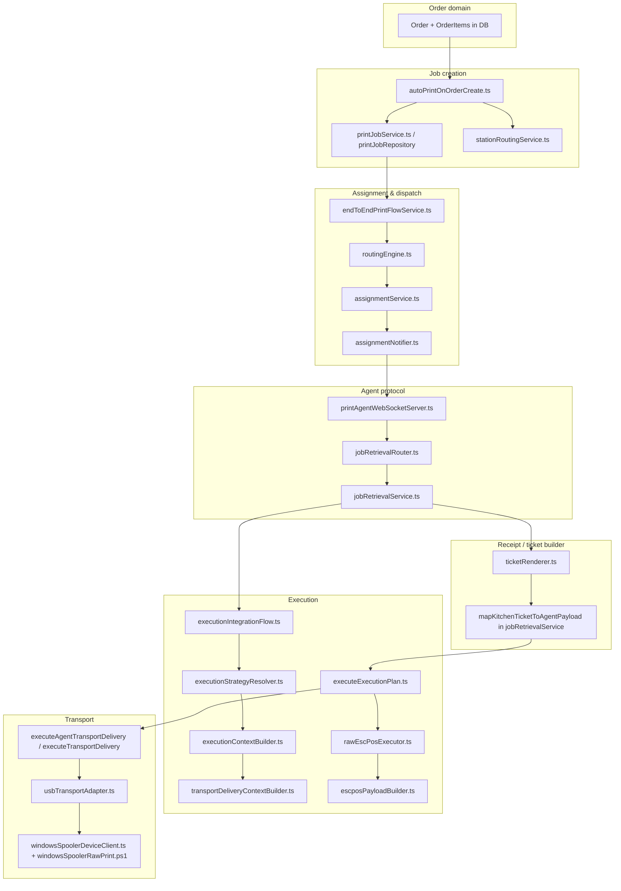

# THERMAL-PRINTING-13A.1 — Arabic Printing Capability Audit

**Status:** Audit complete — no runtime changes  
**Date:** 2026-06-22  
**Scope:** Architecture definition only; implementation deferred to post-approval phase

---

## Executive Summary

MineuQR’s validated Windows USB path delivers **raw ESC/POS bytes** produced by a **UTF-8 text encoder** with **no Arabic shaping, RTL, bidi, code-page selection, or raster rendering**. Arabic item names *can* enter the ticket domain (`nameAr` preferred in `ticketRenderer`), but the **production executor path** uses a simplified English-header template in `escposPayloadBuilder.ts`, not the richer `escposRenderer.ts` kitchen ticket.

Physical Arabic output on typical CP437/CP864 thermal firmware is **not guaranteed** today. `PRINT_TICKET_LOCALE` exists in shared types but is **unused**. Paper width (58mm / 80mm) is stored on printer profiles but **not applied** to line layout. `imagePrinting` capability is negotiated but **not implemented** in ESC/POS generation.

**Recommended architecture:** **Hybrid (Option 4)** — rasterized Arabic as primary, code-page ESC/POS as optimized fallback for detected Class B printers, with profile-driven detection and platform-neutral rendering core shared by Windows, Android, and future iOS bridge paths.

---

## 1. Print Pipeline Map (13A.1A)

### 1.1 End-to-end flow (production — validated Windows USB)



### 1.2 Stage reference

| Stage | Primary files | Key functions |
|-------|---------------|---------------|
| Order data | `drizzle/schema.ts`, `server/db.ts` | `getOrderById`, `getOrderItemsByOrderId` |
| Station filtering | `server/printing/stationRoutingService.ts` | `filterOrderItemsForStationJob`, `resolveStationPrintTargets` |
| Kitchen ticket | `server/printing/ticketRenderer.ts` | `renderKitchenTicket`, `resolveItemName` |
| Ticket types | `server/printing/ticketTypes.ts` | `KitchenTicket`, `KitchenTicketItem` |
| Job payload wire | `server/printing/jobRetrievalService.ts` | `fetchAuthoritativePrintJob`, `mapKitchenTicketToAgentPayload` |
| Agent job contract | `shared/printing/agentJobMessages.ts` | `AgentJobPayload`, `AgentJobTicketPayload` |
| Execution plan | `server/printing/executionIntegrationFlow.ts` | `resolveRuntimeExecutionPlan` |
| Strategy | `server/printing/executionStrategyResolver.ts` | `resolveExecutionStrategy` → `raw-escpos` (Windows + escpos capable) |
| ESC/POS generation | `shared/printing/escposPayloadBuilder.ts` | `buildEscPosPayloadFromAgentTicket`, `encodeEscPosCommands` |
| Executor | `server/printing/executors/rawEscPosExecutor.ts`, `agent/execution/executors/rawEscPosExecutor.ts` | `RawEscPosExecutor.execute` |
| Transport | `agent/transports/usbTransportAdapter.ts` | `UsbTransportAdapter.deliver` |
| Windows spooler | `agent/transports/windowsSpoolerDeviceClient.ts` | `NodeWindowsSpoolerDeviceClient.write` |
| RAW print | `agent/transports/windowsSpoolerRawPrint.ps1` | `SendBytesToPrinter` (datatype `RAW`) |
| Agent consumption | `agent/consumption/jobConsumptionService.ts` | `consumeAssignedJob` |

### 1.3 Parallel (non-production) pipeline

A **second** ESC/POS path exists on the server for domain modeling and tests only. It is **not** called by `rawEscPosExecutor` or the agent runtime.

| Stage | Files | Notes |
|-------|-------|-------|
| Rich kitchen document | `server/printing/escposRenderer.ts` | `renderEscPosKitchenTicket` — order number, table, session, notes |
| Byte encoder | `server/printing/escposByteEncoder.ts` | `encodeEscPosDocument` |
| Constants | `server/printing/escposConstants.ts`, `escposTypes.ts` | Shared command model |

**Gap:** Production uses `escposPayloadBuilder.ts` (duplicate encoder + simplified layout). Arabic tests for rich rendering live in `escposRenderer.test.ts` / `escposByteEncoder.test.ts`; production builder has **no Arabic-specific tests**.

### 1.4 Current payload format

**Wire artifact:** `EscPosPayload` (`shared/printing/executionExecutor.ts`)

```typescript
{
  kind: "escpos-bytes",
  bytes: Uint8Array,
  byteLength: number,
  encoding: "escpos"  // semantic label only — not a charset name
}
```

**Byte stream structure** (both encoders):

1. `ESC @` — initialize  
2. `ESC a n` — alignment (left/center/right)  
3. Text lines — string → bytes → `LF`  
4. `ESC d n` — feed  
5. `GS V 0` — partial cut  

**Production template labels** (English, hardcoded in `escposPayloadBuilder.ts`):

- `"Kitchen Order"`, `"Order Number: …"`, `"Created Time: …"` (ISO timestamp)
- Items: `` `${quantity}x ${itemName}` ``
- Separator: 32× `"-"` (fixed, not width-aware)

**Ticket domain content** (from DB):

- Item names: `nameAr` preferred, `nameEn` fallback (`ticketRenderer.resolveItemName`)
- Prices, totals: **not included** in `KitchenTicket` or `AgentJobTicketPayload`
- Order notes: in `KitchenTicket` but **stripped** in `mapKitchenTicketToAgentPayload` (only `orderId`, `restaurantId`, `items` sent to agent)

### 1.5 Text rendering path

```
DB nameAr/nameEn
  → ticketRenderer.resolveItemName()
  → KitchenTicket.items[].itemName
  → AgentJobTicketPayload.items[].itemName
  → escposPayloadBuilder.renderAgentTicketCommands()
  → EscPosByteBuilder.writeText() / TextEncoder.encode()
  → Uint8Array
  → Windows RAW spooler → physical printer
```

No font selection, no glyph layout, no printer-side code page setup.

---

## 2. Encoding Audit Report (13A.1B)

### 2.1 Actual encoding path

| Layer | Mechanism | Charset |
|-------|-----------|---------|
| JavaScript strings | UTF-16 internally | Unicode |
| `writeText()` | `new TextEncoder().encode(text)` | **UTF-8** |
| ESC/POS commands | Raw byte literals (`0x1b`, `0x1d`, …) | Binary |
| Windows spooler | `ReadAllBytes` → `WritePrinter` | Opaque byte stream (`RAW`) |
| `EscPosPayload.encoding` | Constant `"escpos"` | **Not a character encoding** |

**Locations:**

- `shared/printing/escposPayloadBuilder.ts` — `const textEncoder = new TextEncoder()` (production)
- `server/printing/escposByteEncoder.ts` — same pattern (alternate path)

### 2.2 Assumed vs actual

| Assumption (implicit in tests/docs) | Reality |
|-------------------------------------|---------|
| Arabic Unicode passes through encoder | **True** at byte-generation layer |
| Printer interprets bytes as UTF-8 | **Not configured** — no `ESC t` / code page command |
| `encoding: "escpos"` describes charset | **False** — artifact metadata only |
| CP864 / CP720 / CP1256 supported | **No conversion code** exists |
| UTF-16 on wire | **Not used** for text lines |

### 2.3 Encoding technologies — presence in codebase

| Technology | Present? | Location / notes |
|------------|----------|------------------|
| UTF-8 (`TextEncoder`) | **Yes** | Both ESC/POS encoders |
| UTF-16 | No | Only in unrelated Windows P/Invoke `CharSet.Unicode` for spooler API |
| CP864 (Arabic DOS) | **No** | — |
| CP720 (Arabic Windows) | **No** | — |
| CP1256 (Windows Arabic) | **No** | — |
| ESC/POS `ESC t n` (select code page) | **No** | — |
| `iconv-lite` / native iconv | **No** | — |
| Raster / GS `v` / `m` image | **No** | `imagePrinting` profile flag only |

### 2.4 Unused / dead encoding-related code

- `PRINT_TICKET_LOCALE` (`shared/printing/types.ts`) — **defined, never referenced** in printing pipeline
- `server/printing/escposRenderer.ts` + `escposByteEncoder.ts` — **not wired** to production executor
- `executionStrategyResolver` `spooler` method — strategy exists, **no spooler executor** registered (only `raw-escpos`)

### 2.5 Test evidence

`escposByteEncoder.test.ts` explicitly asserts UTF-8 for `"2x برجر"`. This validates **encoder behavior**, not **printer compatibility**.

---

## 3. Arabic Capability Matrix (13A.1C)

| Capability | Supported today? | Evidence |
|------------|------------------|----------|
| Arabic text in domain model | **Partial** | `nameAr` → `itemName` in `ticketRenderer` |
| Arabic in production ESC/POS template | **Data-only** | Same strings encoded UTF-8; labels English |
| Arabic shaping (initial/medial/final) | **No** | No harfbuzz / arabic-persian-reshaper / equivalent |
| RTL layout | **No** | All lines LTR; `align` is physical left/center/right |
| Bidi (mixed AR/EN/digits) | **No** | No UBA / direction marks |
| Arabic-Indic digits | **No** | Quantities use ASCII digits in template |
| Western digits in Arabic context | **Default** | `${quantity}x` ASCII |
| Arabic + English mixed rows | **Raw concatenation** | e.g. `"2x برجر"` — no ordering rules |
| Arabic + prices | **No** | Prices not on ticket payload |
| Code page switching | **No** | — |
| Text → image / raster | **No** | Despite `imagePrinting` profile flag |
| Locale selection (`ar` / `en` / `bilingual`) | **No** | `PRINT_TICKET_LOCALE` unused |
| Receipt headers in Arabic | **No** | Hardcoded English strings |
| Physical validation of Arabic glyphs | **Unverified** | E2E validates pipeline, not glyph correctness |

**Conclusion:** Arabic is **transported as raw Unicode UTF-8 bytes** without typography. Correct rendering depends entirely on printer firmware — **not engineered** by MineuQR today.

---

## 4. Width Compatibility Matrix (13A.1D)

### 4.1 Current width handling in code

| Concern | 58mm | 80mm | Implementation |
|---------|------|------|----------------|
| Profile storage | Supported | Supported | `PrinterProfile.paperWidth` ∈ `{58, 80}` |
| Execution context | Passed through | Passed through | `executionContextBuilder` → `printer.paperWidth` |
| Line width / CPL | **Not used** | **Not used** | — |
| Separator length | 32 chars | 32 chars | `DEFAULT_SEPARATOR_LENGTH = 32` (fixed) |
| Text wrap | **None** | **None** | One command = one line; overflow clips on printer |
| Column layout (qty / name / price) | **None** | **None** | Simple string interpolation |

### 4.2 Industry-typical constraints (reference for design)

| Width | Printable dots (typical) | Chars/line (Font A, 12×24) | Chars/line (Font B, 9×17) |
|-------|--------------------------|----------------------------|---------------------------|
| 58mm | 384 | ~32 | ~42 |
| 80mm | 576 | ~48 | ~64 |

MineuQR does not select Font A vs B or set character width commands.

### 4.3 Arabic impact analysis (design-time)

| Scenario | 58mm risk | 80mm risk | Notes |
|----------|-----------|-----------|-------|
| Long Arabic item names | **High** | Medium | Unshaped Arabic + no wrap → overflow / clipping |
| Mixed `2x اسم عربي طويل` | **High** | Medium | Bidi absent; digit/name order may look wrong |
| English headers + Arabic items | Medium | Low | Visual inconsistency; direction clash |
| Centered Arabic title | **High** | Medium | Centering without RTL awareness misaligns |
| Price columns (future) | **High** | Medium | Needs RTL-aware column layout or raster |
| Separator (32 chars) | OK on 58 | Underfills 80 | 80mm receipts look narrow |
| Kitchen station tickets | 58 usable | 80 preferred | More Arabic glyphs per line on 80mm |

**Recommendation for implementation phase:** Drive layout from `paperWidth` with **separate CPL tables** for Latin vs Arabic (raster lines use pixel width, not CPL).

---

## 5. Arabic Printer Capability Matrix (13A.1E)

### 5.1 Current profile & negotiation surface

**`PrinterProfile`** (`shared/printing/printerProfiles.ts`):

| Field | Arabic relevance today |
|-------|------------------------|
| `capabilities.escpos` | Gates `raw-escpos` strategy |
| `capabilities.imagePrinting` | **Not used** in rendering — candidate for Class C |
| `capabilities.qrCode` | Not used in ticket rendering |
| `executionCapabilities.airprint` | iOS path only |
| `executionCapabilities.vendorSdk` | iOS path only |
| `paperWidth` | Not used in layout |

**Negotiation path:** Agent `PROFILES_REPORT` → `printerProfileService` → `printerProfileStore` (informational). No Arabic probe or font discovery.

### 5.2 Printer classes

| Class | Description | Typical hardware | MineuQR detection today |
|-------|-------------|------------------|-------------------------|
| **A — Native Arabic ESC/POS** | Firmware renders Arabic/UTF-8 text commands correctly | Some Hoin/Xprinter ME region models | **Cannot detect** — no probe |
| **B — Arabic code page** | Requires `ESC t` + CP864/CP720/CP1256 bytes | Many budget 58mm ESC/POS | **Cannot detect** — no code page commands |
| **C — Raster required** | Text Arabic unreliable; GS `v` / bit image needed | Generic POS-80C-class, validated USB path | **De facto default** for Arabic — safest assumption |

### 5.3 Proposed detection (future — not implemented)

| Signal | Class hint | Mechanism |
|--------|------------|-----------|
| Default (unknown) | **C** | Conservative until probed |
| `capabilities.imagePrinting: true` | C (or B) | Eligible for raster path |
| Agent-reported `arabicMode: "native" \| "codepage" \| "raster"` | A / B / C | Profile extension (new field) |
| Self-test print probe | A vs B vs C | Optional agent diagnostic job |
| Vendor model allowlist | A or B | Config / DB metadata |
| Raster probe success | C confirmed | Render test pattern |

---

## 6. Architecture Recommendation (13A.1F)

### 6.1 Options evaluated

| Option | Pros | Cons | Fit |
|--------|------|------|-----|
| **1 — Raw Arabic ESC/POS (UTF-8)** | Simplest bytes; current encoder | Fails on most CP437 printers; no shaping/RTL | **Poor** as primary |
| **2 — Code page Arabic** | Compact bytes; fast on Class B | Code page fragmentation; bidi still hard; region-specific | **Good fallback** |
| **3 — Rasterized Arabic** | Consistent glyphs; works 58/80; platform-neutral | Larger payload; needs font asset; slower | **Strong primary** |
| **4 — Hybrid** | Best coverage; optimizes per printer | More complexity; needs detection | **Recommended** |

### 6.2 Recommended strategy

#### Primary: **Rasterized Arabic rendering (Option 3)**

- Introduce a **presentation layer** between `KitchenTicket` and ESC/POS bytes:
  - Shape Arabic (HarfBuzz WASM or pre-shaped pipeline)
  - Apply RTL / bidi for mixed content
  - Render lines to monochrome bitmap at width derived from `paperWidth` (384 / 576 px)
  - Emit GS `v 0` / `m` raster commands (when `imagePrinting` or default Arabic mode)
- **Unify** `escposRenderer` and `escposPayloadBuilder` into one layout engine to remove dual-path drift
- Use `PRINT_TICKET_LOCALE` for `ar` / `en` / `bilingual` label sets

#### Fallback: **Code page ESC/POS (Option 2)**

- When profile declares `arabicMode: "codepage"` + `codePage: 864|720|1256`:
  - Emit `ESC t n` before text
  - Convert UTF-8 → target bytes via explicit codec table
  - Simpler rows only (kitchen items); still limited bidi

#### Detection strategy

1. **Profile extension** on `PrinterProfile`: `arabicRendering: "auto" | "raster" | "codepage" | "native"`  
2. **Default `auto` → raster** for production safety (Class C)  
3. Optional agent **probe job** during deployment validation  
4. Record observed class in endpoint/printer metadata (12E operations model)

#### Migration strategy

| Phase | Action | Risk |
|-------|--------|------|
| M1 | Unify ticket → ESC/POS pipeline; preserve byte-identical output for Latin-only | Low |
| M2 | Add locale + `paperWidth`-aware layout (Latin) | Low |
| M3 | Raster Arabic behind feature flag per restaurant | Medium |
| M4 | Code-page fast path for probed Class B printers | Medium |
| M5 | Android runtime shares same render core | Low (shared package) |
| M6 | iOS via bridge / AirPrint PDF or raster | Separate track |

### 6.3 Platform support matrix (target)

| Platform | Transport | Arabic delivery |
|----------|-----------|-----------------|
| Windows Agent | USB RAW / network | Raster ESC/POS (primary) |
| Android Runtime | USB / BT / network | Same shared raster payload |
| iOS Runtime | AirPrint / bridge | Raster or PDF render → AirPrint (no raw ESC/POS on iOS) |

### 6.4 Non-goals confirmed (this audit)

- No routing, assignment, resolution, dispatch, transport, endpoint, or operations changes
- No runtime modifications in 13A.1
- Implementation deferred to **THERMAL-PRINTING-13B+** (post architectural approval)

---

## 7. Validation

| Check | Result |
|-------|--------|
| `pnpm tsc --noEmit` | No code changes — unaffected |
| Runtime behavior | Unchanged |
| Printing output | Unchanged |

---

## 8. Key files index

```
server/printing/ticketRenderer.ts          # Arabic name selection
server/printing/jobRetrievalService.ts     # Ticket → agent payload
shared/printing/escposPayloadBuilder.ts  # Production ESC/POS bytes
server/printing/escposRenderer.ts          # Alternate layout (unused in prod)
server/printing/escposByteEncoder.ts       # Alternate encoder (unused in prod)
agent/execution/executors/rawEscPosExecutor.ts
agent/transports/usbTransportAdapter.ts
agent/transports/windowsSpoolerDeviceClient.ts
shared/printing/printerProfiles.ts         # Capabilities (no Arabic fields)
shared/printing/types.ts                   # PRINT_TICKET_LOCALE (unused)
```

---

## 9. Approval checklist (for stakeholders)

- [ ] Accept **Hybrid** strategy with **raster primary**
- [ ] Approve **PrinterProfile extension** for Arabic rendering class
- [ ] Approve **unification** of dual ESC/POS code paths
- [ ] Confirm **prices / totals** scope for Arabic receipts (currently absent)
- [ ] Confirm **bilingual** vs **Arabic-only** restaurant requirements
- [ ] Green-light **THERMAL-PRINTING-13B** implementation phase
