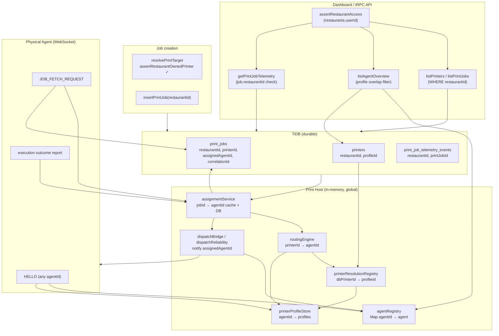

# THERMAL-PRINTING-13I-NOTE-1 — Multi-Restaurant Agent Visibility Investigation

**Title:** Multi-Restaurant Agent Visibility — Forensic Architecture Audit  
**Status:** Investigation complete (no code changes)  
**Date:** 2026-06-22  
**Mode:** Architecture investigation only

---

## Executive Summary

The observation that the **same Agent ID appears under multiple restaurants belonging to one account** is **primarily a UI visibility phenomenon**, not evidence of a broken tenant registry or shared database agent row. There is **no `agents` table**; agents exist only as **global in-memory WebSocket registrations** on the Print Host. Restaurant scoping is applied at the **API/dashboard layer** (via `restaurantId` query parameters and `assertRestaurantAccess`) and at **job persistence** (`print_jobs.restaurantId`), but **not** as a hard boundary in the runtime routing/assignment pipeline.

**Authority model (actual):**

| Identifier | Scope | Role |
|------------|-------|------|
| `restaurantId` | DB + API | Job ownership, printer rows, telemetry reads, dashboard queries |
| `accountId` | Implicit (`restaurants.userId`) | API access control only; not used in print routing |
| `agentId` | Global (Print Host memory) | WebSocket identity; convention `mineuqr-agent-{restaurantId}` is **not enforced** |
| `printerId` | Per-restaurant DB row | Job target; globally unique integer PK |
| `profileId` / `profilePrinterId` | **Global namespace** on Print Host | Bridges DB printer → live agent inventory |

**Why the same agent appears in multiple restaurant dashboards:** `listAgentOverview(restaurantId)` includes a globally connected agent when **any profile reported by that agent matches any `printers.profileId` for that restaurant**. A single physical PC running one agent that reports profiles for multiple restaurants (or duplicate `profileId` strings across restaurants) will appear in each matching restaurant's agent list.

**Execution isolation:** Fetch and execution paths enforce **`assignment.agentId === requestingAgentId`**, not `job.restaurantId === agentRestaurant`. Cross-restaurant **execution** is therefore **conditionally possible** when `profileId` strings collide across restaurants or when the `routeViaSingleCandidate` fallback fires (printer missing from resolution registry with exactly one online agent globally). These are **misconfiguration / edge-case** paths, not API tenant bypass. Cross-**account** job access via dashboard APIs is blocked by `assertRestaurantAccess`.

**Final verdict:** **B — Tenant Isolation Verified With UI Leakage**

Execution cannot be arbitrarily hijacked across restaurants; the observed multi-restaurant agent visibility is explained by profile-overlap matching and global agent registry design. Conditional cross-restaurant routing gaps exist and should be hardened, but they do not constitute an immediate cross-account breach under system-generated `profileId` conventions.

---

## End-to-End Authority Diagram



**Pipeline sequence (production path):**

```text
Order (restaurantId)
  → resolvePrintTarget (restaurant-owned printer validated)
  → print_jobs INSERT (restaurantId, printerId)
  → assignPrintJob
      → resolveRoutingDecision(jobId, printerId)
          → resolvePrinter(dbPrinterId) → profileId → agentId (global profile ownership)
      → transitionPrintJobExecutionState(ASSIGN) → assignedAgentId in DB
  → dispatchBridge → WebSocket JOB_ASSIGNED to assignedAgentId
  → Agent JOB_FETCH_REQUEST
      → resolvePrintJobAssignment + agentId match guard
      → renderKitchenTicket(job.restaurantId)
  → execution outcome → transitionPrintJobExecutionState
  → telemetry events (restaurantId from job)
```

---

## Isolation Matrix

| Subsystem | Verdict | Justification |
|-----------|---------|---------------|
| **1. Agent registration** | **CONDITIONALLY SAFE** | `agentRegistry` is global `Map<agentId, RegisteredAgent>` with **no `restaurantId` field** (`server/printing/agentRegistry.ts`). HELLO accepts any `agentId` without server validation (`agentWebSocketInboundHandler.ts:114-122`). Convention `mineuqr-agent-{restaurantId}` is generated in `buildSuggestedPrintAgentId` but **not enforced**. One physical agent = one `agentId` globally; logical multi-restaurant attachment is via **reported profiles**, not registration records. |
| **2. Printer ownership** | **CONDITIONALLY SAFE** | DB: `printers.restaurantId` indexed, all restaurant-scoped queries use `eq(printers.restaurantId, restaurantId)` (`printerRepository.ts`). **No FK** from `print_jobs.printerId` → `printers.id`. Runtime: `printerResolutionRegistry` maps **global** `dbPrinterId → profilePrinterId` rebuilt from `listAllPrinters()` across all tenants (`printerResolutionPersistenceService.ts`). `profileId` has **no unique DB constraint**; collision across restaurants is possible for legacy/manual values. Printer A's DB row cannot appear in Restaurant B's printer **list API**; it **can** route to the same agent if `profileId` strings match. |
| **3. Assignment isolation** | **CONDITIONALLY SAFE** | `assignPrintJob` routes via `resolveRoutingDecision({ jobId, printerId })` only — **no `job.restaurantId` check** (`assignmentService.ts:145-149`). Assignment stores `restaurantId` from job row for cache/Telemetry but does not validate printer.restaurantId or agent-restaurant alignment. **Risk path:** `routeViaSingleCandidate` assigns to the sole globally online agent when `UNKNOWN_DB_PRINTER` (`routingEngine.ts:150-151, 58-78`). **Risk path:** `resolvePrinter` returns agent owning matching `profileId` regardless of restaurant (`printerResolutionService.ts`). |
| **4. Dispatch isolation** | **SAFE** | Dispatch targets `print_jobs.assignedAgentId` (`dispatchNotificationRepository.ts`, `dispatchReliabilityService.ts`). Reconnect replay filters by `agentId` on HELLO (`replayPendingDispatchNotificationsForAgent`). Startup replay lists all pending but each notification is sent only to its row's `assignedAgentId`. Cannot cross-notify unless assignment already wrong. |
| **5. Fetch isolation** | **CONDITIONALLY SAFE** | `fetchAuthoritativePrintJob` guards: agent registered, assignment exists, `assignment.agentId === requestingAgentId` (`jobRetrievalService.ts:79-97`). **Does not** verify `job.restaurantId` against agent-inferred restaurant. Agent can fetch any job **assigned to its agentId**; ticket content uses `job.restaurantId` from DB. |
| **6. Execution isolation** | **CONDITIONALLY SAFE** | `recordExecutionOutcomeReport` mirrors fetch guards (`executionOutcomeService.ts:52-63`). `printJobExecutionState` validates `agentId` on ASSIGN/START transitions but **never `restaurantId`** (`printJobExecutionState.ts`). Execution proceeds when assignment chain is consistent; wrong assignment from routing is not caught here. |
| **7. Telemetry isolation** | **SAFE** | `getPrintJobOperationalTelemetry(restaurantId, printJobId)` returns `null` if `job.restaurantId !== restaurantId` (`printJobTelemetryService.ts:167-169`). API gated by `assertRestaurantAccess` (`printOperationsRouter.ts:99`). Events stored with `restaurantId` from job at emit time; no cross-restaurant timeline API without job ID + access. |
| **8. Dashboard isolation** | **NOT SAFE (UI)** | **Printer list / job queue:** scoped by `restaurantId` ✓ (`printOperationsService.ts`). **Agent list (`listAgentOverview`):** iterates **global** `listAgentConnectivityStates()`, includes agent if reported `profile.printerId` ∈ restaurant's `printers.profileId` set (`printOperationsService.ts:221-241). Same agent legitimately appears in multiple restaurants when profiles overlap. **Diagnostics:** returns **all** global agents with `relevantToRestaurant` badge (`printOperationsDiscoveryService.ts:272-278`, `PrinterDiscoveryDiagnosticsPanel.tsx:125-148`). **Ownership conflicts** surfaced when inferred agent restaurant ≠ current restaurant (`detectOwnershipConflicts`). |
| **9. Database isolation** | **CONDITIONALLY SAFE** | Tenant column `restaurantId` on `print_jobs`, `printers`, `print_stations`, `print_job_telemetry_events`. No `agents` table. No FK enforcement between jobs and printers. `profileId` not unique per restaurant. Account boundary = `restaurants.userId`, enforced only at API layer. |
| **10. Restart behaviour** | **SAFE** | `replayAllPendingDispatchNotifications` replays by `assignedAgentId` per row (`dispatchReliabilityService.ts:64-66`). Assignment cache warmed with row's `restaurantId` (`dispatchReliabilityService.ts:35-42). Retry sweep uses same pending query. Cannot replay Restaurant A's job to Restaurant B's agent unless `assignedAgentId` already wrong. |

---

## Potential Cross-Tenant Risks

Ranked by severity. **Tenant** = restaurant row unless noted.

### Critical

**None identified** for cross-**account** execution under normal system-generated `profileId` values and multi-agent online Print Host operation.

### High

| Risk | Path | Condition |
|------|------|-----------|
| **H1 — Cross-restaurant assignment via `profileId` collision** | `resolvePrinter` → `detectProfilePrinterOwnershipConflict` → single owner agent | Two restaurants' `printers.profileId` strings identical; one agent reports that profile. Restaurant B's job routes to Restaurant A's agent. Fetch/execution succeed because assignment matches agent. |
| **H2 — Cross-restaurant assignment via `routeViaSingleCandidate`** | `UNKNOWN_DB_PRINTER` → sole globally online agent | Printer row missing from resolution registry (empty `profileId`, registry not rebuilt, or new printer before sync) **and** exactly one agent online on Print Host. Job assigned regardless of restaurant. |

### Medium

| Risk | Path | Condition |
|------|------|-----------|
| **M1 — Misleading multi-restaurant agent visibility** | `listAgentOverview` profile overlap | Same agent ID shown in multiple restaurant dashboards for one account. Operators interpret as duplicate registration or broken isolation. |
| **M2 — Diagnostics global agent exposure** | `getPrintDiscoveryDiagnostics` | All connected agents on Print Host visible in support panel (with relevance badge). Agent IDs from other restaurants on shared host are visible to any restaurant admin with diagnostics access. |
| **M3 — WebSocket agent identity not authenticated** | HELLO with arbitrary `agentId` | No token/auth on `/ws/print-agent`. Any connector can register as any `agentId` and report arbitrary profiles. Mitigated by need for correct `profileId` ownership for routing, not by restaurant ACL. |
| **M4 — `RESOLUTION_CONFLICT` blocks printing but not visibility** | Multiple agents report same `profileId` | Assignment fails (`RESOLUTION_CONFLICT`); dashboards may still show agent via partial profile overlap. |

### Low

| Risk | Path | Condition |
|------|------|-----------|
| **L1 — Cross-account API data leak** | tRPC `printOps.*` | **Mitigated:** `assertRestaurantAccess` checks `restaurant.userId === ctx.user.id` (`restaurantAccess.ts:24`). Admin role bypass is intentional. |
| **L2 — Agent ID suffix inference mismatch** | `inferRestaurantIdFromAgentId` | Agent using non-conventional ID breaks ownership conflict detection heuristics; routing still profile-based. |
| **L3 — In-memory assignment cache** | `assignmentService` Map | Process-local; restart recovery uses DB `assignedAgentId`. No cross-tenant leak; stale cache is per-process. |

### None

| Area | Reason |
|------|--------|
| Dispatch replay cross-notify | Keyed by `assignedAgentId` |
| Telemetry timeline cross-read | `job.restaurantId` guard on read API |
| Printer list cross-restaurant | DB `restaurantId` filter |

---

## Required Fixes

*Investigation recommendations only — not implemented.*

### Architecture

1. **Establish restaurant as a first-class runtime authority** in routing/assignment: `resolveRoutingDecision` should accept `restaurantId` and reject resolution when resolved printer row's `restaurantId` or agent's bound restaurant disagrees.
2. **Deprecate global `profileId` namespace** or namespace profiles as `{restaurantId}:{profileId}` on the wire and in resolution.
3. **Remove or restaurant-scope `routeViaSingleCandidate`** — fail closed instead of assigning to any sole online agent.
4. **Optional:** Persist agent↔restaurant binding at HELLO when `agentId` matches convention or config token maps to restaurant.

### Implementation

1. In `assignPrintJob` / `resolveRoutingDecision`: `findPrinterById(printerId)` and assert `printer.restaurantId === job.restaurantId`.
2. In `fetchAuthoritativePrintJob` / `recordExecutionOutcomeReport`: optional defense-in-depth `inferRestaurantIdFromAgentId(agentId) === job.restaurantId` when inferable.
3. DB unique constraint: `UNIQUE(restaurantId, profileId)` on `printers` (or global `profileId` unique if profiles are truly global).
4. `listAgentOverview`: filter by `inferredRestaurantId === restaurantId` **or** profile overlap (document precedence); hide non-relevant agents from operator agent tab (keep in diagnostics only).
5. WebSocket HELLO: authenticate agent connect token issued per restaurant (`printAgentConnectConfig`).

### Operational

1. Audit production for duplicate `printers.profileId` values across restaurants on shared Print Host.
2. Document **one agent per restaurant** vs **shared kitchen hardware** deployment models explicitly.
3. Run `detectOwnershipConflicts` as support checklist when same agent ID reported across restaurants.

### Documentation

1. Clarify in operator docs that **agent list is profile-relevance based**, not restaurant-registration based.
2. Document Print Host as **shared runtime** across all restaurants on the deployment (not per-tenant process isolation).

---

## Detailed Findings by Investigation Scope

### 1. Agent Registration

- **Can one physical agent be registered to multiple restaurants?** **Not as multiple registry entries.** One `agentId` → one `RegisteredAgent`. Multi-restaurant association is **implicit** through `printerProfileStore` (agent reports multiple profiles).
- **Ownership authority:** Runtime = `agentId` string + reported profiles. DB = none. Suggested ID = `mineuqr-agent-{restaurantId}` (`printerProfileId.ts:12-14`). Inference = suffix parse (`endpointRegistryCompatibility.ts:207-218`).

### 2. Printer Ownership

- DB lookups: `listPrintersForRestaurant`, `findPrinterById` + restaurant assert in diagnostics/test-print paths (`diagnosticPrintService.ts:65`, `printTargetSelectionService.ts:17-30`).
- Runtime resolution joins: `dbPrinterId` → `profilePrinterId` (registry) → agent reporting profile (profile store). **No `restaurantId` in join.**

### 3. Assignment Isolation

- `resolvePrintJobAssignment`: DB authority `assignedAgentId` when status past queued (`assignmentService.ts:78-101`).
- `restaurantId` stored on assignment object but **not used for routing validation**.

### 4. Dispatch Isolation

- Durable idempotency: `dispatchNotifiedAt` on `print_jobs` (13I.3C.2).
- Pending query: `status = assigned AND assignedAgentId IS NOT NULL AND dispatchNotifiedAt IS NULL` (+ optional agent filter).

### 5. Fetch Isolation

- `JOB_FETCH_REQUEST` → `fetchAuthoritativePrintJob` (`jobRetrievalService.ts`).
- Job payload includes `restaurantId` from DB row for ticket rendering.

### 6. Execution Isolation

- State machine: `queued → assigned → printing → printed | failed` (`printJobExecutionState.ts`, migration 0035).
- Guards: agent registered, assignment match, valid transitions. No restaurant guard.

### 7. Telemetry Isolation

- `correlationId` unique per job (`print_jobs.correlationId`).
- Read path enforces restaurant match (`printJobTelemetryService.ts:167-169`).

### 8. Dashboard Isolation

- **Operator agent tab:** profile-overlap filter (`PrintingOperationsPanel.tsx` → `printOps.listAgents`).
- **Support diagnostics:** global agent presence with relevance badge (`PrinterDiscoveryDiagnosticsPanel.tsx`).

### 9. Database Isolation

| Table | Primary authority | restaurantId | account (userId) |
|-------|-------------------|--------------|------------------|
| `printers` | `restaurantId` | ✓ column | via `restaurants.userId` |
| `print_jobs` | `restaurantId` | ✓ column | indirect |
| `print_stations` | `restaurantId` | ✓ column | indirect |
| `restaurant_print_settings` | `restaurantId` PK | ✓ | indirect |
| `print_job_telemetry_events` | `printJobId` + `restaurantId` | ✓ column | indirect |
| agents | *none (runtime)* | — | — |
| dispatch state | `print_jobs.dispatchNotifiedAt` | on job row | — |
| assignment state | `print_jobs.assignedAgentId` + in-memory cache | on job row | — |

### 10. Restart Behaviour

- Bootstrap: `rebuildPrinterResolutionRegistryFromDb` on Print Host start (`printingRuntimeBootstrap.ts`).
- HELLO triggers per-agent dispatch replay (`agentWebSocketInboundHandler.ts:125-130`).
- Startup: `replayAllPendingDispatchNotifications` (global list, per-row agent targeting).

---

## Answer to the Original Question

| Hypothesis | Verdict |
|------------|---------|
| **UI visibility only** | **Primary explanation** for same agent ID in multiple restaurant dashboards under one account |
| **Shared configuration only** | **Contributing factor** — one physical agent, shared Print Host, profile-based relevance |
| **Actual tenant isolation risk** | **Conditional** — not arbitrary cross-restaurant fetch, but misconfigured `profileId` or resolution fallback can assign cross-restaurant jobs on a shared Print Host |

---

## Final Verdict

### **B — Tenant Isolation Verified With UI Leakage**

**Execution is safe** in the sense that agents cannot fetch jobs without a matching `assignedAgentId`, and dashboard APIs cannot read another account's jobs. **Dashboard and diagnostics visibility is misleading** when one agent reports profiles relevant to multiple restaurants or when diagnostics show global agent presence. **Cross-restaurant execution** is not architecturally impossible but requires **profile namespace collision or resolution fallback**, not a simple UI bug — tracked as High-severity hardening items, not as an observed production breach in the one-account multi-restaurant scenario.

---

*Investigation based on production codebase as of THERMAL-PRINTING-13I.3C.3. No code, migrations, or ADR changes were made.*
