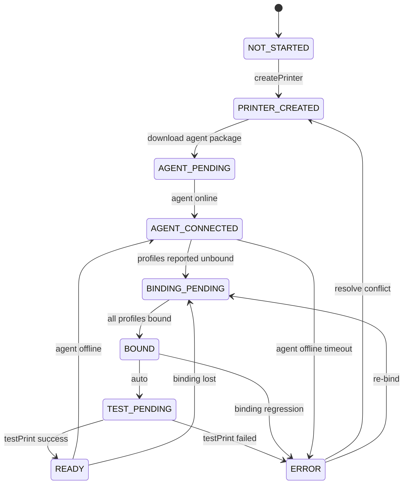

# THERMAL-PRINTING-13I.3 — Printing Setup Experience Redesign

**Status:** Audit & Architecture (no implementation)  
**Checkpoint:** 2026-06-24  
**Architecture:** PRINTING-ARCHITECTURE-NOTE-6  
**Supersedes:** Incremental UX patches to Printing Operations

---

## 1. Executive Summary

The MineuQR printing platform has completed the technical foundation for commercial deployment: logical printer provisioning (13I.1J), agent distribution (13I.2C), binding foundation (13I.2E.1), and local Windows printer binding (13I.2E.2). The **dashboard experience has not kept pace**.

Today, a restaurant operator lands on **Printer Operations** — an infrastructure console with six tabs, raw status enums, developer runbook copy, and a 3-step wizard that ends at **Download Configuration** (`mineuqr-agent-config.json`). The wizard treats agent connectivity as completion, but the platform now requires a **separate binding step** (`bind-printers.cmd`) that the dashboard never surfaces. Binding state lives only on the POS machine; the server cannot distinguish **Agent Connected** from **Printer Bound** from **Ready To Print**.

**This program replaces the printing setup experience** with a state-driven commercial onboarding flow. Operators see progress, not configuration. Technical artifacts (JSON, profileIds, USB ports, spooler queues) move behind a collapsed **Advanced · Support** section.

**Recommendation:** Build a new **Printing Setup** experience as the primary surface. Retain Printing Operations as a **post-setup monitoring** view (reduced scope). Do not extend legacy provisioning components.

| Dimension | Current state | Target state |
|-----------|---------------|--------------|
| Primary metaphor | Configuration download | Agent package + guided setup |
| Setup stages | 3 (missing binding) | 6 (printer → agent → bind → test → ready) |
| State source | DB + agent online only | Server-reported binding + diagnostic outcomes |
| Audience | Mixed operator + support | Restaurant owner first; support in advanced tier |
| Mobile | Desktop tables, small touch targets | Full journey on tablet/POS |

---

## 2. Legacy UX Audit

### 2.1 Entry Point

| Item | Detail |
|------|--------|
| Location | Dashboard tab only — `/dashboard?restaurant={id}&section=printing` |
| Nav label | "Printer Operations" / "عمليات الطباعة" |
| Orchestrator | `PrintingOperationsPanel.tsx` |
| Entitlement | No gating; always visible |

There is no dedicated setup route. Onboarding and day-2 operations share one screen.

### 2.2 Component Verdicts

| Component | Path | Verdict | Justification |
|-----------|------|---------|---------------|
| **PrintingOperationsPanel** | `client/src/components/dashboard/printing/PrintingOperationsPanel.tsx` | **Redesign → split** | Good data shell; wrong primary experience. Demote to monitoring; extract setup into new flow. |
| **PrinterProvisioningPanel** | `.../PrinterProvisioningPanel.tsx` | **Remove** (replace) | 3-step model is architecturally incomplete (no binding stage). Do not extend. |
| **AddPrinterDialog** | `.../AddPrinterDialog.tsx` | **Keep** (reuse) | Operator-appropriate: name + paper width only. Fits Stage 1 unchanged. |
| **ConnectDeviceGuideSheet** | `.../ConnectDeviceGuideSheet.tsx` | **Remove** (replace) | JSON-centric download flow; "Device ID"; Windows file-path assumptions. Replace with Agent Package install guide. |
| **PrinterDiscoveryDiagnosticsPanel** | `.../PrinterDiscoveryDiagnosticsPanel.tsx` | **Remove** from operator default | SRE runbook: repo paths, `startupPrinters`, health JSON, `profileId` alignment steps. Relocate to Advanced Support. |
| **DiagnosticHistoryPanel** | `.../DiagnosticHistoryPanel.tsx` | **Redesign** | Useful history; expose plain "Passed / Failed at {time}", hide `diagnosticId` by default. |
| **downloadAgentConfigFile** | `client/src/lib/printing/downloadAgentConfigFile.ts` | **Keep** (support tier) | Implementation utility; hide from primary operator path. |
| Printer detail sheet (inline) | `PrintingOperationsPanel.tsx` | **Redesign** | Hide `profileId`, raw `transport`, resolution internals. |
| Job detail sheet (inline) | `PrintingOperationsPanel.tsx` | **Redesign** | Hide `agentId`, execution/delivery categories from operator view. |
| Agents / Stations / Queue / Failures tabs | `PrintingOperationsPanel.tsx` | **Redesign** | Retain for support/monitoring; remove from setup journey; humanize statuses. |

### 2.3 Obsolete UX Patterns

| Pattern | Where | Why obsolete |
|---------|-------|--------------|
| "Download Configuration" as primary CTA | `ConnectDeviceGuideSheet` | Operators need **Print Agent package**, not JSON. Config is an implementation detail consumed by installer. |
| "Connect Device" step label | `PrinterProvisioningPanel` | Conflates agent install, config placement, service install, and binding into one vague step. |
| `connectConfig` JSON preview | `ConnectDeviceGuideSheet` Advanced | Correctly collapsed but still the mental model — setup is document-driven. |
| `suggestedAgentId` as "Device ID" | `ConnectDeviceGuideSheet` Advanced | Internal identifier; never operator-facing. |
| 3-step wizard completion | `PrinterProvisioningPanel` | Skips binding entirely; advances to Test Print when agent is merely online. |
| Discovery diagnostics on Printers tab | `PrintingOperationsPanel` | Duplicated on Diagnostics tab; overwhelms setup with infra metrics. |
| Empty-state repo paths | `PrinterDiscoveryDiagnosticsPanel` | `production.print-host.example.json`, `install-print-agent-service.ps1` — developer artifacts. |

### 2.4 What Works Today (preserve concepts, not components)

- Bilingual EN/AR throughout printing components
- `AddPrinterDialog` field simplicity
- Test Print mutation and diagnostic history data
- KPI summary for operational monitoring
- Collapsible advanced pattern (correct idea, wrong content placement)

---

## 3. User Journey Analysis

### 3.1 Current Journey (as implemented)

```
Dashboard → Printer Operations
    ↓
[No printers] → Add Printer dialog (name, paper width) ✓
    ↓
[connect_agent] → Connect Device sheet
    → Download mineuqr-agent-config.json  ← operator sees JSON filename
    → Manual steps: move file, install service, Windows visible
    ↓
[Agent connects] → Server advances to test_print (binding unknown)
    ↓
[Test Print] → May fail silently at transport if bind-printers never run
    ↓
[Operations tabs] → profileId, agentId, transport, failure codes
```

**Operator confusion points:**

1. Download says "Configuration" — not "Print Agent"
2. No dashboard step for **Bind Printer** (`bind-printers.cmd`)
3. "Connected" means agent WebSocket online, not printer ready
4. Test Print can appear available before physical binding exists
5. Failure surfaces `failureCode` / `failureLayer` — not actionable plain language

### 3.2 Target Journey (commercial)

```
Dashboard → Printing Setup (new primary)
    ↓
Stage 1: Create Printer — "Kitchen Printer", 80 mm → Done
    ↓
Stage 2: Install Print Agent — Download Print Agent (ZIP) + simple numbered steps
    ↓
Stage 3: Agent Connected — Connected / Waiting / Offline, Last Seen
    ↓
Stage 4: Bind Printer — Select Windows printer from list (server-reported or guided)
    ↓
Stage 5: Test Print — one button → Success / Failed + troubleshooting
    ↓
Stage 6: Ready — "Printing Ready" summary card
    ↓
[Optional] Printing Status — ongoing monitoring (simplified operations view)
```

### 3.3 Persona Fit

| Persona | Current experience | Target experience |
|---------|-------------------|-------------------|
| Restaurant owner | Overwhelmed by tabs and IDs | Sees 6 clear stages and "Ready / Action Required" |
| Manager | Can add printer; lost at Connect Device | Guided install + bind without files |
| Cashier (tablet) | Tables overflow; tiny controls | Large CTAs, vertical stepper, minimal scrolling |
| Support engineer | JSON in Advanced works | Full diagnostics in collapsed Advanced tier |

---

## 4. New Setup Architecture

### 4.1 Design Principles

1. **State-driven, not document-driven** — UI reflects live setup status, not file download checklist.
2. **Package-first delivery** — Primary download is `MineuQR-Print-Agent.zip`, not JSON.
3. **Binding is a first-class stage** — Between agent connect and test print.
4. **Plain language only** — No transport endpoints, spooler, USB, profileId in primary UI.
5. **Single source of truth** — Server aggregates agent-reported binding + connectivity + diagnostic outcomes.
6. **No patches to legacy screens** — New route/section; legacy panel frozen then removed.

### 4.2 Proposed Surface Structure

```
Printing (sidebar item — rename optional: "Printing" / "الطباعة")
├── Setup (default when not READY)     ← NEW: PrintingSetupExperience
│   ├── SetupProgressStepper (6 stages)
│   ├── StagePanel (contextual content + CTA)
│   ├── OverallStatusBanner (Ready / Action Required)
│   └── AdvancedSupportDrawer (collapsed)
└── Status (default when READY)        ← REDUCED PrintingOperationsPanel
    ├── Agent + Printer health summary
    ├── Recent jobs / failures (humanized)
    └── Link back to Setup if regression
```

### 4.3 Stage Specifications

#### Stage 1 — Create Printer

| Element | Operator sees |
|---------|---------------|
| Status | Not started → Complete |
| Content | Printer list (empty → one card) |
| Action | "Add Printer" → existing dialog |
| Success | "Kitchen Printer added" |

Reuse `AddPrinterDialog`. No API changes required.

#### Stage 2 — Install Print Agent

| Element | Operator sees |
|---------|---------------|
| Status | Waiting → Downloaded (optional) → Installed (inferred) |
| Primary CTA | **Download Print Agent** (ZIP from `package:agent` artifact) |
| Secondary | "I've installed it" + Refresh (until agent reports) |
| Steps (numbered) | 1. Download 2. Extract on POS 3. Run installer script 4. Return here |
| Hidden | `mineuqr-agent-config.json`, JSON, Device ID, raw config |

Config file is **bundled or auto-fetched by installer** in a future phase; for interim, installer script can download config silently — not operator-facing.

#### Stage 3 — Agent Connected

| Element | Operator sees |
|---------|---------------|
| Status | Offline / Waiting / Connected |
| Fields | Last seen, Agent version (when reported) |
| Iconography | Green check / amber pulse / gray offline |
| No exposure | `agentId`, WebSocket, Print Host |

Data source: `listAgents` + `getDiscoveryDiagnostics.counts` (existing). Version requires agent HELLO extension (gap).

#### Stage 4 — Bind Printer

| Element | Operator sees |
|---------|---------------|
| Status | Unbound / Binding needed / Bound |
| Per logical printer | "Kitchen Printer" → dropdown of Windows printers |
| Action | Select printer → Save |
| No exposure | Port names, USB001, spooler queue terminology |

**Architecture gap:** Binding is agent-local today (`bind-printers.cmd`). Dashboard cannot show Windows printer list without **agent → Print Host reporting** (see §5).

**Interim option (if wire protocol delayed):** Guided instruction card — "On your POS, run Bind Printers from the Start Menu" with completion detected via binding status report. Still no JSON/USB exposure.

**Target option:** In-browser or agent-assisted binding API — operator selects from server-provided discovery list.

#### Stage 5 — Test Print

| Element | Operator sees |
|---------|---------------|
| CTA | Single "Test Print" button |
| Outcome | Success ✓ / Failed ✗ |
| Failure | Plain troubleshooting ("Check paper", "Check printer power", "Contact support") |
| Hidden | `diagnosticId`, dispatch internals |

Reuse `testPrint` mutation + `listDiagnosticRuns` (humanized).

#### Stage 6 — Ready

| Element | Operator sees |
|---------|---------------|
| Banner | **Printing Ready** |
| Checklist | Agent Online ✓ · Printer Bound ✓ · Test Passed ✓ |
| Next | "You can now print orders" + link to Status view |

### 4.4 Advanced · Support Section

Collapsed by default. Support-role or explicit expand only.

| Content | Today | Future placement |
|---------|-------|------------------|
| Raw agent config JSON | `ConnectDeviceGuideSheet` | Here only |
| Device / agent ID | `ConnectDeviceGuideSheet` | Here only |
| Discovery diagnostics metrics | `PrinterDiscoveryDiagnosticsPanel` | Here only |
| Ownership conflicts | `PrinterDiscoveryDiagnosticsPanel` | Here only |
| Diagnostic run IDs | `DiagnosticHistoryPanel` | Here only |
| Job assignment / delivery details | Job detail sheet | Here only |
| Copy-for-support buttons | — | Add |

---

## 5. State Model

### 5.1 Setup Status Enum

```text
NOT_STARTED
PRINTER_CREATED
AGENT_PENDING
AGENT_CONNECTED
BINDING_PENDING
BOUND
TEST_PENDING
READY
ERROR
```

### 5.2 Authoritative State Sources

| State | Authoritative source | Available today? |
|-------|---------------------|------------------|
| `NOT_STARTED` | No DB printers | ✓ `assignedDbPrinters === 0` |
| `PRINTER_CREATED` | ≥1 DB printer, agent offline | ✓ |
| `AGENT_PENDING` | Config issued / package downloaded (optional tracking) | ✗ |
| `AGENT_CONNECTED` | Agent `online` + relevant profiles | ✓ partial |
| `BINDING_PENDING` | Agent reports pending binding per profile | ✗ |
| `BOUND` | Agent reports `BOUND` for all profiles | ✗ |
| `TEST_PENDING` | Bound but no successful diagnostic run | ✗ explicit |
| `READY` | Bound + latest diagnostic `completed` | ✗ explicit |
| `ERROR` | `blocked`, `MISSING_PRINTER`, `INVALID_BINDING`, failed test | partial |

### 5.3 State Transitions



### 5.4 Mapping from Legacy `ProvisioningStep`

| Legacy step | Legacy meaning | New model equivalent | Gap |
|-------------|----------------|----------------------|-----|
| `add_printer` | No DB printers | `NOT_STARTED` | Aligns |
| `connect_agent` | No active printers | `PRINTER_CREATED` or `AGENT_PENDING` | Split install vs connect |
| `test_print` | Active printers > 0 | `AGENT_CONNECTED` through `TEST_PENDING` | **Too coarse** — treats online as ready |
| `blocked` | Ownership conflict | `ERROR` | Aligns |

### 5.5 Required Backend Extensions (for implementation phase)

1. **Agent binding report** — Extend agent → Print Host message (e.g. `agent.binding.status.report`) with per-profile `RuntimeBindingStatus`, optional Windows printer display name.
2. **`PrintingSetupState` API** — New field on `getDiscoveryDiagnostics` or dedicated `getPrintingSetupStatus` query.
3. **`resolveSetupStage()`** — Replace or supersede `resolveProvisioningStep()` using binding + diagnostic data.
4. **Agent version in HELLO** — For Stage 3 display.
5. **Optional: binding command channel** — Dashboard triggers bind via agent (long-term; not required for v1 guided flow).

### 5.6 Operational Visibility (Day-2)

Independent of setup stage, operators always see:

| Dimension | Values | Plain language |
|-----------|--------|----------------|
| Agent | online / offline / stale | Connected / Offline / Connection lost |
| Printer | bound / unbound / missing | Ready / Needs setup / Printer not found |
| Test | passed / failed / never | Working / Problem / Not tested |
| Overall | ready / action_required | Ready to print / Setup incomplete |

---

## 6. Mobile Considerations

### 6.1 Current Gaps

| Issue | Location |
|-------|----------|
| Wide data tables (6 columns) | Printers, Agents, Queue tabs |
| Horizontal tab bar (6 tabs) | `PrintingOperationsPanel` |
| Sheet side panel | `ConnectDeviceGuideSheet` — OK on tablet |
| Monospace IDs wrap poorly | Diagnostics, history |
| Small badge text | Status enums |
| Desktop-first empty-state steps | Multi-line repo paths |

### 6.2 Target Mobile Requirements

| Requirement | Approach |
|-------------|----------|
| Full setup on tablet | Vertical stepper; one stage per viewport |
| POS touch | Minimum 44px touch targets; full-width CTAs |
| No horizontal scroll | Card lists replace tables in Setup |
| RTL (Arabic) | Stepper order, icons, chevrons mirror correctly |
| Offline-tolerant copy | "Return when POS is online" messaging |
| Download on mobile | ZIP download works; instruct "send to POS" or QR-to-desktop handoff |

### 6.3 Responsive Layout Sketch

```
Mobile / Tablet (Setup):
┌─────────────────────────┐
│ Overall: Action Required│
├─────────────────────────┤
│ ●━━○━━○━━○━━○━━○  (6)   │  vertical step dots
├─────────────────────────┤
│ Stage 4: Bind Printer   │
│ Kitchen Printer         │
│ [ Select printer    ▼ ] │
│ [ Save ]                │
├─────────────────────────┤
│ ▸ Advanced · Support    │
└─────────────────────────┘
```

Tables and infra tabs remain desktop-optimized in **Status** view only, or behind Advanced.

---

## 7. Migration Strategy

### 7.1 Principles

- **No printer loss** — DB `printers` rows unchanged
- **No profile loss** — `profileId` values preserved (including legacy `pos-80c-copy-1-usb001`)
- **No binding loss** — Existing `printer-bindings.json` on POS continues to work
- **No forced reinstall** — Running agents stay connected
- **Gradual UI cutover** — New Setup alongside legacy until READY detection proven

### 7.2 Restaurant Categories

| Category | Detection | Migration behavior |
|----------|-----------|-------------------|
| **A — Fully operational** | Agent online + bound (local) + successful test print history | Show `READY` immediately; land on Status view |
| **B — Agent online, unbound** | Agent online, binding pending/missing | Setup opens at Stage 4 (Bind) |
| **C — Printer configured, no agent** | DB printers, agent offline | Setup opens at Stage 2 (Install) |
| **D — New restaurant** | No printers | Setup opens at Stage 1 |
| **E — Legacy bound config** | Agent config has pre-13I.2E.1 `usbTransportEndpoints` | Treat as `BOUND`; no re-bind required |

### 7.3 Backward Compatibility

| Layer | Strategy |
|-------|----------|
| Agent config | Continue accepting legacy full `usbTransportEndpoints` |
| `printer-bindings.json` | Unchanged; merge at agent load |
| Dashboard download | Config becomes support-tier only; package install is primary |
| `ProvisioningStep` | Deprecate after `PrintingSetupState` ships; maintain parallel read during transition |

### 7.4 Rollout Phases

1. **13I.3A** — Agent binding status report to Print Host (backend)
2. **13I.3B** — `PrintingSetupState` API + setup stage resolver
3. **13I.3C** — New `PrintingSetupExperience` UI (feature flag per restaurant)
4. **13I.3D** — Agent package download endpoint / CDN for ZIP
5. **13I.3E** — Legacy component removal + sidebar rename
6. **13I.3F** — Print Host + Vercel deploy alignment (see 13I.2E production gap)

### 7.5 Existing Restaurant 720007 (pilot)

- Legacy `profileId`: `pos-80c-copy-1-usb001` — keep, do not regenerate
- If agent running with `printer-bindings.json` → infer `BOUND` when agent reports status
- If agent running with old inline `usbTransportEndpoints` → infer `BOUND` (category E)
- Setup UI shows `READY` when diagnostic history has recent success

---

## 8. Legacy Removal Candidates

**Do not remove until new experience is approved and shipped.**

| # | Item | Path | Removal condition |
|---|------|------|-------------------|
| 1 | `PrinterProvisioningPanel` | `client/.../PrinterProvisioningPanel.tsx` | Replaced by `PrintingSetupStepper` |
| 2 | `ConnectDeviceGuideSheet` | `client/.../ConnectDeviceGuideSheet.tsx` | Replaced by `InstallAgentStage` |
| 3 | `PrinterDiscoveryDiagnosticsPanel` (operator placement) | `client/.../PrinterDiscoveryDiagnosticsPanel.tsx` | Moved to Advanced only or deleted |
| 4 | Provisioning wiring in `PrintingOperationsPanel` | inline imports/state | Setup extracted |
| 5 | `ProvisioningStep` type (server) | `printOperationsProvisioningTypes.ts` | Superseded by `PrintingSetupStage` |
| 6 | `resolveProvisioningStep()` | `printOperationsDiscoveryService.ts` | Superseded by `resolveSetupStage()` |
| 7 | `connectConfig` in primary API response | `buildProvisioningState()` | Moved to support-only endpoint |
| 8 | "Download Configuration" primary CTA | `ConnectDeviceGuideSheet` | Removed from operator flow |
| 9 | Duplicate diagnostics on Printers tab | `PrintingOperationsPanel` | Single Advanced location |
| 10 | Developer empty-state copy | `PrinterDiscoveryDiagnosticsPanel` | Replaced with plain language |

**Keep (modified):**

- `AddPrinterDialog`
- `downloadAgentConfigFile` (support tier)
- `PrintingOperationsPanel` (reduced monitoring scope)
- `testPrint` / `createPrinter` mutations
- Server printing routers (extend, don't replace)

---

## 9. Risks

| Risk | Severity | Mitigation |
|------|----------|------------|
| Binding status not on server | **Critical** | Ship agent report message before UI Stage 4 |
| Print Host deploy lag | **High** | Tie setup API to same deploy pipeline; verify staging before prod |
| tRPC split (Vercel vs Fly) | **High** | New setup queries on Print Host; document deploy order |
| False `READY` from agent-online alone | **High** | Never infer READY from `activePrinters`; require binding + test |
| Legacy restaurants with inline bindings | **Medium** | Category E detection in setup resolver |
| Mobile ZIP install friction | **Medium** | QR handoff to desktop; email link to package |
| Arabic technical strings | **Medium** | Translate plain-language statuses; keep IDs out of UI |
| Feature flag drift | **Medium** | Single `printingSetupV2` flag; remove legacy in one cut |
| Support team depends on JSON | **Low** | Preserve Advanced tier with copy buttons |
| Scope creep into installer | **Medium** | Stage 2 guides to existing ZIP; Windows Installer is out of scope |

---

## 10. Recommended Implementation Plan

### Phase 13I.3A — Binding Visibility (Backend)

**Goal:** Server knows binding state per restaurant.

- Extend agent WebSocket protocol: `agent.binding.status.report`
- Print Host stores per-agent, per-profile binding snapshot
- Expose in `getDiscoveryDiagnostics` or new `getPrintingSetupStatus`
- Agent sends report on startup and after `bind-printers` save

**Exit:** API returns `BOUND` / `UNBOUND` / `MISSING_PRINTER` per logical printer.

### Phase 13I.3B — Setup State Engine (Backend)

**Goal:** Replace 3-step provisioning with 6-stage model.

- Add `PrintingSetupStage` enum + `PrintingSetupState` type
- Implement `resolveSetupStage()` with transition table (§5.3)
- Map legacy restaurants (categories A–E)
- Deprecate `ProvisioningStep` in API (parallel emit during transition)

**Exit:** Unit tests for all categories; staging API returns correct stage for 720007.

### Phase 13I.3C — Printing Setup UI (Frontend)

**Goal:** New primary experience; legacy frozen.

- New `PrintingSetupExperience` component + route/tab default
- Stage panels for all 6 stages
- `OverallStatusBanner` + plain-language operational visibility
- `AdvancedSupportDrawer` (collapsed) with relocated technical content
- Feature flag: `printingSetupV2`

**Exit:** Full journey testable on tablet; zero JSON in primary path.

### Phase 13I.3D — Agent Package Delivery (Full stack)

**Goal:** "Download Print Agent" not "Download Configuration".

- Hosted `MineuQR-Print-Agent.zip` (CDN or API endpoint)
- Optional: installer script fetches config silently using restaurant auth
- Update distribution README alignment

**Exit:** Operator downloads one artifact; config not mentioned in primary copy.

### Phase 13I.3E — Legacy Removal (Frontend)

**Goal:** Remove misaligned components.

- Delete candidates §8 items 1–4, 8–10
- Reduce `PrintingOperationsPanel` to Status/monitoring
- Sidebar label: "Printing" with Setup/Status sub-navigation

**Exit:** No `ConnectDeviceGuideSheet`, no 3-step wizard, no operator-facing diagnostics.

### Phase 13I.3F — Binding UX Integration (Optional enhancement)

**Goal:** Dashboard-native bind (no `bind-printers.cmd`).

- Agent exposes binding API or polls dashboard for selection
- Operator selects Windows printer in Stage 4 dropdown (server-fed list)

**Exit:** No POS CLI required for binding. *Can follow 13I.3C if interim guided flow is acceptable.*

---

## Appendix A — Legacy Assumption Catalog

Every UX element that assumes manual provisioning, config editing, or developer knowledge:

| # | Assumption | Occurrence |
|---|------------|------------|
| 1 | Operator downloads JSON config file | `ConnectDeviceGuideSheet` primary CTA |
| 2 | Operator knows filename `mineuqr-agent-config.json` | Connect sheet steps, distribution README referenced in copy |
| 3 | Operator places config in specific folder | Install steps, `CONFIG-PLACEMENT.txt` |
| 4 | Operator runs PowerShell service install | `PrinterDiscoveryDiagnosticsPanel` empty state |
| 5 | Operator checks Print Host health JSON | `agents.online = 1` in diagnostics steps |
| 6 | Operator edits `startupPrinters` in config | Diagnostics `agent_no_matching_profiles` |
| 7 | Operator aligns `profileId` between DB and config | Diagnostics (multiple empty reasons) |
| 8 | Operator understands `agentId` | Connect Advanced, Agents tab, conflicts, job details |
| 9 | Operator understands `profileId` | Printers table, printer detail, conflicts |
| 10 | Operator understands `transport: usb` | Printers table |
| 11 | Operator uses repo example config paths | `production.print-host.example.json` in empty state |
| 12 | Operator runs `bind-printers.cmd` without dashboard mention | Platform gap — assumed external docs |
| 13 | Agent online = ready to test print | `resolveProvisioningStep` → `test_print` |
| 14 | Configuration drive setup progress | Wizard step tied to `connectConfig` presence |
| 15 | Operator interprets `operationalStatus` enums | Queue, failures tabs |
| 16 | Operator interprets `failureLayer` / `failureCode` | Failures tab |
| 17 | Operator needs Device ID | Connect Advanced section |
| 18 | Operator reads raw JSON for verification | Connect Advanced copy |
| 19 | One "Connect Device" step covers install + config + service + bind | Wizard step 2 |
| 20 | Technical IDs mentioned to build trust | "Technical IDs are managed automatically" |

---

## Appendix B — Architecture Alignment (PRINTING-ARCHITECTURE-NOTE-6)

| Concern | Owner | Dashboard shows | Dashboard must NOT show |
|---------|-------|-----------------|-------------------------|
| Logical printer | Dashboard | Name, paper width | profileId (operator) |
| Agent install | Agent / package | Download, progress | JSON structure |
| Physical binding | Agent | Bound / Unbound, picker | USB001, spooler, port |
| Validation | Agent | Ready / Problem | binding-diagnostics.json |
| Routing / jobs | Platform | Order printed / failed | dispatch bridge internals |

---

## Appendix C — Success Criterion Checklist

At program completion, a restaurant owner with zero technical knowledge can:

- [ ] Add a kitchen printer by name
- [ ] Install the print agent without hearing the word "JSON"
- [ ] See whether the POS is connected without knowing what an agentId is
- [ ] Bind the kitchen printer to the physical device without typing port names
- [ ] Run a test print and see clear success or failure
- [ ] Reach "Printing Ready" with confidence
- [ ] Complete the entire flow on a tablet

They must never need to know that `USB001`, `profileId`, `printer-bindings.json`, or `usbTransportEndpoints` exist.

---

## Document Control

| Field | Value |
|-------|-------|
| Phase | Audit only — no code changes |
| Next action | Review and approve architecture |
| Implementation entry | 13I.3A (Binding Visibility) |
| Related docs | 13I.2E.1, 13I.2E.2, AGENT-DEPLOYMENT.md |
