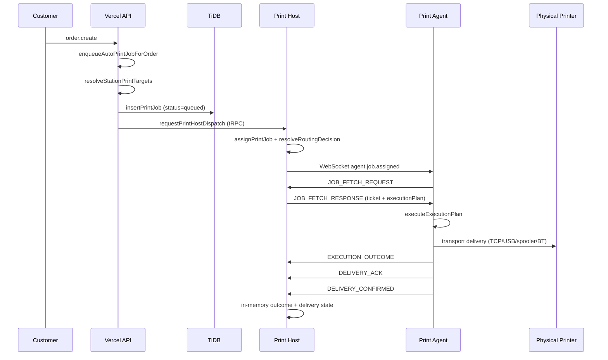

# THERMAL-PRINTING-13I.3C — Production Print Pipeline Validation

**Status:** Audit complete  
**Date:** 2026-06-22  
**Frozen inputs:** THERMAL-PRINTING-13I.3A, 13I.3B, 13I.3B.5, 13I.3B.6, PRINTING-ADR-13I-002  
**Out of scope:** Printing Readiness Authority, Setup State Engine, readiness algorithm, multi-restaurant agent visibility, diagnostics redesign

---

## 1. Executive Summary

The production print pipeline is **architecturally complete** and **deterministic within a single Print Host process lifetime**. A customer order on Vercel triggers best-effort auto-print job creation in TiDB, followed by an HTTP dispatch bridge to Print Host, which assigns the job to an online agent, notifies via WebSocket, and the agent fetches authoritative ticket data, executes ESC/POS transport, and reports outcomes back.

**Authoritative execution path:** `agent-runtime` (`server/printing/executionAuthority.ts`). The legacy `printProcessorWorker` is dormant and not scheduled in production.

**Verdict drivers:**

| Area | Assessment |
|------|------------|
| Happy-path flow | Complete and testable (E2E harness + unit/integration tests) |
| Idempotency at creation | Strong (DB unique `idempotencyKey`) |
| Dispatch idempotency | Strong within process (`dispatchBridgeState`) |
| Agent-side deduplication | Strong (`jobId:timestamp` subscription dedupe; pipeline short-circuit) |
| DB lifecycle truth | **Broken** — agent path never advances `print_jobs.status` past `queued` |
| Runtime state durability | **Ephemeral** — assignments, routing, delivery, outcomes lost on Print Host restart |
| Failure recovery | **Gaps** — no dispatch retry, no reconnect replay, no orphaned-job sweeper |
| Operational telemetry | **Partial** — delivery ack and execution outcome events missing from `opsLog` |
| Physical print guarantee | **Semantic gap** — `delivered` operational status ≠ physical print success |

Production printing can succeed end-to-end when Print Host, agent, and printer are healthy and co-located configuration is correct. The pipeline is **not production-hardened** for disconnect, restart, or silent-failure recovery without operator intervention.

**Final verdict:** **READY WITH REQUIRED IMPLEMENTATION** (see §9–10).

---

## 2. End-to-End Pipeline Diagram

### 2.1 Logical stages

```
Customer Order
      ↓
Order Processing (order.create)
      ↓
Print Job Creation (createPrintJob → TiDB queued)
      ↓
Print Resolution (station routing on Vercel; printer+agent resolution on Print Host)
      ↓
Agent Dispatch (HTTP bridge → assignPrintJob → WebSocket JOB_ASSIGNED)
      ↓
Agent Execution (JOB_FETCH → render ticket → ESC/POS transport)
      ↓
Printer (physical I/O via agent transport clients)
      ↓
Delivery Confirmation (DELIVERY_ACK → DELIVERY_CONFIRMED over WebSocket)
      ↓
Operational Status (Print Host in-memory aggregation → printOps APIs)
```

### 2.2 Sequence (production split: Vercel + Print Host)



### 2.3 Process ownership

| Stage | Process | Key module |
|-------|---------|------------|
| Order trigger | Vercel | `server/routers.ts` → `enqueueAutoPrintJobForOrder` |
| Job persistence | Vercel (write), Print Host (read) | `printJobRepository.ts` |
| Station routing | Vercel | `stationRoutingService.ts` |
| Dispatch bridge | Vercel → Print Host | `printHostDispatchClient.ts` → `dispatchBridgeService.ts` |
| Agent registry + WS | Print Host only | `printAgentWebSocketServer.ts`, `agentRegistry` |
| Assignment + routing | Print Host only | `assignmentService.ts`, `routingEngine.ts` |
| Job retrieval + render | Print Host | `jobRetrievalService.ts` |
| Execution + transport | Agent | `jobConsumptionService.ts` |
| Ops read APIs | Print Host (authoritative) | `printOperationsService.ts` |

Reference: `docs/thermal-printing/THERMAL-PRINTING-13H.1-DISPATCH-CONTRACT.md`

---

## 3. Print Job Lifecycle Audit

### 3.1 DB lifecycle (`print_jobs.status`)

Defined in `shared/printing/types.ts`, enforced by `printJobTransitions.ts`:

| From | Allowed transitions |
|------|---------------------|
| `queued` | **none** |
| `claimed` | `printing` |
| `printing` | `printed`, `failed` |
| `printed`, `failed`, `cancelled`, `expired` | terminal |

**Finding (Critical):** The authoritative agent-runtime path **never calls** `claimJob`, `markJobPrinting`, `markJobPrinted`, or `markJobFailed`. Those functions are used only by the dormant `printProcessorWorker` / `printJobExecutionService`.

**Consequence:** TiDB `print_jobs.status` remains `queued` for all agent-executed jobs. `printOperationsService.mapOperationalStatus` compensates by merging in-memory assignment, delivery, and execution-outcome stores — but only on the Print Host process that handled the job.

### 3.2 Operational lifecycle (UI / `printOps`)

Derived in `printOperationsService.mapOperationalStatus`:

```
queued → assigned → executing → delivered
                              ↘ failed | cancelled | expired (from DB only)
```

| Operational status | Source signals |
|--------------------|----------------|
| `queued` | No assignment |
| `assigned` | `getPrintJobAssignment(jobId)` exists |
| `executing` | DB `printing` OR outcome `executed`/`prepared` |
| `delivered` | delivery state `delivered` OR DB `printed` |
| `failed` | DB `failed` only (outcome `failed` does **not** map here) |

**Finding (High):** A job can show `delivered` operationally while execution outcome is `failed` — operators must cross-reference outcome store.

### 3.3 In-memory delivery lifecycle

`deliveryStateTracker.ts`:

```
(none) → acknowledged → delivered
```

- Ack: agent received payload (`deliveryAckService.ts`)
- Confirm: agent pipeline completed (`deliveryConfirmationService.ts`)
- **Not** physical print confirmation (documented in code)

### 3.4 Dispatch lifecycle

`executePrintHostDispatch` (`dispatchBridgeService.ts`):

```
received → assign → notify → dispatched | already_processed | failed
```

`already_processed` when assignment exists **and** `hasDispatchNotificationBeenSent(jobId)`.

### 3.5 Illegal transitions

| Transition | Status |
|------------|--------|
| `queued` → `printing` via agent path | **Never attempted** (not illegal — simply absent) |
| `delivered` without `acknowledged` | **Rejected** by `deliveryConfirmationService` |
| Double assignment same jobId | **Prevented** — assignment Map returns existing |
| Re-assign after DB leaves `queued` | **Would throw** — but DB never leaves `queued` on agent path |

### 3.6 Persistence matrix

| Artifact | Persisted? | Location |
|----------|------------|----------|
| Print job row | Yes | TiDB `print_jobs` |
| Idempotency key | Yes | TiDB unique index |
| Assignment | No | In-memory Map |
| Routing decision | No | In-memory Map |
| Dispatch notification sent | No | In-memory Set |
| Delivery ack / confirm | No | In-memory Maps |
| Execution outcome | No | In-memory Map |
| Protocol job status reports | No | In-memory (informational) |

---

## 4. Dispatch Validation

### 4.1 Entry points

| Trigger | Path |
|---------|------|
| Production auto-print | `order.create` → `enqueueAutoPrintJobForOrder` → `requestPrintHostDispatch` per target |
| Colocated dev | `shouldUseColocatedDispatchFallback()` → local `dispatchAssignedPrintJob` |
| E2E harness | `orchestratePrintJobFlow` / `dispatchAssignedPrintJob` |
| Reprint | `createPrintJob({ trigger: "reprint" })` exists — **no production API** wires dispatch |

### 4.2 Determinism checks

| Check | Result |
|-------|--------|
| Same jobId redispatched after successful notify | `already_processed` — no second WebSocket message |
| Same jobId redispatched after assign but notify failed | **Re-notifies** — assignment reused, notification retried (good) |
| Same jobId redispatched after notify sent, assignment lost (restart) | **Re-notifies** — duplicate ticket risk if agent already printed |
| Routing decision for same jobId | Cached in `routingDecisions` — deterministic |
| Assignment for same jobId | Idempotent return `{ created: false }` |
| Agent notification dedupe | `jobId:timestamp` on agent subscription |

### 4.3 Routing decision order (`routingEngine.ts`)

1. Cached decision for `jobId`
2. Manual override (if agent online)
3. `resolvePrinter(printerId)` → `PRINTER_OWNER` if owner online
4. On `UNKNOWN_DB_PRINTER` only → `SINGLE_CANDIDATE` if exactly one online agent
5. Otherwise → `RoutingRejectedError`

**Finding (Medium):** Multi-agent restaurants without printer resolution get `MULTIPLE_CANDIDATES` — no fallback except single-agent deployments.

### 4.4 Agent disconnected at notify time

`notifyAgentOfAssignment` returns `{ notified: false, reason: "agent_disconnected" }`.

- Assignment **is created**
- `dispatch_notification_failed` + `print_agent_job_notification_skipped` logged
- `recordDispatchNotificationSent` **not** called
- **No background retry** scheduled

**Finding (Critical):** Job orphaned in `queued` + assigned in-memory until manual redispatch or agent polls (agent does not poll — push only).

### 4.5 Bridge failures (Vercel side)

| Failure | Job DB state | Recovery |
|---------|--------------|----------|
| `dispatch_bridge_not_configured` | `queued` | Configure env vars |
| HTTP / network error | `queued` | Manual redispatch only |
| Routing rejection on Print Host | `queued` | Fix agent/printer; manual redispatch |

`enqueueAutoPrintJobForOrder` does **not** inspect `requestPrintHostDispatch` result — dispatch failures are ops-logged only.

### 4.6 Ordering / race conditions

| Scenario | Risk |
|----------|------|
| Concurrent dispatch for same jobId | Bridge serializes per process; second call → `already_processed` if first completed notify |
| Order create + idempotent job reuse | Still calls `requestPrintHostDispatch` — enables replay (good) |
| Agent connects after notify skipped | Job stuck until redispatch — **no HELLO-triggered replay** |
| Multi-station order | Independent jobs per station; parallel dispatch — no cross-job ordering guarantee |

---

## 5. Failure Path Analysis

### 5.1 Failure matrix

| Failure | Detection | Operator visibility | Recovery | Logging |
|---------|-----------|---------------------|----------|---------|
| Auto-print disabled | Silent return | None | Enable in print settings | None |
| Station routing skip | Per-station | `print_job_creation_failed` (`failureLayer: station-routing`) | Fix station/printer config | Yes |
| `createPrintJob` error | Caught | `print_job_creation_failed` | Manual | Yes |
| Bridge not configured | `dispatch_bridge_failed` | Ops log | Env config | Yes |
| Bridge unreachable | `dispatch_bridge_failed` | Ops log | Retry dispatch (manual) | Yes |
| Print job not found at dispatch | `failed` result | Ops log | — | Yes |
| Routing: no candidates | `dispatch_bridge_failed` | Ops log | Agent online | Yes |
| Routing: multiple candidates | `dispatch_bridge_failed` | Ops log | Fix resolution | Yes |
| Routing: offline owner | `dispatch_bridge_failed` | Ops log | Agent reconnect + redispatch | Yes |
| Resolution conflict | `dispatch_bridge_failed` | Ops log | Fix binding | Yes |
| Agent disconnected at notify | `dispatch_notification_failed` | Ops log | **No auto retry** | Yes |
| Agent fetch fails | Agent-side error | Agent logs | — | Agent only |
| Execution failure | `EXECUTION_OUTCOME failed` | Print Host outcome store | **No server retry** | **No opsLog** |
| Transport retry exhausted | Outcome `retry-exhausted` | Outcome store | Manual reprint | **No opsLog** |
| Printer offline at transport | Transport `failed` | Outcome store | Agent transport retry (3×) then fail | **No opsLog** |
| Printer deleted / missing binding | Routing or resolution fail at dispatch | Ops + dashboard | Fix config | Partial |
| WebSocket interruption | Agent reconnect engine | `print_agent_disconnected` | WS reconnect; **no job replay** | Yes |
| Print Host restart | All in-memory state lost | Dashboard shows `queued` | Manual redispatch | No sweep event |
| Agent stale (5 min no heartbeat) | `calculateAgentStatus → stale` | Agent overview | Treated offline for routing | Heartbeat gap |

### 5.2 Silent failure paths

1. **Dispatch failure after job creation** — job exists in TiDB as `queued`; no dashboard failure row unless ops logs are monitored.
2. **Notify skipped (agent disconnected)** — assignment exists only in memory; invisible after Print Host restart.
3. **Execution failure** — stored in-memory only; `mapOperationalStatus` may still show `assigned` or `executing`, not `failed`.
4. **`cancelled` / `expired` DB statuses** — schema-defined but no writer; never surfaced organically.

### 5.3 Timeout handling

| Timeout | Value | Enforced? |
|---------|-------|-----------|
| Agent heartbeat stale | 5 min | Yes — routing treats as offline |
| Legacy claim lease | 5 min (`PRINT_JOB_CLAIM_LEASE_MS`) | **No worker** — dead path |
| Transport retry | 3 × 50ms | Agent-local only |
| Dispatch / bridge HTTP | Platform default | No explicit timeout config audited |
| Execution timeout | — | **Not implemented** |

---

## 6. Retry & Idempotency Analysis

### 6.1 Idempotency mechanisms

| Layer | Mechanism | Effectiveness |
|-------|-----------|---------------|
| Job creation | DB unique `idempotencyKey` + pre-read + duplicate-key catch | **Strong** |
| Per-station keys | `order:{id}:submitted:station:{stationId}` | **Strong** — one job per station |
| Dispatch notify | `notifiedJobIds` Set | **Strong** within process |
| Assignment | Map keyed by `jobId` | **Strong** within process |
| Routing | Cached per `jobId` | **Strong** within process |
| Agent JOB_ASSIGNED | `seenNotificationKeys` (`jobId:timestamp`) | **Strong** per timestamp |
| Agent pipeline | Short-circuit if `delivered`/`acknowledged` | **Strong** within agent process |
| Delivery ack | Map dedupe `agentId:jobId` | **Strong** |
| Delivery confirm | State machine rejects out-of-order | **Strong** |
| Execution outcome | Dedupe `category+timestamp+outcomeStatus` | **Strong** |
| Transport I/O | `deliverWithTransportRetry` (3 attempts) | **Agent-local** |

### 6.2 Duplicate execution risks

| Scenario | Duplicate ticket? | Severity |
|----------|-------------------|----------|
| Normal happy path | No | — |
| Duplicate `order.create` with same idempotency | No — job reused, dispatch idempotent if notified | Low |
| Redispatch after Print Host restart | **Yes** — `notifiedJobIds` cleared | **Critical** |
| Redispatch with new `notificationTimestamp` after partial agent execution | **Possible** — new timestamp bypasses agent dedupe | High |
| Concurrent agents (misconfigured) | Routing should reject `MULTIPLE_CANDIDATES` | Medium |

### 6.3 Retry gaps

| Gap | Impact |
|-----|--------|
| No Vercel-side dispatch retry queue | Jobs stuck after transient bridge failure |
| No notify retry after `agent_disconnected` | Jobs assigned but agent never notified |
| No agent reconnect job replay | Jobs missed during disconnect window |
| No server-side job re-queue after execution failure | Permanent in-memory failure only |
| No DB status advance | Cannot use TiDB for failure analytics or reconciliation |
| Idempotent dispatch does not help after restart | `notifiedJobIds` ephemeral |

### 6.4 Disconnect / reconnect behavior

**Agent (`reconnectEngine.ts`):** Exponential backoff WebSocket reconnect; re-sends HELLO / registration. **Does not** request pending assignments.

**Print Host:** `handleAgentWebSocketDisconnect` unregisters agent. Assignments for in-flight jobs remain in memory but agent is offline for routing.

**Dashboard:** Requires `VITE_PRINT_OPS_API_URL` pointing at Print Host; otherwise Vercel `printOps` returns empty in-memory state (split-brain).

---

## 7. Operational Logging Review

Emitter: `server/_core/opsLog.ts`  
Taxonomy: `server/_core/opsTaxonomy.ts`  
Category: `"ORDER"` for print pipeline events

### 7.1 Events observed in production path

| Stage | Event | Emitted? |
|-------|-------|----------|
| Job created | `print_job_created` | Yes |
| Job idempotent reuse | `print_job_idempotency_reused` | Yes |
| Job creation failed | `print_job_creation_failed` | Yes |
| Dispatch requested | `dispatch_requested` | Yes |
| Dispatch received | `dispatch_received` | Yes |
| Assignment started | `dispatch_assignment_started` | Yes |
| Job assigned | `print_job_assigned` | Yes |
| Assignment reused | `print_job_assignment_reused` | Yes |
| Assignment completed | `dispatch_assignment_completed` | Yes |
| Notify sent | `dispatch_notification_sent`, `print_agent_job_notified` | Yes |
| Notify failed | `dispatch_notification_failed`, `print_agent_job_notification_skipped` | Yes |
| Bridge failed | `dispatch_bridge_failed` | Yes |
| Delivery confirmed | `print_job_delivery_confirmed` | Yes |
| Delivery confirm reuse | `print_job_delivery_confirmation_reused` | Yes |
| Agent connect/disconnect | `print_agent_connected`, `print_agent_disconnected` | Yes |

### 7.2 Missing or incomplete telemetry

| Expected event | Status | Impact |
|----------------|--------|--------|
| `print_job_delivery_acknowledged` | **Defined but never emitted** | Ack stage invisible in ops |
| Execution started | **Not in taxonomy** | No server-side execution start signal |
| Execution completed / failed | **Not in taxonomy** | Outcomes only in-memory |
| Dispatch retry / orphan sweep | **Not in taxonomy** | No recovery observability |
| Print Host restart state loss | **Not logged** | Silent operational reset |
| Physical print success | **Not modeled** | Delivery confirm ≠ paper out |

### 7.3 Correlation

`x-correlation-id` propagated Vercel → Print Host on dispatch bridge. Present on dispatch events. **Not** propagated through agent WebSocket messages or execution outcome reports.

---

## 8. Risks

### Critical

| ID | Risk | Evidence |
|----|------|----------|
| C1 | **DB status frozen at `queued`** — TiDB cannot be used for reconciliation, reporting, or `listPrintFailures` for agent-executed jobs | `markJobPrinted` etc. only in dormant worker; tests assert not called on agent path |
| C2 | **Print Host restart loses all runtime state** — assignments, notify tracking, delivery, outcomes; redispatch can duplicate tickets | All Maps/Sets in-process; `dispatchBridgeState.notifiedJobIds` |
| C3 | **No dispatch notify retry** — agent disconnected at notify time orphans job with no sweeper | `dispatchBridgeService.ts` logs skip, returns `dispatched` with `notified: false` |

### High

| ID | Risk | Evidence |
|----|------|----------|
| H1 | **Operational `delivered` ≠ print success** — false-positive delivery status | `deliveryConfirmationFlow` semantics; `mapOperationalStatus` ignores outcome `failed` |
| H2 | **Execution failures invisible in opsLog** — operators cannot alert on print failures | `recordExecutionOutcomeReport` has no `opsLog` call |
| H3 | **Bridge/dispatch failures do not surface in dashboard job status** — jobs appear `queued` indefinitely | `enqueueAutoPrintJobForOrder` ignores dispatch result |
| H4 | **Redispatch after restart can duplicate physical tickets** | Notify tracking ephemeral; agent dedupe keyed on timestamp |

### Medium

| ID | Risk | Evidence |
|----|------|----------|
| M1 | Multi-agent routing fails without printer resolution | `MULTIPLE_CANDIDATES` in `routingEngine.ts` |
| M2 | `printOps` split-brain when dashboard hits Vercel instead of Print Host | Documented in agent-host production notes |
| M3 | Auto-print does not gate on Printing Readiness Authority — jobs created when setup incomplete, fail later at routing | `enqueueAutoPrintJobForOrder` checks only `isAutoPrintEnabledForRestaurant` |
| M4 | No production reprint API | Reprint only in scripts |
| M5 | `print_job_delivery_acknowledged` taxonomy gap | Never emitted |
| M6 | No execution timeout — hung transport blocks agent consumption thread | No timeout in `jobConsumptionService` |

### Low

| ID | Risk | Evidence |
|----|------|----------|
| L1 | `cancelled` / `expired` statuses are schema-only | No writers |
| L2 | Legacy `printProcessorWorker` code path still present | Dormant but could confuse operators |
| L3 | Protocol `JOB_STATUS_REPORT` informational only | Does not drive status |
| L4 | Correlation ID not end-to-end through agent WS | Harder distributed trace |

---

## 9. Required Implementation Tasks (13I.3C scope only)

Tasks are limited to **production pipeline hardening**. They do **not** modify Printing Readiness Authority, Setup State Engine, or PRINTING-ADR-13I-002.

### P0 — Must ship for production hardening

| Task | Description | Primary files |
|------|-------------|---------------|
| **13I.3C-1** | **Advance DB `print_jobs.status` on agent path** — transition `queued` → `printing` on fetch/execution start, → `printed` or `failed` on outcome/delivery policy (define single source of truth) | `executionOutcomeService.ts`, `deliveryConfirmationFlow.ts`, `printJobRepository.ts`, `printJobTransitions.ts` (extend `queued` transitions) |
| **13I.3C-2** | **Dispatch notify retry sweeper** — periodic or event-driven retry for jobs with assignment but `!hasDispatchNotificationBeenSent` when target agent online | New `dispatchRetryService.ts`, hook agent HELLO / heartbeat |
| **13I.3C-3** | **Persist dispatch notification state** — survive Print Host restart without re-notifying completed jobs (TiDB column or dedicated table) | `dispatchBridgeState.ts`, schema migration |
| **13I.3C-4** | **Emit execution ops events** — add taxonomy entries + log on outcome report (started/completed/failed) | `opsTaxonomy.ts`, `executionOutcomeService.ts` |
| **13I.3C-5** | **Emit `print_job_delivery_acknowledged`** | `deliveryAckService.ts` or wrapper in inbound handler |

### P1 — Strongly recommended

| Task | Description | Primary files |
|------|-------------|---------------|
| **13I.3C-6** | **Map execution outcome `failed` to operational `failed`** in `mapOperationalStatus` | `printOperationsService.ts` |
| **13I.3C-7** | **Orphaned job recovery on agent reconnect** — replay notify for assigned-but-unnotified jobs owned by reconnecting agent | `agentWebSocketInboundHandler.ts`, `assignmentService.ts` |
| **13I.3C-8** | **Surface dispatch failures on job detail** — persist `lastDispatchFailureReason` on job or parallel ops index | `printJobRepository.ts`, `printOperationsService.ts` |
| **13I.3C-9** | **Vercel dispatch failure handling** — inspect `requestPrintHostDispatch` result; log + optional deferred retry queue | `autoPrintOnOrderCreate.ts`, `printHostDispatchClient.ts` |
| **13I.3C-10** | **E2E validation extension** — `validate-printing-e2e.ts` stage for Vercel→Print Host bridge + failure/retry scenarios | `scripts/validate-printing-e2e.ts` |

### P2 — Follow-up (still 13I.3C, lower urgency)

| Task | Description |
|------|-------------|
| **13I.3C-11** | Persist assignments (or reconstruct from DB + routing on startup) |
| **13I.3C-12** | Production reprint API (`createPrintJob` + dispatch) |
| **13I.3C-13** | End-to-end correlation ID through agent WS messages |
| **13I.3C-14** | Execution timeout watchdog on agent |
| **13I.3C-15** | Remove or quarantine dormant `printProcessorWorker` to prevent accidental activation |

---

## 10. Final Verdict

### **READY WITH REQUIRED IMPLEMENTATION**

**Rationale:**

- The pipeline is **functionally complete** for the happy path: order → job → dispatch → agent → printer → confirmation.
- Determinism and idempotency are **sound within a stable Print Host process**.
- **Critical gaps** in durability (C1–C3), observability (H2, M5), and failure recovery prevent classification as fully **READY** for unattended production operation.
- No blockers require redesign of frozen components (Readiness Authority, Setup State Engine, ADR-002).
- P0 tasks (§9) are sufficient to reach **READY**; P1 tasks reduce operational risk in multi-agent and reconnect scenarios.

**Acceptance criteria for READY (post-implementation):**

1. Agent-executed job reaches terminal DB status (`printed` or `failed`).
2. Dispatch notify retry recovers `agent_disconnected` without duplicate notify when already sent.
3. Print Host restart does not re-notify or duplicate-print previously completed jobs.
4. Execution and delivery-ack stages emit ops events queryable by `printJobId`.
5. `validate-printing-e2e.ts` passes bridge + retry scenarios.

---

## Appendix A — Key file index

| Concern | Path |
|---------|------|
| Order trigger | `server/routers.ts` |
| Auto-print enqueue | `server/printing/autoPrintOnOrderCreate.ts` |
| Job creation | `server/printing/printJobService.ts` |
| Persistence | `server/printing/printJobRepository.ts` |
| Station routing | `server/printing/stationRoutingService.ts` |
| Printer resolution | `server/printing/printerResolutionService.ts` |
| Agent routing | `server/printing/routingEngine.ts` |
| Assignment | `server/printing/assignmentService.ts` |
| Dispatch bridge | `server/printing/dispatchBridgeService.ts` |
| Vercel→Host client | `server/printing/printHostDispatchClient.ts` |
| WS inbound | `server/printing/agentWebSocketInboundHandler.ts` |
| Job retrieval | `server/printing/jobRetrievalService.ts` |
| Delivery ack / confirm | `server/printing/deliveryAckService.ts`, `deliveryConfirmationFlow.ts` |
| Execution outcomes | `server/printing/executionOutcomeStore.ts` |
| Ops aggregation | `server/printing/printOperationsService.ts` |
| Agent consumption | `agent/consumption/jobConsumptionService.ts` |
| DB transitions | `server/printing/printJobTransitions.ts` |
| Execution authority | `server/printing/executionAuthority.ts` |
| E2E harness | `scripts/validate-printing-e2e.ts` |

## Appendix B — Explicit non-goals (frozen)

- Printing Readiness Authority algorithm or API shape
- Setup State Engine (`resolvePrintingSetupState`)
- PRINTING-ADR-13I-002
- Multi-restaurant agent visibility
- Diagnostics panel redesign
- Using readiness authority as auto-print enqueue gate (may be a future policy decision outside 13I.3C)
